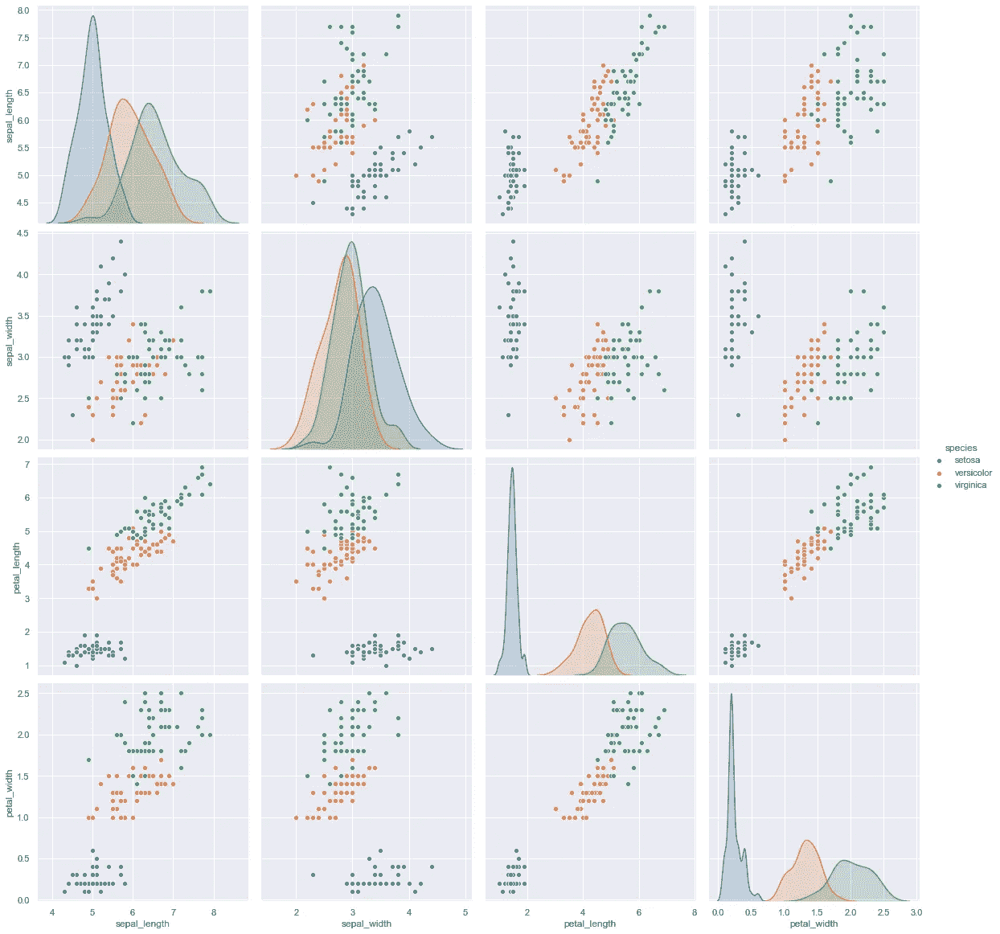

# 探索性数据分析:Iris 数据集

> 原文：<https://medium.com/analytics-vidhya/exploratory-data-analysis-iris-dataset-4df6f045cda?source=collection_archive---------1----------------------->


[迈克](https://unsplash.com/@omaha?utm_source=medium&utm_medium=referral)在 [Unsplash](https://unsplash.com?utm_source=medium&utm_medium=referral) 上的照片

你好，合十礼！！

**虹膜**花**数据集**或费希尔**虹膜数据集**是用于测试各种机器学习算法的最著名的多元数据集之一。

这是我在 Iris 数据集上的 EDA 版本。

给出了每个可视化步骤的数据见解

# 导入相关库

> import pandas as PD
> import numpy as NP
> import matplotlib . py plot as PLT
> import seaborn as SNS
> from sk learn import metrics
> SNS . set()

# 数据来源

数据存储在一个名为“iris.csv”的 csv 文件中

# 加载数据

> iris _ data = PD . read _ CSV(' iris . CSV ')
> iris _ data


完整的虹膜数据集


鸢尾属物种各种特征的视觉描述

# 从数据中获取信息

> iris_data.info()

```
<class 'pandas.core.frame.DataFrame'>
RangeIndex: 150 entries, 0 to 149
Data columns (total 5 columns):
 #   Column        Non-Null Count  Dtype  
---  ------        --------------  -----  
 0   sepal_length  150 non-null    float64
 1   sepal_width   150 non-null    float64
 2   petal_length  150 non-null    float64
 3   petal_width   150 non-null    float64
 4   species       150 non-null    object 
dtypes: float64(4), object(1)
memory usage: 6.0+ KB
```

## 数据洞察:

*1 所有列都没有任何空条目*

*2 四列是数值型*

*3 只单列分类类型*

# 统计洞察力

> iris_data.describe()


## **数据洞察:**

1.  平均值
2.  标准差，
3.  最小值
4.  最大值

# 检查重复条目

> iris _ data[iris _ data . duplicated()]


重复条目

有 3 个副本，因此我们必须检查每个物种数据集是否平衡

## 检查余额

> iris_data['物种']。值计数()

```
setosa        50
versicolor    50
virginica     50
Name: species, dtype: int64
```

因此，我们不应该删除这些条目，因为这可能会使数据集不平衡，从而证明对有价值的见解不太有用

# 数据可视化

## 物种计数

> plt.title('物种计数')
> sns.countplot(iris_data['物种'])


## 数据洞察:

1.  这进一步显示了物种之间的平衡
2.  每种鸢尾(海滨鸢尾、刚毛鸢尾、杂色鸢尾)都有 50 个


鸢尾花种类

## 单变量分析

***基于萼片长度和宽度的物种间比较***

> plt.figure(figsize=(17，9))
> plt.title('基于 sapel 长度和宽度的各种物种之间的比较')
> sns .散点图(iris_data['sepal_length']，iris_data['sepal_width']，hue =iris_data['species']，s=50)


## 数据洞察:

1.  刚毛鸢尾的萼片长度较小，但宽度较大。
2.  杂色几乎位于长度和宽度的中间
3.  海滨锦鸡儿的萼片长度较长，宽度较小

***基于花瓣长度和宽度的不同物种间的比较***

> plt.figure(figsize=(16，9))
> plt.title('基于花瓣长度和宽度的各种物种之间的比较')
> sns .散点图(iris_data['花瓣长度']，iris_data['花瓣宽度']，hue = iris_data['物种']，s= 50)


## 数据洞察

1.  刚毛物种的花瓣长度和宽度都最小
2.  杂色种类有平均花瓣长度和花瓣宽度
3.  海滨种类有最高的花瓣长度和花瓣宽度

## 双变量分析

> sns.pairplot(iris_data，hue="species "，height=4)



## 数据洞察:

1.  花瓣长与宽柱高相关。
2.  Setosa 具有低花瓣长度和宽度
3.  杂色有平均花瓣长度和宽度
4.  Virginica 的花瓣长度和宽度都很高。
5.  刚毛的萼片宽度高，长度低。
6.  杂色花的萼片尺寸的平均值为。
7.  海滨锦鸡儿宽度小，但萼片长度大

## 检查相关性

> plt.figure(figsize=(10，11))
> SNS . heat map(iris _ data . corr()，annot=True)
> plt.plot()


热图

## 数据洞察:

1.  萼片长度和萼片宽度特征彼此之间略有关联

## **检查平均值&每个物种的中值**

> iris.groupby('物种')。agg(['均值'，'中值'])


平均和中间输出

使用箱线图和小提琴图可视化分布、平均值和中值

## 了解分布的箱线图

箱线图，查看分类特征“物种”如何与所有其他四个输入变量一起分布

> fig，axes = plt.subplots，2，figsize=(16，9))
> SNS . box plot(y = " petal _ width "，x= "species "，data=iris_data，orient='v '，ax=axes[0，0])
> SNS . box plot(y = " petal _ length "，x= "species "，data=iris_data，orient='v '，ax=axes[0，1])
> SNS . box plot(y = " sepal _ length "，x= "species


箱线图

## 数据洞察:

1.  Setosa 的特征更小，分布更少
2.  杂色以平均的方式和平均的特征分布
3.  弗吉尼亚高度分布着大量的 no。价值和特征
4.  很明显，各种特征(萼片长度和宽度，花瓣长度和宽度)的平均值/中值由每个图显示

## 用于检查分布的小提琴图

小提琴图显示了物种的长度和宽度的密度。较薄的部分表示密度较小，而较厚的部分表示密度较高

> fig，axes = plt.subplots(2，2，figsize=(16，10))
> SNS . violinplot(y = " petal _ width "，x= "species "，data=iris_data，orient='v '，ax=axes[0，0]，inner = ' quartile ')
> SNS . violinplot(y = " petal _ length "，x= "species "，data=iris_data，orient='v '，ax=axes[0，1]，inner='quartile')
> sns


小提琴情节

## 数据洞察:

1.  在花瓣长度和宽度方面，刚毛藻的分布和密度较小
2.  在花瓣长度和宽度的情况下，杂色以平均方式和平均特征分布
3.  弗吉尼亚高度分布着大量的 no。萼片长度和宽度的值和特征
4.  高密度值表示平均值/中值，例如:鸢尾在 5.0 cm 处密度最高(萼片长度特征)，这也是表中的中值(5.0)

供参考的平均值/中值表


## 绘制直方图和概率密度函数(PDF)

在 X 轴上绘制概率密度函数(PDF ),每个特征作为一个变量，在 Y 轴上绘制直方图和相应的核密度图。

> sns。FacetGrid(iris，hue="species "，height=5) \
> 。map(sns.distplot，" sepal_length") \
> 。add_legend()
> 
> sns。FacetGrid(iris，hue="species "，height=5) \
> 。map(sns.distplot，" sepal_width") \
> 。add_legend()
> 
> sns。FacetGrid(iris，hue="species "，height=5) \
> 。map(sns.distplot，"花瓣 _ 长度")\
> 。add_legend()
> 
> sns。FacetGrid(iris，hue="species "，height=5) \
> 。map(sns.distplot，"花瓣 _ 宽度")\
> 。add_legend()
> plt.show()


图 1 |分类特征:萼片长度


图 2 |分类特征:萼片宽度


地块 3 |分类特征:花瓣长度


地块 4 |分类特征:花瓣宽度

## **数据洞察:**

1.  图 1 显示了在萼片长度上物种之间有大量的重叠，因此它不是有效的分类特征
2.  图 2 显示了在萼片宽度上物种之间甚至有更高的重叠，因此它不是有效的分类特征
3.  图 3 显示花瓣长度是一个很好的分类特征，因为它清楚地区分了物种。重叠部分非常少(在云芝和海滨锦鸡儿之间)，刚毛藻与其余两个分开得很好
4.  就像图 3 一样，图 4 也表明花瓣宽度是一个很好的分类特征。重叠部分明显较少(在云芝和海滨锦鸡儿之间)，刚毛藻与其余两个分离得很好

## 选择样地 3(分类特征为花瓣长度)区分物种


地块 3 |分类特征:花瓣长度

鸢尾的 pdf 曲线大约在 2.1 处结束

## 数据洞察:

1.  鸢尾的 pdf 曲线大约在 2.1 处结束
2.  如果花瓣长度< 2.1, then species is Iris Setosa
3.  The point of intersection between pdf curves of Versicolor and Virginica is roughly at 4.8
4.  If petal length >为 2.1，花瓣长度< 4.8 then species is Iris Versicolor
5.  If petal length >为 4.8，则该物种为海滨鸢尾

就这样，我完成了这篇博客。在下一篇博客中，我们将应用机器学习分类算法来预测物种

非常感谢你花宝贵的时间来阅读这个博客。请随意指出任何错误(毕竟我是个初学者)，并提供相应的反馈或留下评论。

丹尼瓦德。！

反馈:
电子邮件:pranshu453@gmail.com