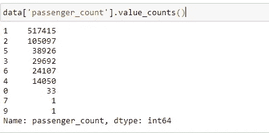
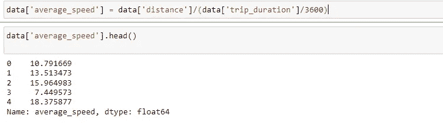

# 探索性数据分析:使用 Python 的纽约市出租车出行持续时间

> 原文：<https://medium.com/analytics-vidhya/exploratory-data-analysis-nyc-taxi-price-prediction-using-python-44fce176a8fe?source=collection_archive---------1----------------------->


让我们从了解探索性数据分析(EDA)开始。EDA 可以定义为:

1.  理解或获得对我们数据的直觉。
2.  检查我们的数据是否正确，见解是否正确。
3.  找出您的数据是否有任何缺失值，或者我们的数据集中是否有任何异常值。
4.  总结我们的数据。


进行 EDA 的步骤

> 正确使用统计方法的重要性

假设我们正在绘制两个城市一周中某一天的用电量，其中 0 代表星期日，1 代表星期一，依此类推。


因此，假设我们采用平均值作为统计方法:可以认为城市 A 的耗电量更多，因为它的折线图比城市 B 高得多


如果我们以中位数作为统计指标来比较电力消耗，我们可以看到两个城市的电力消耗没有太大的差异。

> 在本例中，与均值相比，中值是正确的统计方法，因为如果我们将均值视为统计参数，则城市 A 中的一些房屋可能会对城市 A 的分布造成更大的干扰。

# 让我们从讨论问题陈述开始:

这个博客的目的只是探索数据集，并从中产生见解。以下是数据集中所有可用变量/特征的描述，可帮助您执行 EDA:

*   **id** —每次旅行的唯一标识符
*   **vendor_id** —表示与旅行记录相关联的提供商的代码
*   **pickup_datetime** —启用血糖仪的日期和时间
*   **dropoff_datetime** —血糖仪脱离的日期和时间
*   **乘客数量** —车辆中的乘客数量(驾驶员输入值)
*   **拾取经度** —仪表接合的经度
*   **拾取纬度** —仪表接合的纬度
*   **dropoff_longitude** —仪表脱离的经度
*   **dropoff_latitude** —仪表脱离的纬度
*   **store_and_fwd_flag** —该标志表示在发送给供应商之前，行程记录是否保存在车辆存储器中，因为车辆没有连接到服务器(Y = store and forwardn =不是存储和转发行程)
*   **行程持续时间**——(目标)行程持续时间，单位为秒

> 让我们开始探索我们的数据集:


导入基本库


读取数据集


使用 Describe()函数检查基本统计信息

> 我们从中得到推论。对于所有连续变量，计数变量与数据集中的行数相同，这意味着没有缺失值。
> 2。乘客计数范围从 0 到 9。
> 3。在我们的数据集中，有两种供应商类型提供出租车。
> 4。行程持续时间具有高标准偏差。最长的行程大约是 277.6 小时。


验证从 Describe()函数推断的缺失值，并检查数据集中可用的要素


检查数据类型。

> 1.需要将 pickup_datetime 和 dropoff_datetime 更改为 datetime 格式。
> 
> 2.商店和转发标志需要改变成类别格式(是/否)。

让我们像上面看到的那样更改数据类型:


As Type 用于将数据类型更改为我们想要表示的类型

> 让我们探索日期时间，并扩展到工作日、月、小时、分钟，以便在分析数据时获得更全面的了解


可以实现日期时间库，如上所示，按月、小时、分钟等进行过滤

通过向我们使用日期时间库创建的数据集中添加更多列，让我们看看数据集中发生了什么变化:

> 数据[['接送日期时间'，'接送日期时间'，'接送日'，'接送日'，'接送日'号'，'接送日'号'，'接送日'号'，'接送月'，'接送小时'，'接送小时'，'接送分钟'，'接送分钟']]。头部()


完美你可以看到我们的日期时间功能已经创建

使用 Geopy 库计算新的要素距离(我们将进一步了解该库)可以为我们的分析部分提供见解:


经度和纬度特征可以帮助理解行程起点和终点坐标

现在，我们已经为每次旅行的数据集中的每一行添加了距离，我们可以使用 lambda 函数，这对于在整个数据集中进行一次旅行非常方便。

```
data['distance'] **=**data. Apply(**lambda** x: distance_Trip(x['pickup latitude'],x['pickup longitude'],x['dropoff_latitude'],x['dropoff_longitude']), axis**=**1)
```

使用点应用，我们可以在我们创建的距离行程函数中使用 lambda 函数来计算距离。


现在我们可以看到距离特征是为我们的数据集计算的

> 单变量分析:

让我们从分析接送周开始:


我们可以观察到星期五是最忙的一周。

让我们看看哪些旅行被记录或没有。


99 %的时间旅行不会被记录在服务器上。我们需要在双变量分析中进一步研究。

让我们看看哪个月的旅行次数最多:


对出租车司机来说，三月是最忙的月份，其次是四月。

> 现在让我们创建一个函数 Duration()，我们将它描述为:
> 
> **If 6 <时间<12-上午:If 12 < t < 16 和 16 < t < 22 为晚上，其他行程为深夜**


一天中完美的时间被创造出来

现在让我们看看乘客人数分布:


直观的



描述的

> 从中可以看出以下几点:
> 
> a)大部分乘客密度位于 b/w 1 和 2。
> 
> b)有两个行程，最大乘客人数分别为 7 人和 9 人。
> 
> c)有 33 次旅行没有乘客，这意味着预订可能由于某种原因被取消。

让我们分析一下我们之前创建的一天中发生的旅行持续时间:


晚上是最忙的时间，其次是早上，这是有道理的，因为大多数人不得不在早上去办公室，晚上回家。

让我们分析出行持续时间特征:


这表明它有异常值，因为它是右偏的，我们可以从分布图中看到。让我们绘制方框图，看看是否有异常值。


我们可以看到有一个异常值，值 1939736 是数据集中的极值。让我们放弃这一价值。

让我们再创造一个特征出租车司机的平均速度:



从平均速度，我们可以推断，纽约市有主要的交通。

> 双变量分析:

让我们分析乘客数量和供应商 ID:


供应商 id 与乘客数量

> 大多数人在预订出租车服务时更喜欢供应商 2，这可以引出思考部分:
> 
> a)供应商 1 提供的出租车可能短缺。
> 
> B)或者与 A 相比，供应商 B 可能提供了更好的服务。让我们通过绘制 catplot 进行调查。


供应商 id 与行程持续时间

> 供应商 1 提供短途旅行。供应商 2 提供短途和长途旅行，这就是为什么人们更喜欢供应商 2。

让我们看看我们之前讨论过的双变量分析中的 b/w 商店和 _fwd 标志与行程持续时间的关系:


我们可以从那里观察到的更长的旅程没有记录。短途旅行是有记录的

> 现在让我们看看数据集中不同变量的相关性。


数据集中的数字数据类型


这是我们从 Correlation()函数得到的一个非常大的表。让我们用一个更小的表格来看皮尔逊系数，这样更容易查阅。

让我们将所有数字列拆分，然后进行快速排序，接着创建一个日期框架，将排序后的值和系数放在一起进行分析:


我们可以看到，取货日和卸货日的相关性最高。

让我们画出热图来看看所有的相关性:


> 斯皮尔曼相关似乎在它们之间有非常相似的模式，除了在相关的大小上有轻微的变化。
> *相关性不显著的变量太多。
> *主要相关性存在于接送时间之间。

让我们一起分析乘客数量与行程持续时间:


大多数乘客行程持续时间为 b/w 800 至 1000 秒。
最短旅行持续时间约为 0，这可能是一个异常值，或者人们可能在预订后取消了行程。这应该进行调查。


> 我们可以观察到下午 2 点到 4 点左右是最忙的时候。

我们可以执行 T-检验和 Z-检验，从数据中获得更多见解:


在 Python 中创建 z 测试和 T 测试公式


创建了一个函数来检查所有的统计参数


两家供应商的平均速度没有显著变化。


有一个显著的变化。与供应商 1 相比，供应商 2 的行程持续时间更长。我们可以在数据集中看到许多异常值。

> 多元分析:

让我们从数据集中的多变量分析开始:


b/w 提货日和卸货日的紧密关系。
中等关系 b/w 平均速度和距离。


装货时间与行程持续时间与商店和前进标志

> 从这里我们可以推断，与短途旅行相比，长途旅行标记被记录下来。


提货时间与速度和一天中的时间

> 我们可以由此推断:
> 
> 1.深夜平均速度是最大的，因为交通可能会更少。
> 
> 2.在上午和下午，交通状况会很拥挤，这表明汽车的平均速度较低(12-20 公里/小时)

> 因此，我们讨论了探索性数据分析，以及它如何帮助我们识别数据中的潜在模式。
> 
> 现在，你可能已经有了做 EDA 的感觉。我建议您在我们的数据集中探索更多这样的变量。

# 快乐学习！