# 佐玛托餐厅的探索性数据分析

> 原文：<https://medium.com/analytics-vidhya/exploratory-data-analysis-of-zomato-restaurant-4c7ceac7c4ba?source=collection_archive---------2----------------------->

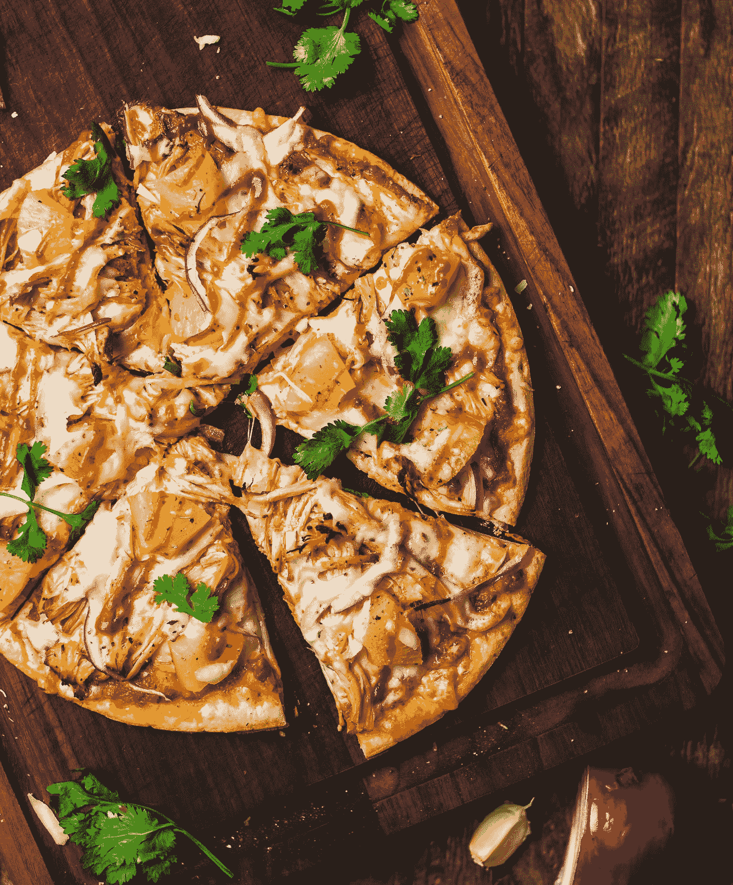

乍得·蒙塔诺在 [Unsplash](https://unsplash.com?utm_source=medium&utm_medium=referral) 上的照片

> **“食谱没有灵魂。作为厨师，你必须给食谱带来灵魂。”**

我真的被餐馆里提供的高质量食物迷住了，并愿意帮助社区找到他们所在地区最好的美食。

Zomato API 分析是美食家最有用的分析之一，他们希望在自己的预算范围内品尝世界各地的最佳美食。这个分析也是为了那些想在全国各地寻找物有所值的餐馆来品尝美食的人。此外，这种分析迎合了那些努力获得该国最佳美食的人们的需求，以及该国哪个地区提供该美食的餐馆数量最多。♨️

Zomato 是一家印度跨国餐厅聚合和食品配送公司，由 Deepinder Goyal、Pankaj Chaddah 和 Gunjan Patidar 于 2008 年创立。Zomato 提供信息、菜单和用户对餐馆的评论，以及选择城市中合作餐馆的送餐选择。截至 2019 年，该服务已在 24 个国家和超过 10，000 个城市提供。

Zomato 于 2008 年成立时名为 Foodiebay，2010 年 1 月 18 日更名为 Zomato Media PVT . ltd . 2011 年，zom ATO 在印度的业务扩展至德里 NCR、孟买、班加罗尔、钦奈、浦那和加尔各答。2012 年，该公司在多个国家开展国际业务，包括阿联酋、斯里兰卡、卡塔尔、英国、菲律宾和南非。2013 年，Zomato 在新西兰、土耳其、巴西和印度尼西亚推出，其网站和应用程序提供土耳其语、葡萄牙语、印度尼西亚语和英语版本。2014 年 4 月，Zomato 在葡萄牙推出了服务，随后于 2015 年在加拿大、黎巴嫩和爱尔兰推出了服务。

2019 年，Zomato 收购了总部位于西雅图的食品门户网站 Urbanspoon，这使得该公司进入了美国和澳大利亚。这种美国扩张使 Zomato 与 Yelp 和 Foursquare 等类似模式直接竞争。

Zomato 也因其在数字营销方面的能力而闻名。

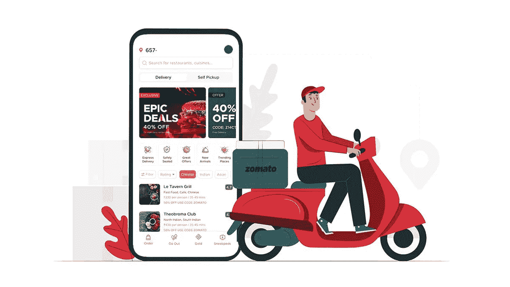

像大多数其他创业公司一样，印度食品科技的先驱独角兽 Zomato 在其旅程中经历了许多高峰和低谷。虽然有一些辉煌的时刻和成就，但也有困难的时候，有些时候甚至使公司的存在受到质疑。

在 2015 年的大规模裁员和亏损期间，佐马托的生存机会似乎很渺茫。该公司采取紧缩措施，解雇了约 300 名员工，占其总人数的近 10%，以削减其较弱业务方面的成本，并将重点转移到预订等更能产生收入的领域。

然而，在 Zomato 存在的十年中，这是该公司实际上遇到的最大困难。其余时间，创始人兼首席执行官 Deepinder Goyal 和联合创始人 Pankaj Chad dah(2018 年离开 Zomato)坚定不移地抓住公司的缰绳，使其走上增长和扩张的道路，使其成为印度第一家食品科技独角兽。

虽然 Zomato 与 Swiggy、UberEats 和 Ola-Foodpanda 等公司竞争，但该公司仍在继续创新产品，并以其自成立以来一直在做的方式进行扩张。

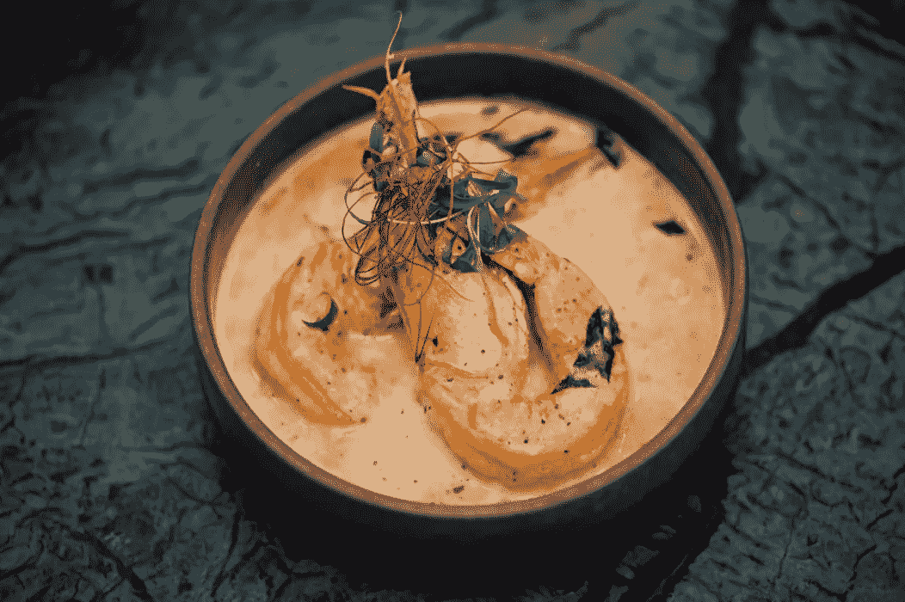

# 数据集:

> **https://www.kaggle.com/shrutimehta/zomato-restaurants-data**

获取数据:

数据是从 Zomato API 以下列形式收集的。使用 URL = " https://developers . zoma to . com/API/v 2.1/search？entity _ id = 1 & entity _ type = city & start = 1 & count = 20 "

在这里可以看到原始数据

数据收集:

收集的数据可以看作是原始的。json 文件在这里

数据存储:

收集的数据存储在逗号分隔值文件 Zomato.csv 中。数据集中的每个餐馆都由其餐馆 Id 唯一标识。每个餐馆都包含以下变量:

餐厅 id:世界各城市中每家餐厅的唯一 Id

餐厅名称:餐厅的名称

国家代码:餐厅所在的国家

城市:餐厅所在的城市

地址:餐厅的地址

地点:城市中的位置

位置详细:位置的详细描述

经度:餐厅位置的经度坐标

纬度:餐厅位置的纬度坐标

美食:餐厅提供的美食

两个人的平均费用:两个人不同货币的费用👫

货币:国家的货币

是否已预订餐桌:是/否

是否在线交付:是/否

是否交付:是/否

切换到订单菜单:是/否

价格范围:食品价格的范围

综合评分:平均评分，满分为 5 分

评级颜色:取决于平均评级颜色

评级文本:基于评级的文本

投票:人们投票的次数

# 调查覆盖的国家列表:

调查覆盖的国家列表——

菲律宾、巴西、美国、澳大利亚、加拿大、新加坡、阿联酋、印度、印度尼西亚、新西兰、英国、卡塔尔、南非、斯里兰卡、土耳其。

全国总数为 15 个。

由于 Zomato 是一家来自印度的初创公司，因此它在印度的餐厅中拥有最大的业务分布是有道理的。

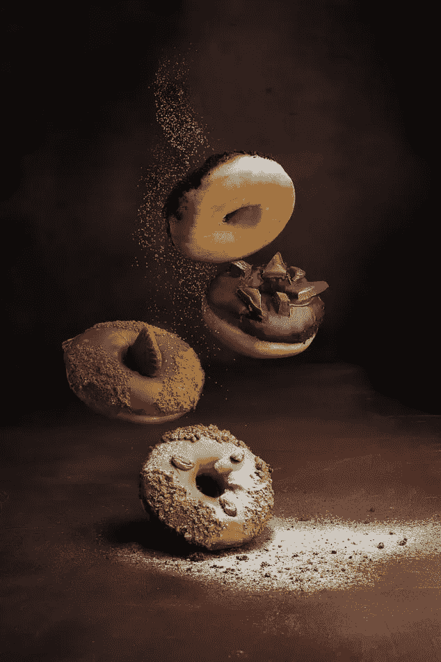

# 了解评分汇总、颜色和文本:

以上信息有助于我们理解综合评分、颜色和文本之间的关系。我们总结了分配给评级的以下颜色:

*评级 0 —白色—未评级

*评级 1.8 至 2.4-红色-较差

*评分 2.5 至 3.4 —橙色—平均

*等级 3.5 至 3.9 —黄色—良好

*评分从 4.0 到 4.4 —绿色—非常好

*评分从 4.5 到 4.9 —深绿色—优秀

让我们试着去理解餐馆间评分的分布。

未评级的数量非常高，让我们来看看原因是什么。

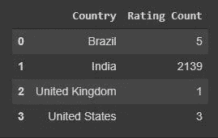

印度似乎有最多的未评级餐馆。在印度，网上订餐的文化仍在发展，因此大多数餐馆在 Zomato 上仍未评级，因为人们可能更喜欢去餐馆用餐。

# 全国货币:

[梁杰森](https://unsplash.com/@ninjason?utm_source=medium&utm_medium=referral)在 [Unsplash](https://unsplash.com?utm_source=medium&utm_medium=referral) 上的照片

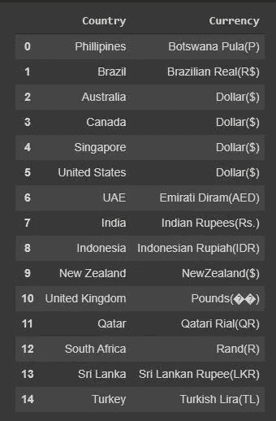

# 在线交付:

看起来大多数酒店都没有网上送货。全球只有 25.3%的餐厅拥有在线配送系统。这个数据可能有偏差，因为我们这里列出的最大数量的餐馆都来自印度。

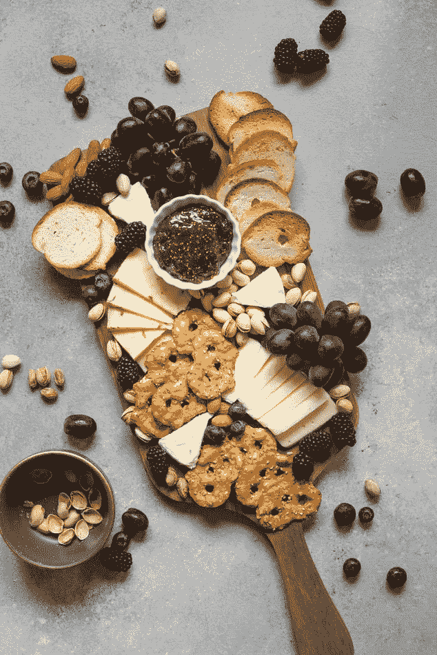

# 让我们试着了解一下这个城市的覆盖范围:

我们可以看到，在新德里，古尔冈，诺伊达·佐马托的存在感非常高。

# 让我们根据我的家乡城市加尔各答来分析一下:

**加尔各答**—**印度的文化之都**是美食家的天堂，尤其是爱吃甜食的人。然而，孟加拉糖果很有名，当然不需要介绍；加尔各答的辛辣、扑鼻和令人垂涎的街头食物会让你犹豫不决，你是更喜欢辛辣的孟加拉美食还是甜食的融化味道。除此之外，这里还有传统的中国和藏餐，你会有很多选择。

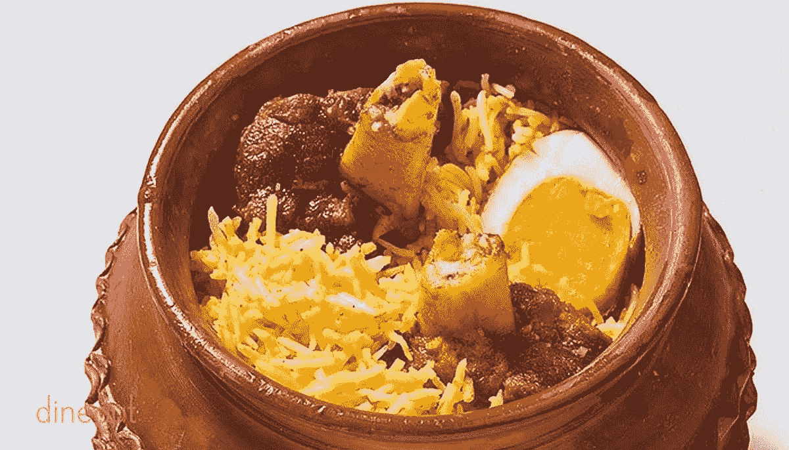

**孟加拉美食**([Bengali](https://en.wikipedia.org/wiki/Bengali_language):বাঙালিখাবার)是[孟加拉](https://en.wikipedia.org/wiki/Bangladesh)印度次大陆东部[孟加拉地区](https://en.wikipedia.org/wiki/Bengal_region)和[印度各邦](https://en.wikipedia.org/wiki/Indian_states)西孟加拉邦、[特里普拉邦](https://en.wikipedia.org/wiki/Tripura)、[阿萨姆邦](https://en.wikipedia.org/wiki/Assam)巴拉谷[的烹饪风格。重点是鱼、肉、蔬菜和扁豆，主食是米饭。](https://en.wikipedia.org/wiki/Barak_Valley)

许多孟加拉的食物传统来自社会活动，例如 [adda](https://en.wikipedia.org/wiki/Adda_(South_Asian)) ，或者[mez ban。](https://en.wikipedia.org/wiki/Mezban)

孟加拉美食以其各种口味的使用以及其糖果和甜点的传播而闻名。它拥有从印度次大陆烹饪发展而来的[多道菜](https://en.wikipedia.org/wiki/Full_course_dinner)传统，在结构上类似于现代 [*法式*](https://en.wikipedia.org/wiki/Service_%C3%A0_la_russe)*[法式](https://en.wikipedia.org/wiki/French_cuisine)的* 服务风格，食物分[道菜](https://en.wikipedia.org/wiki/Course_(food))供应，而不是一次性供应。

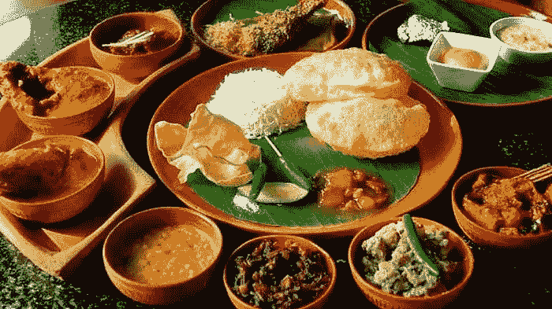

# 加尔各答的特产:

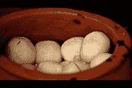

加尔各答罗索戈拉

在加尔各答，许多当地的街头小贩拥有自己的小店，在那里他们出售自己自制的商品。像奶酪(*paner*)这样的食物可以直接食用，也可以制成甜点)*[*rosogolla*](https://en.wikipedia.org/wiki/Rasgulla)或 *chanar payesh* 。牛奶尤其用于加尔各答的各种 payesh，使用不同的谷物和添加剂，如枣、无花果和浆果。除了巧克力等欧洲食品，加尔各答的烹饪也受到了海外华人的影响。*

*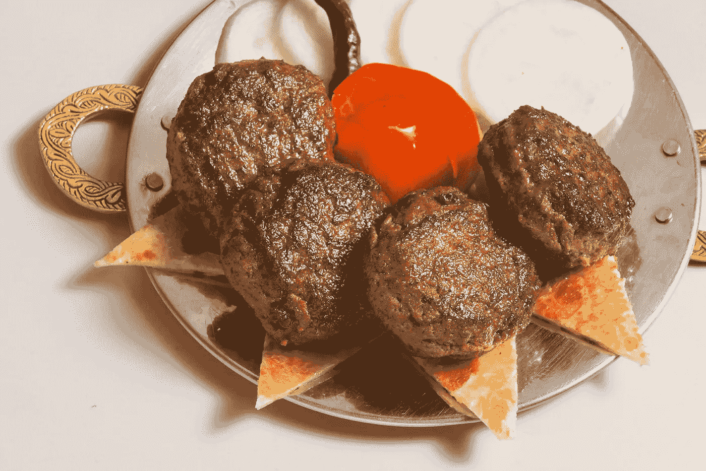*

*孟加拉美食可以细分为四种不同类型的菜肴，charbya(孟加拉语:চর্ব্য)，或咀嚼的食物，如米饭或鱼；choṣya(孟加拉语:চোষ্য)，或被吸的食物，如 ambal 和 taklehya(孟加拉语:লেহ্য)，或者是意在舔的食物，比如酸辣酱；peya(孟加拉语:পেয়)，包括饮料，主要是牛奶。[20]*

*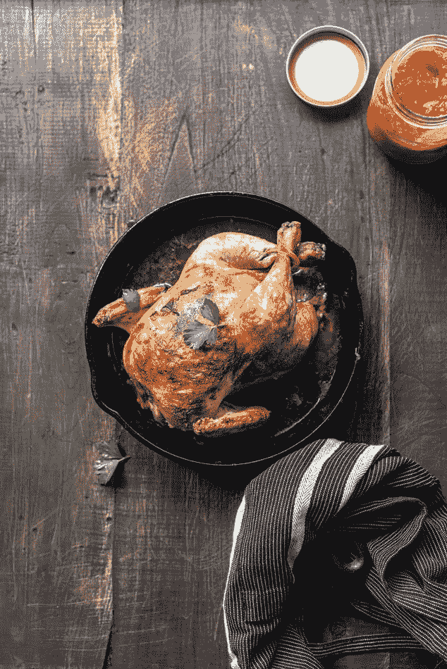*

# *加尔各答美食的传统美食*

***加尔各答美食**以其精致的味道著称。这些是一些传统菜肴，人们必须品尝和享受古老的孟加拉美食的正宗风味。*

*   ***Macher Jhol**——独家咖喱鱼*
*   *Kolkata Bir yani——美味的大米*
*   ***Kosha Mangsho**——特色咖喱羊肉*
*   ***Alur Torkari 和 Luchi**——加尔各答风格 Aloo Poori*
*   *一碗蔬菜*
*   ***切洛肉串** —独特的拼盘*
*   *莫查尔·古恩托——美味的咬*
*   ***卡塔拉卡利亚**——传统美食*
*   ***Macher Muri Ghonto** —健康碗*
*   *Aloo Posto——给土豆爱好者*
*   ***Phuchka**——可爱的帕尼·普里*
*   *Telebhaja——完美的小吃*
*   *贾姆里——健康的咀嚼*
*   ***排骨** —辣肉排*
*   ***凯茜面包卷**——世界著名的面包卷*
*   *Roshogullas——爱吃甜食*
*   ***Sandesh** —强制叮咬*
*   ***郑初美郑初美**——美味的融合*
*   ***米丝蒂土井** —发酵甜酸奶*
*   ***Patisapta**——节日的快乐*

# *加尔各答 zomato 服务下在线预订的餐厅数量最多:*

# *加尔各答最贵的 25 家双人餐厅:*

**

# *两个对比总评分的平均成本:*

*加尔各答是你的最佳选择，因为西孟加拉邦的首府是世界上最实惠的城市之一。根据购买或租赁房屋的成本、往返工作场所的成本、家庭水电费用、儿童保育费用等，加尔各答的生活成本为每月 10，000 至 50，000 卢比。加尔各答的生活成本与班加罗尔或德里相当，尽管加尔各答的生活水平更高。总的来说，加尔各答所需的大部分东西都是买得起的。*

# *价格范围与平均成本与印度城市:*

*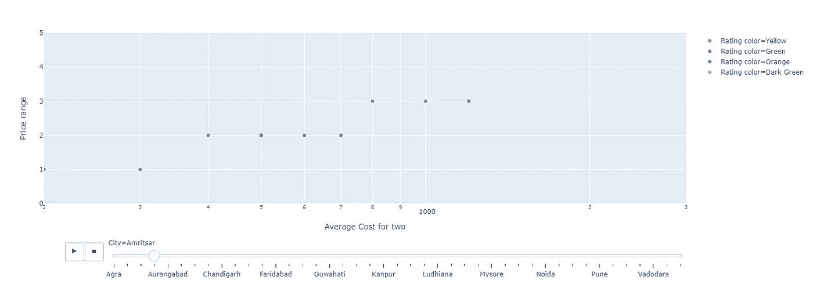*

> ***注:**由于不可避免的情况，我们不得不张贴此视频图形情节的截图。但这实际上是一个点在移动的视频。我把我的代码笔记本上传到 kaggle，观众可以从那里看到这个情节。*

*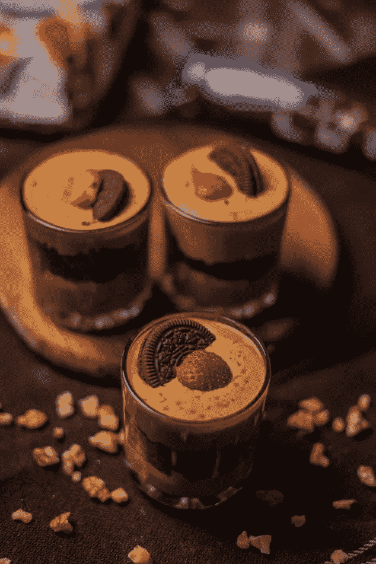*

# *推论和结论:*

*我们从调查中得出了许多推论。以下是其中一些的摘要:*

*   *该数据集偏向印度，并不代表全球餐馆的完整数据。*
*   *餐馆评级分为六类*

1.  *未评级*
2.  *平均的*
3.  *好的*
4.  *很好*
5.  *优秀的*

*   *成本和评级之间没有关系。一些最受好评的餐馆价格低廉，反之亦然。*

*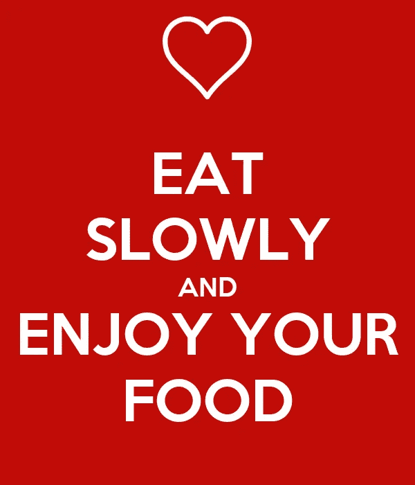*

# *项目链接:*

> *[https://www . ka ggle . com/soham 27/explorative-data-analysis-of-zomato-restaurant](https://www.kaggle.com/soham27/exploratory-data-analysis-of-zomato-restaurant)*