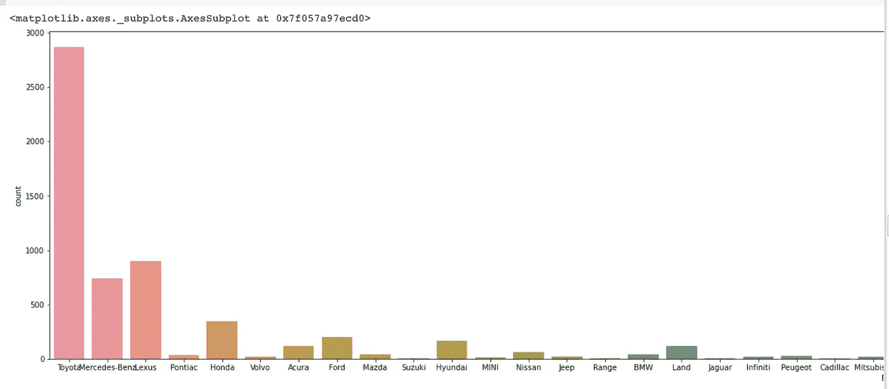

# web scraped Checki 数据集上的探索性数据分析

> 原文：<https://medium.com/analytics-vidhya/exploratory-data-analysis-on-a-web-scraped-checki-data-set-f3ad5ce80523?source=collection_archive---------5----------------------->

这是一个 EDA 练习，目的是从 Checki(一个在线汽车商店)收集的 CSV 数据集获得洞察力。这是一个包含待售汽车、位置、车型年份等信息的数据集。我与 [Hard Core](https://medium.com/u/c92d9971fe4e) 和@dakinbuwa 合作执行了这个练习，数据集可以通过本文末尾的链接在 GitHub 上获得。

预期的结果是洞察，例如汽车列表数量最多的位置、各州的汽车品牌列表、列表数量最多的汽车型号、每个位置汽车的平均价格等等。为了实现这些，我们必须清理我们的数据，并使用 pandas 和 NumPy 进行数据操作，使用 matplot 和 seaborn 进行可视化。

是时候导入必要的库了

```
import numpy as npimport seaborn as snsimport pandas as pdimport matplotlib.pyplot as plt%matplotlib inline
```

我在 google colab 上执行了这个练习；因此，下一步是加载我的存储数据集的 google drive 帐户。如果您打算使用 Jupyter 或任何其他 IDE 在本地工作，可以跳过这一步。如果你想设置一个 google colab 笔记本，你可以查看我以前的帖子，在那里我概述了如何使用下面的链接设置一个 colab 笔记本。

[](https://usmanbiu.medium.com/a-simple-guide-to-building-an-image-classifier-with-cnn-from-data-set-to-deployment-deecde4480dc) [## 使用 CNN 构建图像分类器的简单指南(使用 google colab)

### 今天我们要用 CNN 建立一个图像分类器。对于这个项目，我们将训练我们的模型来分类两个…

usmanbiu.medium.com](https://usmanbiu.medium.com/a-simple-guide-to-building-an-image-classifier-with-cnn-from-data-set-to-deployment-deecde4480dc) 

是时候将 google drive 安装到 google colab 了

```
from google.colab import drivedrive.mount('/gdrive')
```

下一步是创建我们的文件路径，确保编辑文件路径以匹配系统上数据集的位置。

```
file_path='/gdrive/My Drive/Ai_projects/checki EDA/Cheki_ng_scraping.csv'cd= pd.read_csv(file_path)
```

让我们看看我们的数据集

```
cd.head
```


让我们看看每一列的数据类型，并检查是否有任何缺失值或空值

```
cd.info()
```


价格和里程列属于对象数据类型；必要的时候我们会把它们改成‘int’。从上面可以看出，我们没有丢失或空值。
仅使用必要的列从数据集创建新的数据框(删除未命名的列)

```
cols=['Car_name', 'Year', 'Price', 'Location', 'Status', 'Ratings','Mileage']cd_data = cd[cols]
cd_data.head(10)
```


# 数据清理和特征工程

# 里程栏

里程以公里和英里为单位，我们需要创建一个新列，将里程的所有值转换为公里

```
km=[]  #creating and empty set to hold the converted mileagesfor i in cd_data.Mileage: # *for each value in the mileage column* if i[-2:]=='km':  # *if the last two characters are 'km'* km.append(i[:-3].replace(',','')) *#add the mileage to the               empty set 'km' without the units while stripping of comma's by replacing them with an empty character.* if i[-2:]=='mi': *# if the last two characters are 'mi'* j=(i[:-3].replace(',','')) * #store the mileage with the 'j' variable without the units while stripping of comma's* x=int(j)*1.6  *#converting the unit from miles to km* km.append(x) *#add the mileage to the empty set 'km'*
```

创建一个以公里为单位的新列，并查看新的数据集

```
cd_data['Mileage_km']=kmcd_data
```


现在我们可以删除里程列。

```
cd_data.drop('Mileage', axis=1 ,inplace=True)cd_data
```


# 价格栏

我们需要从 price 列的值中删除 Naira 符号和逗号，然后最终将它们的数据类型更改为 int。

```
prices=[]for i in cd_data.Price:a=i[2:].replace("," , "") #replacing comma's with an empty character (nothing).prices.append(int(a))
```

创建一个新的价格列，并删除旧的价格列

```
cd_data['Prices']=pricescd_data.drop('Price',axis=1,inplace=True)cd_data
```


# 为品牌名称创建新列

让我们从汽车名称中获取品牌名称

```
brand=[]for i in cd_data.Car_name:c = i.split(' ')[0] *#splliting the car names at the space and taking the first value, which is the brand name*brand.append(c)cd_data['Brand']=brandcd_data
```


# 从汽车名称中提取汽车型号

```
model=[]for i in cd_data.Car_name:c = i.split(' ')[1]model.append(c)cd_data['Model']=modelcd_data
```


# 为汽车型号和年份创建列

通过合并“年份”和“型号”列中的数据，创建一个包含汽车型号和年份的新列。

```
years=[]for i in cd_data.Year:i=' '+str(i)years.append(str(i))cd_data['Years']=yearscd_data['Model_year']=cd_data['Model']+cd_data['Years']cd_data
```


# 从位置列中提取状态。

```
state=[]for i in cd_data.Location:b=i.split(',')[-1]state.append(b)cd_data['State']=statecd_data
```


# 检查异常值

检查价格列中的异常值

```
sns.boxplot(x=cd_data['Prices'])
```


在上图中，价格列中有一个异常值。为了找到异常值，我们将对价格列中的值进行排序

```
cd_data.sort_values('Prices',axis=0,ascending=False)
```


除了上表中的第一辆车之外，其他车的价格似乎都很合理。它是一个异常值，需要使用其索引将其删除。

```
cd_data.drop(627, axis=0, inplace=True)sns.boxplot(x=cd_data['Prices'])
```


# 数据探索

在我们分析的这个阶段，以下问题的答案是我们要寻找的:
汽车数量最多的地点
各州汽车品牌列表
汽车数量最多的汽车品牌
每个地点汽车的平均价格
按车型年列出的汽车列表
评级最高的汽车型号
汽车最频繁的评级
汽车最频繁的状态
基于汽车状况(状态)的平均价格
车型状态

# 汽车数量最多的位置

```
plt.figure(figsize=(20,8))sns.countplot(data=cd_data, x='State')
```


拉各斯的汽车数量最多。

# 按州列出的汽车品牌列表

```
pd.pivot_table(cd_data,index='State',columns='Brand', values = 'Location', aggfunc='count')
```


上表显示了 x 轴上的州和 y 轴上的汽车品牌，以及填充单元格的汽车数量。注意 NaN 代表零(0)。

# 刊登数量最多的汽车品牌

```
plt.figure(figsize=(40,8))sns.countplot(data=cd_data, x='Brand')
```



```
pd.pivot_table(cd_data,index='Brand', values = 'Mileage_km', aggfunc='count')
```


从上表和上图来看，丰田的上市数量最高。

# 每个地点的汽车平均价格

```
pd.pivot_table(cd_data,index='State', values = 'Prices', aggfunc='mean')
```


通过对汽车价格进行分组和过滤，可以获得关于汽车价格分布的更详细的信息。

```
Price_group=[]for c in cd_data.Prices:if c<2000000:Price_group.append("0-1.99m")elif 1999999<c<5000000:Price_group.append("2m-4.99m")elif 4999999<c<10000000:Price_group.append("5m-9.99m")elif 9999999<c<20000000:Price_group.append("10m-19.99m")elif 19999999<c<50000000:Price_group.append("20m-40.99m")elif 40999999<c<100000000:Price_group.append("50m-99.99m")else:Price_group.append("100m-150m")cd_data['Price_group']=Price_group pd.pivot_table(cd_data,index='State',columns='Price_group', values = 'Mileage_km', aggfunc='count')
```


# 按车型年列出的汽车列表

```
pd.pivot_table(cd_data,index='Car_name',columns='Years',values='Mileage_km',aggfunc='count')
#take note that NaN represents zero (0)
```


# 汽车最常见的状态

```
sns.countplot(data=cd_data, x='Status')
```


大多数汽车是外国使用的。

# 基于汽车状态的平均价格

```
pd.pivot_table(cd_data,index='Status',columns='Brand',values='Prices',aggfunc='mean')
```


# 模型的状态

```
pd.pivot_table(cd_data,index='Status',columns='Brand', values = 'Mileage_km', aggfunc='count')
```


每个品牌的新车状态都很少，有些品牌根本没有新车，而除五十铃之外的所有品牌都有外国二手车状态。

练习到此结束，你可以通过下面的链接获得数据集

[](https://github.com/usmanbiu/Exploratory-data-analysis-on-a-web-scrapped-data-set-of-checki-automobiles.git) [## GitHub-usman biu/explorative-data-analysis-on-a-web-screwed-data-set-check I-automobiles:这…

### 这是一个 EDA 练习，从 checki(一个在线汽车商店)废弃的 csv 数据集获得一些见解…

github.com](https://github.com/usmanbiu/Exploratory-data-analysis-on-a-web-scrapped-data-set-of-checki-automobiles.git) 

您可以通过下面的链接访问 google colab 笔记本。

[](https://colab.research.google.com/drive/1A67Pvw69pz9WEtPxqZQTygWaMEpo02aJ?usp=sharing) [## 谷歌联合实验室

### 编辑描述

colab.research.google.com](https://colab.research.google.com/drive/1A67Pvw69pz9WEtPxqZQTygWaMEpo02aJ?usp=sharing) 

再见了。