# 脸书利用数据的探索性数据分析

> 原文：<https://medium.com/analytics-vidhya/exploratory-data-analysis-on-facebook-utilization-data-9067cb1a1ebc?source=collection_archive---------3----------------------->

首先，对提供给你的任何原始数据进行 EDA 是分析数据和揭示数据背后的故事的最重要的事情之一。

不多说了，让我们直入主题吧。

我正在使用的 excel 文件在这里给出了。如果有人想使用它，请随意使用。

我正在使用 Google Colab 编写代码，您可以使用任何您喜欢的 IDE。至于 excel 文件，它在我的硬盘上。因此，在 colab 上安装驱动器非常重要。

# **在 Colab 上安装驱动器**

安装驱动

上面的代码将驱动器安装到 colab 上。

# **导入库:**

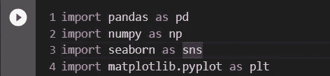

EDA 所需的库

下面给出了一些关于这些库的信息，如果你已经知道的话，可以跳过。

> ***导入 numpy 为 np:***

NumPy 是一个 python 库，用于处理数组。它还具有在线性代数、傅立叶变换和矩阵领域工作的功能。它是由特拉维斯·奥列芬特于 2005 年创作的。这是一个开源项目，你可以免费使用。NumPy 代表数字 Python。在 Python 中，我们有服务于数组目的的列表，但是它们处理起来很慢。NumPy 的目标是提供一个比传统 Python 列表快 50 倍的数组对象。数组在数据科学中使用非常频繁，在数据科学中速度和资源非常重要。

> ***导入熊猫为 pd***

Pandas 是一个开源的、BSD 许可的 Python 库，为 Python 编程语言提供了高性能、易于使用的数据结构和数据分析工具。Python 和熊猫被广泛应用于学术和商业领域，包括金融、经济、统计、分析等。Python 主要用于数据管理和准备。它对数据分析的贡献很小。熊猫解决了这个问题。使用 Pandas，我们可以完成数据处理和分析的五个典型步骤，而不管数据的来源——加载、准备、操作、建模和分析。

> ***导入 matplotlib.pyplot 为 plt***

Matplotlib 是 Python 编程语言及其数字数学扩展 NumPy 的绘图库。Pyplot 是一个 Matplotlib 模块，提供了一个类似 MATLAB 的接口。Matplotlib 被设计成像 MATLAB 一样可用，具有使用 Python 的能力以及免费和开源的优势。Matplotlib 被设计成像 MATLAB 一样可用，具有使用 Python 的能力以及免费和开源的优势。它提供了一个面向对象的 API，使用 Tkinter、wxPython、Qt 或 GTK+等通用 GUI 工具包将绘图嵌入到应用程序中。

> ***导入 seaborn 为 sns***

Seaborn 是一个用 Python 制作统计图形的库。它构建在 matplotlib 之上，并与 pandas 数据结构紧密集成。Seaborn 的目标是让可视化成为探索和理解数据的核心部分。其面向数据集的绘图功能对包含整个数据集的数据框和数组进行操作，并在内部执行必要的语义映射和统计聚合，以生成信息丰富的绘图。

下面的代码用于读取 excel 文件。

**pd.read_excel** 是 Pandas 内置的命令，主要帮助读取 excel 文件。该数据帧存储在变量 df 中。

head()函数用于获取前 n 行。该函数根据位置返回对象的前 n 行。它有助于快速测试对象中是否有正确的数据类型。默认情况下，n=5。

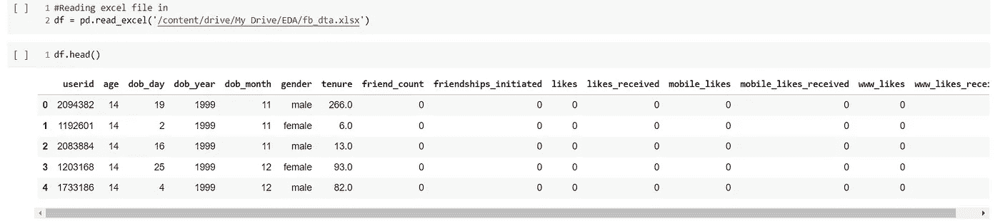

读取数据

只是为了检查我们的数据是否已经被加载和读取，下面的代码被执行，输出显示数据已经被加载和读取。

**df.info** 这个函数给出关于当前列的信息，即它的名称、计数、数据类型，以及它是否为空。

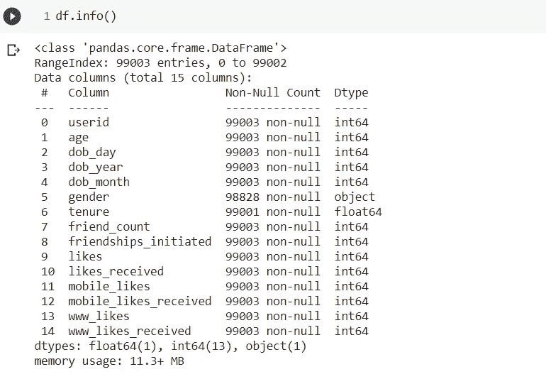

关于 df.info()的输出

describe()函数计算与数据框列相关的统计数据摘要。该函数给出平均值、标准差和 IQR 值。并且，函数排除字符列，给出数字列的汇总。

在下面的输出中，我们可以看到性别列被排除在外，因为它包含非数值。

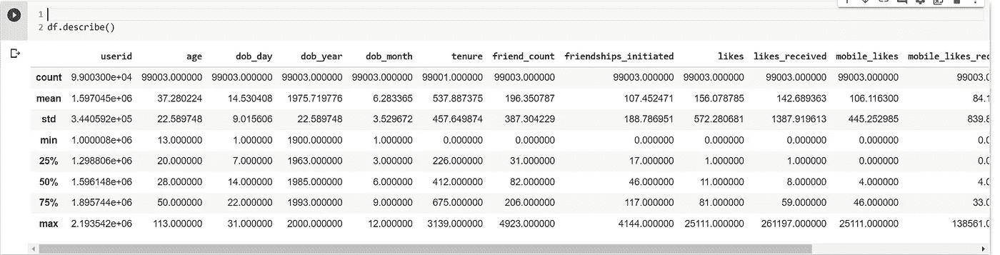

# **缺失值**

有时可能会出现一些缺失数据或数据中的一些不一致，这可能会在分析数据时进一步产生问题，因此替换缺失值或空值非常重要

通常有两种方法可以遵循

1.  要么删除丢失数据的整行。
2.  您可以用列中数据的平均值、众数或中位数来填充它。

我个人更喜欢第二种方法，因为删除行可能会导致数据丢失，而在分析或训练时，拥有尽可能多的数据有利于预测更好的结果。

下面的代码向我们展示了数据框中的每一列中有多少空值。

性别:175 个空值

任期:2 个空值

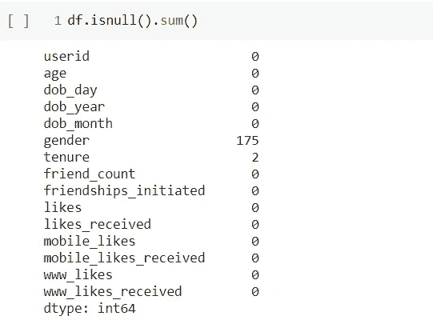

每一列都为空值

如果您想检查特定列的空值，那么您可以使用下面的命令。

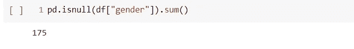

在这里，我首先要解释我是如何替换性别列中的空值的，然后我是如何在代码中实现它的。我将性别列中的所有空值替换为数据的模式，其背后的基本逻辑是，在给定的数据中，性别是一个分类变量，即它可以是男性或女性。因此，在类别的情况下，当只有两个变量可用时，最常出现的值应该是理想值，应该用空值替换。

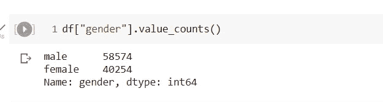

男性用户数量和女性用户数量

这里，我用数据模式替换了性别列中的空值。

替换为模式

最后，替换后，我们可以看到空值为 0。

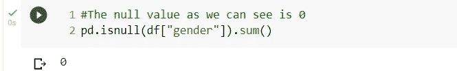

用 mode 替换后空值的数量。

任期是自用户加入 FB 以来的天数，因此用 median 替换它是合理的。在下面的四个代码块中，我们可以看到

a)保有权中空值的数量:2

b)中值=412.0

最后，当保有权替换为中位数时，空值变为 0。

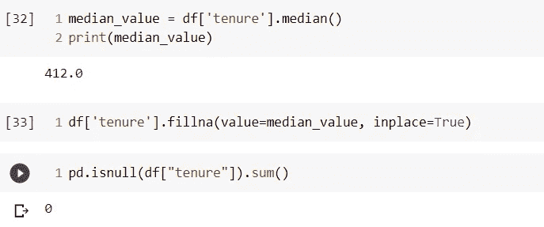

用中位数取代任期。

最后，为了检查我们是否处理了所有丢失的值，让我们运行一次 df.isnull 命令。

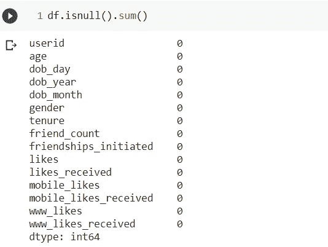

不存在空值

# **相关矩阵**

相关矩阵是显示变量之间相关系数的表格。表格中的每个单元格显示了两个变量之间的相关性。相关矩阵用于汇总数据，作为更高级分析的输入，以及作为高级分析的诊断。

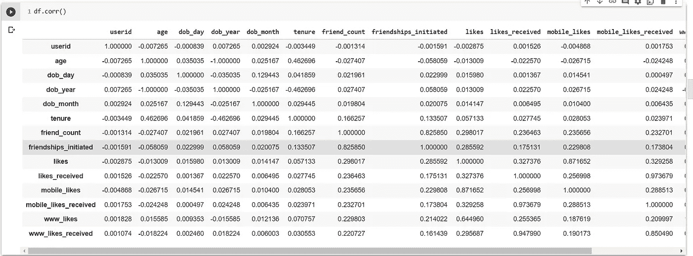

相关矩阵

绘制相关矩阵的热图。

绘制热图的代码

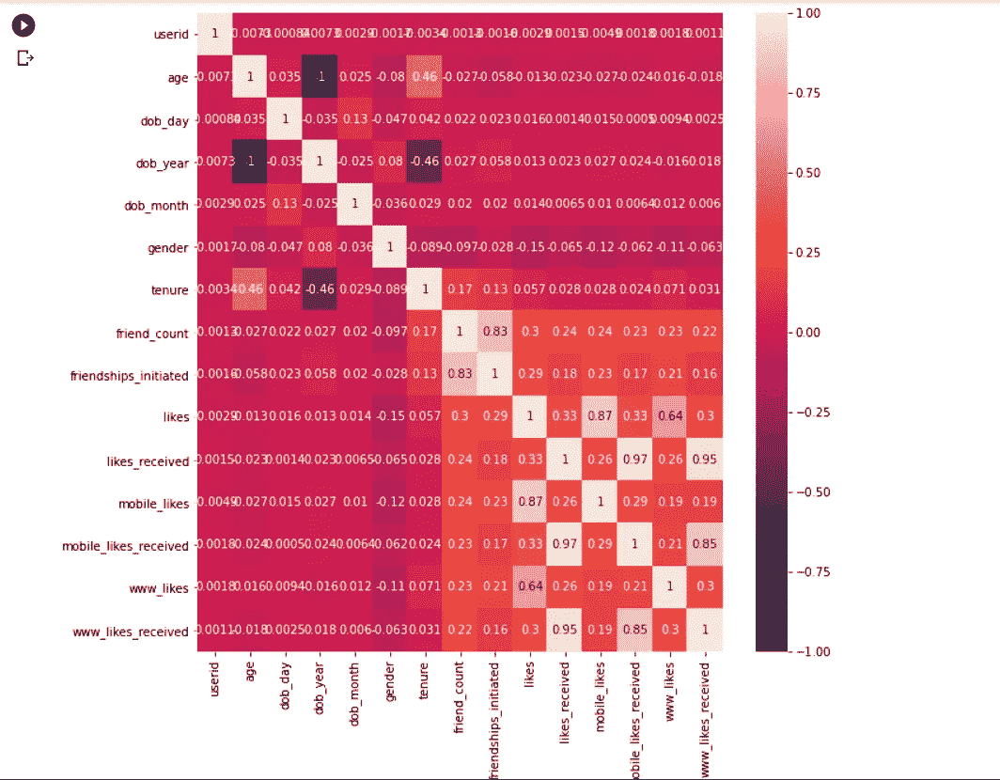

热图

假设我们的目标变量是性别，那么让我们根据它进行分析。

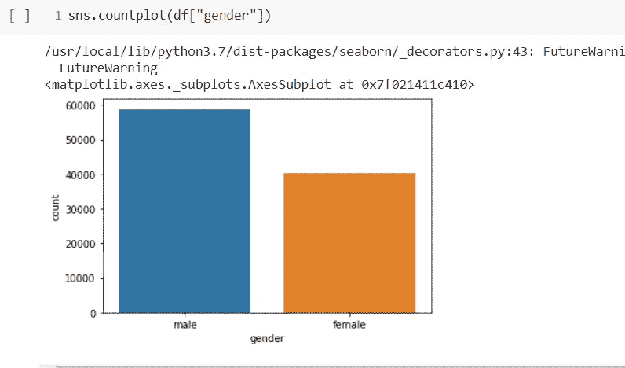

计数图男性对女性

从上面的图表中我们可以清楚地看到，男性的数量远远超过女性。

在给定的数据表中，friend_count 指的是每个用户拥有的好友数量，所以让我们来看看**哪种性别拥有更多好友？**

这里我使用了 groupby 函数。

`DataFrameGroupBy.**agg**` ( *arg* ， **args* ， ***kwargs* ) →(关于 Groupby 的小信息)

用于聚合数据的函数。如果是函数，则必须在传递给 DataFrame 或 DataFrame.apply 时工作。对于 DataFrame，如果键是 DataFrame 列名，则可以传递 dict。

在下面的代码块中，你可以看到，通过使用 groupby，我们可以找到每种性别的朋友总数，以及与之相关的柱状图。

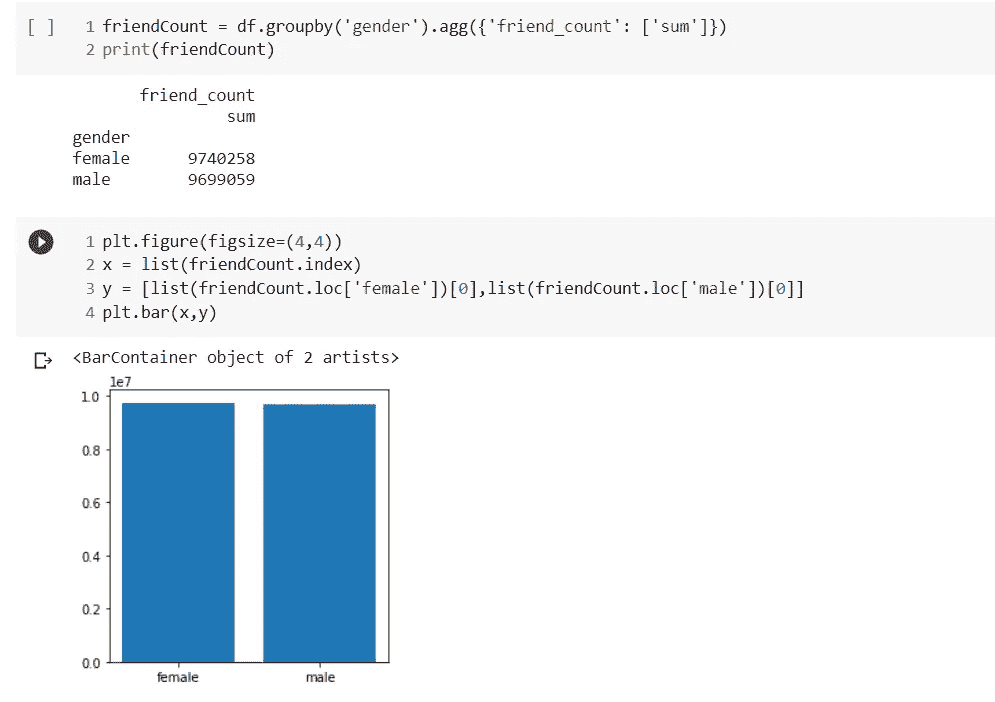

每个性别类别拥有的朋友数量分类

**观察:**

*   从上面的柱状图可以看出，男性和女性的朋友数量几乎相同
*   但是根据这些数值，男性和女性的数量略有不同
*   女:9740258
*   男:9699059

现在我们将检查**哪个类别发起了更多数量的友谊**或者更简单地说，哪个性别类别发送了更多数量的朋友请求。

在下面的代码块中，你可以看到通过使用 groupby，我们可以找到在每一个性别类别中谁发起了更多的好友请求，以及与之相关的柱状图。

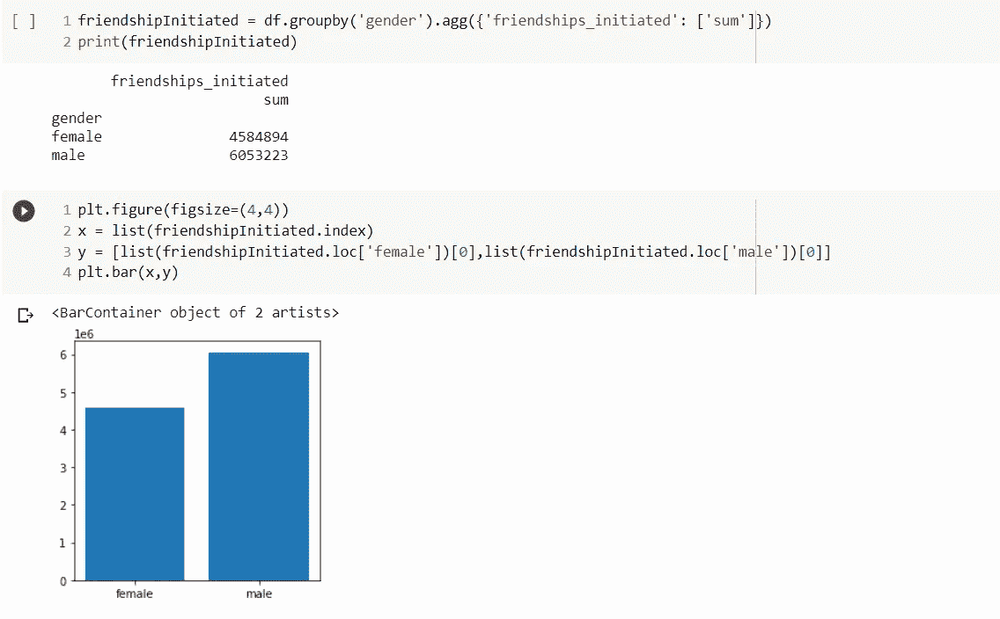

根据每种性别的友谊数量进行分类

**观察:**

*   从上面的代码中，我们可以看到男性比女性建立了更多的友谊。
*   在这张图中，我们也可以看到不同友谊之间的明显差异。
*   女:4584894
*   男:6053223

现在我们来看看**哪一类人在 facebook 上呆的时间比另一类人多**。

在下面的代码块中，你可以看到，通过使用 groupby，我们可以找到每个性别类别中谁在 facebook 上花的时间更多，还可以找到与之相关的条形图。

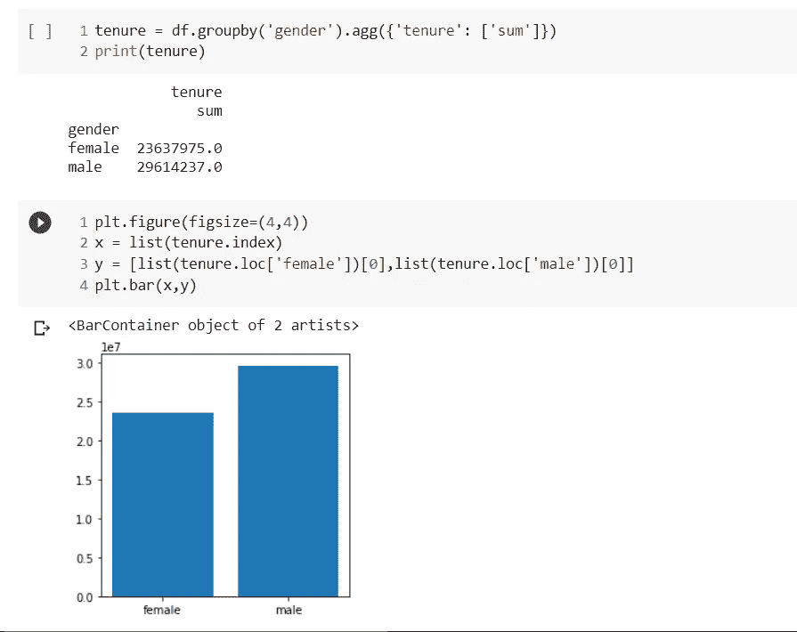

**观察:**

*   从上面的代码中，我们可以看到男性比女性使用 facebook 的时间更长。
*   在这张图中，我们也可以看到不同友谊之间的明显差异。
*   女:23637975.0
*   男:29614237.0

# **基于脸书最不活跃用户的分析**

主要有三个关于最不活跃用户问题

1.  有多少用户没有朋友？
2.  有多少用户不喜欢任何帖子？
3.  有多少用户没有收到任何赞？

这里的分析是用户明智的:

发现这很简单。

对于每一列，检查值是否为 0，然后将它们相加。

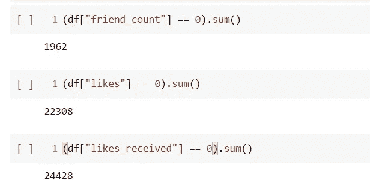

所以，我们得到

a.1962 用户没有任何朋友。

b.22308 个用户不喜欢任何帖子。

c.24428 个用户没有收到任何赞。

# **基于用户可访问性的分析(移动设备与网络设备)**

1.  **与移动设备相比，用户(基于性别)喜欢的帖子的平均数量是多少？**

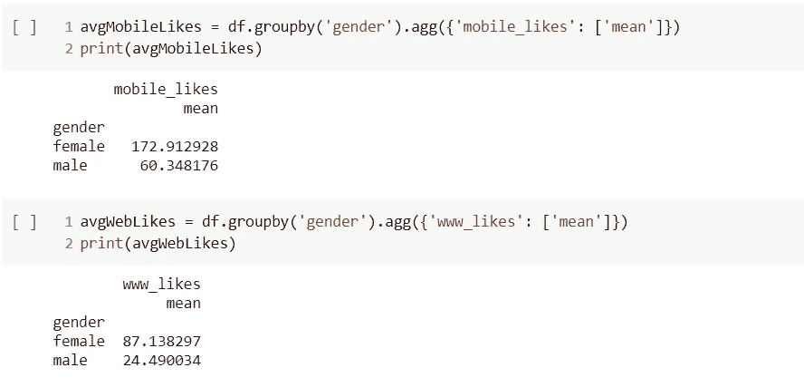

在这里，我们可以看到在这两种情况下，平均喜欢一个职位的女性比男性多。下面是两个条形图，显示了移动设备喜欢和网络设备喜欢的性别比较。

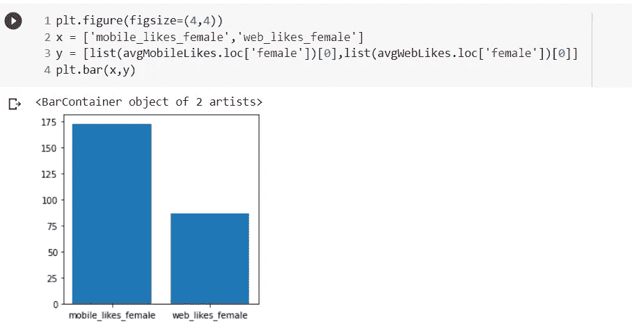

mobile _ likes _ female vs web _ likes _ female

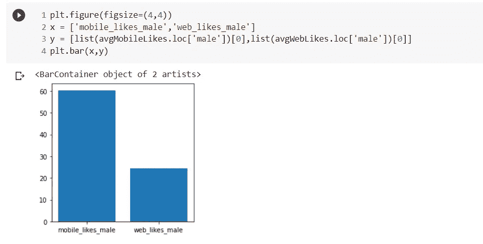

男性 _ 喜欢 _ 男性 vs 网络 _ 喜欢 _ 男性

**2。用户通过网络和移动设备获得的平均赞数(基于性别)是多少？**

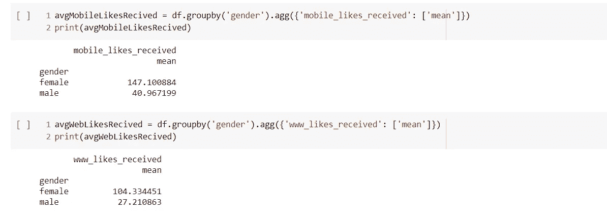

这里我们可以看到，在这两种情况下，女性收到的平均点赞数比男性多。下面是两个条形图，显示了移动设备喜欢和网络设备喜欢两种性别收到的喜欢的比较。

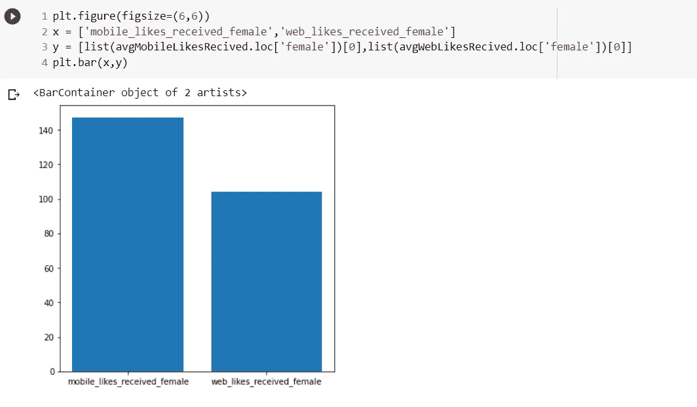

mobile _ likes _ received _ female vs web _ likes _ received _ female

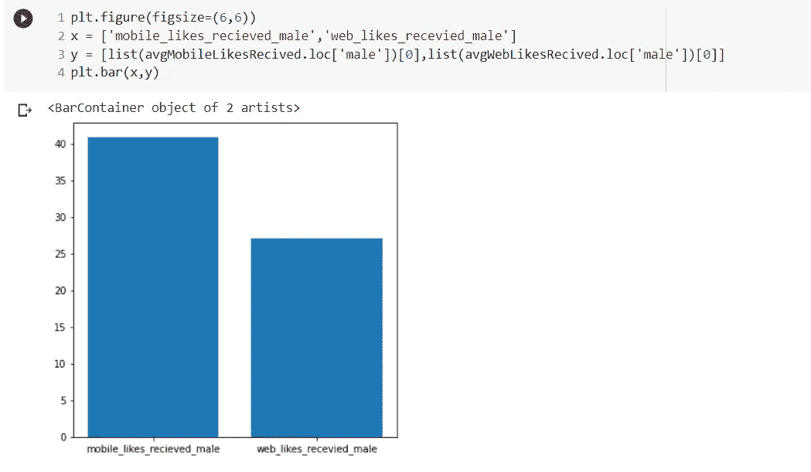

mobile _ likes _ received _ male vs web _ likes _ received _ male

这是我做的一些 EDA，如果你有任何问题，请随时联系。