# 西雅图 Airbnb 民宿探索性数据分析

> 原文：<https://medium.com/analytics-vidhya/exploratory-data-analysis-on-seattle-airbnb-homestays-dbeed8855b63?source=collection_archive---------10----------------------->

计划去西雅图旅行之前你需要知道的事情

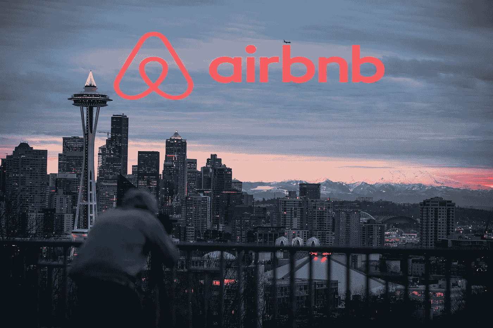

罗伯特·尼克森在 [Unsplash](https://unsplash.com/?utm_source=medium&utm_medium=referral) 上的照片

西雅图是美国生活成本第五高的城市。我很确定去西雅图旅行对旅行者来说会很贵。随着人们对更个性化住宿的需求不断上升，以及旅游业和酒店业的竞争日益激烈，西雅图 Airbnb 可能是最佳选择吗？

为了找到答案，我对[西雅图 Airbnb 开放数据](https://www.kaggle.com/airbnb/seattle)做了一些 EDA，并在这里分享了一些有趣的见解。

数据集的高层信息:
**房源**——包含 92 列中 3818 个 Airbnb 房源的所有信息。列表使用“ **id** 进行标识。

**日历** -这是 2016 年 1 月至 2017 年 1 月的预订日志，有 1，393，570 行和 4 列。包含每个 Airbnb 列表的 365 条记录。每个列表 id 有 365 天的记录，以及当天的可用性和预订价格。如果酒店已经预订，则不提及预订价格。

**评论** -包含来自唯一评论者的关于列表的评论。我将在另一篇文章中分享我对这些数据的见解。

***1。西雅图 Airbnb 情侣住宿的平均每日预订价格是多少？***

西雅图一对夫妇的平均酒店价格是 189 美元。你认为 Airbnb 能提供更好的交易吗？为了找到答案，我使用了**容纳**功能来对抗**预订价格**。

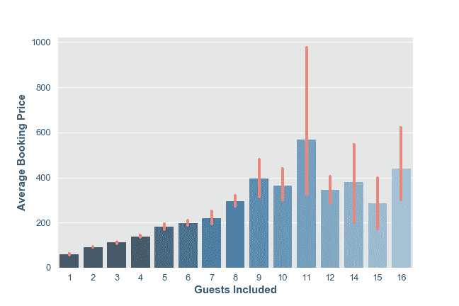

从上面的条形图中，你可以看到在西雅图 Airbnb 住一晚的费用接近每人 91 美元，一对夫妇 112 美元，这比西雅图的平均酒店价格更方便。橙色的小线是价格的变化。看来 Airbnb 给了我们更好的待遇！！

***2-西雅图 Airbnb 房屋在一年中的特定时间段内的收入是多少？***

这可以通过查看全年每月和每周的预订趋势来发现。

***在一年中的任何时候，预订价格都有趋势吗？***

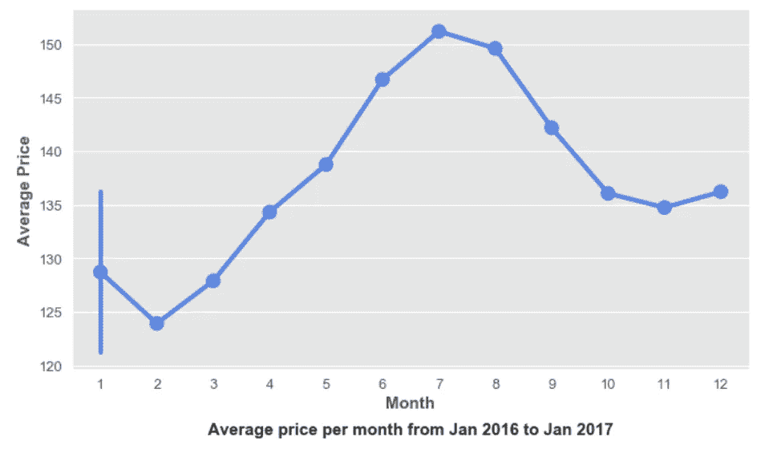

从 2016 年 2 月到 2016 年 7 月，价格呈上升趋势，平均价格达到最高，每天 153 美元。然后，下降趋势一直持续到 16 年 11 月。

> 从图表来看，六月到八月是游览西雅图的最佳时间。夏季标志着这座城市的旺季，这意味着房价上涨，空房率下降，而冬季寒冷的天气甚至会让最热情的游客望而却步。

1 月的一条小线表示 2016 年和 2017 年有两个价格:2017 年 1 月的平均价格高于 2016 年 1 月。

***周末期间预订价格是否会出现飙升？***

通常，人们喜欢在周末度假，从紧张的工作中获得一些休息时间。我们来看看同样的情况是否适用于 Airbnb 民宿。

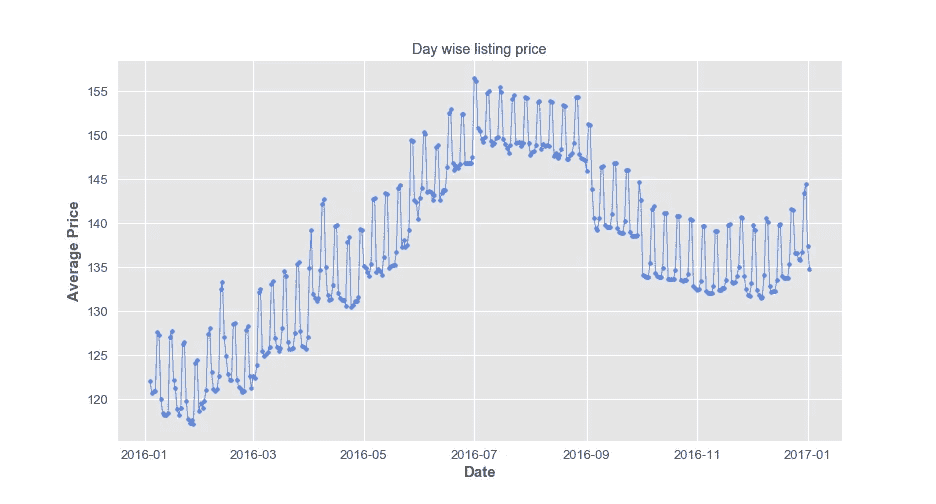

图中有一个周期性的小峰，这可能是周末季节性的一个指标。我进一步绘制了工作日的价格，以便更深入一层。

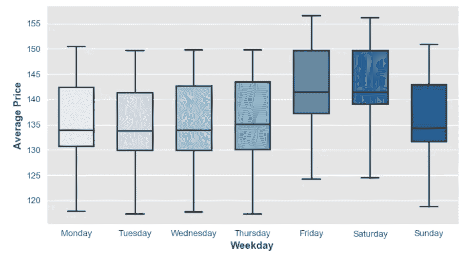

上面的箱线图显示了周五和周六预订价格的峰值。显然，有一种每周趋势，即**周末**的挂牌价格高于其他工作日。

西雅图最繁忙/最昂贵的社区是哪些？

***西雅图十大最繁忙街区:***

作为 Airbnb 民宿中心的街区将是最繁忙的，有很多旅游活动。我使用了 neighborhood _ group(district)和 neighborhood 列来查找最繁忙的街区。

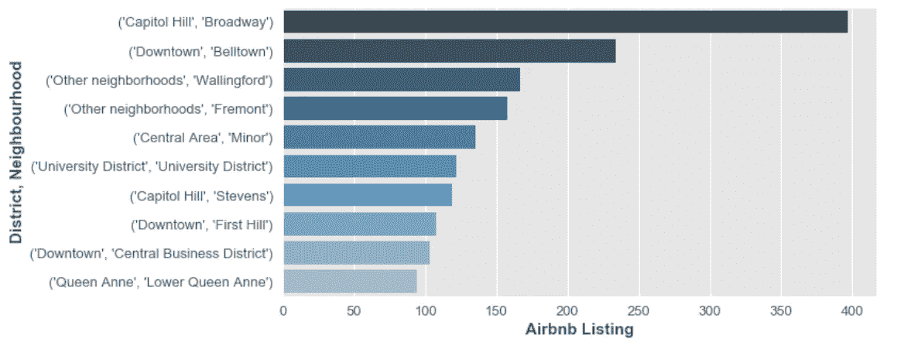

百老汇，国会山似乎是西雅图最拥挤的街区，有 397 处 Airbnb 房产，其次是贝尔敦，市中心有 234 处房产。

***西雅图十大最昂贵街区***

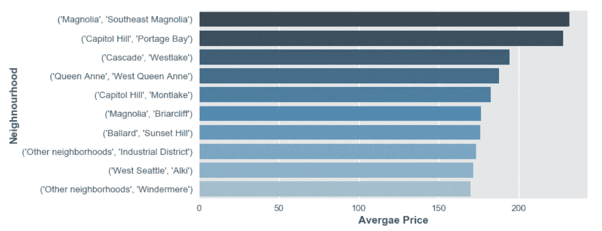

**东南木兰**是西雅图住宿最贵的地方，平均每晚 232 美元，其次是国会山**波蒂奇湾**，平均价格接近 227 美元。

> 如果你想体验一次豪华的家庭旅馆，就在这些街区预订住宿，那里每晚的平均价格从 170 美元到 232 美元不等。

***4-西雅图最常见的 Airbnb 房产类型有哪些？***

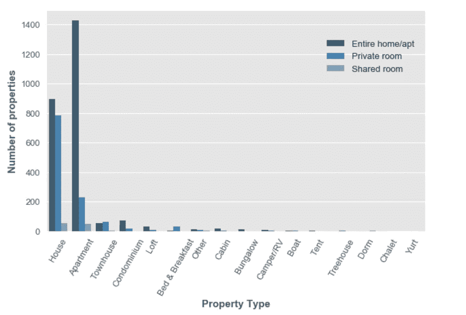

房屋和公寓占据了西雅图所有 Airbnb 房产的 90%,共有 1733 栋房屋和 1708 套公寓。在西雅图，蒙古包、宿舍和小木屋是免费的。

从上面的图中可以看出，与**合租**房相比，大部分房产的首选房型为**住宅/公寓**和**私人**。

***5-有什么关于房产的东西可以帮助我们预测价格吗？***

找出属性的**特征**和**价格**之间是否存在任何关系的最简单方法是获取数据集中每个特征的**相关性度量**。下面的热图显示了包括目标(价格)在内的数字特征的成对相关性。

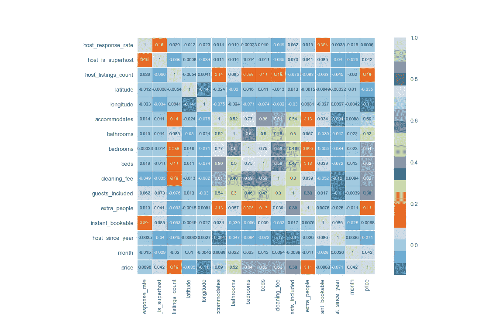

,

物业的基本特征——住宿、卧室、床、清洁费与价格高度正相关，这意味着如果这些因素的价值增加，价格将会增加，反之亦然，而 host_since_year 与价格负相关，这意味着如果 host 长期在那里，价格将会增加。

要更清楚地了解功能与价格的相关性，请查看下面的条形图:

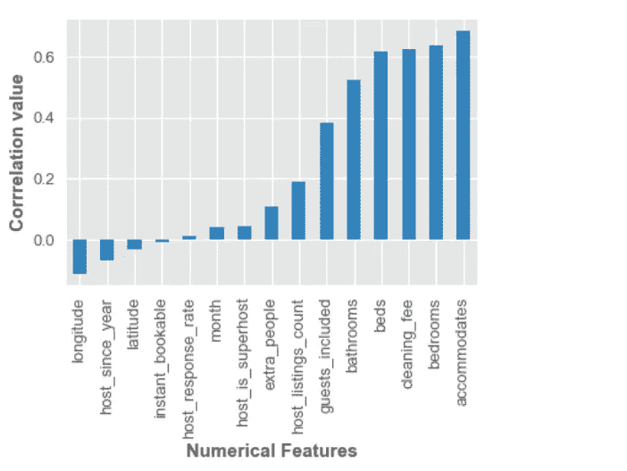

有许多工具和技术可以用来确定特征的重要性。

为了举例说明，我在 **scikit-learn 中使用了 **RandomForestRegressor** 的内置 **feature_importances_** 属性。**我训练了一个回归变量，并创建了下图，显示了特征的重要性。

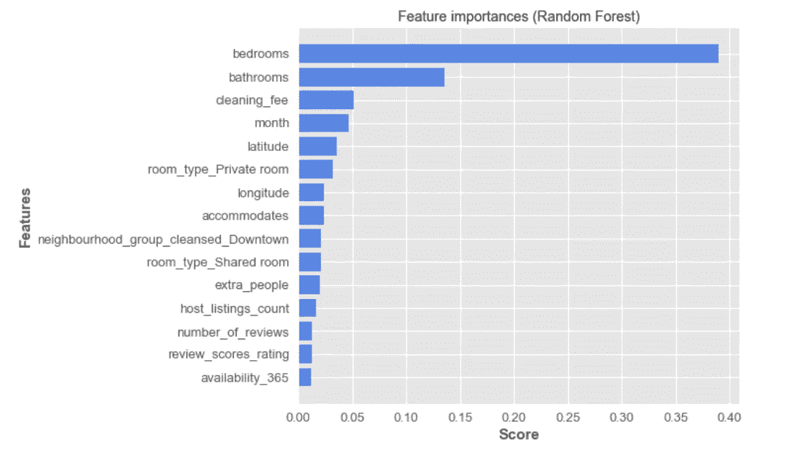

这很好地显示了那些对价格有影响的功能和那些没有影响的功能。在分析这张图表后，我们可以选择去掉一些不太重要的特征。

> 预订价格受酒店配置(卧室、浴室、住宿等的数量)、位置、季节、主人素质的影响很大。

# 尾注

虽然有很多方法可以找出影响 Airbnb 预订价格的因素，但这完全取决于旅行者的旅行目的。我很确定，以上见解会让你对西雅图的 Airbnb 民宿有一个大致的了解。

我已经使用了 [Seaborn](https://seaborn.pydata.org/tutorial.html) 和 [Matplotlib](https://matplotlib.org/tutorials/introductory/pyplot.html#sphx-glr-tutorials-introductory-pyplot-py) 来创建所有的可视化效果。完整代码请参考我的 [Github](https://github.com/JSanjayam/seattle_airbnb_exploratory_data_analysis) 。

感谢您的阅读。