# 超级商店销售分析

> 原文：<https://medium.com/analytics-vidhya/exploratory-data-analysis-super-store-cb91c37bcb06?source=collection_archive---------0----------------------->

## 分析超级市场的销售数据，并确定促进业务增长的机会


现在你知道我是金便利的超级粉丝了！😉|图片来源:[https://www . blogto . com/real-estate-Toronto/2021/04/iconic-kims-便利店-待售-toronto/](https://www.blogto.com/real-estate-toronto/2021/04/iconic-kims-convenience-store-for-sale-toronto/)

# 介绍

超级商店是一家位于美国的小型零售企业。他们销售家具、办公用品和技术产品，他们的客户是大众消费者、企业和家庭办公室。

数据集包含超级商店的销售、利润和地理信息。

我们的任务是分析销售数据，找出超级商场的薄弱环节和机会，以促进业务增长。

**商务问题**

*   哪个品类最畅销，最赚钱？
*   最畅销和最赚钱的子类别是什么？
*   哪一个是最畅销的子类别？
*   哪个客户群最有利可图？
*   首选的船模式是什么？
*   哪个地区最赚钱？
*   哪个城市销量最高？

**谁在读这篇分析？**

*   我们假设超级商店是一个家族企业，由 1 或 2 个对其业务非常投入的所有者拥有。
*   所有者很可能不是擅长阅读图表或解释统计分析的人，所以我们的分析将深入浅出，易于理解。

# 准备环境

我们将导入所需的库并读入数据集。

*   熊猫——数据处理
*   Matplotlib 和 Seaborn —数据可视化

```
*# Import libraries and alias for easy reading*
import pandas as pd
import matplotlib.pyplot as plt
import seaborn as sns
import warnings
warnings.filterwarnings("ignore")
%matplotlib inline*# Read in data in CSV format*
superstore = pd.read_csv('../Data Analytics/The Sparks Internship/Super Store/SampleSuperstore.csv')
```

# 数据探索

让我们来看看使用 df.head()和 df.tail()函数的数据。

```
*# Preview first 5 rows of data set*
superstore.head()
```

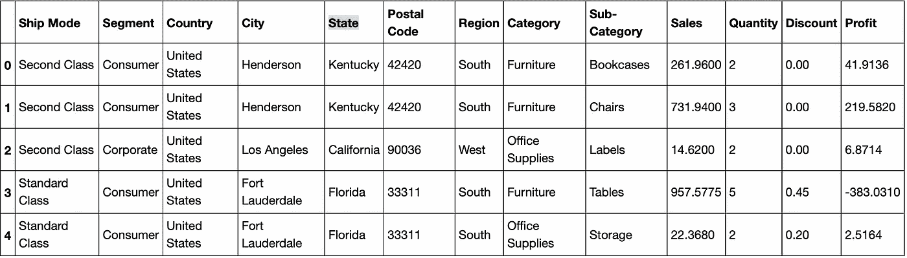

预览超级商店数据集的前 5 行

```
*# Preview last 5 rows of data set*
superstore.tail()
```


预览最后 5 行

你可以很容易地看出，这里混合了分类变量、地理变量和数字变量。

每行代表一个项目的订单以及相应的数量、销售额、折扣和利润。还有就是发货方式，客户细分，地域方面。

接下来，我们将使用 df.shape()和 df.info()来获取更多信息。

```
*# Shape of data set*
superstore.shape(9994, 13)*# Summarised information of data set*
superstore.info()<class 'pandas.core.frame.DataFrame'>
RangeIndex: 9994 entries, 0 to 9993
Data columns (total 13 columns):
 #   Column        Non-Null Count  Dtype  
---  ------        --------------  -----  
 0   Ship Mode     9994 non-null   object 
 1   Segment       9994 non-null   object 
 2   Country       9994 non-null   object 
 3   City          9994 non-null   object 
 4   State         9994 non-null   object 
 5   Postal Code   9994 non-null   int64  
 6   Region        9994 non-null   object 
 7   Category      9994 non-null   object 
 8   Sub-Category  9994 non-null   object 
 9   Sales         9994 non-null   float64
 10  Quantity      9994 non-null   int64  
 11  Discount      9994 non-null   float64
 12  Profit        9994 non-null   float64
dtypes: float64(3), int64(2), object(8)
memory usage: 1015.1+ KB
```

包括标题和 13 列在内共有 9，994 行。数据类型正确并且与相应的值匹配。

# 数据清理

在我们开始分析之前，我们必须首先清理数据或“擦洗污垢”。

对于此分析，我们将查看更常见的问题，如缺失和重复数据。

**处理缺失值**

在这里，我们将找出是否有空值。

```
*# Find the number of null values for all columns*
superstore.isnull().sum()Ship Mode       0
Segment         0
Country         0
City            0
State           0
Postal Code     0
Region          0
Category        0
Sub-Category    0
Sales           0
Quantity        0
Discount        0
Profit          0
dtype: int64
```

结果显示数据集没有任何空值。

**重复数据**

然后，我们会发现是否有重复的数据。

```
*# Find the number of duplicate data*
superstore.duplicated().sum()17
```

结果显示有 17 个重复的行。让我们运行另一个函数来查看复制的数据。

```
*# Show the duplicated rows*
superstore[superstore.duplicated(keep = 'last')]
```

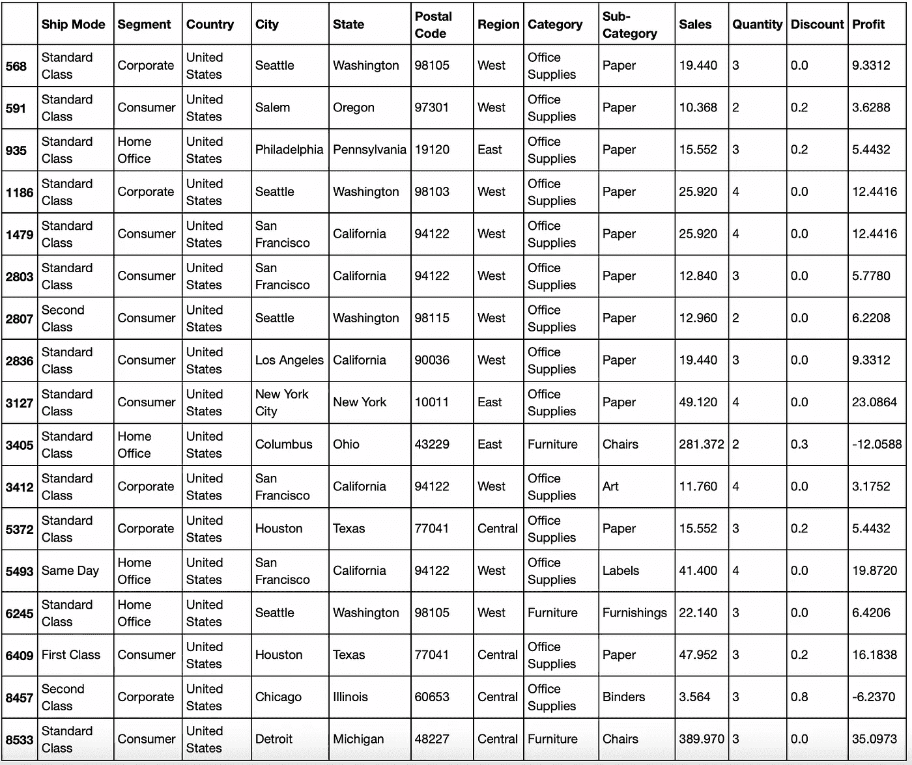

预览 17 个重复的行

然后，我们将运行 drop_duplicates()函数来删除重复的行。

```
*# Drop the duplicated rows*
superstore.drop_duplicates(inplace = **True**)*# Find the no. of rows and columns*
superstore.shape(9977, 13)
```

好吧！我们可以确认重复的行已经被删除，因为之前是 9993 行，现在减少到 9977 行。

**计算字段**

现在，我们将为利润率创建一个计算字段。公式为(利润/销售额)* 100。

```
superstore['Profit Margin %'] = (superstore.Profit / superstore.Sales) * 100
superstore.head(5)
```

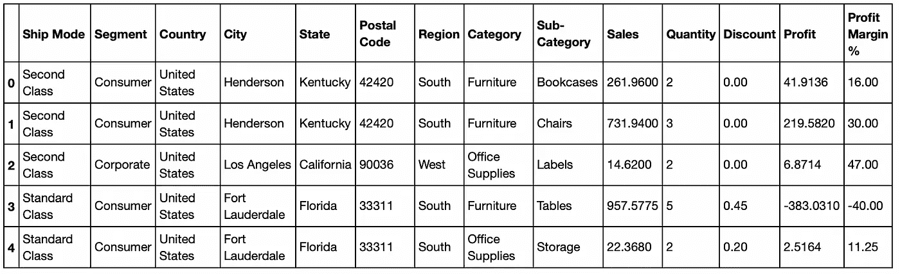

新的计算字段“利润率%”被添加到最后一列

既然数据集已经被清理了，我们可以继续进行一些统计分析了！

# 描述统计学

在这里，我们将做一个描述性的统计分析。我们使用 df.describe()并赋值' include = 'all '来确保分类特征也包含在输出中。

```
*# Get descriptive statistics summary*
superstore.describe(include = "all")
```

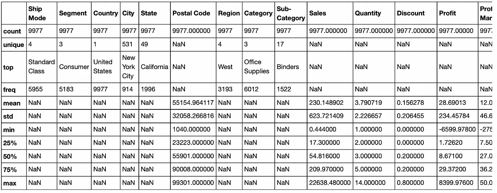

哎呀，不能截图利润率，但它在这里最右边。

你会在一些分类栏中看到“NaN ”,这很好。分类值不意味着对它们执行计算，因此我们可以忽略它们。

我们想要关注的是分类特征的唯一计数和频率，例如

*   有 4 种发货模式和 3 个客户群。近一半的订单来自使用标准舱位运输的消费者群体。
*   商店有 3 类商品，17 个子类别。60%的订单是办公用品，至少 15%的订单是活页夹。

而对于数值参数，有趣的是

*   75%的订单至少有 36%的利润率。
*   亏损的订单可能高达 275%的损失。我们必须把重点放在这些赔钱的销售上，以切断它们。

我们将在下面执行一些分析来测试这些观察。

# 探索性数据分析

# 1.哪个品类最畅销，最赚钱？

最佳销售指的是销售，最有利可图指的是利润。我们将按类别对销售额、利润以及数量进行分组，并运行 df.group()。sum 和 pd。DataFrame()函数。

```
*# Group sales, profit and quantity by category*
category_analysis = pd.DataFrame(superstore.groupby(['Category'])[['Sales', 'Profit', 'Quantity']].sum())
category_analysis
```

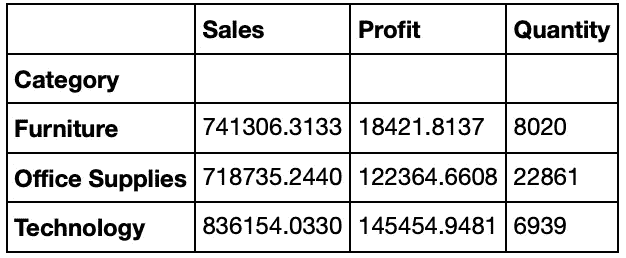

按类别按销售额、利润和数量分组

```
*# Set for grouped plots - figure with a 2x2 grid of Axes*
sns.set_theme(style="whitegrid")
figure, axis = plt.subplots(1, 3, figsize=(8, 5))*# Plot barplots*
cat1 = sns.barplot(x = category_analysis.index, y = category_analysis.Sales, ax=axis[0])
cat2 = sns.barplot(x = category_analysis.index, y = category_analysis.Profit, ax=axis[1])
cat3 = sns.barplot(x = category_analysis.index, y = category_analysis.Quantity, ax=axis[2])*# Set titles*
cat1.set(title = 'Sales')
cat2.set(title = 'Profit')
cat3.set(title = 'Quantity')*# Rotate axis for x-axis*
plt.setp(cat1.get_xticklabels(), rotation = 'vertical', size = 9)
plt.setp(cat2.get_xticklabels(), rotation = 'vertical', size = 9)
plt.setp(cat3.get_xticklabels(), rotation = 'vertical', size = 9)*# Set spacing between subplots*
figure.tight_layout()
```

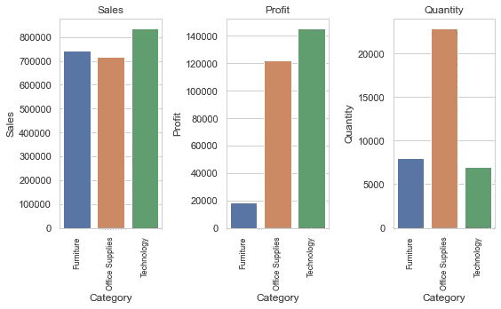

按类别划分的销售额、利润和数量的条形图

我们的观察结果是:

*   所有三个类别——家具、办公用品和技术——的销售额都差不多。
*   技术是最畅销的，很高兴知道这一类别也是最赚钱的。由于这些产品通常是一次性购买的，可以持续至少 4-5 年，因此只出售极少量。
*   尽管家具的销售与技术相似，但它是利润最少的，销量也最低。
*   就数量而言，办公用品卖得最多，因为它是相对便宜的产品。

# 2.最畅销和最赚钱的子类别是什么？

```
*# Group by sub-category*
subcat_analysis = pd.DataFrame(superstore.groupby(['Sub-Category'])[['Sales', 'Profit']].sum())*# Sort by descending order according to sales*
subcat_sales = pd.DataFrame(subcat_analysis.sort_values('Sales', ascending = **False**))
subcat_sales
```

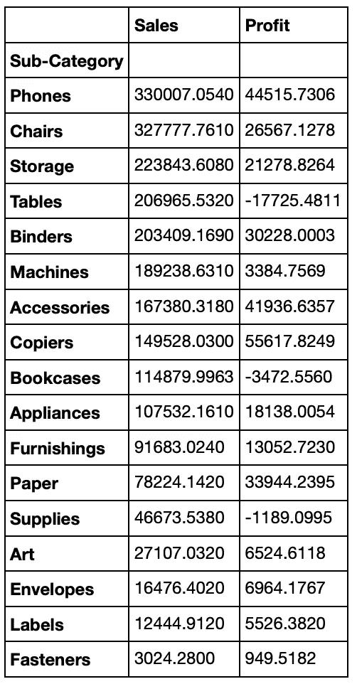

按子类别降序排列的销售和利润数据框架

```
*# Sort by descending order according to profit*
subcat_profit = pd.DataFrame(subcat_analysis.sort_values('Profit', ascending = **False**))
subcat_profit
```

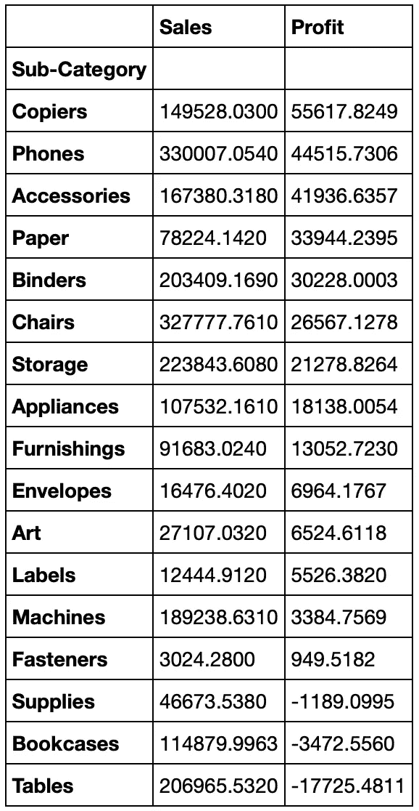

按子类别升序排列的销售和利润数据框架

```
*# Plot Bar Plots*sns.set_theme(style="whitegrid")*# Set for grouped plots - figure with a 1x2 grid of Axes*
figure, axis = plt.subplots(1, 2, figsize=(12, 6))*# Plot Bar Plot for Best Selling Sub-Category*
subcat1 = sns.barplot(data = subcat_sales, x = subcat_sales.index, y = subcat_sales.Sales, ax=axis[0])
subcat1.set(title="Best Selling Sub-Category")
subcat1.set_xticklabels(subcat1.get_xticklabels(),rotation = "vertical", size = 10)*# Plot Bar Plot for Most Profitable Sub-Category*
subcat2 = sns.barplot(data = subcat_profit, x = subcat_profit.index, y = subcat_profit.Profit, ax=axis[1])
subcat2.set(title = "Most Profitable Sub-Category")
subcat2.set_xticklabels(subcat2.get_xticklabels(),rotation = "vertical", size = 10)*# Set spacing between subplots*
figure.tight_layout()plt.show()
```

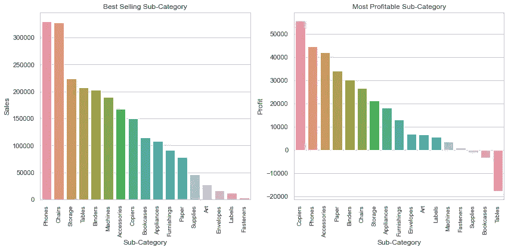

条形图显示子类别的(L)最佳销售和(R)最有利可图

让我们来分析柱状图:

*   电话和椅子是最畅销的两个子类别。
*   复印机产生的利润最多，其次是电话、配件、纸张和活页夹。营销策略必须专注于营销这些产品。
*   另一方面，机器、紧固件、供应品、书架和桌子的利润几乎为零。这些产品 Super Store 可以考虑从产品目录中删除，或者提高销售价格和利润，或者从供应商那里讨价还价。

# 3.哪一个是最畅销的子类别？

```
subcat_quantity = pd.DataFrame(superstore.groupby(['Sub-Category'])[['Quantity']].sum().sort_values('Quantity',ascending=**False**))
subcat_quantity
```

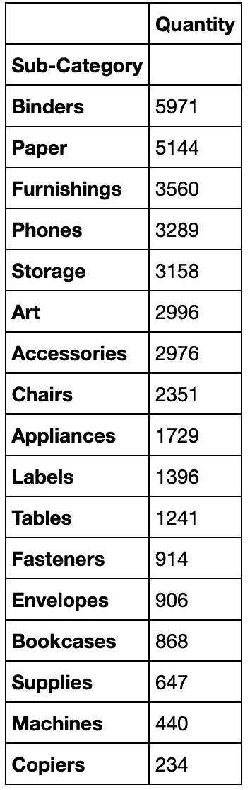

每个子类别的销售数量

```
*# Plot Bar Plot for Top Selling Sub-Category*
sns.set_theme(style="whitegrid")
sns.barplot(data = subcat_quantity, y = subcat_quantity.index, x = subcat_quantity.Quantity, palette = "muted")
plt.title("Top Selling Sub-Category")
plt.show()
```

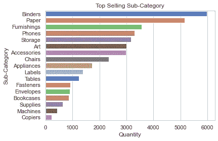

条形图显示每个子类别的最高销售额

在这里，我们可以推断出

*   超级商场应确保畅销品类的库存充足，如活页夹、纸张、家具和手机。
*   尽管利润最高，复印机销售最少，只有 234 台，但由于这是一种相对昂贵的办公设备，通常使用几年，所以它在所有产品中销售最少是可以理解的。

# 4.哪个客户群最有利可图？

```
segment_analysis = pd.DataFrame(superstore.groupby(['Segment'])[['Profit']].sum())
segment_analysis
```

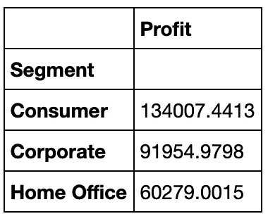

按客户类别划分的利润总额

```
*# Plot Bar Plot*
sns.set_theme(style="whitegrid")
sns.barplot(data = segment_analysis, x = segment_analysis.index, y = segment_analysis.Profit, palette = "rocket")
plt.title("Customer Segment Profitability")
plt.show()
```

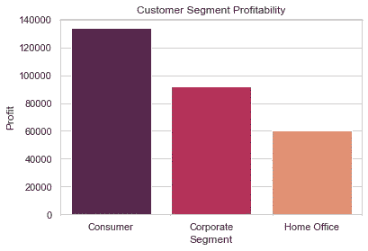

显示每个客户群总利润的图表

消费者市场利润最高，其次是企业市场和家庭办公市场。因此，营销战略必须瞄准或更加注重留住消费者和企业细分市场的客户。

# 5.首选的船模式是什么？

```
*# Plot shipment mode*
sns.set_theme(style="whitegrid")
sns.countplot(superstore['Ship Mode'])
plt.title("Ship Mode")
plt.show()
```

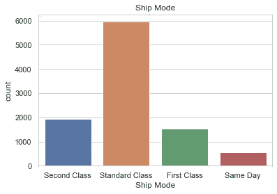

显示使用不同发货模式的订单数量的图表

绝对优势，标准等级是首选的运输方式，也许也是最便宜的方式。其他模式在客户中不受欢迎，并且可能过于昂贵。

# 6.哪个地区最赚钱？

```
region_analysis = pd.DataFrame(superstore.groupby(['Region'])['Profit'].sum().reset_index())
region_analysis
```

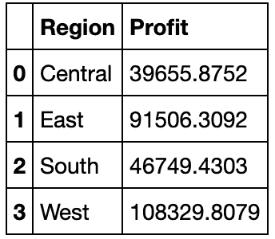

```
*# Plot Pie Chart*
explode = [0, 0, 0, 0.1]plt.pie(region_analysis.Profit, labels = region_analysis.Region, startangle = 90, autopct = "**%1.0f%%**", explode = explode, shadow = **True**)
plt.title("Most Profitable by Region")plt.show()
```

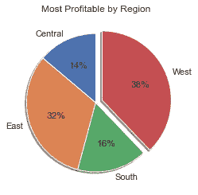

按地区显示销售百分比的饼图

东部和西部地区最有利可图。

# 7.哪个城市销量最高？

```
city_sales = pd.DataFrame(superstore.groupby(['City'])['Sales', 'Quantity'].sum().sort_values('Sales',ascending = **False**))
top10 = city_sales[:10]
top10
```

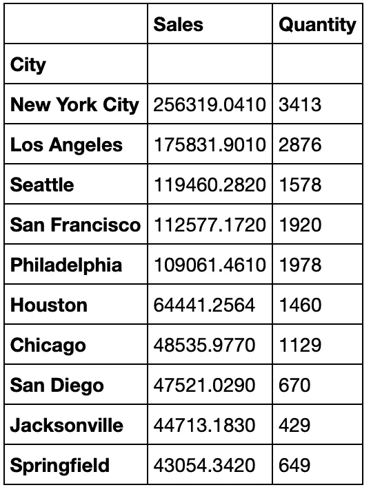

销售额最高的十大城市

```
bottom10 = city_sales[-10:]
bottom10
```


销售额最低的 10 个城市

```
*# Set for grouped plots - figure with a 1x2 grid of Axes*
figure, axis = plt.subplots(1, 2, figsize=(12, 5))sns.set_theme(style="whitegrid")top10c = sns.barplot(data = top10, y = top10.index, x = top10.Sales, palette = "coolwarm", ax = axis[0])
top10c.set(Title = "Top 10 Cities with Highest Sales")
top10c.set_yticklabels(top10c.get_yticklabels(),size = 10)*# Plot Bar Plot for Best Selling Sub-Category*
bottom10c = sns.barplot(data = bottom10, y = bottom10.index, x = bottom10.Sales, palette = "coolwarm", ax=axis[1])
bottom10c.set(Title = "Bottom 10 Cities with Lowest Sales")
bottom10c.set_yticklabels(bottom10c.get_yticklabels(),size = 10)*# Set spacing between subplots*
figure.tight_layout()plt.show()
```

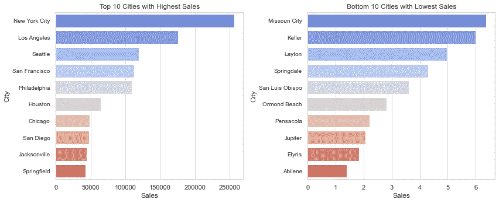

l:销售额最高的 10 个城市| R:销售额最低的 10 个城市

销售额最高和最低的城市之间有巨大的差距。营销策略必须以排名前 10 的城市为目标。

# 战略建议

在这里，我们重温我们的业务问题，并与您分享我们的高级业务建议。

**商业问题**

*   哪个品类最畅销，最赚钱？
*   最畅销和最赚钱的子类别是什么？
*   哪一个是最畅销的子类别？
*   哪个客户群最有利可图？
*   首选的船模式是什么？
*   哪个地区最赚钱？

**推荐**

*   关注技术子类别以及电话和椅子，因为它们销量最高，利润最高。将它们与书柜、桌椅等利润较低的产品捆绑销售，以抵消损失。
*   销售书柜和桌子会导致巨额亏损，因此超级商场必须考虑将它们与高销量或高利润的子类别捆绑在一起，如椅子、复印机、电话和办公用品。
*   对于家庭办公室客户，这些人可能忙于工作，不太可能花时间选择单个产品，因此创建一个家庭办公室产品包，其中包含用于办公室的产品，如桌子、椅子、电话、复印机、储物、标签、紧固件、书柜。
*   对于耗材、书架、桌子等亏损产品，可以考虑从目录中删除，或者更换供应商，争取更低的价格。
*   消费者和企业细分市场占客户群的 70%以上。瞄准他们，特别是来自东部和西部地区销售额最高的前 10 个城市的客户，为大众消费者和家庭办公室推出特别促销和套餐，并发送促销电子邮件或传单。

谢谢大家！