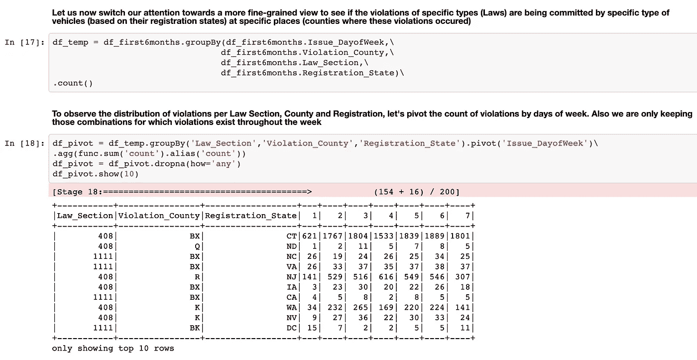

# 使用 Spark 进行探索性数据分析

> 原文：<https://medium.com/analytics-vidhya/exploratory-data-analysis-using-spark-c19964faf620?source=collection_archive---------0----------------------->

# 介绍

这篇博客旨在展示使用 apache spark 执行探索性数据分析的一步一步的方法。它的目标受众是开始接触 PySpark 的初学者和中级数据工程师。但是，更有经验或更高级的 spark 用户也可以查看这些材料，并提出改进措施。

请注意，进行探索性数据分析有多种方法，本博客只是其中一种。这个博客的目的是帮助初学者开始使用 spark 的旅程，并为中级数据工程师提供现成的参考。这里提供的信息可以有多种用途。它可以按原样使用，也可以组合在一起构建各种其他方式来执行 EDA 或构建特定功能。

# 先决条件

本博客中使用的数据取自[https://www.kaggle.com/new-york-city/nyc-parking-tickets](https://www.kaggle.com/new-york-city/nyc-parking-tickets?select=Parking_Violations_Issued_-_Fiscal_Year_2017.csv)。数据集大约有 1000 万条记录

火花分布从 https://spark.apache.org/downloads.html[下载](https://spark.apache.org/downloads.html)

我用来开发这里介绍的代码的发行版是 spark-3.0.3-bin-hadoop2.7.tgz

这篇博客假设读者可以在本地或通过 AWS EMR 或通过 Databricks 或 Azure HDInsights 访问 Spark 集群

最后但同样重要的是，读者应该将 Spark API 参考资料[https://Spark . Apache . org/docs/latest/API/python/reference/py Spark . SQL . html](https://spark.apache.org/docs/latest/api/python/reference/pyspark.sql.html)

本博客中使用的所有代码都可以在[https://github.com/sumaniitm/complex-spark-transformations](https://github.com/sumaniitm/complex-spark-transformations)获得

事不宜迟，让我们开始吧

# 预处理

首先也是最重要的是我们想要对数据进行的预处理

我们将参考笔记本[https://github . com/sumaniitm/complex-spark-transformations/blob/main/preprocessing . ipynb](https://github.com/sumaniitm/complex-spark-transformations/blob/main/preprocessing.ipynb)

作为第一步，我们将在一个公共位置提供一些先决条件，这样我们就可以随时回来并在必要时更改它们。例如，保存数据文件的路径(输入数据和输出数据)、各种解释变量和响应变量的名称(要了解这些变量的含义，请查看[https://www . statistics show to . com/probability-and-statistics/types-of-variables/explanatory-variable/](https://www.statisticshowto.com/probability-and-statistics/types-of-variables/explanatory-variable/))。这些在一个简单的 python 文件中声明[https://github . com/sumaniitm/complex-spark-transformations/blob/main/config . py](https://github.com/sumaniitm/complex-spark-transformations/blob/main/config.py)

config.py 文件中声明的配置

如您所见，我已经列出了作为响应和解释变量的数据属性。这里的目的是研究哪种类型的响应变量相对于解释变量更常见。为了使它更清楚，让我们提出这样的问题:一个月内违反哪种*法律 _ 章节*最多，一周内违反哪种*车牌 _ 类型*最多。这些问题中的星期和月份显然来自于*发布日期*和*违反时间*。

从统计的世界回到工程的世界，下一步是开始一个 spark 会话并使配置文件在会话中可用，然后使用配置文件中提到的配置从文件中读入数据。我们通过以下方式做到这一点

初始声明和读入文件数据

现在我们已经在一个 *PySpark* dataframe 中有了数据，我们会注意到在列名中有空格。这在后面会很不方便，所以为了简化我们的 EDA，我们用下划线代替空格，如下所示

删除列名中的空格

为了开始预处理，我们首先尝试查看数据帧中存在多少个响应变量的唯一值，换句话说，我们需要一种基数感。因此，我们继续进行以下工作

响应变量的不同值

如您所见，一些响应变量具有大量不同的值，而另一些则少得多，例如 *Law_Section* 和 *Violation_County* 是两个具有不同值(分别为 8 和 12)的响应变量，在没有图表/绘图的情况下更容易看到。因此，为了简单起见，我们将选择这两个进行进一步的 EDA。

接下来，我们将重点关注解释变量，作为对所选变量质量的第一次检查，我们将试图找出数据中存在多少解释变量的*空值*或*南值*

解释变量中的空值/NaNs 检查

这很好，我们选择的解释变量不会很容易出现*空值*或*空值*

查看 *Violation_Time* 解释变量，我们可以看到创建另一个解释变量的机会，这可以为我们的 EDA 添加另一个维度，因此我们现在就创建它，而不是在功能或转换构建阶段创建它

新分类解释变量 AM/PM

这个新的解释变量将给出一天中违规行为发生最多的时间，是在凌晨、深夜还是在中午。

我们关心的下一个问题是列 *Issue_Date* 中的日期格式，目前是 MM/dd/yyyy 格式，需要标准化为 YYYY-MM-DD 格式。因此，我们执行以下操作

日期格式标准化

请注意， *Issue_Date* 列中的值将具有大量不同的值，因此以其当前形式处理起来会很麻烦(不借助绘图)。因此，我们从中派生出一些分类解释变量，其基数比当前形式的 *Issue_Date* 要小得多。我们将提取年、月、星期几和月几，如下所示

Issue_Date 的分类变量

我们还研究了数据框架中的几列，看看它们是否可以作为响应变量

搜索其他响应变量

非常高的*null/NaNs，*因此被拒绝

搜索其他响应变量。

除了*脚离开路缘*之外，其他两个都可以被拒绝

更多响应变量的最终搜索

所有这三个都可以被拒绝

为了减小数据帧的大小，让我们删除这些对我们没有明显用处的列。

删除不需要的列

我们将执行的下一项检查将告诉我们数据是否在预期的时间范围内。请记住，我们从 kaggle 的纽约市出租车数据集中选择了 2017 年的数据，因此发布日期的范围预计在 2017 年以内。让我们看看这是不是真的，如果不是，就纠正过来。

清除不良数据

如您所见，有未来发行日期的记录，这实际上没有任何意义，因此我们将数据缩减到 2017 年以内。然而，这将使分类解释变量 *Issue_Year* (之前创建的)变得多余，但这是我们愿意做出的权衡。我们将通过从*违例 _ 时间*变量中导出另一个变量来弥补这个丢失的变量

取代发行年份的新解释变量

最终记录大约是 500 万

限制在 2017 年以内后的记录数

最后，我们通过将此数据帧写入 csv 来保存它，从而完成预处理，这将是我们用于进一步 EDA 的数据集

将最终数据帧写入磁盘

# 转换

在下面的讨论中，我们将参考笔记本[https://github . com/sumaniitm/complex-spark-transformations/blob/main/transformations . ipynb](https://github.com/sumaniitm/complex-spark-transformations/blob/main/transformations.ipynb)

我们通过读取我们在上面的磁盘中写入的预处理数据集来摆脱，并开始寻找季节性，即违规行为是否在任何特定月份都更多(记住我们只处理 2017 年)。

调查季节性

从上面我们可以看到，违规行为在上半年更为常见。这为我们提供了另一个机会，将我们的数据框架进一步缩减至 2017 年上半年。请记住，这可能是源数据本身的错误，但在我们目前的讨论范围内，我们无法验证这一点。

数据缩减至 2017 年前 6 个月

接下来，我们试图在一个月内将违规行为标准化/规范化。要了解标准化和规范化之间的区别，请查看[https://medium . com/swlh/difference-between-standard-normalization-99be 0320 C1 B1](/swlh/difference-between-standardization-normalization-99be0320c1b1)

得出标准化/规范化数字的步骤

标准化/规范化违规计数

观察标准化数字(违规计数高于或低于标准 1、2 或 3 个单位)，违规似乎在月初和月末更常见，月中略有下降。现在我们已经看到了这个月的一些趋势，让我们缩小到一周内。

看着一周

如您所料，在工作日期间，违规更为常见(违规计数比标准高出或低于 1 或 2 个单位)

到目前为止，我们一次只查看一个响应变量，让我们换个角度，尝试观察响应变量的组合。

具有多个响应变量的透视

请密切注意 spark 中 pivot 函数的用法，这是 spark 武器库中的一个强大工具，可以以多种有用的方式使用。但是，这个视图在确定这种响应变量组合的违规趋势时不是很有用，所以让我们尝试一些不同的方法。

十大组合

有明显的迹象表明，在纽约注册的车辆是最常见的违规者，其中违规行为在纽约县更常见，408 节是最常违反的法律。然而，这是很明显的，因为整个数据集来自纽约。让我们去掉 NY county 和 NY 作为注册州，看看哪个组合出现在前 10 名中。

过滤掉纽约

现在，新泽西州注册的车辆名列前茅，K 县是违反法律 408 最多的接收端。

到目前为止还不错，但是响应变量的组合对视觉检查提出了挑战(因为我们没有使用任何图来保持我们自己完全在 spark 内)，因此我们回到研究单个响应变量。

有一点很突出，那就是*问题 _DayofWeek* ，它目前存储为数字，以后可能会带来挑战，所以我们在该列的数据前面追加一个字符串 *Day_* 。

将字符串追加到列条目

现在我们一次关注一个反应变量，看看它们在一周内是如何分布的

法律部分在一周内的分布

注意对`*dropna*`函数的调用中的`*how=‘any’*` ，这告诉 spark 删除任何一列中有空值的行。这就把我们的观察限制在一周内被违反的法律部分。如你所见，408 是违反法律最多的部分，这一周都在违反。

一周内违规县分布

使用与用于*法律部分*类似的变换，我们观察到 K 县在一周内记录了最多的违规。请记住，我们已经从这个数据集中过滤掉了 NY，否则 NY county 会像以前一样出现在最上面。

最后，我们查看*注册状态*，但是要记住这个变量的基数很高，所以我们必须根据违规计数对所有工作日进行排序，然后查看前 10 个数据点。让我们去做吧

十大注册州

如前所述(在处理多个响应变量的组合时)，注册在新泽西州的车辆是一周内最常见的违规者。密切注意变量 *colmToOrderBy。*该变量有助于我们避免将所有日期都作为数据帧排序的列。有必要学习使用这些速记技术，以使您的代码更加模块化和可读性更强，并尽可能避免硬编码。

# EDA 的最终结果

基于 2017 年数据的总体结论如下:违规行为在上半年最常见，违规行为在月初或月末更频繁发生。工作日更容易违规。在纽约和新泽西州注册的车辆是最违规的，这些违规行为在纽约和 K 县被观察到最多

# 结论

如果你已经做到这一步，我感谢你花时间，并希望这是有价值的。请在评论中分享你的观点或鼓掌(如果你认为值得花时间)。