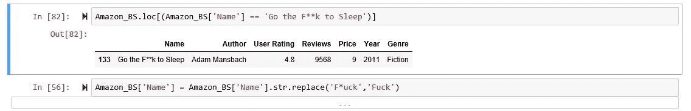
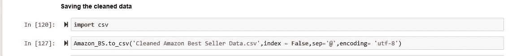
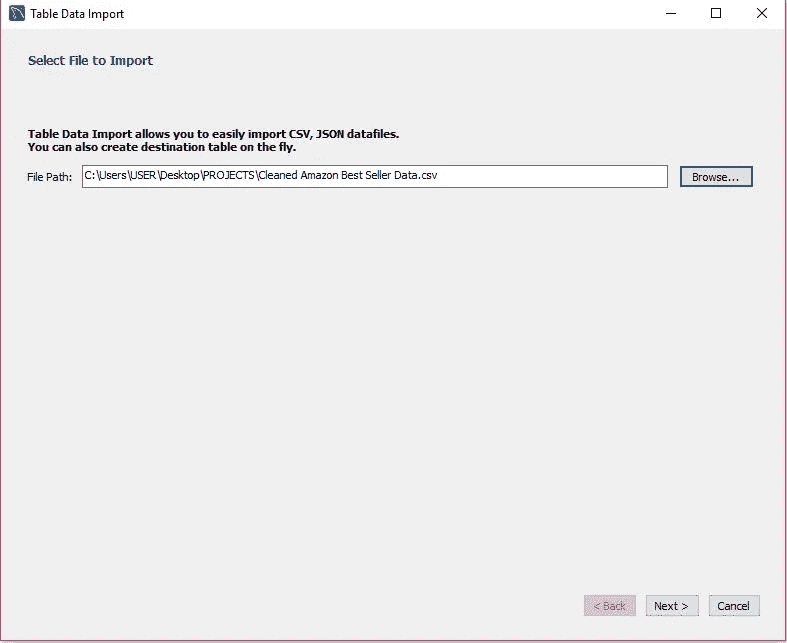

# 使用 SQL(MYSQL)进行探索性数据分析

> 原文：<https://medium.com/analytics-vidhya/exploratory-data-analysis-with-sql-mysql-2e823445525b?source=collection_archive---------8----------------------->

**什么是探索性数据分析(EDA)？**

EDA 是我们描述调查数据集并总结其主要特征的实践的一种方式。这是一种质疑我们其他数据的方式，以获得可以帮助企业或风险投资决策的事实。

**关于数据集**

该分析中使用的数据集来自 [kaggle](https://www.kaggle.com/sootersaalu/amazon-top-50-bestselling-books-2009-2019/tasks) 。该数据集包含 2009 年至 2019 年亚马逊前 50 大畅销书的数据。它包含了 550 本书，数据被分为小说和非小说。

**用 Python 清理数据**

数据集包含一些必须删除的字符，以便执行更精确的 EDA。对不一致的数据进行了检查，注意到数据 80%是干净的，除了数据集中必须删除的几个字符。

数据集在一些书中有*标题，因为它们是诅咒语。

**将数据集保存到 csv**

数据集被保存为 csv 文件，因为它包含一些字符，如“()”、“，”等，这影响了文件到 csv 的保存。通常逗号(，)通常用作分隔符，但在这个文件中使用了' @ '，因为数据集包含一些字符，特别是在书籍的标题中，包括逗号。这是为了让 python 和 MySQL 更准确地读取文件。除了' @ '字符之外，许多其他字符也可以用作字段终止符或分隔符。

将文件保存为 csv 格式时,“@”被用作分隔符

**在 MySQL 中导入文件**

可以使用表导入向导选项或使用 MySQL 服务器将文件导入 MySQL。在这种情况下，数据是使用 MySQL 服务器导入的；这种方法速度更快，尤其是对于大型数据集。

要在 MySQL 上显示这个屏幕，右键单击您的数据库，然后单击表数据导入向导。

**使用 MySQL 服务器导入数据**

这种方法是导入大型数据集的最佳且最快的方法。

要做到这一点；

打开 MySQL 服务器，输入你的密码。使用命令'**创建数据库数据库名称**创建数据库，例如，我们的新数据库名称为' **Amazon，因此为' Create database Amazon** '，单击 enter，键入命令' **show database** '，这是为了查看您可用的数据库，包括您最近创建的数据库。

图像显示了可用的数据库和我们的新数据库“亚马逊”。

**使用数据库“亚马逊”并创建一个表，我们的数据集将被加载到**

在创建我们的表之后，下一步是选择数据库，使用命令' **Use Amazon** '

这张图片展示了我们如何选择 amazon 作为我们的数据库，并为我们的 csv 文件创建了一个表。

接下来，在仔细检查了我们的 csv 文件之后创建了一个表，以便为每一列分配正确的数据类型。我们的表名是' *amazon_50* '

我们的数据集包含 7 列，每一列都根据包含的 csv 的数据类型分配了一个数据类型。

接下来，表'*亚马逊 _ 50【T3]'被加载*

请注意，我们的' @ '是每个列/字段的终止符。

在图像中，我们的字段以“@”结束，因为当我们保存 csv 文件时，我们的分隔符被设置为“@”。

使用 MySQL 成功加载和查询了数据。完整项目的链接在我的 [github](https://github.com/xtric6/Exploratory-Data-Analysis-on-Amazon-Top-50-Best-selling-Books-2009---2019-Dataset.-) 上。