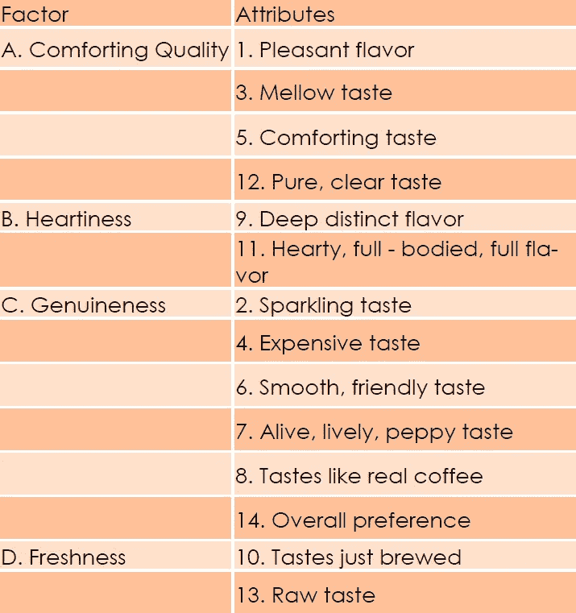
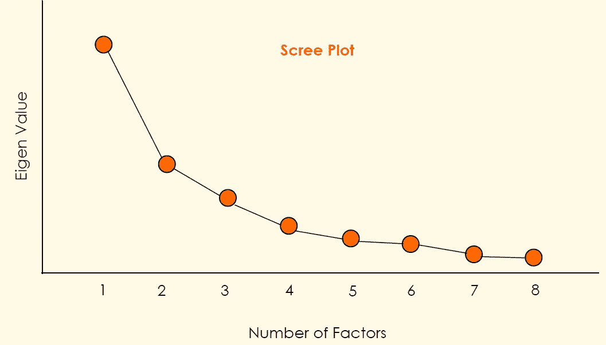
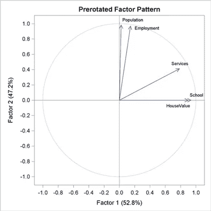
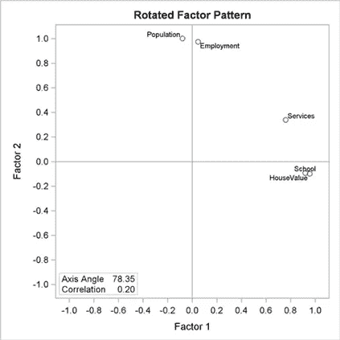

# 探索性因素分析

> 原文：<https://medium.com/analytics-vidhya/exploratory-factor-analysis-9b7fbb7c5a25?source=collection_archive---------7----------------------->

假设，我们对消费者对某一品牌咖啡的评价感兴趣。我们从给了一杯咖啡的消费者中随机抽样。他们没有被告知给他们的是哪个品牌的咖啡。喝完咖啡后，他们被要求用 14 个语义等级来评价咖啡。调查的 14 个属性如下所示:

1.令人愉快的味道——令人不快的味道

2.停滞、闷热的味道——起泡、清爽的味道

3.醇厚的味道——苦味

4.廉价的味道——昂贵的味道

5.令人欣慰、和谐——令人恼火、不和谐

6.顺滑、友好的味道——粗糙、敌对的味道

7.死气沉沉、毫无生气、沉闷的味道——生气勃勃、生气勃勃、生气勃勃的味道

8.尝起来像人造的——尝起来像真正的咖啡

9.浓郁的独特风味——浅淡的模糊风味

10.味道变热了——刚刚煮好的味道

11.爽朗、饱满的酒体、浓郁的味道——温暖、稀薄的空灵味道

12.纯净、清澈的味道——浑浊、潮湿的味道

13.原始味道——变味

14.总体偏好:优秀质量—非常差的质量

对消费者给出的评级进行的因子分析表明，四个因子可以概括这 14 个属性。这些因素是:舒适的质量，真诚，真实和新鲜。

这里我们只是探索因素，但我们不能确定这些是否是唯一的因素，因此命名为探索性因素分析

**主成分分析**

主成分分析是由 Pearson 提出的，并被 Ho telling 用于因子分析。PCA 用户的目标是根据原始变量的线性组合的不相关主成分的较小集合来总结一组原始变量之间的相互关系。

**估计初始公度**

PCA 假设要分析的方差和观察变量的数量一样多，并且一个项目中的所有方差都可以用提取的因子来解释。共性是指项目和因素共有的差异。

**特征值和特征向量**

PCA 被描述为特征分析或寻找相关矩阵的特征方程的解。特征值代表所有项目中可以用给定的主成分或因子来解释的差异量。相关矩阵的特征向量是一列权重。

**因子分析可行吗？**

1.**相关性矩阵检查:**是高低相关性的组合吗？

2. **KMO MSA 检查:**Kaiser-Meyer-ol kin 抽样充分性度量检验变量之间的偏相关是否很小。

3. **Bartlett 球形度检验:**检验相关矩阵是否为单位矩阵，这可能表明因子模型不合适。

**因素负载**

为了获得主分量，特征向量的每个权重乘以主分量的相关特征值的平方根。这些新生成的权重被称为因素负载，代表每个项目与给定主成分的相关性。

**决定因素数量**

**先验标准:**要提取的因子数量是预先决定的

**特征值标准:**

**最小本征准则:**我们决定本征值的底数。如果下限是 0.6，并且有 3 个特征值高于该标志，那么我们要寻找 3 个因子

**比例和累积方差:**我们考虑单个因素解释了多少信息，以及所选因素总体解释了多少信息。

**碎石图:**这基本上是比例方差的图形表示

因此，主成分分析解释了整个方差，而全民教育解释了其中的一部分。在全民教育中，我们基本上是试图解释变量之间的共同差异。

因子分析是一种相互依赖的技术。在相互依赖的技术中，变量没有被分为非独立变量和独立变量；更确切地说，我们检查的是一整套相互依赖的关系。

**因子加载问题及解决方案**

最初，权重分布在所有变量上。所以不可能理解一个或多个变量的潜在因素。为了解决这个问题，我们对轴进行旋转。

我们主要处理两种类型的旋转:

1.  **正交旋转:Varimax**

**2。斜旋转:Promax**

斜旋转的问题是它使因素相互关联。Varimax 旋转用于主成分分析，以便将轴旋转到载荷方差之和最大的位置。

# 参考

# 学术文献

*   [Vogt，2012 年] Vogt，M. (2012 年)。局部平稳时间序列的非参数回归。*《统计年鉴》*， *40* (5)，2601–2633。
*   古吉拉特语，基本计量经济学，第 5 版，塔塔麦格劳-希尔
*   使用 SPSS 发现统计数据，第二版，Sage 出版物
*   Hair，j .，Anderson，r .，巴宾，b.《多元数据分析》,第 7 版，普伦蒂斯霍尔
*   n . k . malhotra，Dash，s,《营销研究:应用导向》,第 5 版，培生教育
*   Rud，O. P,《数据挖掘食谱:营销、风险和客户关系管理的建模数据》, John Wiley & Sons，2000 年