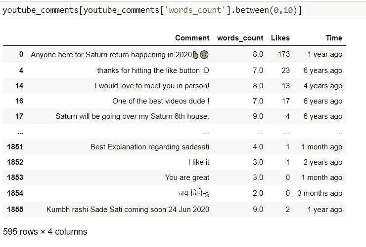
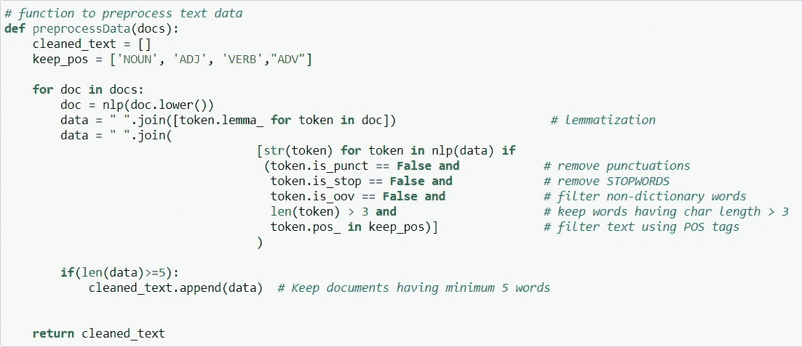
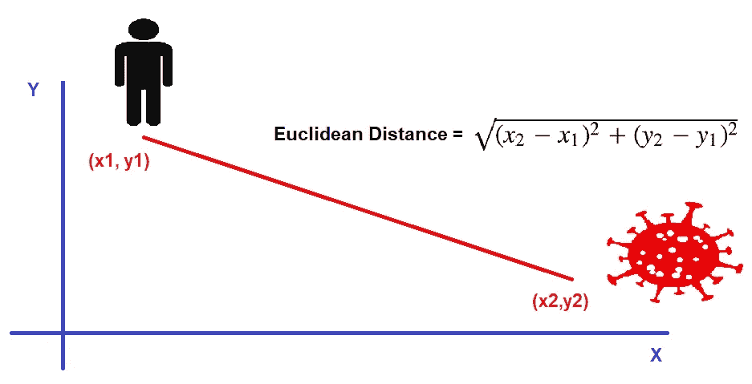

# 使用 NLP(自然语言处理)探索精神世界

> 原文：<https://medium.com/analytics-vidhya/explore-spiritual-world-using-nlp-natural-language-processing-23ff4742269d?source=collection_archive---------8----------------------->

行星真的会影响我们的生活吗？


每个星球都在你如何感受、思考、成长和做所有你做的事情中扮演着角色！

因为一次**“土星回归”**的强度，这次占星凌日经常受到很多关注。在这里，我们将使用 **NLP(自然语言处理)**技术探索这种转变的影响。

## **目录:**

1.  主题背景
2.  数据集概述
3.  数据清理和预处理
4.  数据可视化
5.  情感分析
6.  主题建模
7.  使用搜索查询获取相似的文档
8.  文本摘要
9.  结论

# **1。话题背景:**

*   土星是太阳系中第二大行星，它绕太阳一周大约需要 **29.5 年**，在每个黄道十二宫中大约停留 **2.5 年**。
*   在你 27 岁和 30 岁生日之间，土星会回到你出生时的位置。
*   如果你太执着于某件事，土星会试图移除那份执着并推动你。这就是大多数人的遭遇:他们失去了工作、关系、名誉，他们失去了一切。然后他们开始寻找，试图找出去哪里？然后他们就来到了灵修之路！
*   土星带着你，上下颠倒，抖落你口袋里的一切。留下来的才是属于你的，其他的都只是幻觉。

# **2。数据集概述:**

*   这里我准备了 2 个不同的数据集。
*   一个数据集是通过抓取相关视频的 **YouTube 评论**准备的。你可以访问我的另一个博客查看**“如何废弃 YouTube 评论”** [这里](https://priyanka-ddit.medium.com/how-to-scrap-youtube-comments-cf6348ef9e09)。
*   另一份是从网上搜集相关的**文章**准备的。
*   文章有很长的正文，通常是根据一个人对那个主题的了解而写的。评论相对较短，但大多数都是基于评论者的真实生活经历。
*   所以，在这里比较结果会很有趣！！！

**两个数据集的前 5 行:**


**数据集文章概述**


**YouTube 评论数据集概述**

# **3。数据清洗&预处理:**

1.  **数据清理:**

*   让我们删除字数少于或等于 10 的 YouTube 评论，因为它没有携带任何与主题相关的信息。



**YouTube 评论字数≤ 10**

**2。数据预处理:**

这里我们将使用 **spaCy** 对文本数据进行预处理。我们将在两个数据集上应用以下预处理步骤。

1.  **转换为小写:**
2.  **标记化:**将字符串分解成单词列表
3.  **词汇化:**将单词转换成其有意义的基本形式。(如走- >走，走- >走，走- >走)
4.  **去掉标点:**
5.  **去除停用词**:停用词是常用词或含义不太深的词(如“the”、“a”、“an”、“in”)。空间有预定义的停用词列表。我们可以根据我们的领域需求扩展该列表，或者从现有列表中删除该列表。在这里，我们将扩展这个列表，并添加一些不包含太多信息的常用词。
6.  **过滤词性(词性)标签:**我们可以根据词性标签过滤字符串。如果我们想只保留名词或形容词或任何词性标签的组合，那么我们可以这样做。这里我们只保留名词、形容词、动词和副词。
7.  在应用预处理步骤后，我们将保留最少 5 个单词的文档。

*   以下函数用于预处理数据:



**预处理文本数据的功能**

*   以下是应用数据清理和预处理技术后数据集的状态:

```
Final Document(No. of rows) count in Articles:  18
Final Document(No. of rows) count in YouTube Comments:  1185
```

# **4。数据可视化:**

1.  **字云:**

*   **文字云文章:**


**词云篇**

*   **YouTube 评论的词云:**


**YouTube 评论的文字云**


**生成字云的功能**

2. **N-Grams 可视化:**

*   由于机器不理解文本数据，我们需要使用任何**单词嵌入**技术将文本数据转换成数字。
*   这里我们将使用基于频率的单词嵌入技术，**计数矢量器**到生成**文档-术语矩阵(dtm)** 。
*   计数矢量器如何工作？


**使用计数矢量器生成的文档术语矩阵**

(单字=> 1 个关键字)，(双字= > 2 个关键字的组合)…

*   下面是两个数据集的二元图可视化。
*   在这两个数据集中最常用的术语是**“努力工作”。**


**生成 N 元图的函数**

# 5.情感分析:

**什么是情感分析？**

*   情感分析是确定作者情感的过程。情绪可以是**积极的、消极的**或**中性的**。

***TextBlob*** 是一个处理文本数据的 Python 库。它提供了一个简单的 API 来探索常见的自然语言处理(NLP)任务，如词性标注、名词短语提取、情感分析、分类、翻译等。

***TextBlob*** 的 ***情感*** 函数返回两个属性，**极性**，和**主观性**。

**极性**为浮动，位于 **[-1，1】**范围内

**主观性**也是一个位于**【0，1】**范围内的浮点数


**文章数据集情感分析:**


**前 5 行文章数据集**


**文章数据集情感分析**

**YouTube 评论数据集情感分析:**


**YouTube 评论数据集的前 5 行**


**YouTube 评论数据集情感分析**

# **6。主题建模:**

**什么是主题建模？**

*   **主题建模**是一种**无监督**机器学习技术。
*   **主题建模**是从文档集合中找出一组最能代表集合中信息的单词。

主题建模最常见的形式是**潜在语义分析(LSA)** 和**潜在狄利克雷分配(LDA)。这两种技术互不相同。**

**LSA** 和 **LDA** 都将**文档术语矩阵**作为输入。

这里我们将使用**潜在狄利克雷分配(LDA)实现主题建模。**

我们可以使用任何矢量化技术生成文档术语矩阵，如**计数矢量化器**或 **TfidfVectorizer。**

这里我们将使用**计数矢量器**来生成文档-术语矩阵。

**LDA 如何工作？**

*   LDA 假设每个**文档**由一组 ***主题*** 组成，每个 ***主题*** 由一组**单词**组成。
*   如下图所示，LDA 给出了按主题排列的单词列表作为输出。


*   稍后，如果需要，我们可以标记每个主题。主题标注是一项手工工作。LDA 不执行主题标记。


**LDA 模型参数:**

1.  **n_components:** 主题数量
2.  **learning_method:“批处理”**或**“在线”。**如果数据集很大，使用在线方法。
3.  **max_iter:** 最大迭代次数。
4.  **learning_decay:** 到控制在线学习法中的学习速率。值应设置在(0.5，1.0)之间
5.  **random_state:** 可以使用任意整数值。用于重现相同结果。

*   您可以在此查看其他参数列表[。](https://scikit-learn.org/stable/modules/generated/sklearn.decomposition.LatentDirichletAllocation.html)
*   最好使用 **GridSearchCV** 找到最佳 LDA 模型参数。
*   您可以有多个参数组合，但这将需要更多的计算能力，内存和时间。

**使用 GridSearchCV 寻找最佳 LDA 模型参数的函数:**


*   在最佳 LDA 模型上拟合两个数据集的文档术语矩阵之后，下面是主题-关键词分布的可视化。
*   一个好的主题模型将有**不重叠的**、**大尺寸的**斑点用于每个主题。这里好像是这样的。所以，我们没事了。

**主题-关键词可视化-文章:**


**前 10 位关键词-文章数据框:**


**主题-关键词可视化-YouTube 评论:**


**十大关键词数据框-YouTube 评论:**


# **7。使用搜索查询获取相似文档:**

**什么是文档相似度？**

*   当我们想要基于含义计算相似度时，我们称之为**语义文本相似度**。由于自然语言的复杂性，这是一项非常复杂的任务。
*   另一种方法作用于词汇层面，即只使用句子中的单词。这是计算文档之间文本相似性的传统方法。
*   在这里，我们将探索查找相似文档的传统方法。

**如何找到相似的文档？**

1.  选择一种将文档转换为矢量的方式。
2.  选择向量的相似性度量。
3.  使用选定的相似性度量计算搜索查询和所有文档之间的距离，并获取具有最小距离的文档。


**常见的相似性度量:**

1.  雅克卡距离
2.  余弦距离
3.  欧几里得距离

*   这里我们将使用**欧氏距离**来查找相似的文档。

**什么是欧氏距离？**

*   **欧氏距离**是多维空间中两点之间的距离。更近的点彼此更相似。进一步的点彼此更不同。



**从两个数据集中获取相似文档的搜索查询:**


**搜索查询**

**文章数据集的输出:**

```
**Topic KeyWords:**  ['30th birthday', 'authentic self', 'create space', 'expand feel', 'expect experience', 'experience coming', 'experience deep', 'experiment play', 'explore depth', 'feel allow']**Topic Prob Scores of text:**  [[0.6 0.1 0.1 0.1 0.1 0.1 0.1]]**Most Similar Doc's Probs:**   [[1\. 0\. 0\. 0\. 0\. 0\. 0.]]**Document:**
 "When Saturn is involved, think: responsibilities, rules, restrictions, obligations, challenges, and lessons. Sometimes tough ones. It’s like a cosmic check-in—and check-up—from the Lord of Karma himself. This is your astrological coming-of-age story. It is important to remember that Saturn’s job is to show you the areas of your life where you are the hardest on yourself. You are being pushed to level up to the next stage of life. After all, Saturn is the planetary taskmaster, and at this time, he will likely hold your feet to the proverbial fire. Consider your life before this moment: You have been restricted by the rules placed on you by your parents, teachers, bosses, mentors, and even society at large. It is a slow-moving process, so as you go through this, remember that there are no shortcuts, there will be tests, and you will get through it. By the end of your Saturn return (and by the time of your second and third Saturn return), as you continue to apply these hard-earned lessons, you will eventually greet Saturn like an old friend. You’ll see that Saturn’s tough love during your return called upon you to stop giving away your power. As a result, you’ll see that Saturn was not the author of your life. You are—and always were. Subsequently, Saturn didn’t take away anything that was meant for you. Saturn is here to confront you and ensure that you’re on the right path."
```

【YouTube 评论数据集的输出:

```
**Topic KeyWords:**  ['work hard', 'hard work', 'lord shiva', 'past karma', 'self realisation', 'negative thought', 'decide want', 'person self', 'realise mistake', 'deed past']**Topic Prob Scores of text:**  [[0.1 0.1 0.1 0.1 0.6 0.1 0.1]]**Most Similar Doc's Probs:**   [[0.1 0.1 0.1 0.1 0.6 0.1 0.1]]**Document:**
"you can do everything man!! but now u  really doing your best.... of course its all depend on karmas but finally you listened your soul which must  be key ruling  in your chart which is sun !!  your fame is near to success for sure. tnx"
```


**获取相似文档的代码**

# 8.文本摘要:

**什么是文本摘要？**

*   文本摘要是为较长的文本文档创建简短而准确的摘要的过程。

在这里，我们将探讨 **Bert 提取摘要生成器。**

**为什么是伯特？**

*   因为**伯特**是迄今为止最好的**文本摘要**。

**伯特是什么？**

*   **变压器的双向编码器表示法**是预先训练的语言模型。
*   BERT summary zer 的工作原理是首先嵌入句子，然后运行聚类算法，找到最接近聚类质心的句子。

您将能够安装伯特文本摘要预训练模型使用，

```
pip install bert-extractive-summarizer
```

然后通过写下面 3 行代码，你将能够生成你的长文本文档的摘要。

```
from summarizer import Summarizer
model = Summarizer()
summary = model(text)
```

您可以使用不同的模型参数并检查输出。

1.  **比率**:总结的句子与原文的比率。
2.  **min_length** :作为句子接受的最小长度。
3.  **max_length** :作为句子接受的最大长度。
4.  **num_sentences** :生成摘要需要的句子数量。
5.  **calculate_optimal_k:** 求最佳句子数。

您可以在这里探索更多参数[。](https://pypi.org/project/bert-extractive-summarizer/)

让我们生成数据集的摘要。

1.  **使用 calculate_optimal_k:** 找到最佳句子数量，生成摘要


**YouTube _ 评论 _ 摘要:**

```
Honestly, at 28-31 if you dont feel the need to make a shift in your life there's something wrong. I'm already extremely Saturnian... I get no enjoyment out of life, I just go through the motions and survive. Please tell me how the PLANETS effect the SIDERAL SIGN OPHIUCHUS Wow so if I understand this correctly I have a well placed Saturn. Almost all of what you said has actually come true with me... I am unfortunate enough to be born with my sun moon and rising planet all in Scorpio... And right now i'm going through hell... Wondering if you could tell me what more backlashes to expect Sir , Can you please explain , If shani Dev in tungi , n its sade sati effect  With house-placement starting 1st house the sign of the Asc.
```

**文章 _ 摘要:**

```
During your Saturn return, you are a teenager and the planet of discipline is your dad, barging into your room checking to see if you’ve done your homework. Some old souls that made wise choices from the get-go may find it to be a passage where things are solidified. Maybe you're comfortable, but not exactly happy, in your relationship. Because Saturn is one of the teacher planets in the sky, when it resets in our birth chart, its a cosmic indication that it's time to learn a lesson.
```

**2。使用比率生成汇总:**


**YouTube _ 评论 _ 总结 _ 比率:**

```
Honestly, at 28-31 if you dont feel the need to make a shift in your life there's something wrong. Mines occur in 2022...and I'm 26 getting my life together now..going to school and I feel I have to I have no choice so I can do it..my birth chart says my Saturn is in the 8th house but I was told its in the 9th idk Can someone explain what does he mean by damaged Moon or Mercury? Strong aspects of Jupiter to all planets... I'm doing my best at keeping soft and strong. Ketu with saturn confuses me, its like, am I supposed to "let go" of saturnian things?.............
```

**文章 _ 摘要 _ 比率:**

```
During your Saturn return, you are a teenager and the planet of discipline is your dad, barging into your room checking to see if you’ve done your homework. The Saturn Return is a wake-up call, and this is why so many fear it's sobering realities. Some "old souls" that made wise choices from the get-go may find it to be a passage where things are solidified. Saturn will give you very clear signals if you're not aligned with your calling and pursuing your passions. When you demonstrate your commitment to your goal by taking one concrete step in that direction, Saturn will reward your effort. No matter what your family has to say about it.) Saturn returns and oppositions can be extremely powerful and turn your life in a completely new direction. Because Saturn is one of the "teacher planets in the sky," when it resets in our birth chart, it's a cosmic indication that it's time to learn a lesson.
```

# **9。结论:**

这里我们讨论了 4 种 NLP 技术:

1.  情感分析
2.  主题建模
3.  文档相似度
4.  文本摘要

*   对于两个数据集，所有技术的输出非常相似。
*   在**情感分析**中，我们看到正面评论/文章的比例低于其他两个类别。——我们可以把这与**“土星被认为是有害的行星”的事实联系起来**
*   在文章中，**主观性** & **客观性**被平分，因为文章/博客通常是基于个人的知识或观点而写的。但是 YouTube 评论的客观性更高，因为大多数评论都是基于一个人的真实生活经历。
*   **主题建模**的输出显示，两个数据集讨论最多的主题是**“努力工作”、“吸取教训”、“因果报应”。—** 土星的教训是**纪律**、**努力**、**牺牲。**土星也被称为主**业**和**正义。**

因此，在这里我们可以得出结论，我们已经使用 NLP 技术成功地从两个数据集获得了一些有意义的见解。

你可以从我的 GitHub 库[这里](https://github.com/priyanka-ddit/NLP)下载 **Jupyter 笔记本**和**数据集**。

# 结束注释:

虽然科学不承认那种**【超自然力量】**的存在，但反过来我们可以说，科学只能证明宇宙允许证明的事情，其余的就成了谜。

谢谢你。