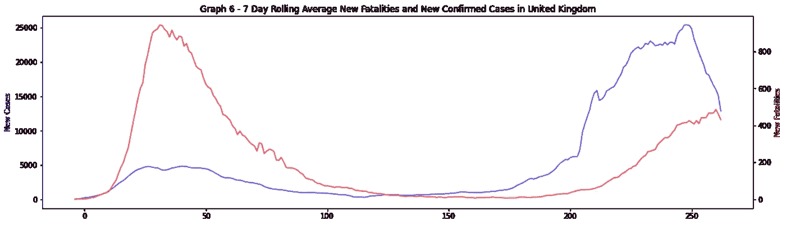

# 用数据科学探索新冠肺炎缓解策略

> 原文：<https://medium.com/analytics-vidhya/exploring-covid-19-mitigation-strategies-with-data-science-adf8847b3646?source=collection_archive---------31----------------------->

## 使用推理统计、聚类和监督学习来探索缓解策略


新型冠状病毒新型冠状病毒的透射电子显微镜图像(图片来源见下面的中的

# 介绍

## 背景和动机

自 2019 年新冠肺炎出现以来，世界上大多数国家都受到了它的影响。它主要通过人与人之间的密切接触传播[【1】](https://www.who.int/news-room/commentaries/detail/transmission-of-sars-cov-2-implications-for-infection-prevention-precautions)。各国政府采取措施减缓病毒的传播，将死亡人数降至最低，有证据表明这些措施拯救了许多人的生命[【2】](https://doi.org/10.1038/s41586-020-2405-7)。政府的方法在类型、严格程度和时机上各不相同。就病例和死亡人数而言，该病毒的影响在各国之间也有所不同，这引出了一个有趣的问题:**哪些策略在防止病毒传播和拯救生命方面最有效**？确定这些可以在未来的疾病爆发中挽救生命，并可能有助于随着危机的缓解而计划放松这些措施，这就是这个项目背后的动机。

这个项目描述了对新冠肺炎真实数据的探索和分析，使用 K-means 聚类和回归工具的数据建模，以及对抗击新冠肺炎的见解。

## 目标

目的是利用数据科学来探索世界各国政府采取的措施，以减轻新冠肺炎的影响。显示所有代码和分析的笔记本可以在 GitHub 资源库[【3】](https://github.com/mattjezza/covid19-modelling)中找到(下面所有的图都取自该资源)。解决了以下问题:

1.  不同政府实施措施和病毒检测方案的速度如何影响超额死亡水平？(超额死亡人数定义为新冠肺炎疫情期间各种原因导致的死亡人数与近年来同期平均死亡人数之差。)
2.  在疫情期间，什么样的措施组合与低水平的超额死亡有关？将开发一个 K-均值聚类模型来探索这一点。
3.  能否利用政府应对措施的数据预测病毒在一个国家的传播(就病例数量而言)？如果是这样的话，有没有可能以此来推断哪些应对措施对防止病毒传播最为重要？将开发一个回归模型来探索这一点。

***作者注***

这是一个主要为数据科学自学而进行的项目。然而，新冠肺炎危机仍然是一个极其严重的局势。寻求关于新冠肺炎和在危机中该做什么的建议的个人应该寻找成熟、可靠的信息来源，如世界卫生组织、声誉良好的政府卫生组织和医疗专业人员。

## 数据

使用了三个主要数据源。

*   牛津大学冠状病毒政府响应跟踪器

每日时间序列，提供关于确诊病例、死亡人数的数据，以及政府实施的措施的详细分类[【4】](https://www.bsg.ox.ac.uk/research/research-projects/coronavirus-government-response-tracker)[【5】](https://github.com/OxCGRT/covid-policy-tracker)。

数据字段的完整列表和每个字段中的空值数量如下所示。

```
**Field   **                                 **Null values**
CountryName                                  0
CountryCode                                  0
RegionName                               60970
RegionCode                               60970
Jurisdiction                                 0
Date                                         0
C1_School closing                         3865
C1_Flag                                  26553
C2_Workplace closing                      4332
C2_Flag                                  31111
C3_Cancel public events                   4303
C3_Flag                                  27312
C4_Restrictions on gatherings             4321
C4_Flag                                  31033
C5_Close public transport                 4307
C5_Flag                                  52755
C6_Stay at home requirements              4650
C6_Flag                                  37927
C7_Restrictions on internal movement      3828
C7_Flag                                  39651
C8_International travel controls          3926
E1_Income support                        11687
E1_Flag                                  45628
E2_Debt/contract relief                  12393
E3_Fiscal measures                       23846
E4_International support                 23034
H1_Public information campaigns           4287
H1_Flag                                  15690
H2_Testing policy                         4115
H3_Contact tracing                        4425
H4_Emergency investment in healthcare    24011
H5_Investment in vaccines                23703
H6_Facial Coverings                       4657
H6_Flag                                  36166
M1_Wildcard                              88775
ConfirmedCases                           13999
ConfirmedDeaths                          14133
StringencyIndex                           4676
StringencyIndexForDisplay                 3906
StringencyLegacyIndex                     4662
StringencyLegacyIndexForDisplay           3899
GovernmentResponseIndex                  12434
GovernmentResponseIndexForDisplay        11659
ContainmentHealthIndex                    4724
ContainmentHealthIndexForDisplay          3949
EconomicSupportIndex                     12432
EconomicSupportIndexForDisplay           11657
```

有关政府措施相关字段(`C1_*`、`C2_*`等)的更多说明，请参见[数据探索和分析](#0bf2)部分。

*   冠状病毒疫情——我们的数据世界

为第一个数据集提供补充数据的每日时间序列，包括人均病例数和死亡数以及测试数据[【6】](https://ourworldindata.org/coronavirus)、[【7】](https://github.com/owid/covid-19-data)。(有关底层数据源的完整参考，请参见[【7】](https://github.com/owid/covid-19-data)。)

数据字段的完整列表和每个字段中的空值数量如下所示。

```
**Field   **                              **Null values**
iso_code                                312
continent                               625
location                                  0
date                                      0
total_cases                            8743
new_cases                               127
new_cases_smoothed                     1083
total_deaths                          16540
new_deaths                              127
new_deaths_smoothed                    1083
total_cases_per_million                9040
new_cases_per_million                   439
new_cases_smoothed_per_million         1390
total_deaths_per_million              16824
new_deaths_per_million                  439
new_deaths_smoothed_per_million        1390
reproduction_rate                     19723
icu_patients                          54973
icu_patients_per_million              54973
hosp_patients                         54299
hosp_patients_per_million             54299
weekly_icu_admissions                 59276
weekly_icu_admissions_per_million     59276
weekly_hosp_admissions                58989
weekly_hosp_admissions_per_million    58989
total_tests                           36208
new_tests                             36344
total_tests_per_thousand              36208
new_tests_per_thousand                36344
new_tests_smoothed                    33717
new_tests_smoothed_per_thousand       33717
tests_per_case                        35636
positive_rate                         35234
tests_units                           32737
stringency_index                       7667
population                              312
population_density                     1879
median_age                             3120
aged_65_older                          4063
aged_70_older                          3432
gdp_per_capita                         3127
extreme_poverty                       20984
cardiovasc_death_rate                  2566
diabetes_prevalence                    1879
female_smokers                        15365
male_smokers                          15989
handwashing_facilities                30037
hospital_beds_per_thousand             7566
life_expectancy                         624
human_development_index                2816
```

*   超额死亡人数— *《经济学家》*

一个每周时间序列，提供关于某些国家[【8】](https://www.economist.com/graphic-detail/2020/04/16/tracking-covid-19-excess-deaths-across-countries)[【9】](https://github.com/TheEconomist/covid-19-excess-deaths-tracker)的[超额死亡](#c007)的信息。

数据字段的完整列表和每个字段中的空值数量如下所示。

```
**Field   **                    **Null values**
country                     0
region                      0
region_code                 0
start_date                  0
end_date                    0
year                        0
week                        0
population                  0
total_deaths                0
covid_deaths                0
expected_deaths             0
excess_deaths               0
non_covid_deaths            0
covid_deaths_per_100k       0
excess_deaths_per_100k      0
excess_deaths_pct_change    0
```

对于这个项目，使用 2020 年 11 月底的数据快照。

# 数据准备

## 清洁

如前一节所示，数据集容易出现空值和数据错误等问题。在[【3】](https://github.com/mattjezza/covid19-modelling)中可以找到为缓解这些问题而采取的清洁和纠错步骤的全部细节。最重要的清洁步骤是:

*   修复空值。许多空值是指疫情早期的日期，当时没有收集数据。解决这些问题很简单。例如，在一个国家确诊第一例病毒之前，病例数或死亡数的零值可以安全地替换为零。然而，这并不总是那么容易。人口规模等要素中的空值不能假定为零。幸运的是，对于这个项目中使用的数据字段的子集，所有的空值都可以设置为零，或者可以使用其他可用的值推断出一个合理的值。
*   修复数据错误。确诊病例或死亡的总数不应减少。但是，相应的数据字段的值偶尔会减少。这可能是由于数据错误或为纠正以前的错误而插入数据的更正。在这些情况下[【3】](https://github.com/mattjezza/covid19-modelling)，编写代码对数据进行一些自动修正。

## 合并

这三个数据集是互补的，合并它们可以进行一些有用的分析。得到的合并数据集是:

*   每日时间序列，包括在[【4】](https://www.bsg.ox.ac.uk/research/research-projects/coronavirus-government-response-tracker)中计算的政府措施，以及来自[【6】](https://ourworldindata.org/coronavirus)的病例、死亡率和检测数据。
*   从上述每日时间序列衍生的每周时间序列，并与来自[【8】](https://www.economist.com/graphic-detail/2020/04/16/tracking-covid-19-excess-deaths-across-countries)的超额死亡数据合并。

## 特征工程

每日确诊病例和死亡人数并不总是以统一的方式报告。具体来说，一些死亡事故可能不会在周末报告，而是在下周一报告。计算确诊病例和死亡病例的 7 天滚动平均值以消除这些差异。

## 关于数据可靠性的一点注记

即使在数据中的简单错误被纠正后，它仍然不是完全可靠的。各国报告的新冠肺炎病例和死亡人数有时会是错误的，要么是错误的，要么是根本没有报告。不同的国家也将以不同的方式报告数据。使用每个国家的超额死亡人数而不是新冠肺炎死亡人数有助于缓解这些死亡人数问题，但超额死亡人数数据并不适用于所有国家，它对病例数没有帮助。虽然这个项目没有从数量上说明这些问题，但在得出结论时应该记住这些问题。

# 数据探索和分析

## 方法

有许多可能的探索途径，但这个项目必须将其范围限制在少数几个。

首先，病毒对不同国家的影响将在病例数、死亡人数和超额死亡人数方面进行比较。下一部分将探讨病毒传播与政府采取的缓解措施之间的关系。然后将探讨与政府反应(包括测试)的类型和时间有关的数据。

## 比较病毒对不同国家的影响

***对比确诊病例和死亡病例***

首先比较不同国家每百万确诊病例数(图 1)和相同国家每百万死亡人数(图 2)。图 1 中的数据按每百万病例数从高到低排序，只显示了 40 个受影响最严重的国家。图 2 中的数据使用相同的排序顺序。


图 1(上图)——不同国家每百万确诊病例总数，从高到低排序


图 2(上图)——每百万人的死亡总数，与图 1 中的国家和排序相同

比较图 1 和图 2 可以看出，不同的国家受到了不同程度的影响。这些差异可以部分归因于一些因素，如病毒首次到达一个国家的时间、进行的检测数量以及计算死亡和病例的不同方法。这两种分布之间几乎没有关系——死亡率似乎相差很大。找出其中的原因可能有助于防止新冠肺炎病毒导致的死亡，接下来的章节试图探究其中的一些原因。

***对比超额死亡人数***

由于几个原因，一个国家报告的新冠肺炎死亡人数可能无法提供一个比较国家间死亡率的好方法。

*   不同的国家使用不同的方法将死亡归咎于新冠肺炎。
*   一些真正的新冠肺炎死亡病例将发生在那些从未寻求医疗救助且从未被确诊的人群中。
*   由于病毒的间接影响，如卫生服务压力增加和人们因其他疾病而不寻求医疗护理，将发生一些非 COVID 死亡。

超额死亡比确诊的新冠肺炎死亡更不容易受到这些问题的影响，因此它提供了一个更好的衡量国家间比较的方法。缺点是只有少数几个国家有超额死亡数据。

下图 3 显示了不同国家不同时期每 10 万人的超额死亡人数。


图 3 —随着时间的推移，每 10 万人的超额死亡人数

对大多数国家来说，超额死亡在最初几周内达到高峰，然后下降，可能是因为政府封锁措施生效和治疗方法的改进。

注意 *x* 轴是`WeekNumber`。这将病毒的`DayNumber` 1 定义为记录 5 例新的新冠肺炎死亡病例的第一天(这一惯例是从我们的世界数据集中采用的)，并且推而广之，`WeekNumber` 1 定义为记录 35 例新死亡病例的第一周。这使得不同国家的数字可以直接比较，即使病毒感染的日期因国家而异。病毒`DayNumber` 1 的不同日历日期也解释了为什么每个国家可获得的数据的周数在 25 到 35 周的范围内变化。

下面的图 4 显示了到病毒第 25 周为止每 10 万人口中的超额死亡总数。


图 4

超额死亡人数差异很大。正如以上图 1 和图 2 之间的比较所表明的，这进一步证明了病毒的致死率在不同的国家有很大的不同。这可能是因为不同水平的医疗保健、人口统计以及国家政府采取的缓解病毒的措施等因素。理解这种变异背后的原因是最大限度地减少病毒死亡和改善政府应对病毒方式的重要一步。

***随着时间的推移病毒对政府措施的影响***

牛津数据[【4】](https://www.bsg.ox.ac.uk/research/research-projects/coronavirus-government-response-tracker)追踪了一段时间以来政府采取的一系列不同措施，包括关闭学校、戴口罩和经济支持(完整列表见[【4】](https://www.bsg.ox.ac.uk/research/research-projects/coronavirus-government-response-tracker))。可以绘制每个单独的测量值随时间变化的图表，但是由于有大约 30 个测量值，这些可能会令人费解。解释这些措施的一个更简单的方法是查看四个综合指数，得分从 1(最低)到 100(最高反应水平)，这些指数综合了各个措施的得分。综合指数是:

*   总体反应(综合所有措施)
*   遏制和健康(包括检测、接触者追踪、医疗投资)
*   对人口的经济支持
*   严格性(限制人们行为的措施)

本节使用图表显示综合指数随时间的变化以及病例和死亡的绝对数量。所有国家都可以这样做，但为了简洁起见，这里只选择两个例子来说明差异并进行比较。

图 5 和图 6 显示了英国病例和死亡的 7 天滚动平均值(上图)和针对病毒的四个综合指数(下图)`DayNumber`。



图 5


图 6

图 5 显示了病例和死亡的明显双峰。图 6 显示严格指数在 60 至 80 的范围内变化。在第一个高峰的早期阶段增加严格性指数似乎预示着病例和死亡率的下降。要详细解释政府措施如何影响第二个高峰并不容易，但可以做出一些观察:

*   第二个高峰的死亡率低于第一个高峰
*   在第二个高峰检测到了更多的病例，这可能是由于检测率的增加——参见后面处理这个问题的部分。

下面的图 7 和图 8 显示了日本的相同数据图。


图 7


图 8

日本引人注目，因为它采取了相对较轻的控制措施(低严格指数)，但每百万人的病例数和死亡率仍然较低。这一结果在被分析的国家中是罕见的——有更多的国家遵循更像英国的模式——但这一事实也使日本成为一个有趣的研究案例。

***分析病毒在不同国家的影响得出的结论***

在[【3】](https://github.com/mattjezza/covid19-modelling)中比较了更多的国家。这显示了一些共同的特征:

*   在大多数国家，病例和死亡人数迅速攀升至初始峰值，然后下降，随后出现一个或多个后续峰值。
*   第二次高峰和随后高峰的死亡人数少于第一次。这可能是因为这些国家对以后的海啸做了更好的准备，也因为有了更好的治疗方法。
*   大多数国家在严格指数较高的疫情早期实施了封锁。
*   后来在疫情发现了更多的病例，可能是由于加大了检测力度。

国家之间的一些差异:

*   即使实施了严格的封锁，病毒的影响在不同国家之间也有很大差异。比如，英国和德国经历了非常不同的超额死亡水平，尽管它们都实施了封锁措施。
*   少数国家(如瑞典和日本)没有实施严格的封锁。令人惊讶的是，这并不总是转化为大量病例，但这些国家在这方面是异常的。

在政府采取封锁措施后，许多国家的第一次高峰消退了。虽然这并不能证明这些措施抑制了病毒，但这与这种解释是一致的。我们对这种病毒的理解是，它在人们彼此靠近时传播，因此政府防止密切接触的措施确实减缓了病毒的传播是有道理的。

然而，这些措施和病毒传播之间的关系并不简单。即使是实施类似严格程度的国家也有非常不同的结果。经济、文化、地理、人口统计和人群依从性等其他因素也可能影响病毒的传播。

大多数政府实施了许多措施，这些措施可能有助于减缓病毒的传播。然而，很难断定哪种方法最有效。后面的章节将使用机器学习方法对此进行进一步探讨。

## 比较政府反应的速度

政府回应的时机可能与措施本身同样重要。图 9 显示了不同国家的严格性指数随时间的变化。


图 9

图 9 中的所有国家都在病毒`WeekNumber` 1 爆发前几周开始实施措施。在大多数情况下，这意味着将严格指数提高到 70 或更高，这意味着该国处于“封锁”状态。之后，随着政府启用或禁用不同的措施，严格性指数往往会有所不同。

我们在这里将关注一个因素:政府实施封锁的时间。对于此分析，我们将锁定状态定义为严格性指数达到 70 的时间，或者其最大值。图 10 描绘了锁定过量死亡的时间，以探索是否存在任何可能的关系。作为一种比较具有相似经济、政治和文化环境的国家的方法，我们将分析局限于欧洲国家。


图 10

图 10 显示了超额死亡和封锁时间之间的某种关系，但这种关系并不清晰或简单。为了说明复杂性，请注意在不同时间(12 天内)锁定的超额死亡人数最低的五个国家，以及在同一时间锁定的一些国家最终的超额死亡人数水平非常不同(比较挪威和葡萄牙，或德国和意大利)。

尽管如此，还是有些关系的。在超额死亡率最低的五个国家中，三个在`DayNumber` 0 之前锁定，任何在`DayNumber` 7 之后锁定的国家都有明显较高的超额死亡率。

直觉上，更早的封锁似乎可能导致更少的感染，这自然会导致更少的死亡。图 10 与此一致，但也再次显示了上一节中的发现:有一系列相互作用的因素影响着超额死亡的水平。

## 实施测试的速度

每周测试率的时间变化如图 11 所示。


图 11

所有国家的检测量都随着时间的推移而增加，但速度不同，而且从来不是线性的。各国开始测试的时间也各不相同，这就是我们在这里要关注的。

图 12 绘出了欧洲国家第一周的测试(相对于病毒`WeekNumber` 1)相对于病毒`WeekNumber` 25 的总过量死亡。


图 12

有迹象表明，越早开始测试的国家最终超额死亡人数越少。然而，这并不是一种强有力的关系:比较一下葡萄牙和丹麦，它们在同一时间开始，但最终的超额死亡人数却大相径庭；或者比较一下法国和荷兰，它们在不同的时间开始。然而，所有超额死亡率最低的国家都在 T4 0 年前开始测试。这表明，较早开始检测的欧洲国家更有可能减少额外死亡。这并不能证明测试本身就是死亡率较低的原因，但它确实表明了两者之间的联系。如前几节所述，这里存在某种程度的关系，但不清楚也不简单。

## 结论数据探索和可视化

本节探讨了数据的几个方面，以寻找模式和推论。关于病例数、死亡人数和过量死亡人数的数据显示，不同国家的病毒致死率差异很大。将政府对病毒传播的反应与一段时间内的情况进行比较可以看出，政府的封锁往往先于病例的下降，但病例、死亡和政府措施之间的关系并不简单。一个国家的超额死亡水平确实与封锁发生的时间和测试开始的时间有一定的关系(发生的时间越早，超额死亡水平越低的可能性越大)，但很明显这些不是唯一重要的因素。越来越多的迹象表明，一系列复杂的相互作用的因素都会影响病毒的传播和死亡率。接下来的章节将使用建模技术来试图理清和理解这些因素。

# 使用聚类模型确定与较低水平的超额死亡相关的政府应对措施

## 方法

数据探索部分显示，各国之间的病毒死亡率差异很大，政府措施是影响这一点的一个因素。找出哪些政府措施对降低死亡率最重要并不简单，因为各国通常会采取一系列措施。在本节中，无监督学习被应用于将超额死亡与政府措施相关联的数据。目的是推断哪些政府措施对降低超额死亡率影响最大。

方法是:

1.  确定要聚类的一组要素。这是所有的序数和二进制政府措施，以及前面部分计算的`time_to_lockdown`和`first_week_of_testing`。使用了所有 21 个有超额死亡数据的国家。
2.  使用主成分分析降低维数。
3.  对这些组件使用 K-means 聚类来创建模型。
4.  确定一组超额死亡率高的国家`high_xs`和一组超额死亡率低的国家`low_xs`。这将是图 4 中排名前五和后五的国家。
5.  确定`high_xs`或`low_xs`中的国家在特定集群中是代表过多还是代表不足。
6.  利用这一点来推断哪些措施似乎有助于降低超额死亡水平。

作者在另一个项目的不同问题中使用了这种方法([【12】](https://github.com/mattjezza/ds-proj3-unsup-clusters))。

## 基于主成分的维数约简

***选择保留多少主成分***

首先应用主成分分析(PCA)来减少数据集中的特征数量。图 13 显示了两个图表:主成分的方差和累积方差。


图 13

一个有九个主成分(标为 0 到 8)的模型用不到一半的维度保留了超过 85%的方差。

***解释主成分***

每个主成分都是聚类模型中特征的组合。每个主要成分的全部细节可以在[【3】](https://github.com/mattjezza/covid19-modelling)中找到。举例来说，以下是主成分 1 和 3 中最重要的特征:

```
3 largest positive-weighted features in Principal Component 1:
time_to_lockdown         0.397862
first_week_of_testing    0.353480
E1_Income support        0.3469153 largest negative-weighted features in Principal Component 1:
C2_Workplace closing           -0.291205
H3_Contact tracing             -0.299770
C6_Stay at home requirements   -0.3040733 largest positive-weighted features in Principal Component 3:
C5_Close public transport    0.421618
C5_Flag                      0.369069
H6_Facial Coverings          0.3426073 largest negative-weighted features in Principal Component 3:
time_to_lockdown                -0.175103
E1_Income support               -0.229962
C4_Restrictions on gatherings   -0.378306
```

主成分 1 和 3 都将在稍后使用[来理解与特定聚类](#1b8a)最强相关的特征。

## 将 K-均值聚类应用于政府回应

***开发模型***

图 14 描绘了每个模型的分数与聚类数 K 的关系(分数越低越好)。我们在曲线开始变平的“拐点”处选择 K 值。经过几次实验后，我们选择 K=6，这意味着这些国家将被分成六个组。


图 14

***与较低水平的超额死亡相关的聚类、主要成分和特征***

图 15 按比例显示了每个数据集在聚类中的分布。`all_xs`代表所有有超额死亡数据的国家，`high_xs`代表超额死亡高的国家，`low_xs`代表超额死亡低的国家。举例来说:`all_xs`中约 30%的国家属于第 1 类和第 2 类，其余属于其他类。80%的`low_xs`群体在集群 2 中。

最有趣的集群是那些与`all_xs`相比`low_xs`或`high_xs`被过度或不足表示的集群。在这些集群中，我们可以将所采取的措施与更多的死亡(对于`high_xs`组被过度代表的集群)或更少的死亡(对于`low_xs`组被过度代表的集群)联系起来。


图 15

重要的是要记住，`low_xs`和`high_xs`组各只包含五个国家。这意味着，虽然代表 20%的群体可能看起来很多，但它只代表一个国家。`all_xs`更大(21 个国家)，所以大约 5%的人代表一个国家。为了说明这一点:`low_xs`组在第 4 组中似乎代表过多，但事实上，该组中只有一个国家，因此我们无法从中得出任何结论。

该图显示，`low_xs`集团在第二组中所占比例过大，有四个国家，而`high_xs`集团有一个国家，另外一个国家两者都没有(该组共有六个国家。)`low_xs`在第 1 组中也代表不足，该组不包含`low_xs`个国家，共有 6 个国家，其中两个来自`high_xs`组。聚类 2 由主成分 3 负主导，聚类 1 由主成分 1 负主导(详情见[【3】](https://github.com/mattjezza/covid19-modelling)，参考上文[解释主成分](#489d)部分可能有用)。

这让我们可以得出一些结论。该模型初步表明，以下指标与低超额死亡更密切相关:

*   `C4_Restrictions on gatherings`
*   `E1_Income support`

与措施相比:

*   `C5_Close public transport`
*   `C5_Flag`

与低超额死亡率联系不大。

该模型还表明，以下指标的低值与低超额死亡更密切相关:

*   `time_to_lockdown`(低值意味着较早锁定)
*   `first_week_of_testing`(低数值意味着更快开始测试)

与措施相比:

*   `C6_Stay at home requirements`
*   `H3_Contact tracing`

## 聚类模型分析的探讨

限制聚会有望减少病毒通过人与人之间的接触传播。收入支持使人们不再去工作，从而最大限度地减少了另一个潜在的传播源。超额死亡水平低的国家可能通过将用户数量减少到较低水平(火车、公共汽车等几乎空载运行)来保持公共交通的开放。

合理的预期是，居家要求和接触者追踪将减少传播和死亡。然而，该模型表明，反应速度(更快的封锁和更快的测试程序启动)是减少总体超额死亡人数的更重要因素。

值得注意的是，尽管某些措施可能被认为与最大限度地减少死亡更有关联，但这是相对于其他措施的*。这并不意味着与较低的超额死亡水平没有密切联系的措施没有效果——事实上，这些措施可能会挽救许多生命。这只是意味着一些措施比其他措施更有效。*

上述收入补助的例子说明了另一个要点:因素之间的相关性并不能证明因果关系。收入支持与低超额死亡相关，也许是因为它允许人们呆在家里而不是去工作。然而，它可能有另一种解释:那就是，更富裕的国家在疫情表现更好。这是必然的，因为如果政府有能力在经济上支持人们，那么他们也更有可能提供高标准的医疗保健。因此，尽管该模型显示收入支持与低超额死亡相关，但它不能确认收入支持本身是低超额死亡的原因，而不是富裕国家中发现的其他因素。

本节说明了 K-均值聚类方法可用于识别最大限度减少超额死亡的因素。主要问题是过量死亡数据集的规模较小，因此所有这些结论都应被视为试验性的和初步的。将来可能会有更多的数据可用，这可能会被合并到模型中，使研究结果更加可信。或者，可以使用确认的新冠肺炎死亡病例而不是超额死亡病例重复分析。这可能会显著增加数据集的大小(可能高达 10 倍)，但确诊死亡人数并不像过量死亡那样可靠，因此它将一个问题换成了另一个问题。

# 使用回归模型预测病例数

## 方法

本节将开发一个回归模型，以预测一个国家作为时间序列的病例数的变化。这样做的动机是双重的。首先，开发一个预测模型可能有助于规划和缓解病毒的传播。第二，将检查模型中特征的相对重要性，目的是推断哪些特征在防止病毒传播中最重要。

将为所有国家培训一个模型，而不是为每个国家培训单独的模型。这提供了数万个数据点来进行训练和测试。

## 工程输入特征

该模型将使用公认的方法，即使用滞后和差异特征作为时间序列预测模型的输入。

该模型的预测目标是`7DANewCases`，即每个国家在特定日期的新病例数(过去 7 天的平均值)。第一个滞后特征是预测日期`7DANewCases-1`前一天`7DANewCases`的值。添加更多的滞后特性有助于提高性能，但会增加复杂性。用不同的值进行实验，得到了一个具有 7 个滞后特征的案例数模型，具体为:`7DANewCases-1`、`7DANewCases-2`、…、`7DANewCases-7`。

`7DANewCases`和`7DANewCases-1`的区别是`7DADeltaNewCases`。由于事先不知道`7DANewCases`(它是预测目标)，所以不可能使用`7DADeltaNewCases`作为模型的输入。然而，也可以使用`7DADeltaNewCases-1`，这是`7DANewCases-1`和`7DANewCases-2.`的区别。这提供了七个不同的特征:`7DADeltaNewCases-1`、`7DADeltaNewCases-2`、…、`7DADeltaNewCases-7`。

政府的措施是基于一个非常简单的病毒在病人体内正常发展的模型。

当患者感染新冠肺炎病毒时，病毒似乎遵循以下大致过程:

*   第 0 天:感染。
*   第五天:症状显现。病人现在具有传染性。
*   第 10 天:严重病例可能需要住院治疗。
*   第 15 天:轻度病例痊愈。病人不再具有传染性。

严重的病例可能需要更长时间的住院治疗，可能需要几个星期。

(参考文献[【2】](https://doi.org/10.1038/s41586-020-2405-7)和[【10】](https://www.who.int/docs/default-source/coronaviruse/who-china-joint-mission-on-covid-19-final-report.pdf))。)

使用这个简化模型，我们预计今天*发现的病例数*受到 5 到 14 天前生效的政府措施的影响。在模型中反映这一点的一种方法是为每个政府措施创建 10 个滞后特征，对应于预测日期前 5 天、预测日期前 6 天以及预测日期前 14 天的政府措施值。但是，这会导致模型具有数百个特征，这可能会给模型的训练和解释带来困难。取而代之的是，使用 10 天期间每个测量值的平均值。

## 培训和测试数据

数据将根据国家和日期分为训练集和测试集。

将这些国家随机分为两组:

*   75%的国家是只接受培训的国家。来自这些的所有数据将用于训练模型。
*   25%的国家用于培训和测试。这些国家/地区的数据(包括 30)将用于培训，但其余数据将从培训中排除，仅用于测试。

病毒未达到 60 天的国家被排除在数据集之外，因此我们知道每个检测国家至少有 30 天的检测数据。这提供了大量的测试数据。

## 模型选择和培训

尝试了几种模型。最终模型的主要特征:

*   光梯度推进机回归器(`LGBMRegressor`)。
*   `MinMaxScaler`。
*   定标器和`LGBMRegressor`组合在一个`Pipeline`中。
*   `GridSearchCV`用于寻找最佳参数并处理 k 重交叉验证。

传入`LGBMRegressor`的一些关键参数:

*   `dart`用作助推模型。这使用下降来帮助减轻过度拟合。
*   调整`max_depth`、`num_leaves`、`learning_rate` 和`n_estimators`以提高精度。
*   使用正则化参数，特别是`reg_sqrt`。这符合目标值的平方根，而不是原始值。`7DANewCases`值的范围很宽(从几个到几万个)，这可能会给训练精确模型带来问题，但是拟合平方根给出了一个较窄的范围。
*   [【3】](https://github.com/mattjezza/covid19-modelling)提供了几组超参数进行搜索，它们具有不同的范围，因此用户可以选择需要更长时间的更彻底的搜索，或者更快完成的不太彻底的搜索。调整并传递到`GridSearchCV`步骤的`LGBMRegressor`超参数的最大范围如下所示(从 [[3]](https://github.com/mattjezza/covid19-modelling) ):

```
parameters = {
 ‘mdl__n_estimators’: [10000, 12500, 15000],
 ‘mdl__learning_rate’: [0.05, 0.06, 0.07],
 ‘mdl__reg_lambda’: [0.001],
 ‘mdl__reg_alpha’: [0.1],
 ‘mdl__max_depth’: [-1, 6, 8, 10],
 ‘mdl__num_leaves’: [6, 8, 10],
 ‘mdl__max_bin’: [600, 800],
 ‘mdl__boosting_type’: [‘dart’],
 ‘mdl__drop_rate’: [0.1],
 ‘mdl__skip_drop’: [0.5],
 ‘mdl__reg_sqrt’: [True]
}
```

根据随机选择的训练和测试数据，以及选择哪组参数传入`GridSearchCV`，由`GridSearcCV`找到的最佳超参数组可能略有不同，但最佳组通常类似于以下内容:

```
{'mdl__bagging_fraction': 0.8,
 'mdl__bagging_freq': 10,
 'mdl__boosting_type': 'dart',
 'mdl__drop_rate': 0.1,
 'mdl__learning_rate': 0.06,
 'mdl__max_bin': 700,
 'mdl__max_depth': -1,
 'mdl__n_estimators': 12000,
 'mdl__num_leaves': 6,
 'mdl__reg_alpha': 0.1,
 'mdl__reg_lambda': 0.001,
 'mdl__reg_sqrt': True,
 'mdl__skip_drop': 0.5}
```

以这种方式设置数据会使这成为一个监督学习问题-对于每一行数据，都有一组输入要素和一个已知的输出值。每个训练阶段使用输入特征预测一个国家在特定日期的新病例数。然后，训练算法将预测值与案例数的真实值进行比较，并调整模型参数。`GridSearchCV`使用五重交叉验证保留 1/5 的数据作为验证集，每次使用不同的验证集执行五次验证。

## 评估模型性能

通过将其性能与**持久性模型进行比较来评估该模型。**这种方法非常适合评估时间序列预测的性能。持久性模型简单地假设今天*的案例数*将等于昨天的案例数*。三个众所周知的措施被用来评分持久性和回归模型:RMSLE，RMSE 和 MAE。每一项测量都告诉我们一些稍微不同的东西。例如，RMSE 通常受较大离群误差的影响最大，RMSLE 受较大离群误差的影响最小。*

因此，对于集合中的每个国家，回归模型和持久性模型的预测都将在所有三个衡量标准上得分。测试集中任何一个国家的回归模型的成功标准是，它在该国的整个测试日期范围内击败了持久性模型。下面显示了测试集中一个国家的示例测试运行([【3】](https://github.com/mattjezza/covid19-modelling)):

```
Hungary
Persistence model
RMSE for persistence model = 63.753
RMSLE for persistence model = 0.09061
MAE for persistence model = 28.702
Regression model
RMSE for regression model = 51.708
RMSLE for regression model = 0.07393
MAE for regression model = 22.666
```

对于这个国家来说，回归模型在所有三个方面都胜过了持续性模型。更多示例见[【3】](https://github.com/mattjezza/covid19-modelling)。

测试集中有 32 个国家，回归模型击败持久性模型的国家越多，模型的整体表现就越好。我们将回归模型的成功标准定义为在超过一半的测试国家中击败持久性模型。

## 测试模型

***预测提前一天***

首先，该模型用于预测 30 日之后测试集中国家的`7DANewCases`，给出当天所有已知的输入特征。这意味着滞后和差异输入要素是地面真实值，而不是预测值。

模型在测试集上的性能的典型总结如下:

```
The regression model beat the persistence model  in 25 out of 32 tests by RMSE
The regression model beat the persistence model in 25 out of 32 tests by RMSLE
The regression model beat the persistence model in 24 out of 32 tests by MAE
The regression model beat the persistence model in 24 out of 32 tests by RMSE, RMSLE and MAE
```

请记住，根据上面的定义，要使模型成功，它必须在一半以上的测试国家中击败持久性模型。在反复的实验中，训练好的回归模型总能达到这一点。回归模型优于持久性模型的国家通常有 20 到 29 个。这因测试运行的不同而不同，因为不同的国家被随机选择用于训练和测试集。

图 16 和图 17 显示了两个国家的预测值和真实值(更多示例见[【3】](https://github.com/mattjezza/covid19-modelling))。请记住，这些是“提前一天”的预测，模型是**而不是**比已知数据提前一天预测序列。


图 16(上图)-印度尼西亚的预测(红色)和真实(蓝色)7d 新闻案例，提前一天回归模型


图 17(上图)—南非的预测(红色)和真实(蓝色)7d 新闻案例，提前一天回归模型

***提前几天预测***

上一节显示，该模型在有限的情况下表现良好，在这种情况下，在已知数据的所有输入下，它预测特定一天的病例数。一个更好的模型应该能够预测未来的几天，所以这个模型被调整来做这个。该模型从`DayNumber` 31 日到 2020 年 11 月底进行了预测。

模型的准确性在`DayNumber` 31 后几天迅速下降。然而，期望它在这么长的时间里表现良好是不现实的。进行长期预测比预测某一天更困难，因为输入特征`7DANewCases-1`、`7DANewCases-2`、`...`是根据`7DANewCases`的未来*预测值*计算的。预测中的错误将反馈到模型中，并随着对未来的预测而使模型变得不太准确。

此外，很可能还有其他因素和事件影响病毒的传播。该模型没有考虑人群依从性，或更具传染性的病毒变种的出现，或任何其他因素。

图 18 和 19 显示了未来小范围内(20 天)的预测和真实`7DANewCases`。


图 18(上图)-挪威的预测(红色)和真实(蓝色)7d 新闻案例，未来 20 天的系列预测


图 19(上图)-巴西的预测(红色)和真实(蓝色)7d 新闻案例，未来 20 天的系列预测

对于图 18 和图 19 中的两个例子，预测相当不错。然而，情况并非总是如此，有时预测会更快地偏离真实值(更多示例见[【3】](https://github.com/mattjezza/covid19-modelling))。对于未来四天的预测，回归模型仍优于测试集中约 25%国家的持久性模型。尽管在超过几天后，该模型与持久性模型相比表现不佳，但请注意，持久性模型确实比回归模型具有更多信息的优势，因为它始终使用前一天的已知值`7DANewCases`。回归模型没有此信息—它使用`7DANewCases`的预测值作为输入，这将影响准确性。

## 评估功能重要性

该项目的主要目的之一是确定政府在控制病毒传播方面最有效的应对措施。要做到这一点，找出哪些特性对模型预测目标值的能力影响最大可能会很有意思。必须小心:模型仅仅是模型，假设对模型重要的东西在控制病毒传播的实际过程中也很重要并不总是有意义的。记住这一点，图 20 显示了一个条形图，显示了这些特性的相对重要性。


图 20 —特性重要性。到目前为止，最重要的特性(在图表的顶部)是滞后和差异特性。政府措施在模型中最不重要。

在图 20 中，绝大多数模型中最重要的特征是基于病例数的滞后和差异特征(`7DANewCases-1`、`7DADeltaNewCases-1`和类似特征)。在进一步的实验中，政府措施被取消，但这并没有降低模型的准确性。这表明该模型在进行预测时没有充分利用政府措施。因此，不可能就控制病毒的措施的相对重要性得出结论。

请注意，这并不意味着政府的措施在现实中对病毒的传播没有影响。事实上，有证据表明这些措施拯救了许多生命。然而，这个回归模型不能告诉我们哪些是最重要的度量。

## 回归模型的讨论

在给定所有地面实况输入值的情况下，预测某一天`7DANewCases`的短程模型与持久性模型相比表现相当好。然而，到目前为止最重要的特性是基于`7DANewCases`的滞后和差异特性。试图由此推断政府措施的相对重要性是不值得的。

虽然该模型在仅提前一天预测已知数据时表现良好，但当它用作长期预测的基础时，预测的准确性会迅速下降。当预测未来几天时，模型使用自己对`7DANewCases`的预测作为输入。`7DANewCases`预测中的小误差被迅速放大，在未来不到五天的时间里，回归模型不如持续模型准确。

总的来说，这里使用的方法作为一个预测模型有一些非常有限的成功，但它不是一个探索政府应对新冠肺炎的相对有效性的有用方法。

# 结论

## 总体项目结论

该项目结合了几个关于新冠肺炎的数据集以及世界各国政府对此的应对方式，以解决 [Aim](#fe73) 部分中关于最大限度减少病毒病例和死亡人数的一些具体问题。

主要结论是:

1.  政府封锁通常先于病例下降，但病例、死亡和政府措施之间的关系很复杂。数据表明，更快地实施封锁和测试有更大的机会降低超额死亡水平，但这些并不是唯一的重要因素。有一系列复杂的相互作用的因素影响着病毒的传播和死亡率。
2.  K-means 聚类模型初步表明，以下指标与低超额死亡更密切相关:

- `C4_Restrictions on gatherings`
- `E1_Income support`
- `time_to_lockdown` (低值表示较早锁定)
- `first_week_of_testing`(低值表示较早开始测试)

对比措施:
-`C5_Close public transport`-
-`C5_Flag`-
-`C6_Stay at home requirements`-
-`H3_Contact Tracing`

聚类模型给出了有趣的结果，但它受到缺乏过量死亡数据的国家的限制。这也不能证明因果关系。

3.在对给定日期进行预测时，回归模型比持久性模型更准确。但是，当预测未来更远的时间时，准确性会迅速下降，当预测未来超过两到五天时，持久性模型通常比回归模型更准确。政府措施在模型中的重要性如此之小，以至于不可能对它们得出任何结论。

## 进一步工作的想法

还有许多其他方面的数据值得研究。

死亡率与一些因素之间的关系，如一个国家的吸烟率、肥胖、年龄、贫困、医院床位数等，可以通过可视化和推理统计来探索。

可以用报告的死亡人数而不是过多的死亡人数进行聚类分析，以给出更大的数据集。

除了政府措施之外，探索从谷歌移动数据[【13】](https://www.google.com/covid19/mobility/)等来源推断出的人口合规水平也很有意思

虽然这里使用的回归模型对于了解政府措施的重要性没有什么用处，但可能有其他模型对此更有用。确诊死亡人数可能比病例数更可靠，因此预测死亡人数可能会产生更好的模型。

## 进一步阅读

[【11】](https://doi.org/10.1038/s41562-020-01009-0)是一项与本项目目标相似但使用不同方法的研究。

## 参考

1.  世界卫生组织，[新型冠状病毒的传播:感染预防措施的影响](https://www.who.int/news-room/commentaries/detail/transmission-of-sars-cov-2-implications-for-infection-prevention-precautions) (2020)，世界卫生组织网站，[https://www . who . int/news-room/comments/detail/Transmission-of-SARS-cov-2-implications-for-infection-prevention-preventions](https://www.who.int/news-room/commentaries/detail/transmission-of-sars-cov-2-implications-for-infection-prevention-precautions)，2021 年 3 月 7 日查阅。
2.  Flaxman，s .、Mishra，s .、Gandy，A. *等，* [评估欧洲非药物干预对新冠肺炎的影响](https://doi.org/10.1038/s41586-020-2405-7) (2020)，*《自然》* **584，**257–261。
3.  [作者自己的 GitHub 库](https://github.com/mattjezza/covid19-gov-resp)
4.  黑尔、托马斯、萨姆·韦伯斯特、安娜·彭斯瑞克、托比·菲利普斯和比阿特丽斯·基拉。牛津[新冠肺炎政府反应追踪](https://www.bsg.ox.ac.uk/research/research-projects/covid-19-government-response-tracker) (2020)，布拉瓦特尼克政府学院。数据使用政策:[知识共享署名 CC BY standard](https://creativecommons.org/licenses/by/4.0/) 。
5.  [牛津新冠肺炎政府响应跟踪 GitHub 数据库](https://github.com/OxCGRT/covid-policy-tracker)
6.  Max Roser，Hannah Ritchie，Esteban Ortiz-Ospina 和 Joe Hasell — [冠状病毒疫情(新冠肺炎)](https://ourworldindata.org/coronavirus) (2020)。在 OurWorldInData.org 在线出版。检索自:[https://ourworldindata.org/coronavirus](https://ourworldindata.org/coronavirus)【在线资源】数据使用政策:[知识共享署名 CC BY standard](https://creativecommons.org/licenses/by/4.0/) 。
7.  [我们的世界在数据 GitHub 数据仓库](https://github.com/owid/covid-19-data)
8.  *《经济学人》*，[追踪各国新冠肺炎超额死亡](https://www.economist.com/graphic-detail/2020/04/16/tracking-covid-19-excess-deaths-across-countries)，2021 年 3 月 7 日获取。在[知识共享署名 4.0 国际许可](https://creativecommons.org/licenses/by/4.0/)下许可的数据。
9.  [*经济学人*GitHub 数据仓库](https://github.com/TheEconomist/covid-19-excess-deaths-tracker)超额死亡
10.  世界卫生组织，[世卫组织-中国冠状病毒疾病联合特派团 2019 年报告(新冠肺炎)](https://www.who.int/docs/default-source/coronaviruse/who-china-joint-mission-on-covid-19-final-report.pdf)。在线发布于:[https://www . who . int/docs/default-source/coronavirus/who-China-joint-mission-on-新冠肺炎-final-report.pdf](https://www.who.int/docs/default-source/coronaviruse/who-china-joint-mission-on-covid-19-final-report.pdf) ，2021 年 3 月 7 日获取。
11.  Haug，n .，Geyrhofer，l .，Londei，a .等人[对全球新冠肺炎政府干预的有效性进行排名](https://doi.org/10.1038/s41562-020-01009-0)，(2020)，Nat Hum Behav 4，1303–1312。
12.  作者自己的 GitHub 知识库，[关于无监督学习的 Udacity 数据科学纳米学位项目](https://github.com/mattjezza/ds-proj3-unsup-clusters)。
13.  谷歌，[新冠肺炎社区流动性报告](https://www.google.com/covid19/mobility/)，2020 年 4 月 14 日获取。

## **致谢**

文章顶部图片鸣谢:[https://commons . wikimedia . org/wiki/File:Novel _ Coronavirus _ SARS-CoV-2 . jpg](https://commons.wikimedia.org/wiki/File:Novel_Coronavirus_SARS-CoV-2.jpg)。根据[知识共享](https://en.wikipedia.org/wiki/en:Creative_Commons) [署名 2.0 通用](https://creativecommons.org/licenses/by/2.0/deed.en)许可。这张图片最初由 NIAID 在[https://flickr.com/photos/54591706@N02/49534865371](https://flickr.com/photos/54591706@N02/49534865371)([存档](https://web.archive.org/web/20200226200839/https://flickr.com/photos/54591706@N02/49534865371))发布到 [**Flickr**](https://en.wikipedia.org/wiki/Flickr) 。

感谢 Kaggle 组织了几场与了解新冠肺炎相关的挑战。参见[卡格尔新冠肺炎预测挑战](https://www.kaggle.com/c/covid19-global-forecasting-week-1)。

归功于 [Udacity 数据科学纳米学位](https://www.udacity.com/course/data-scientist-nanodegree--nd025)。这里使用的一些技术是从那门课程中学到的，也在我的 GitHub 资源库中的其他项目中使用，这个项目是我完成那门课程的工作的一部分。