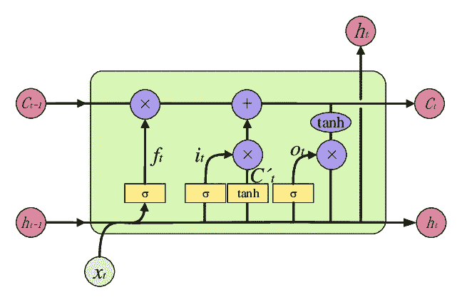

# 探索不同类型的 LSTMs

> 原文：<https://medium.com/analytics-vidhya/exploring-different-types-of-lstms-6109bcb037c4?source=collection_archive---------6----------------------->

# 介绍

最近，我们做了一个有趣的项目，在这个项目中，我们使用不同类型的 LSTMs 对来自 Kaggle 的电影评论数据集进行了情感分析，并分别获得了良好的准确率。让我们了解项目中使用的 LSTM 概念如下:

## LSTM

长短期记忆网络是一种特殊的 RNNs，能够学习长期依赖性。

rnn 在单 Tanh 层的重复模块中具有简单的结构，如下所示:


标准 RNN

与 rnn 不同，LSTMs 有两个输入门、遗忘门和输出门，它们以特殊方式相互作用，如下图所示:


LSTM

## 项目详情:

我们已经对电影评论数据集进行了情感分析。让我们看看数据集在下图中的样子:


电影评论数据集

我们可以看到，数据有四列，其中短语列包含用户提供的评论，相应的情感列分为五个类别，即从“0”(非常差)到“4”(非常好)，如下所示:


现在，我们已经对数据集有了一个概念，我们可以对数据集进行预处理。

# 预处理

现在，通过考虑短语列，我们对数据集应用 NLP 文本处理步骤如下:

> 将文本改为小写

```
train['Phrase']=train.Phrase.apply(**lambda** x: x.lower())
```

> 识别和删除标点符号

```
**def** remove_punc(text):
    **for** i **in** string.punctuation:
        text=text.replace(i,' ')    
    **return** text
train['Phrase']=train.Phrase.apply(remove_punc)
```

> 删除停用词

```
stopword_list=stopwords.words('english')
stopword_list.remove('no')
stopword_list.remove('not')
train['Phrase'] = train.Phrase.apply(**lambda** x : " ".join(x **for** x **in** x.split() **if** x **not** **in** stopword_list))
```

> 单词标记化

```
train['Phrase']=train.Phrase.apply(word_tokenize)
```

> 移除数字

```
**def** remove_numbers(words):    
    new_words = []
    **for** word **in** words:
        new_word = re.sub("\d+", "", word)
        **if** new_word != '':
            new_words.append(new_word)
    **return** new_words
train['Phrase']=train.Phrase.apply(remove_numbers)
```

> 词汇化动词

```
**def** lemmatize_verbs(words):   
    lemmatizer = WordNetLemmatizer()
    lemmas = []
    **for** word **in** words:
        lemma = lemmatizer.lemmatize(word, pos='v')
        lemmas.append(lemma)
    **return** lemmas
train['Phrase']=train.Phrase.apply(lemmatize_verbs)
```

> 为数据创建了 Wordcloud


预处理完成后，我们将数据分成训练和测试数据集。现在，我们尝试应用不同的 LSTM 模型，并检查准确性，如下所示:

# 不同的 LSTM 模式

## 经典 LSTM

这种结构由 4 个门控层组成，单元状态通过这些门控层工作，即 2 输入门、遗忘门和输出门。输入门协同工作，选择要添加到单元状态的输入。遗忘门基于当前单元状态来决定遗忘哪个旧单元状态。输出门决定通过它们发送什么输出。



我们将经典的 LSTM(长短期记忆)应用于建模的训练数据并拟合模型。

```
EMBEDDING_DIM = 128
lstm_out = 196
a = len(tokenize.word_index)+1
model = Sequential()
model.add(Embedding(a, EMBEDDING_DIM, input_length=max_len))
model.add(LSTM(lstm_out, dropout=0.2, recurrent_dropout=0.2 ))
model.add(Dense(5, activation='softmax'))
model.compile(loss='sparse_categorical_crossentropy', optimizer='adam', metrics=['accuracy'])
print(model.summary())
model.fit(X_train, y_train, batch_size=128, epochs=24, verbose=1)
```

在这里，我们为模型使用了一个 LSTM 层，优化器是 Adam，在大约 24 个时期后达到了 80%的准确率，这很好。


值得注意的是，通过应用不同类型的 LSTMs(基本上是 rnn ),研究了相同的数据集。

## 堆叠 LSTM

堆叠的 LSTM 只不过是具有多个 LSTM 层的 LSTM 模型。LSTM 层向下一个 LSTM 层提供顺序输出。


我们已经应用了堆叠 LSTM，它只不过是增加了多个 lstm 并适合模型。

```
EMBEDDING_DIM = 128
lstm_out = 196
a = len(tokenize.word_index)+1
model2 = Sequential()
model2.add(Embedding(a, EMBEDDING_DIM, input_length=max_len))
model2.add(LSTM(lstm_out, return_sequences=**True**, dropout=0.2, recurrent_dropout=0.2))
model2.add(LSTM(lstm_out))
model2.add(Dense(5, activation='softmax'))
model2.compile(loss='sparse_categorical_crossentropy', optimizer='adam', metrics=['accuracy'])
print(model.summary())
model2.fit(X_train, y_train, batch_size=128, epochs=24, verbose=1)
```

使用两个 LSTM 层的模型和优化是亚当，实现了 80%的准确率。


## 双向 LSTM

双向 LSTM 在输入序列上训练两个而不是一个，这意味着第一个输入序列和第二个输入序列是它的反向拷贝。更快地改进模型的学习。


我们应用了双向 LSTM 并拟合了模型。

```
**from** **keras.layers** **import** Bidirectional
EMBEDDING_DIM = 128
a = len(tokenize.word_index)+1
model3 = Sequential()
model3.add(Embedding(a, EMBEDDING_DIM, input_length=max_len))
model3.add(Bidirectional(LSTM(64, return_sequences=**True**)))
model3.add(Bidirectional(LSTM(64)))
model3.add(Dense(5, activation='softmax'))
model3.compile(loss='sparse_categorical_crossentropy', optimizer='adam', metrics=['accuracy'])
print(model.summary())
model3.fit(X_train, y_train, batch_size=128, epochs=24, verbose=1)
```

在这里，我们看到，我们不仅对模型使用了双向 LSTM，而且还使用了多个层，它也是堆叠的，优化器是 Adam，在这里，我们在 24 个时期后达到了 81%的准确性，但我们可以更进一步，训练模型以获得更好的准确性。


## **GRU(门控循环单元)**

门控递归单元神经网络基本上由两个门组成，即复位门和更新门。重置门有助于捕获序列中的短期相关性，更新门有助于捕获序列中的长期相关性。这两个门控制着每个隐藏单元在处理序列时必须记住或忘记多少。


我们将 GRU 应用于该模型，并实现了 81%的准确率。我们可以在下面找到代码:

```
model4 = Sequential()
model4.add(Embedding(a, EMBEDDING_DIM, input_length=max_len))
model4.add(GRU(64))
model4.add(Dense(5, activation='softmax'))
model4.compile(loss='sparse_categorical_crossentropy', optimizer='adam', metrics=['accuracy'])
print(model.summary())
model4.fit(X_train, y_train, batch_size=128, epochs=24, verbose=1)
```


## **双向 GRU**

作为双向 LSTM，双向 GRU 也是双向 RNN，这意味着，BGRU 只不过是双向的 GRU。


我们已经为模型应用了 BGRU，优化器是 Adam，实现了 79%的准确率，如果模型被训练更多的时期，可以实现更多。

```
model5 = Sequential()
model5.add(Embedding(a, EMBEDDING_DIM, input_length=max_len))
model5.add(SpatialDropout1D(0.2))
model5.add(Bidirectional(GRU(64)))
model5.add(Dropout(0.2))
model5.add(Dense(5, activation='softmax'))
model5.compile(loss='sparse_categorical_crossentropy', optimizer='adam', metrics=['accuracy'])
print(model.summary())
model5.fit(X_train, y_train, batch_size=128, epochs=24, verbose=1)
```


# 结论

总之，我们已经知道所有的 LSTMs 都是 RNNs 的亚型。由于消失梯度问题，训练 RNN 解决某些问题变得很困难，为了克服这一点，我们使用 LSTM，它使用一个特殊的单位和标准单位，这些单位可以控制记忆何时忘记以及何时获得输出。GRU 是具有简化结构的 LSTM，并且不使用单独的存储单元，而是使用较少的门来控制信息流。

在这个项目中，我们利用经典的 LSTM 完成了一个完整的自然语言处理项目，取得了 80%的准确率。我们更进一步，了解了不同类型的 LSTMs 及其使用相同数据集的应用。对于双向 LSTM 和 GRU，我们分别达到了大约 81%的准确度，然而，我们可以为更少的时期训练模型，并且可以达到更好的准确度。

*因此，总的来说，根据我们的要求，这个项目的主要收获包括不同类型的 LSTMs 及其数据集实现的基础知识。*