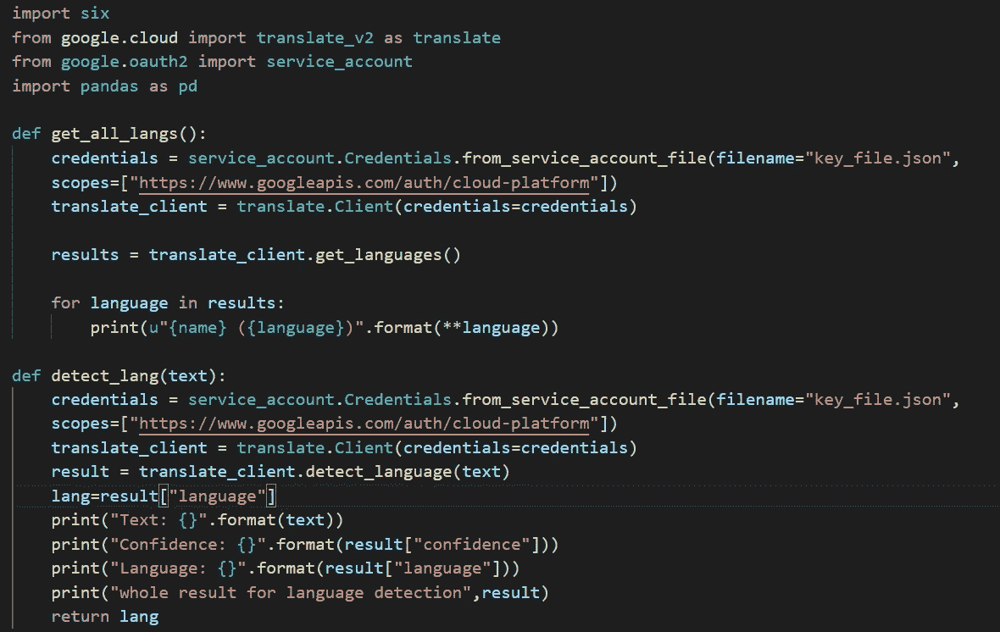
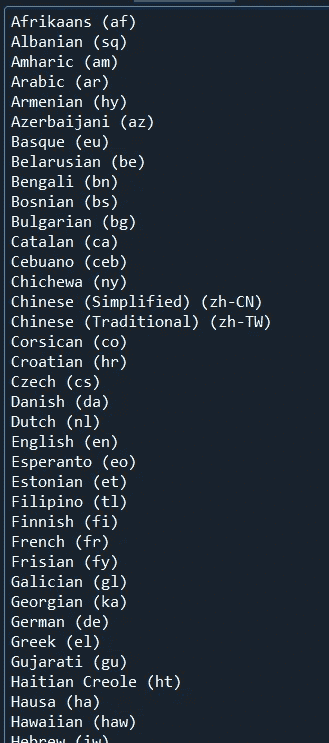
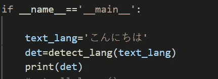
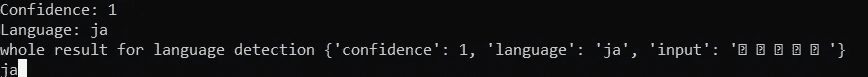
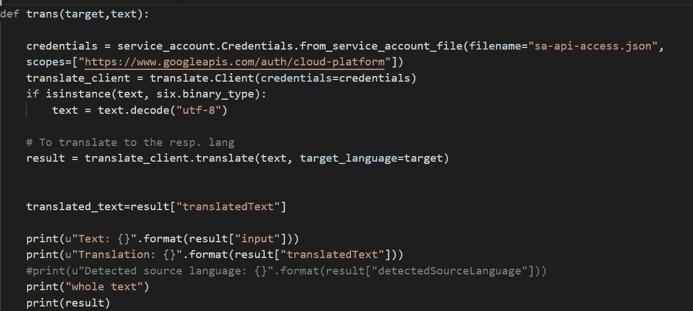
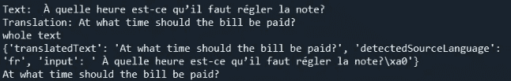
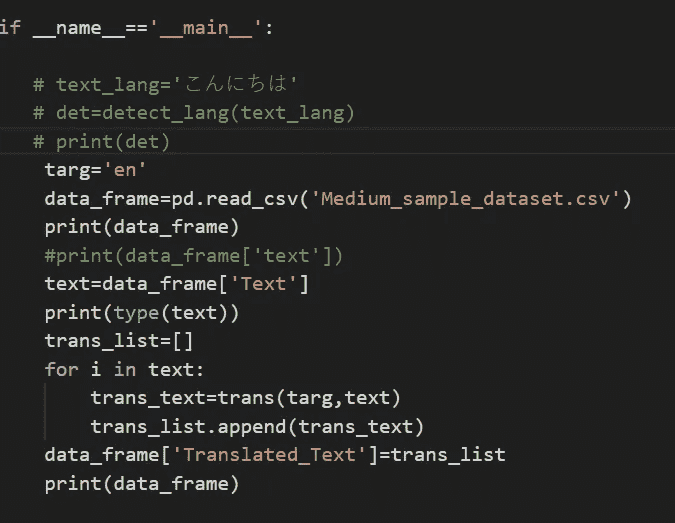
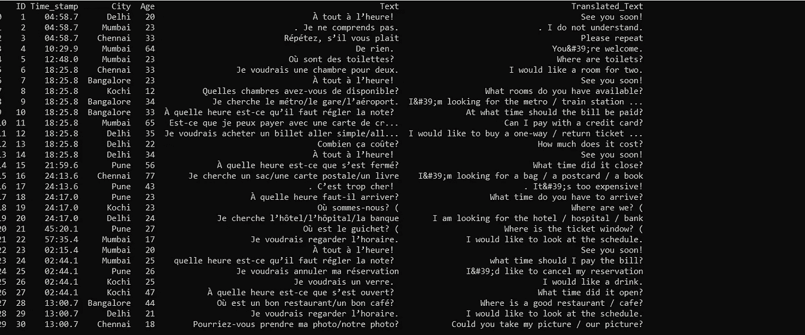

# 探索用于 Python 机器翻译的 Google Cloud Translate API

> 原文：<https://medium.com/analytics-vidhya/exploring-google-cloud-translate-api-for-machine-translation-in-python-ef60c123fc37?source=collection_archive---------4----------------------->

Moshi Moshi，Ohayo Gozaimasu 或 Bonjour！我想我们大多数人都知道这些词的意思，不是吗？掌握一些不同语言的基本词汇当然是一项很好的技能，但是当你有大量不同语言的数据时，你该怎么办呢？

这就是机器翻译的用武之地。因此，机器翻译是计算语言学的一个子领域，它研究使用软件将文本或语音从一种语言翻译成另一种语言。

谷歌云平台为我们提供了一个机器翻译服务，如果你有一个服务帐户，它可以帮助我们有效地完成上述工作，因为这是一个付费服务，有利于使用 API 提供的服务。

> ***安装***

**pip install Google-cloud-translate**
从命令提示符下运行上面的命令来安装 API

另外，请将您的 JSON keyfile w . r . t GCP 凭证放在与您的身份验证脚本相同的目录中。

代码片段 1

> ***进口***

**translate_v2** 是与谷歌云翻译 API
交互的客户端 **google.oauth2** 用于认证

对于身份验证，创建服务帐户凭据对象，并将包含所有 GCP 凭据的密钥文件 json 作为参数传递。

> ***获取 API 支持的所有语言***

代码片段中的第一个方法对应于获取 API 支持的语言。创建翻译客户端对象后，将凭据作为参数传递。您可以使用它来调用 get_languages()方法，该方法将获取 API 支持的所有语言。

类似地，调用 get_languages()将返回其余语言及其语言代码

有关语言的完整列表，请参考 https://cloud.google.com/translate/docs/languages。

> ***检测文本的源语言***

方法 detect_language()将文本作为参数，并将返回一个响应，该响应包含一个字典，该字典具有三个键值对、语言预测、pred 的置信度得分。语言和用户提供的输入。该方法的参数可以是一个字符串或一系列字符串。在输入字符串序列的情况下，返回的结果将是每个文本的结果序列。

方法返回的结果

> ***将文本翻译成目标语言***

代码片段 2

现在这个块是翻译 API 的 Translate()方法的结果的解释。自定义方法 trans 有两个参数，第一个是目标语言，文本需要转换到的语言，第二个是文本。在提供给 translate()方法之前，文本需要是 UTF-8 格式，因此文本被解码为 utf-8 格式，因为许多语言最初都在 req 中。格式。这个 translate 方法返回一个响应，该响应由包含 3 个键-值对的字典组成，这三个键是检测到的语言、用户提供的输入和翻译的文本。

结果

现在，这个 API 在许多这样的情况下变得很方便，例如您有一个由 6000 行(任意)组成的巨大数据帧，其中一列包含 diff 语言的文本，我们可以将该文本转换为目标语言并存储在不同的列中。

代码片段 3

结果

为了更好地理解，请参考此[https://github . com/Google APIs/python-translate/tree/a 5 C1 ced 2 ea a43 f 42 BCB 8300 f 4351 e 5987 a 7182 CB](https://github.com/googleapis/python-translate/tree/a5c1ced2eaa43f42bcb8300f4351e5987a7182cb)

希望这篇文章对某人有所帮助。:)

编码快乐！^_^