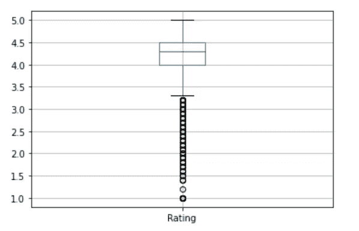
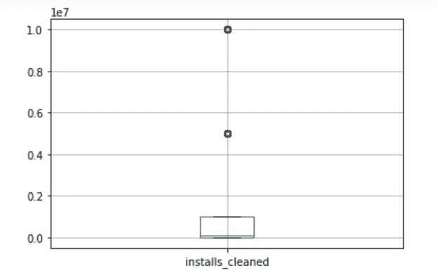

# 探索 Google Playstore 数据集

> 原文：<https://medium.com/analytics-vidhya/exploring-google-playstore-dataset-f0cdcd240294?source=collection_archive---------22----------------------->

在本节中，我们将使用上一节中清理的数据来获取一些有见地的信息。

> 探索性数据分析是对数据进行初步调查的关键过程，以便发现模式、发现异常、测试假设并借助汇总统计和图形表示检查假设。

数据头

让我们看看哪些类别的应用数量更多

每个类别中的应用数量

从图中可以明显看出，家庭和游戏是应用数量最多的两大类别。

现在让我们来看看 Playstore 上应用程序的评级趋势

评分直方图

左边的倾斜直方图显示，应用程序的平均评分在 4.2 - 4.6 左右。

应用程序大小直方图

从这个直方图我们可以清楚地看到，用户更喜欢使用轻量级的应用程序。

# 极端值

> 在统计学中，异常值是与其他观察值显著不同的数据点。

## 大小

大小的箱线图(mb)

这个应用程序大小的方框图显示，大多数应用程序的大小都在 75mb 以下。我们还可以找到一些 80 到 100mb 以上的异常值。

## 评级

评级箱线图

该箱线图显示，大多数评级范围为 3.3-5，但很少有低于 3.3 的异常值。

## 安装

安装箱线图

在这里，我们可以看到 5 亿和 10 亿的异常值。

# 免费与付费

从上面的柱状图我们可以看到，Playstore 中免费应用的数量几乎是付费应用的 7 倍。

我很好奇哪些应用是付费最高的，

老实说，我一点也不惊讶，实际上，我一直在期待付费最高的应用会是“我很有钱”的应用。

在付费排行榜前几位的这些无用 app 下面，我们可以看到一些医疗类的应用。

从这个图表中，我们可以看到排名靠前的应用程序的最佳价格在 0-40 美元之间。

现在让我们来看看 playstore 中安装数量最多的应用程序。

在这里，我绘制了一个数据透视表，显示了应用程序的安装数量和评级。

出于好奇，我想知道 playstore 上安装最多的游戏。

现在我想知道哪一类的规模最大。

正如预期的游戏应用程序具有较大的平均大小，我们还可以看到工具、天气和生产力应用程序等类别具有最低的平均大小。

这就是我对 Google Playstore 数据集的简短分析。如果你想看看这些图表是如何绘制的，只要翻翻我的笔记本就可以了。那会让你有更好的想法。请随意提出建议或想法。