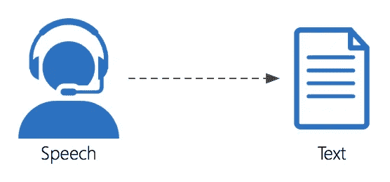

# 探索谷歌语音识别和谷歌翻译

> 原文：<https://medium.com/analytics-vidhya/exploring-google-speech-recognition-along-with-google-translate-7318f6349b94?source=collection_archive---------5----------------------->

嗯，我们不能否认这样一个事实，自然语言处理使我们的生活变得更容易了，它的一些应用如语音到文本的对话或机器翻译有许多用途。

来吧，让我们一起探索作为“精灵”的谷歌如何能够满足我们的任何要求，你要求转换，他们得到了，你要求翻译，嘣，他们也得到了！

在本文中，我们将利用 SpeechRecognition 和 Google Translate 来开发一个程序，可以将你的诗句翻译成你想要的语言。很好，对吧？我想你可以用一种方式实现它，如果你的朋友没有看过《攻打泰坦》的话，他就可以理解牟信代鲁的意思，而不需要你在中间暂停这一集。

首先，由于谷歌翻译的使用，显然需要一个 GCP 服务帐户，你可以查看我以前的文章，了解更多关于谷歌翻译 API 的详细信息。

所以工作流程将如下:-
1。语音到文本转换
2。机器翻译
3。通过文本到语音听出输出(可选)

## ***语音到文本转换***

语音转文本

1.  必要的进口

下面列出了要为此安装的包，您可以在 python 中安装这些包。
—演讲人识别

> pip 安装语音识别

— PyAudio

> 安装 PyAudio

(注意:如果你有 python 3.8，这将抛出错误，所以你可以用 python 3.8 版创建一个 conda 虚拟环境(我用的是相同的，它工作得很好))

2.代码解释

首先，我们将创建一个负责识别语音的识别器类的实例。
现在，我们使用系统的麦克风(这就是为什么我们需要 PyAudio ),但您可以使用音频文件(如。wav 文件)来进行语音转换。目前，API 支持的音频文件格式有 Wav、AIFF、AIFF-C、FLAC。如果使用音频文件，将
替换为 sr.Microphone()作为信号源

> aud = Sr . audio file(' ABCD . wav ')
> 以 aud 为源:

因此，如果您对说话但无法识别感到困惑，您可能需要使用 list_microphone_names()方法检查系统的麦克风是否列出。
你可以在任何你需要的时间内使用 pause_threshold，这样这段时间内的沉默将被记录在你所说的句子的末尾。
adjust _ for _ ambient _ noise(source)使用来自源(AudioSource 实例)的音频动态调整能量阈值，以考虑环境噪声。
audio=r.listen(source)记录来自源实例的短语，并返回一个 AudioData 实例(保存在 audio 变量中)。

此外，上面附加的代码片段是实际的语音到文本转换发生的地方。因此，这里我们使用的是 recognize_google()方法，它是 Google Web Speech API。如果您正在寻找一个离线工作的 API，您可以调用 recognize_sphinx()方法，它与 CMU Sphinx 引擎一起工作。
在该方法中，传递 listen()方法返回的 audiodata，并在 language 属性中指定要用哪种语言将语音转换为文本。您可以在线查看 SpeechRecognition 支持哪些语言。

[语言支持](https://cloud.google.com/speech-to-text/docs/languages)

## 使用谷歌翻译的机器翻译

1.必要的进口

> pip 安装谷歌云翻译
> pip 安装谷歌 oauth
> pip 安装六

2.代码解释

将 google cloud credentials json 文件的名称作为文件名，作为参数传递给 from_service_account_file()方法。

> 翻译 _ 客户端=翻译。客户端(凭据=凭据)

这里我们创建了一个 Google Cloud Translate 客户端对象，用于将文本翻译成目标语言。

> 结果= translate _ client . translate(text，target_language=target)

translate()方法有两个参数，第一个是字节格式的文本，第二个是目标语言，即您希望文本转换成的语言。
该方法返回的结果是一个由几个键-值对组成的字典，其中一个是 translatedText，它包含目标语言的翻译文本。

## 文本到语音转换(可选)

现在，如果你想把你的结果说出来，你可以使用 pyttsx3 进行文本到语音的转换。

必要的进口

> pip 安装 pyttsx3

代码解释

您需要做的第一件事是调用初始化连接的 init()函数。

您只需要为某个短语的文本到语音转换调用 say()方法，并将文本作为参数传递。
engine.runAndWait():这个函数将使系统中的语音听得见，如果你不写这个命令，那么你将听不到语音。

您可以尝试使用 getProperty()方法来了解声音(速率、声音)等属性。

# 完整代码

> 导入 speech_recognition as sr
> 导入 pyttsx3
> 从 google.cloud 导入 datetime
> 作为 translate
> 从 google.oauth2 导入 service_account
> 导入 six
> 
> target='en'
> 导入 pyttsx 3
> engine = pyttsx 3 . init(' SAPI 5 ')
> 
> def speak(音频):
> engine.say(音频)
> engine . runandwait()
> 
> def trans(目标，文本):
> 
> credentials = service _ account。credentials . from _ service _ account _ file(filename = " credentials . JSON "，
> scopes =["[https://www.googleapis.com/auth/cloud-platform](https://www.googleapis.com/auth/cloud-platform)"])
> translate _ client = translate。client(credentials = credentials)
> if is instance(text，six . binary _ type):
> text = text . decode(" utf-8 ")
> #要翻译成 resp。lang
> result = translate _ client . translate(text，target _ language = target)
> 
> translated _ text = result[" translated text "]
> 
> 返回结果["translatedText"]
> 
> r=sr.Recognizer()
> 以 sr.Microphone()为源:
> print(" Listening ")
> Sr . Microphone . list _ Microphone _ names()
> r . pause _ threshold = 1
> r . adjust _ for _ ambient _ noise(source)
> audio = r . listen(source)
> print()
> try:
> print(" recognize…)
> query = r . recognize _ Google(audio，language="fr-FR")
> print("打印 format(query))
> trans _ text = trans(target，query)
> print("英语中它的意思是"，trans _ text)
> speak(trans _ text)
> Exception as e:
> print(e)
> speak("请再说一遍")

## **输出**

输出

尽情享受吧！你刚刚完成了。

备案

[谷歌翻译详解](/analytics-vidhya/exploring-google-cloud-translate-api-for-machine-translation-in-python-ef60c123fc37)

快乐学习！