# 用 Yahoo Finance Python 模块探索股票数据

> 原文：<https://medium.com/analytics-vidhya/exploring-stock-data-with-a-yahoo-finance-python-module-319c6b3815ae?source=collection_archive---------4----------------------->

## 热衷于研究股票的散户投资者入门指南

如果你是一个对股票市场感兴趣的散户投资者，自己研究股票是必不可少的。雅虎财经和许多其他网站一样，提供股票数据供用户互动。对于那些精通编码技术的人来说，有一些 API(应用程序接口)可以编程访问 Yahoo Finance 数据。 [yfinance](https://pypi.org/project/yfinance/) ，由[Ran aroun si](https://medium.com/u/68179100a7a3?source=post_page-----319c6b3815ae--------------------------------)维护，是一个 Python 模块，提供对多个数据集的访问。

这篇文章将展示 yfinance 模块的一些方面，并希望为其他人的参与和探索打开大门。

# 装置

我用`pip`安装的。在`Terminal`中，运行以下程序:

```
pip install yfinance
```

# 跑马灯模块

要访问一只股票的数据，只需使用`Ticker`模块。首先，导入`yfinance`，然后通过定义您感兴趣的股票代码来启动(例如，Amazon，by sybmol AMZN)。

```
import yfinance as yf
stock = yf.Ticker('AMZN')
```

`stock`实例包含大量信息，您可以通过调用不同的方法来访问这些信息。我们将在接下来的章节中详细介绍它们，但是首先让我们通过打印出`stock.info`来看看`info`对象。这在一个字典中包含了关于 Amazon 业务和 AMZN 股票的基本信息，包括价格、数量、短期利息和 beta 系数风险。

```
{'zip': '98109-5210',
 'sector': 'Consumer Cyclical',
 'fullTimeEmployees': 1298000,
 'longBusinessSummary': 'Amazon.com, Inc. engages in the retail sale of consumer products and subscriptions in North America and internationally. The company operates through three segments...,
 'city': 'Seattle',
 'phone': '206-266-1000',
 'state': 'WA',
 'country': 'United States',
 'companyOfficers': [],
 'website': 'http://www.amazon.com',
 'maxAge': 1,
 'address1': '410 Terry Avenue North',
 'industry': 'Internet Retail',
 'previousClose': 3146.14,
 'regularMarketOpen': 3143.47,
 'twoHundredDayAverage': 3209.0454,
 'trailingAnnualDividendYield': None,
 'payoutRatio': 0,
 'volume24Hr': None,
 'regularMarketDayHigh': 3163.52,
 'navPrice': None,
 'averageDailyVolume10Day': 3790100,
 'totalAssets': None,
 'regularMarketPreviousClose': 3146.14,
 'fiftyDayAverage': 3237.417,
 'trailingAnnualDividendRate': None,
 'open': 3143.47,
 'toCurrency': None,
 'averageVolume10days': 3790100,
 'expireDate': None,
 'yield': None,
 'algorithm': None,
 'dividendRate': None,
 'exDividendDate': None,
 'beta': 1.143009,
 'circulatingSupply': None,
 'startDate': None,
 'regularMarketDayLow': 3087.12,
 'priceHint': 2,
 'currency': 'USD',
 'trailingPE': 73.97872,
 'regularMarketVolume': 2506444,
 'lastMarket': None,
 'maxSupply': None,
 'openInterest': None,
 'marketCap': 1558297051136,
 'volumeAllCurrencies': None,
 'strikePrice': None,
 'averageVolume': 3656136,
 'priceToSalesTrailing12Months': 4.03637,
 ...
 'shortPercentOfFloat': 0.0089,
 'sharesShortPriorMonth': 3141707,
 'impliedSharesOutstanding': None,
 'category': None,
 'fiveYearAverageReturn': None,
 'regularMarketPrice': 3143.47,
 'logo_url': 'https://logo.clearbit.com/amazon.com'}
```

# 价格历史

`history`方法提供了对某种股票价格历史的访问。下面是调用该方法的输入参数，来自模块的文档。

```
history(period='1mo', interval='1d', start=None, end=None, prepost=False, actions=True, auto_adjust=True, back_adjust=False, proxy=None, rounding=False, tz=None, **kwargs)
```

让我们使用 1 个月的默认时间段来获取数据，并进行检查。

```
prices = stock.history(period='1mo')
prices.head()
```

这向我们展示了数据帧的前 5 行

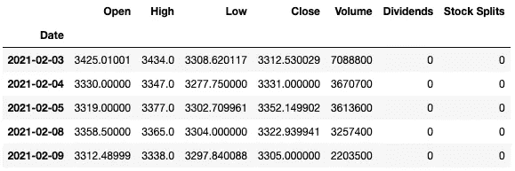

价格历史记录的前 5 行

为了计算股票的每日收益，我们可以使用`pct_change`方法对`Close`列熊猫如下

```
prices['Returns'] = prices['Close'].pct_change()
prices.head()
```

现在，dataframe 有了一个 returns 列，可用于不同的目的，例如计算特定时间段内的滚动回报。

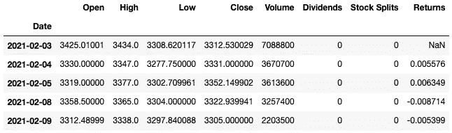

带有退货栏的价格历史记录的前 5 行

此外，`history`方法提供实时价格数据。对于那些感兴趣的人来说，这可以用来监控甚至交易当天的股票。为了展示数据是如何实时的，我们访问 1 天的数据，暂停 1 分钟，然后再次访问 1 天的数据。价格数据将在`Close`列中。下面的代码

```
print(datetime.now())
display(stock.history(period='1d'))
time.sleep(60)
print(datetime.now())
display(stock.history(period='1d'))
```

数据打印出来如下

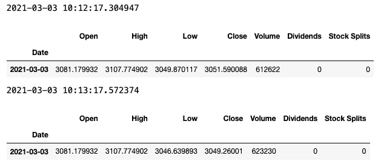

亚马逊(AMZN)的实时数据

# 股息历史

对于对股息投资感兴趣的投资者来说，`dividends`方法提供了历史股息支付数据。下面是 Visa 过去 8 个季度的股息示例。人们可以将其与价格历史相结合，计算股息收益率，比较不同的收益率，并选择高收益投资。

```
stock = yf.Ticker('V')
stock.dividends.tail(8)
```

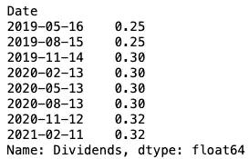

过去 8 个季度的 Visa (V)股息历史

# 主要股东

对于对股票所有权感兴趣的投资者来说，`Ticker`下的两个对象可以提供所有权数据。这可能有助于设计策略，跟踪有洞察力的大型投资者的投资，并获得一些回报。

下面，我们显示了 Palantir 的最大投资者(持有人列)以及他们拥有 Palantir 多少流通股(股份和百分比列)。您还可以找到最后一次报告持股的时间(报告日期栏)，我相信这是公司提交 SEC 13F 表格的日期。

```
stock = yf.Ticker('PLTR')
stock.institutional_holders
```

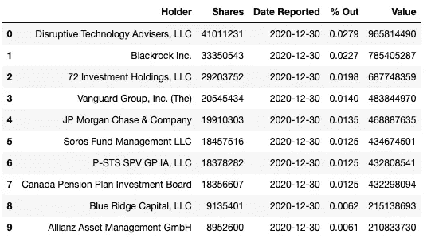

Palantir (PLTR)的机构持有人

```
stock.mutualfund_holders
```

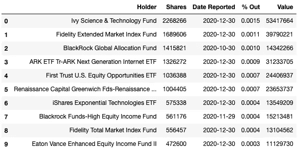

Palantir 的共同基金持有人

# 分析师建议

华尔街分析师提供他们对股票的建议，有时是买入、持有和卖出，从看涨到看跌；也可能是超重、等重和欠重(UW)。这有助于检查对股票是否有共识，并监控股票的升级或降级行为，这些行为有时会影响股价。

```
stock = yf.Ticker('ZM')
stock.recommendations
```

在下面的数据框架中，我们可以在日期索引中找到建议的发布时间；分析师所属的公司或经纪人；“升级”和“升级”栏中的建议和先前的建议；以及“动作”，即从和到之间的增量，其可以是

*   Init:初始化
*   降级还是升级:降级还是升级
*   主要:维持先前的建议

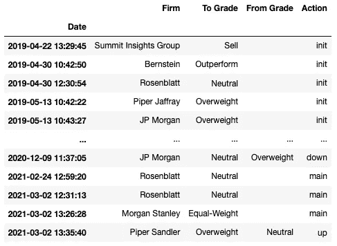

分析师对 Zoom (ZM)的建议

# 日历

对于关注某些股票即将盈利的投资者来说，`calender`方法提供了下一次盈利日期和华尔街预测的信息。在下面的例子中，我们找到了特斯拉即将到来的收益日期。由于日期尚未确定，数据框包含两列两个估计日期。它包含每股收益(EPS)和收入的平均值、最小值和最大值，这是两个重要的估值指标。

```
stock = yf.Ticker('TSLA')
stock.calendar
```

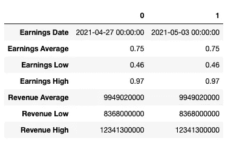

特斯拉(TSLA)即将到来的盈利日期和估计

# 选择

最后但同样重要的是，`Ticker`模块为感兴趣的人提供期权定价数据。您可以首先使用`options`对象来查找存储在元组中的到期日期。

```
stock = yf.Ticker('AMZN')
stock.options
```

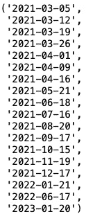

AMZN 期权到期日

然后，通过定义到期日，使用`option_chain`方法访问期权数据。然后，按如下方式分别访问看涨和看跌期权。你会发现交易日期、执行价格、合同的第三位要价、交易量、隐含波动率(IV)以及其他信息。

```
option_chain = stock.option_chain(date='2021-03-05')
option_chain.calls.sort_values('lastTradeDate')
```

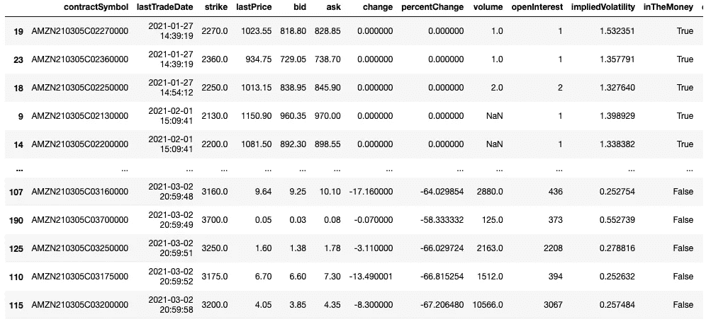

AMZN 的买入期权历史

```
option_chain.puts.sort_values('lastTradeDate')
```

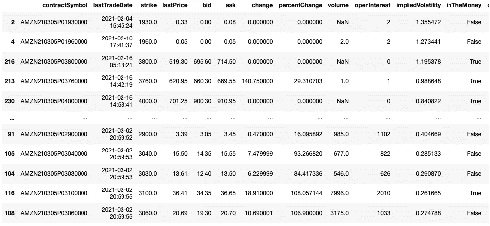

AMZN 的看跌期权历史

# 结论

希望这对那些有兴趣将编码应用于股票研究和投资的人有用。祝大家好运！