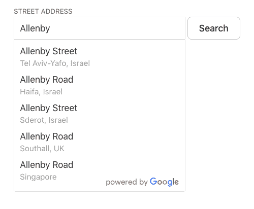
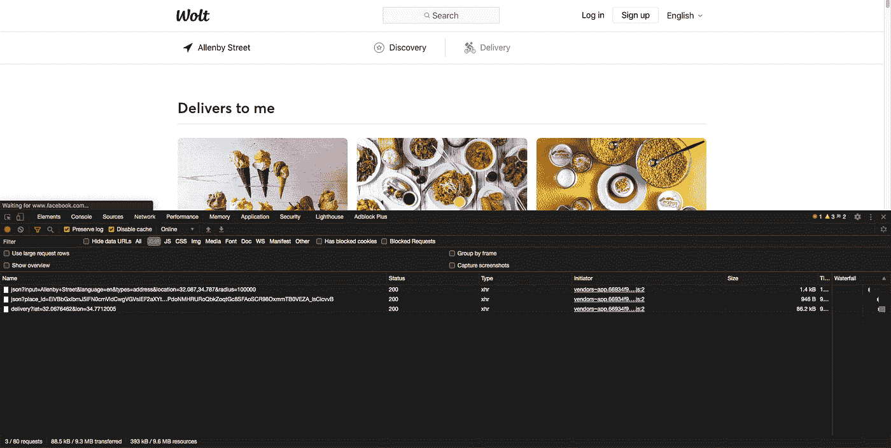
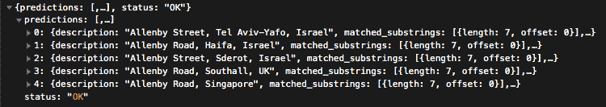
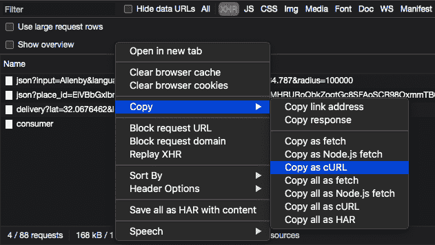
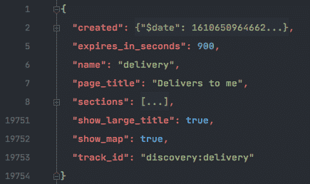

# 探索网站的 API

> 原文：<https://medium.com/analytics-vidhya/exploring-the-api-of-a-website-8579b04df28f?source=collection_archive---------9----------------------->

如今，由于 Javascript 框架如 [React](https://reactjs.org/) 越来越受欢迎，许多网站通过从后端加载 JSON 或 XML 来呈现动态内容，这意味着越来越少的网站在*服务器端*生成，而是在*客户端*呈现。

在本帖中，我们将通过使用一些 Python 代码直接访问他们的 API 来探索 [Wolt 的网站](https://wolt.com/)。

Wolt 是一个食品配送平台。它允许人们从他们的餐馆伙伴那里找到食物，要么自己取，要么让他们的送货伙伴送货上门。

我们将使用 Chrome DevTools 来监控 Wolt 网站向其服务器发出的所有网络请求，看看我们如何使用自己的代码发出同样的请求。我们将从服务器检索的数据将包括附近餐馆的信息，如评级、描述、地址、送货价格等。

为此，我们将使用:

1.  计算机编程语言
2.  [请求](https://requests.readthedocs.io/en/master/)
3.  [Chrome 开发工具](https://developers.google.com/web/tools/chrome-devtools)

# 清注意

任何时候你加载一个网页，你都是在向服务器发出请求。当你只是一个拥有浏览器的人时，你可能不会造成太大的伤害。然而，当编写访问服务器的代码时，您可以在一秒钟内发送数千个请求。这会让网站所有者损失一大笔钱，甚至关闭他们的网站。

记住这一点——您需要非常小心地使用代码，并限制发送到服务器的请求数量，以避免造成任何损害。

# 我们开始吧

首先，让我们进入 Wolt 的网站，进入[送货页面](https://wolt.com/en/delivers-to-me)(因为我们想找到附近餐馆的信息)并点击添加地址。

现在，让我们试着判断一下搜索附近餐馆时服务器的响应。打开 Chrome DevTools，右击页面上的任意位置，点击 Inspect，转到 Network 选项卡，然后按下 XHR。我们现在应该有这样的东西:


在搜索框中，我们输入一个街道名称，例如 *Allenby* ，然后单击搜索。我们现在应该会看到一些与我们的搜索查询相匹配的结果。让我们选择一个在*以色列特拉维夫亚佛*的。



我们现在可以看到 Chrome DevTools 中的 Network 选项卡填充了 3 个新的 XHR 请求。注意，可能会有 3 个以上的请求，这需要一些试验和错误，以找到我们到底在寻找什么。

XHR 将包含关于浏览器对服务器的请求的信息，比如请求 URL(本例中是 API 的端点)、请求方法(GET、POST 等)。)、头和参数。它还将包含服务器对该特定请求的响应。



让我们点击第一个请求，然后点击 Chrome DevTools 左侧的预览选项卡。这将向我们展示服务器的响应是什么样子的。



我们可以看到服务器返回了一个 JSON 响应，其中包含一个包含艾伦比街的城市列表。但是等等——这是响应，请求呢？为了理解网站发送给服务器的请求是什么以及它看起来像什么，我们将使用[curl.trillworks.com](https://curl.trillworks.com/)，这将允许我们轻松地将 [cURL](https://en.wikipedia.org/wiki/CURL) 转换成 Python 脚本。

让我们右键单击第一个请求，然后单击 Copy > Copy as cURL，并将其粘贴到 Trillworks 的工具上。



稍微清理一下代码后，我们得到了类似这样的东西:

```
import requestsURL = 'https://restaurant api.wolt.com/v1/google/places/autocomplete/json'headers = {
    'user-agent': 'Mozilla/5.0 (Macintosh; Intel Mac OS X 10_14_6) AppleWebKit/537.36 (KHTML, like Gecko) Chrome/86.0.4240.68 Safari/537.36'
}params = [{'input': 'Allenby'}]response = requests.get(URL, 
                        headers=headers,
                        params=params)
print(response.text)
```

首先，我们为请求设置头，请求包括一个带有所需头的字典。User-Agent 头让服务器“认为”我们正试图从一个实际的浏览器(在这种情况下是 Mac 上的 Chrome)访问它。当它不存在时，服务器可能会认为自动请求是由机器人发出的，并可能返回错误的响应。

然后，我们设置参数，这些参数基本上就是我们发送给服务器的查询(还记得我们在搜索框中输入‘Allenby’吗？).

最后，我们使用 requests.get()函数向服务器发送一个 GET 请求，其中包含 API 的端点、头和我们设置的参数。

这段代码基本上将模拟网站发送给服务器的相同请求，并允许我们得到网站正在接收的相同响应。

根据我们得到的响应，我们将从服务器返回的城市列表中选择第一个项目，它看起来像这样:

```
{'description': 'Allenby Street, Tel Aviv-Yafo, Israel',
                  'matched_substrings': [{'length': 7, 'offset': 0}],
                  'place_id': 'EiVBbGxlbmJ5IFN0cmVldCwgVGVsIEF2aXYtWWFmbywgSXNyYWVsIi4qLAoUChIJx0FPdoNMHRURoQbkZoqtGc8SFAoSCR98OxmmTB0VEZA_lsCicvvB',
                  'reference': 'EiVBbGxlbmJ5IFN0cmVldCwgVGVsIEF2aXYtWWFmbywgSXNyYWVsIi4qLAoUChIJx0FPdoNMHRURoQbkZoqtGc8SFAoSCR98OxmmTB0VEZA_lsCicvvB',
                  'structured_formatting': {'main_text': 'Allenby Street',
                                            'main_text_matched_substrings': [{'length': 7,
                                                                              'offset': 0}],
                                            'secondary_text': 'Tel Aviv-Yafo, '
                                                              'Israel'},
                  'terms': [{'offset': 0, 'value': 'Allenby Street'},
                            {'offset': 16, 'value': 'Tel Aviv-Yafo'},
                            {'offset': 31, 'value': 'Israel'}]
                  'types': ['route', 'geocode']}
```

在这一点上，它没有告诉我们太多。我们可以看到 Allenby street 有一个名为“place_id”的属性以及一些更相关的属性。

现在让我们检查对服务器的第二个请求。

和以前一样，我们复制了请求的 cURL，并将其粘贴到 TrillWorks 的工具上，现在我们有了类似这样的东西:

```
import requestsURL = 'https://restaurant-api.wolt.com/v1/google/geocode/json'headers = {
    'user-agent': 
    'Mozilla/5.0 (Macintosh; Intel Mac OS X 10_14_6) AppleWebKit/537.36 (KHTML, like Gecko) Chrome/86.0.4240.68 Safari/537.36',
}params = [
    {'place_id':
  'EiVBbGxlbmJ5IFN0cmVldCwgVGVsIEF2aXYtWWFmbywgSXNyYWVsIi4qLAoUChIJx0FPdoNMHRURoQbkZoqtGc8SFAoSCR98OxmmTB0VEZA_lsCicvvB'
}
]response = requests.get(URL, headers=headers, params=params)print(response.text)
```

我们可以看到，现在，该网站正在向服务器发送另一个 GET 请求，该请求具有我们从第一个请求中收到的相同的“place_id”属性。响应看起来是这样的:

```
"results": [
    {
        "address_components": [
            {
                "long_name": "Allenby Street",
                "short_name": "Allenby St",
                "types": ["route"]
            },
            {
                "long_name": "Tel Aviv-Yafo",
                "short_name": "Tel Aviv-Yafo",
                "types": ["locality", "political"]
            },
            {
                "long_name": "Tel Aviv District",
                "short_name": "Tel Aviv District",
                "types": ["administrative_area_level_1", "political"]
            },
            {
                "long_name": "Israel",
                "short_name": "IL",
                "types": ["country", "political"]
            }
        ],
        "formatted_address": "Allenby St, Tel Aviv-Yafo, Israel",
        "geometry": {
            "bounds": {
                "northeast": {
                    "lat": 32.07381530000002,
                    "lng": 34.7739591
                },
                "southwest": {
                    "lat": 32.06058009999997,
                    "lng": 34.7650244
                }
            },
            "location": {
                "lat": 32.0676462,
                "lng": 34.7712005
            },
            "location_type": "GEOMETRIC_CENTER",
            "viewport": {
                "northeast": {
                    "lat": 32.07381530000002,
                    "lng": 34.7739591
                },
                "southwest": {
                    "lat": 32.06058009999997,
                    "lng": 34.7650244
                }
            }
        },
        "place_id": "EiVBbGxlbmJ5IFN0cmVldCwgVGVsIEF2aXYtWWFmbywgSXNyYWVsIi4qLAoUChIJx0FPdoNMHRURoQbkZoqtGc8SFAoSCR98OxmmTB0VEZA_lsCicvvB",
        "types": ["route"]
    }
],
"status": "OK"
```

我们可以看到，现在响应具有诸如“lat”和“lng”的属性，它们表示特拉维夫 Yafo 的 Allenby 街的纬度和经度。

转到第三个请求，复制 cURL 并将其转换为 Python，如下所示:

```
import requestsURL = 'https://restaurant-api.wolt.com/v1/pages/delivery'headers = {
    'user-agent':
        'Mozilla/5.0 (Macintosh; Intel Mac OS X 10_14_6) AppleWebKit/537.36 (KHTML, like Gecko) Chrome/86.0.4240.68 Safari/537.36',
}params = [
    {'lat', '32.0676462'},
    {'lon', '34.7712005'}
]response = requests.get(URL, headers=headers, params=params)print(response.text)
```

现在，我们可以看到 *lat* 和 *lon* 值作为 GET 请求中的参数被传递给服务器(注意，现在 longitude 的拼写不同了: *lon* )。

作为回报，我们将得到如下所示的 JSON 响应:



展开 *sections* 属性将显示一个与 Wolt 合作并向所提供的街道递送食物的餐馆及其信息的巨大列表。

我选择了第一家餐馆，这样我们就可以看到响应中有哪些信息:

```
{image: {blurhash: "jdRYf1X;TtrcLLKYPcKXJkh3hmh4",…},…}
image: {blurhash: "jdRYf1X;TtrcLLKYPcKXJkh3hmh4",…}
blurhash: "jdRYf1X;TtrcLLKYPcKXJkh3hmh4"
url: "https://prod-wolt-venue-images-cdn.wolt.com/s/sI8s6J88YvIarmXei4Tmr0XUEC5wWJVwX_2IXER1m2k/5d25876a70bfc61476fe9774/1d3bb9c41565710c313996ab39623ee9-edits/fdec11eea2a5b5afe684b07acbbce331"
variants: ["xs", "sm", "md", "frontpage"]
link: {target: "https://wolt.com/en/isr/tel-aviv/restaurant/arte-gelateria", target_sort: "default",…}
target: "https://wolt.com/en/isr/tel-aviv/restaurant/arte-gelateria"
target_sort: "default"
target_title: ""
title: ""
type: "url"
template: "venue-large"
title: "Arte Italian Ice Cream"
track_id: "venue-arte-gelateria"
venue: {address: "נחלת בנימין 11", badges: [], city: "Tel Aviv", currency: "ILS", delivers: true,…}
address: "נחלת בנימין 11"
badges: []
city: "Tel Aviv"
currency: "ILS"
delivers: true
delivery_price: "₪10.00"
estimate: 20
estimate_range: "15-25"
franchise: ""
id: "5d25876a70bfc61476fe9774"
location: [34.770119190216064, 32.06833246901664]
name: "Arte Italian Ice Cream"
online: true
price_range: 2
product_line: "restaurant"
rating: {rating: 4, score: 9.6}
short_description: "The Art of Ice-cream"
slug: "arte-gelateria"
tag: "ice cream"
tags: ["ice cream", "sweets", "dessert"]}
```

我们现在有了特拉维夫亚佛艾伦比街附近餐馆的所有公开信息。我们可以看到一些属性，这些属性将告诉我们餐馆当前是否在线并接受订单，他们是否有送货选项，预计送货时间，他们的菜单有多贵，等等。

# 概述

1.  我们向服务器发送一个带有街道名称的 *GET* 请求，并接收一个包含城市列表的响应，这些城市具有我们传递的街道名称及其对应的 id。
2.  一旦选择了一个城市，我们就向服务器发送另一个带有所选城市 id 的 *GET* 请求(在我们的例子中是特拉维夫 Yafo 的 Allenby)。
3.  作为回报，我们收到一个 JSON 响应，其中包含街道的纬度和经度。
4.  最后，我们向服务器发送一个带有街道纬度和经度的 *GET* 请求，并获取一个包含我们经过的街道附近所有餐馆信息的 JSON。

我已经写了一个代码，总结了我们在这篇文章中所经历的一切。

```
import json
import requests class Wolt:
    HEADERS = {
        'user-agent':
            'Mozilla/5.0 (Macintosh; Intel Mac OS X 10_14_6) AppleWebKit/537.36 (KHTML, like Gecko) Chrome/86.0.4240.68 Safari/537.36'
    } PLACES_URL = 'https://restaurant-api.wolt.com/v1/google/places/autocomplete/json'
    GOOGLE_GEOCODE_URL = 'https://restaurant-api.wolt.com/v1/google/geocode/json'
    DELIVERY_URL = 'https://restaurant-api.wolt.com/v1/pages/delivery' def get_matching_cities(self, street):
        """
        :param street: a street name
        :return: a list of dictionaries containing the all the cities that has the passed street name and its id
        """
        params = {'input': street}
        response = json.loads(requests.get(self.PLACES_URL, headers=self.HEADERS, params=params).text)
        predictions = response['predictions'] return [
            {
                'street': result['description'],
                'place_id': result['place_id']} for result in predictions] if response else None def get_lat_lon(self, city_id):
        """
        :param city_id: the ID of the city you want to get the latitude and longitude of
        :return: dictionary containing the lat and lon of the
        """
        params = {'place_id': city_id}
        response = json.loads(requests.get(self.GOOGLE_GEOCODE_URL, headers=self.HEADERS, params=params).text)
        lat_lon = response['results'][0]['geometry']['location']
        return lat_lon def get_nearby_restaurants(self, lat, lon):
        """
        :param lat: latitude of the street
        :param lon: longitude of the street
        :return: list of dictionaries containing all the available information about nearby restaurant
        """
        params = {'lat': lat, 'lon': lon}
        response = requests.get(self.DELIVERY_URL, headers=self.HEADERS, params=params).text
        restaurants = json.loads(response)['sections'][0]['items']
        return restaurants if __name__ == '__main__':
    wolt = Wolt() # Get the matching streets
    cities = wolt.get_matching_cities('Allenby') # Select the first place (Allenby, Tel-Aviv Yafo)
    # and get the latitude and longitude of it
    city = cities[0]['place_id']
    lat_lon = wolt.get_lat_lon(city) # Pass the latitude and longitude to get all nearby restaurants
    restaurants = wolt.get_nearby_restaurants(lat_lon['lat'], lat_lon['lng'])
    print(restaurants)
```

我的 [GitHub](https://github.com/AcrobaticPanicc/wolt) 上也有代码。

# 摘要

我们可以以各种方式使用代码；创建一个[电报机器人](https://github.com/dFurman/wolt-checker-bot)在我们最喜欢的餐厅有外卖时通知我们，创建一个具有 Wolt 的应用程序/网站中不存在的功能的应用程序，或者使用它进行分析或研究。

# 法律注释

本文中的信息仅用于研究目的，使用这些信息的风险由您自行承担。尽管来自服务器的信息是公开的，但是一些网站可能不允许使用代码访问它们的公共数据。如果不违反网站的服务条款，网络抓取通常无需征得数据所有者的许可。