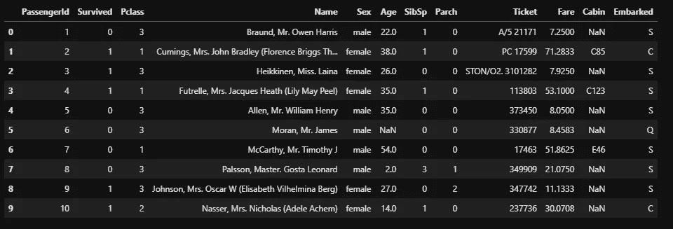
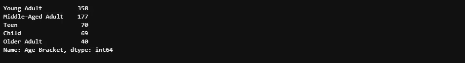
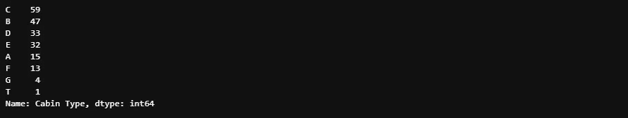
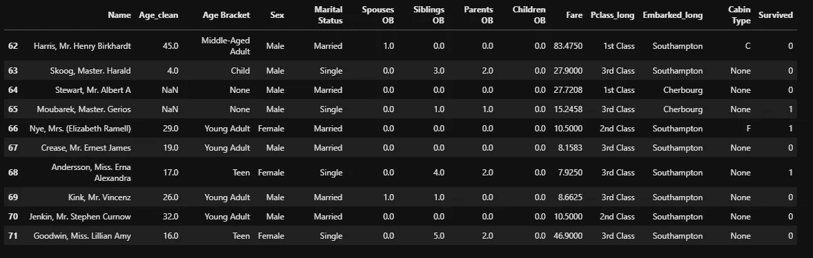
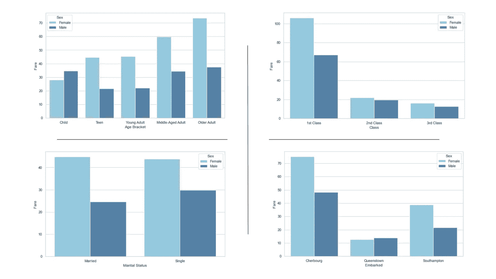
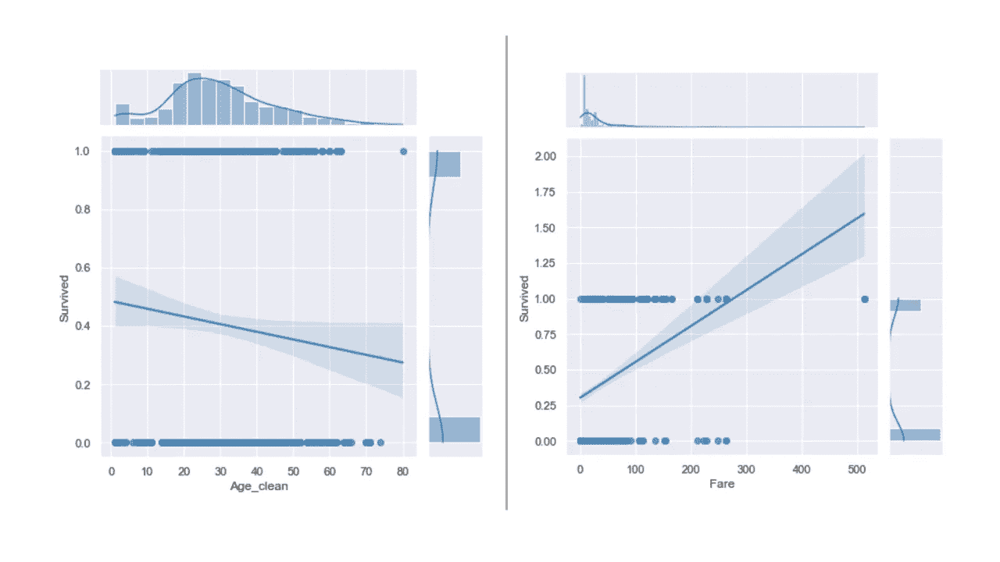
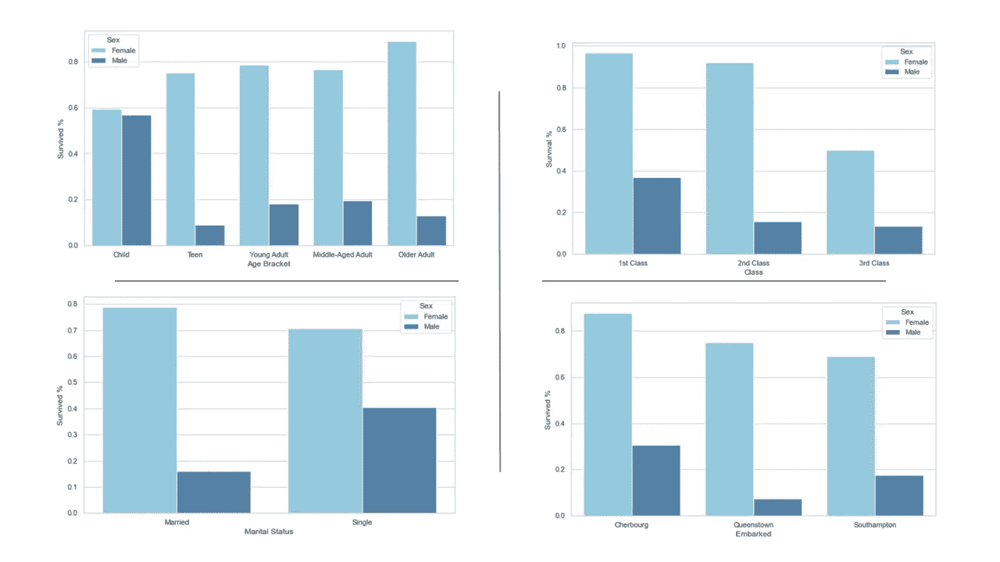
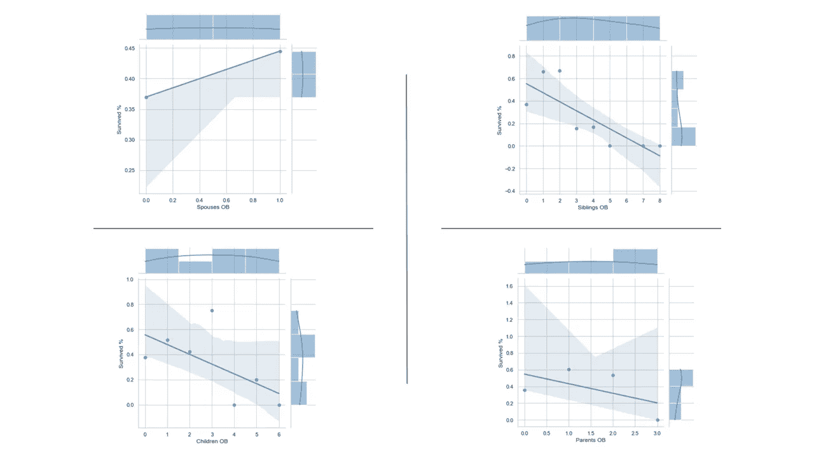

# 用熊猫和海豚探索泰坦尼克号隐藏的宝藏

> 原文：<https://medium.com/analytics-vidhya/exploring-the-hidden-treasures-of-titanic-using-pandas-and-seaborn-88123548c214?source=collection_archive---------0----------------------->

20 世纪初，当时最著名的两家航运公司——白星和丘纳德——相互竞争运送富有的旅客横渡大西洋。Cunard 通过引入两艘新船 Lusitania 和 Mauretania，打响了增加其市场份额的第一枪，这两艘船后来以创纪录的时间横渡大西洋而闻名。作为对 Cunard 这一举动的回应，White Star 决定建造三艘船，这三艘船将因其舒适性而非速度而在客户中为人所知，这是一个了解客户需求和竞争对手弱点并迎合这些具体情况的出色例子，而不是通过试图建造更快的船来击败 Cunard 来进行一场激烈的竞争。泰坦尼克号是白星在此期间建造的挑战丘纳德市场地位的三艘船之一。

1912 年 4 月 10 日，泰坦尼克号从英国南安普敦起航，开始了它的处女航，前往纽约，中途在法国瑟堡和爱尔兰皇后镇停留过两次。1912 年 4 月 15 日凌晨，在北大西洋纽芬兰海岸撞上一座冰山后，这艘号称“永不沉没”的泰坦尼克号沉入海底。

Kaggle 泰坦尼克号测试数据集包含 891 名乘客的虚拟数据，他们参加了这次宏伟而艰巨的航行。下面是数据集的快照，带有乘客级别提供的初始变量。“SibSp”为我们提供了船上兄弟姐妹或配偶的数量,“Parch”提供了每位乘客的父母或子女的数量。在进入特征工程之前，关于数据集要记住的一个有趣的事实是，假设没有一个乘客的情妇和未婚夫与他们的伴侣一起在飞机上。如果你想知道更多关于变量的信息，探索 Kaggle 提供的[数据字典](https://www.kaggle.com/c/titanic/data)。

数据清理和特征工程前的数据快照

# 数据清理

在深入研究数据集之前，我们采取了一些预防性的数据清理步骤，以便在分析的 EDA 阶段更容易处理数据集。数据清理主要包括将装载等级和港口的缩写词转换成单词，并将所有年龄转换成整数类型。执行后一项任务主要是因为数据集包含 1 岁以下乘客的分数值。

# 特征工程

## 年龄段

将年龄组引入数据集的目的仅仅是为了按年龄进行细分，以帮助在年龄的分类水平上探索数据。以下是分配任务后按类别划分的年龄。

按年龄段细分的年龄

## 客舱类型

在仔细检查作为每个乘客的客舱 id 提供的数据后，可以看到一种模式，即在数字前给出一个字母。这让我们相信船上有多种类型的船舱，每个首字母代表不同类型的船舱。以下是分配后的船舱明细。

按客舱类型细分的客舱

## 婚姻状况

尽管数据集没有提供每位乘客的婚姻状况，但名字中提供的瓦片结合一些合理的规则和假设，有助于将每位乘客分配到二元(“单身”或“已婚”)婚姻状况。流程中的规则和假设如下所示。除了名字中给出的瓦片，我们还认为每一个 18 岁以下的乘客都没有结婚(即使在标题上写着“先生”和“夫人”的情况下)

## 配偶和兄弟姐妹 OB

如前所述，一名乘客在整个旅程中只允许有一个伴侣。这意味着，每当一名已婚乘客在“SibSp”下有超过 1 个，就意味着该乘客在飞机上既有伴侣又有兄弟姐妹。如果一名单身乘客的“SibSp”值高于 0，则“SibSp”值直接给出了机上兄弟姐妹的数量。无论婚姻状况如何，在“SibSp”为“无”的情况下，配偶 OB 被分配为零。当乘客是单身时，以及当乘客是已婚的并且“SibSp”是 1 时，兄弟姐妹 OB 被分配为零。

## 父母和孩子 OB

与船上配偶和兄弟姐妹的分配相比，船上父母和子女人数的分配相当简单，原因有两个主要假设。在父母的情况下，我们假设已婚乘客不会带他们的父母一起去游轮(只是因为这真的不酷),而“ParCh”中给出的数字只是该乘客船上孩子的数量。在儿童的情况下，通过假设儿童不会由单独的乘客陪伴，做出了类似的假设。

在上述数据清理和特征工程之后，我们在探索性数据分析中留下了一个全面的数据集。如果你热衷于学习更多关于上面进行的特征工程的知识，看看这个我解释这个过程的视频。

数据清理和特征工程后的数据快照

# 探索性数据分析

## 票价

当我们观察船票票价在年龄、阶级、婚姻状况和装货港之间的分布时，我们可以看到，在大多数情况下，女性乘客比男性乘客被收取更多的费用。可以看出，女性乘客的票价随着年龄的增长而增长，然而，男性乘客的票价在青少年和年轻人中略有下降。正如预期的那样，这种公平分布在各个阶层，头等舱的乘客收费最高，而已婚和单身乘客之间几乎没有差别。根据费尔绘制的装船港地图显示，法国人被收取的费用最高，而爱尔兰人被收取的费用最低。

## 幸存

上面的两个图表告诉我们，乘客的生存概率与年龄呈负相关，与票价呈正相关。简而言之，如果你是泰坦尼克号上一名又老又穷的乘客，你上救生艇或抓住门不放的可能性非常小。

在所有类别中，女性乘客的生还几率都高于男性。女性的存活几率随着年龄的增长而增加，而男性的存活几率则最低。在所有等级中，头等舱的乘客生还几率最高。当生存机会与婚姻状况相对照时，已婚男性得分最低，而已婚女性得分最高。

上面的联合图告诉我们，和配偶一起上船的乘客有更高的生存机会。生存的机会随着船上兄弟姐妹的数量增加而增加，直到两个，然后急剧下降。存活率也随着船上儿童和父母的增加而降低。

既然我们已经在数据清理和特征工程的众多步骤之后探索了这些数据，我们的下一步将是通过使用这些数据来训练机器学习模型，并在给定新输入数据的情况下预测乘客的生存机会。最后但同样重要的是，利用从数据集收集的一些见解创建的迷因。

