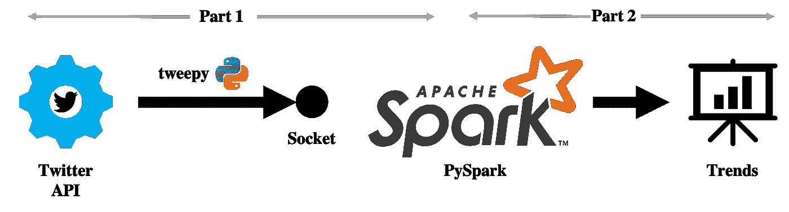
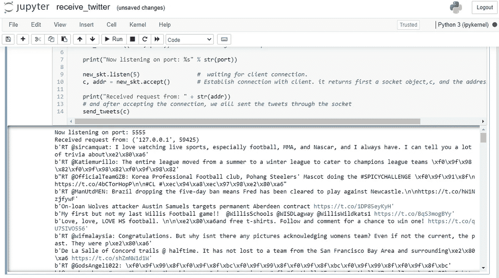
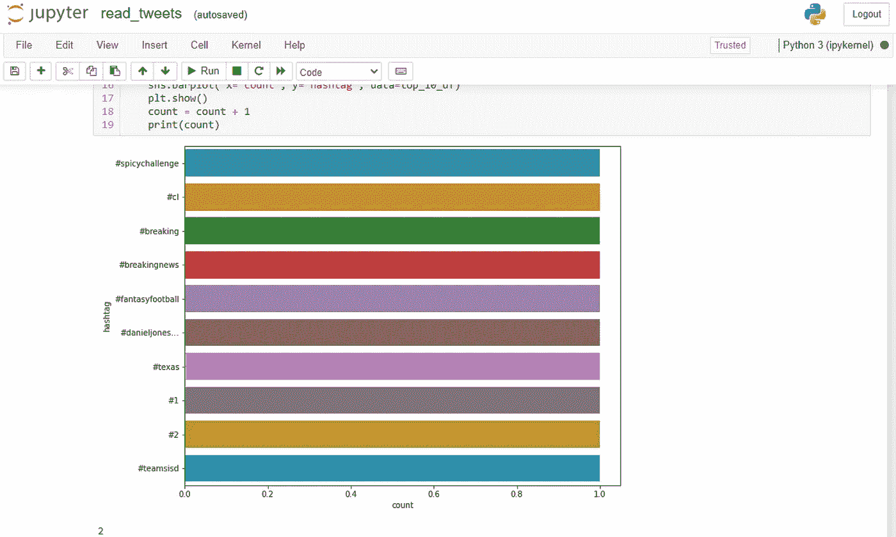

# 如何使用 Python 和 Spark 探索 Twitter 流数据

> 原文：<https://medium.com/analytics-vidhya/exploring-twitter-streaming-data-using-python-and-spark-3f4f189ec660?source=collection_archive---------0----------------------->

本教程探索了使用 Spark 和 Python 的 Twitter 流数据。

数据正以前所未有的速度生成，通过正确分析数据并在适当的时间提供有价值和有意义的见解，可以为一系列与数据相关的领域带来有价值的解决方案。从医疗保健和银行到媒体和零售，实时流数据被广泛应用于多个行业。例如，网飞提供根据个人喜好定制的实时推荐。类似于每一个传输大量数据并依赖各种分析的企业，亚马逊跟踪用户与其产品的互动，并及时推荐相关商品。

Apache Spark 是实时分析大量数据并对数据执行各种分析的有效框架。许多资源都在讨论 Spark 及其在大数据领域的受欢迎程度，但值得强调的是，它的核心特性包括使用弹性分布式数据集(RDDs)的实时大数据处理、流和机器学习。在本教程中，我们将演示如何将 Spark 流组件与 PySpark 结合使用来解决业务问题。

# 动机

当今社会，社交媒体的重要性不可否认。大多数企业从他们的 Twitter 追随者那里收集反馈，以便获得洞察力，更好地了解他们的客户。社交媒体反馈瞬息万变，实时分析反馈的能力对于任何企业的成功都至关重要。有几种方法可以发现人们对新产品、品牌或事件的反应。例如，通过关于特定主题、产品、品牌或事件的推文表达的情感可以提供对产品的意愿或信任程度的指示。因此，我们在教程中使用这个前提，每隔几分钟提取与我们想要的主题相关的趋势#标签，因为带标签的推文更有吸引力。

# 履行

我们将使用 Tweepy 访问 Twitter 的流 API，使用 TCP socket 访问 Spark 流组件来接收 tweets。我们将在 RDD 上发布推文，然后检索最受欢迎的标签。之后，我们使用 Spark SQL 将顶部的散列表保存到一个临时数据库中。最后，我们使用 Python 的可视化工具将结果可视化。

下图展示了我们程序的整体架构。

**端到端架构**

本教程有两个部分。

## 第 1 部分:从 Twitter API 检索 Tweets

*第一步:导入必要的包*

我们将使用 tweepy(一个连接到 Twitter API 的 Python 模块)以及 Stream、StreamListener 和 OAuthHandler 来构建 receive_tweets.py 中的数据流管道。为了处理 json 对象，我们需要 json 模块。

*第二步:插入 Twitter 开发者证书*

插入您的 Twitter 开发人员帐户的凭据。要获得凭证，您必须首先创建一个 [Twitter 开发者帐户](https://developer.twitter.com/en/apply-for-access)，然后从开发门户请求凭证。

*第三步:创建一个 StreamListener 实例*

TweetListener 表示 StreamListener 的一个实例，它连接到 Twitter API，一次返回一条 tweet。一旦我们激活了流，实例就会自动创建。

TweetsListener 类包含三个方法:on_data、if_error 和 __init__。on_data 方法检索传入 tweet 的 json 文件，其中包含一条 tweet，并确定 tweet 的哪些部分应该保留。例如，一条推文的信息、评论或标签都可以作为例子。If_error 确保流工作，并且 __init__ 设置 Twitter API 的套接字。

*第四步:从 Twitter 发送数据*

为了从 Twitter API 中检索数据，我们必须首先使用预定义的凭证来验证我们的连接。认证之后，我们将包含指定关键字和语言的 tweet 数据对象进行流式传输。TweetListener 将 tweets 作为对象返回。

*第五步:开始流媒体播放*

从 Twitter API 流式传输数据需要在本地机器(服务器)上预先定义的本地 IP 地址和端口上创建一个侦听 TCP 套接字。一个套接字由一个服务器端(我们的本地机器)和一个客户端(Twitter API)组成。服务器端的开放套接字监听来自客户端的连接。当客户端启动并运行时，套接字将根据 StreamListener 实例中定义的主题或关键字从 Twitter API 接收数据。

## 第 2 部分:Tweets 预处理和寻找趋势#标签

*第一步:导入必要的包*

在第二部分中，我们将使用 findspark 库在本地机器上定位 Spark，然后从 pySpark 导入必要的包。

我们的教程使用 Spark 结构化流，这是一个基于 Spark SQL 的流处理引擎，为此我们导入了 pyspark.sql 模块。

*步骤 2:启动 SparkContext*

我们现在启动 SparkContext。SparkContext 是所有 spark 函数的入口点。当我们运行任何 Spark 应用程序时，都会运行一个驱动程序，它充当主函数，SparkContext 在这里被初始化。SparkContexts 表示一个到 Spark 集群的连接，可用于在该集群上创建 rdd、累加器和广播变量。这里，SparkContext 使用 Py4J 启动一个 JVM 并生成一个 JavaSparkContext。在任何给定时间，只能有一个 SparkContext 处于活动状态。然后，我们以 10 秒的间隔启动 StreamingContext()，这意味着在流式传输过程中，输入流将每 10 秒被分成几批。

接下来，我们将分配流输入源，然后在行中设置传入数据。

我们使用我们在第一部分中指定的相同端口号(5555)来发送推文，并且我们使用相同的 IP 地址，因为我们在本地运行应用程序。我们还使用 window()函数来确定我们每分钟(60 秒)都在分析推文，以确定哪些是前 10 #标签。上图说明了 Spark 的 window()函数是如何操作的。

现在我们已经完成了所有的先决条件，让我们看看如何清理以#开头的 tweet，并将前 10 条 tweet 保存在一个临时 SQL 表中。

为了保存标签的数量，我们创建了一个 namedtuple 对象。然后，我们使用 flatmap()生成一组标记化的 tweets。我们使用 lambda 函数，因为它们需要更少的内存，运行更快。然后我们过滤不以#开头的推文。pySpark 中的 foreachRDD()函数是一个重要的函数，可以更快地处理 RDD。它应用于每个 RDD，将其转换为数据帧，然后存储在一个名为“tweets”的临时表中。

我们现在可以运行 **receive-tweets.py** ，之后我们可以通过运行 **read_tweets.py** 开始流式传输。

注意:我们必须在运行 **receive-tweets.py** 后等待几分钟，以确保我们有足够的 tweets 来处理。

推文流

接下来，我们导入我们的可视化库，并绘制与“足球”主题相关的前 10 个#标签的图表。出于学习目的，我们每分钟运行一次流，只检查前 10 个#标签几次，您可以看到#标签并不经常改变，但如果您想看到更好的结果，您可以让它运行更长时间:

结果如下:

足球话题中的十大热门标签

恭喜你。你成功了！代码在我的 [**GitHub**](https://github.com/muhammadnaumanshahid/twitter_streaming_data) 有。

注:这两部分都是使用 Jupyter 笔记本进行的。您可以在 GitHub 上找到本教程中使用的 Java、Python、Spark 和 Winutils 的版本。

# 关键途径

这是 Apache Spark 的流组件如何工作的一个简单例子。总有更复杂的方法将同一方法应用于不同类型的输入流，例如来自 YouTube 或 Amazon(媒体、零售)等热门网站的用户交互数据。Apache Spark 的另一个用例是股票市场，在这里，实时传输大量数据和运行各种分析对股票经纪公司至关重要。

# 最后的想法

在本教程中，我们利用 Spark 和 Python 来识别足球话题中的趋势#标签。如果你愿意，你可以改变关键词，搜索与你感兴趣的话题相关的推文。尝试不同的关键字，并获得一些洞察力！

> 感谢阅读！如果你喜欢这首曲子，快速👏对我来说意味着一切。订阅我的个人资料，随时了解最新动态，不要犹豫发表评论或联系我们。快乐阅读！