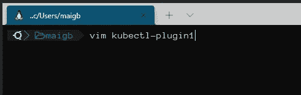

# 扩展您的 Kubernetes 环境

> 原文：<https://medium.com/analytics-vidhya/extend-your-kubernetes-environment-90d8a1435dd8?source=collection_archive---------7----------------------->

这很简单，也很有帮助。

来源:https://buddy.works/blog/introducing-kubectl

> 关键: **kubectl** +你的想象力

例如，我们创建了一个名为 kubectl-plugin 1 的文件

重要！Kubectl 插件需要有 3 个要求:

*   可执行的
*   位置:系统的路径。
*   文件名以 **kubectl-** 开头

在文件中，我们写道:

我们分配执行权限

如果我们执行创建的文件，我们将获得以下结果:

看起来很简单，不是吗？但是现在外挂有什么用呢？

假设我们想要创建一个特权容器。我们不仅要写与服务器相关的内容。此外，我们需要安装卷，等等，这是一个累人的任务。有了这个插件(它是一个 Bash 脚本),我们可以简单地用一个命令来完成它，并且我们将在 1 分钟内组装好一个容器，随时可以使用。

 [## 主 kvaps 上的 ku bectl-node-shell/ku bectl-node _ shell/ku bectl-node-shell

### 此时您不能执行该操作。您已使用另一个标签页或窗口登录。您已在另一个选项卡中注销，或者…

github.com](https://github.com/kvaps/kubectl-node-shell/blob/master/kubectl-node_shell) 

来源:[**kvaps**](https://github.com/kvaps)**/**[**kubectl-node-shell**](https://github.com/kvaps/kubectl-node-shell)

它很容易使用:

插件非常好。但是从中获得一个重要的好处真的很难，它只会让我们在令人疲惫的任务上优化时间。

我们可以用一个简单的命令创建插件来查看秘密、部署、副本、改变上下文等(这肯定会节省我们的时间)。