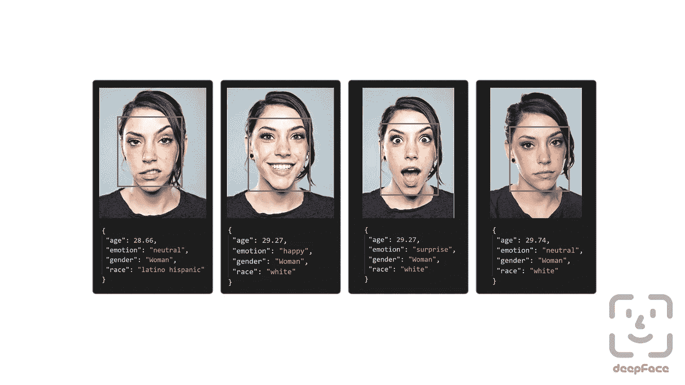
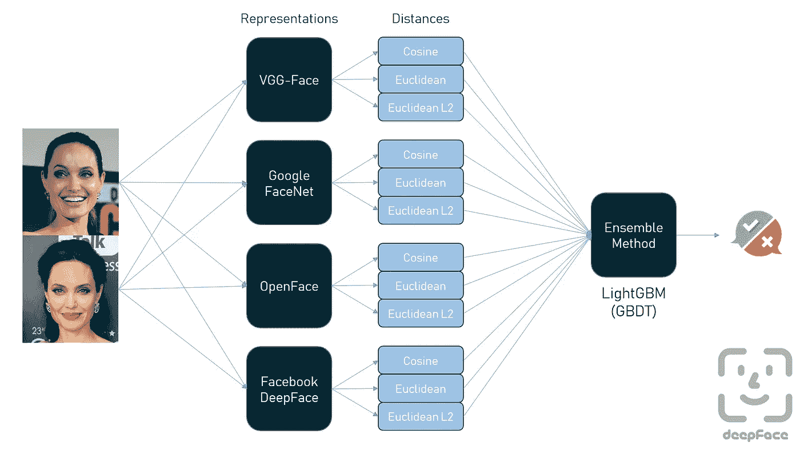
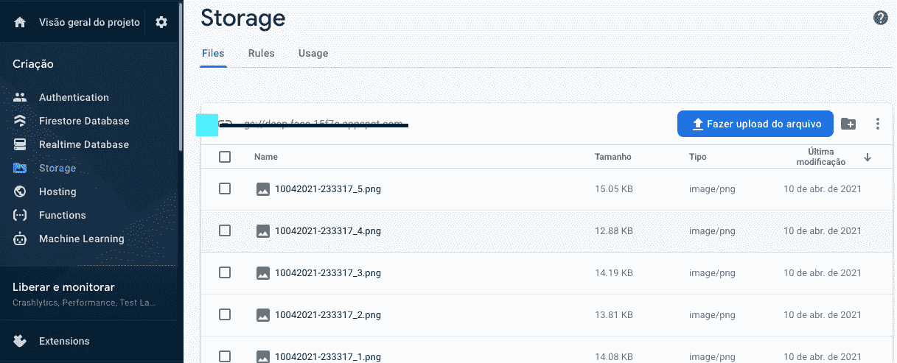
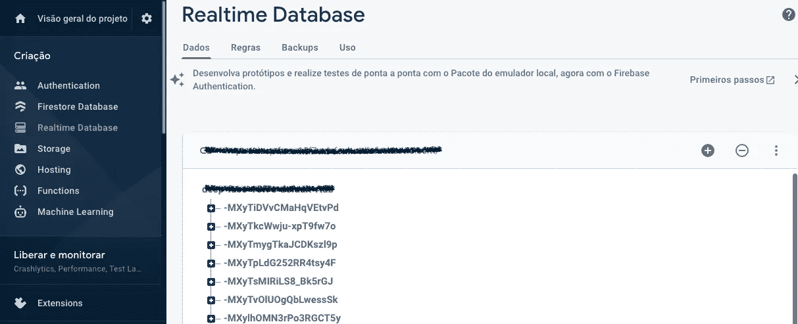

# 从图像中提取和存储数据

> 原文：<https://medium.com/analytics-vidhya/extract-and-store-data-from-images-c2737c860428?source=collection_archive---------14----------------------->


在这篇文章中，我们使用 firebase 来存储我们为应用程序收集的数据，如性别、年龄和每次检测的主导情绪。

在讨论之前，请观看下面的视频，了解我们使用 streamlit | python 和 firebase 部署应用程序的结果。

# 情感识别

在 18 世纪和 19 世纪的 T2，人们普遍相信面部表情揭示了一个人的道德价值或真实的内心状态，在西方世界，T4 相面术是一门受人尊敬的科学。从 19 世纪早期开始，照相术被用于面部特征和面部表情的相面分析，以检测精神错乱和痴呆。在 20 世纪 60 年代和 70 年代，心理学家重新发明了对人类情绪及其表达的研究，他们试图定义对事件的情绪反应的正常范围。[【160】](https://en.wikipedia.org/wiki/Facial_recognition_system#cite_note-160)自 20 世纪 70 年代以来，对自动化[情感识别](https://en.wikipedia.org/wiki/Emotion_recognition)的研究一直集中在[面部表情](https://en.wikipedia.org/wiki/Facial_expression)和[言语](https://en.wikipedia.org/wiki/Speech)上，这被认为是人类与他人交流[情感](https://en.wikipedia.org/wiki/Emotions)的两种最重要的方式。在 20 世纪 70 年代，建立了面部动作编码系统(FACS)，用于情感的身体表达的分类。它的开发者保罗·艾克曼坚持认为有六种情感是全人类共有的，并且可以用面部表情来编码。[【162】](https://en.wikipedia.org/wiki/Facial_recognition_system#cite_note-162)在过去的几十年里，对自动情感特定表情识别的研究集中在人脸的正面图像上。[【163】](https://en.wikipedia.org/wiki/Facial_recognition_system#cite_note-163)



## 人脸检测器

> 人脸检测和对齐是现代人脸识别管道的早期阶段。`[OpenCV](https://sefiks.com/2020/02/23/face-alignment-for-face-recognition-in-python-within-opencv/)`、`[SSD](https://sefiks.com/2020/08/25/deep-face-detection-with-opencv-in-python/)`、`[Dlib](https://sefiks.com/2020/07/11/face-recognition-with-dlib-in-python/)`和`[MTCNN](https://sefiks.com/2020/09/09/deep-face-detection-with-mtcnn-in-python/)`方法被包装在 deepface 中作为检测器。您可以选择将自定义检测器传递给 deepface 接口中的函数。MTCNN 是默认的检测器，如果你不会通过任何检测器。

来源:[https://github.com/serengil/deepface](https://github.com/serengil/deepface)

```
backends = ['opencv', 'ssd', 'dlib', 'mtcnn']for backend in backends:

  demography = DeepFace.analyze("img4.jpg", detector_backend =             backend)
```



# 储存；储备

> Firebase 实时数据库是一个云托管的数据库。数据存储为 JSON，并实时同步到每个连接的客户端。当您使用我们的 iOS、Android 和 JavaScript SDKs 构建跨平台应用时，您的所有客户端共享一个实时数据库实例，并自动接收最新数据的更新。

来源:[https://firebase.google.com/docs/database](https://firebase.google.com/docs/database)


# 储存；储备

存储服务允许你上传图片到 Firebase。

# 儿童

就像使用数据库服务一样，您可以使用存储服务构建数据路径。

```
storage.child("images/example.jpg")
```



存储 Firebase 服务(捕获的文件)

# 保存数据

## 推

要用一个惟一的、自动生成的、基于时间戳的键保存数据，请使用`push()`方法。

```
data = {"name": "Mortimer 'Morty' Smith"}
db.child("users").push(data)
```



实时数据库防火墙服务(来自图像的数据)