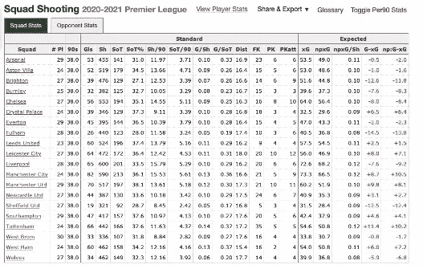

# 以零 R 经验提取 R 中的足球数据

> 原文：<https://medium.com/analytics-vidhya/extract-football-soccer-data-in-r-with-zero-r-experience-bee36287ad37?source=collection_archive---------2----------------------->


结合 R、worldfootballR 和 RStudio 分析足球数据

# 介绍

你是否发现你对足球的热爱和好奇汇聚到了这样一个点，你想要挖掘一点数据，以确认你的眼睛所看到的是否确实是正在发生的事情，但你只是不知道如何开始，或从哪里获得数据？或者你可能已经开始在可视化软件中做一些分析，包括 PowerBI、Tableau、Excel 等，或者对统计学有足够的了解，想要进行一些统计建模，但你只需要知道如何更快、更容易地访问更多数据？那么这个帖子就是给你的。

这篇文章将有望教你如何使用`worldfootballR`——一个 R 包，用于帮助从一些流行的网站(在他们同意的情况下)提取世界足球数据。

本文将演示如何使用该包以编程方式提取数据，并将其保存为适合您的报告的文件格式，省去了您从下面列出的流行网站提取数据的手动步骤。

此外，如果你愿意花时间学习 R，我还将展示 R 中可用的可视化工具。

这篇文章的最后一个目的是强调对于那些 R 编程新手来说，R 中有什么是可能的，希望它能激起足够的兴趣，让你开始 R 学习之旅。

这篇文章不会是一篇深入的如何编写 R 代码的文章——有大量的在线资源，包括 MOOCs、文章、视频等等。这篇文章将关注如何让你的手里或屏幕上的数据运行起来。

## 能得到什么数据？

版本为 0.3.2 的软件包提供了对来自以下数据站点的数据的访问:

*   FBref.com(一大堆要分析的数据，包括结果、比赛数据、赛季数据、球员和球队数据等)；
*   Transfermarkt.com(球员市值、球队转会历史、球员转会历史)；而且，
*   Understat.com(大联盟比赛的拍摄地点数据)

这三个站点是世界各地的分析师经常使用的，但是软件包在不断发展，将来可能会包括来自其他站点的数据。

据我所知，只有 FBref 提供了将数据导出到文件的能力——其他两个都没有，所以您需要找到一些其他方法来获取数据(极其缓慢的复制和粘贴),这就是`worldfootballR`的用武之地。

## 先决条件

这个职位的唯一先决条件是你有一台电脑，互联网连接和分析世界足球数据的愿望。这篇文章旨在让任何没有 R 编码经验的有抱负的分析师能够使用`worldfootballR` R 库以编程方式提取数据。

## 什么是 R /为什么我要用 R？

来自 R 官方网站([https://www.r-project.org/about.html](https://www.r-project.org/about.html))；

> *R 是一种统计计算和图形的语言和环境。*

随着您对主页上的语言越来越有经验，您可以找到更多关于 R 的信息，但是现在您需要知道的是，R 将是您的工具箱中的另一个工具，用于执行您想要做的分析。R 是一个令人惊叹的编程框架，它允许你做很多事情，包括数据清理、执行统计分析和建模，以及使用 R 编程语言构建完全可定制的可视化。

重要的是，任何被编程的东西都意味着它是可重复的。预先设置您的代码，然后简单地重新运行它以获得一致的结果。

如果你有学习的动力，世界是你的。

# 安装 R 和 RStudio

第一部分将详细介绍安装 R 和 RStudio 所需的步骤，然后您可以开始使用`worldfootballR`提取数据。

## 入门指南

好了，在我们开始之前，有几件事…这是用外行的术语来说的(因为我自己就是个外行)。r 是引擎，是驱动您想做的一切的编码语言，RStudio 是漂亮的图形用户界面(GUI 读作“gooey”)，当您在其中编写代码时，它会为您提供额外的功能。在这篇文章中，我打算建议同时安装 R 和 RStudio，但是如果你不想要 RStudio(我建议你使用 RStudio)，你仍然可以运行代码来获得你需要的数据(这里我假设一切都是在 RStudio 中完成的)。

## 安装 R

你记得我说过我是个门外汉吗？它会延伸到这里。我们将安装 R，并使用所有默认选项(只需继续点击“*接受*”或“*同意*”，或“*继续*”，直到 R 成功安装为止)。当你更精通 R 时，你可以定制安装，但是现在，只给我看数据！

所以你问怎么找 R 安装 R？嗯，你必须在谷歌上输入一些非常复杂的东西…“*下载 r windows* ”或者在 Mac OS 上…是的，你猜对了，“下载 r mac ”。


如果你不想这么做，这里有一些链接:

*   对于 Windows 操作系统:[https://cran.r-project.org/bin/windows/base/](https://cran.r-project.org/bin/windows/base/)

选择“下载 R X.X.X for Windows”，其中“X.X.X”表示最新版本的 R:


*   对于苹果操作系统:[https://cran.r-project.org/bin/macosx/](https://cran.r-project.org/bin/macosx/)

根据您运行的 Mac OS 的版本，将决定安装哪个版本，但一般来说，这只是下面突出显示的选项之一:


一旦你选择了 Windows 或 Mac OS 版本，就像安装任何软件一样安装，记住我在本节开始时的一个特殊规则…默认选项。

## 现在是 RStudio

一旦安装了 R，我们现在就可以继续安装 RStudio，记住，它是一个 GUI，允许您编码并提供附加功能。

回到我们复杂的谷歌搜索查询…“*下载 rstudio* ”，并选择第一个结果:


或者为网址:[https://www.rstudio.com/products/rstudio/download/](https://www.rstudio.com/products/rstudio/download/)

打开页面后，我们会看到几个定价选项，但如果你像几乎所有的业余分析师一样(说实话，即使是专业分析师)，你可能只需要免费版:


## 我们(几乎)准备好开始编码了！

好了，我们几乎已经准备好开始编码了，但是首先我们将对 RStudio 进行一点浏览(再次提醒那些已经忘记的人，RStudio 是我们键入和执行 R 代码的软件)。


控制台窗格是我们能够看到我们的代码运行的地方(或者如果我们不使用脚本，在这里运行我们的代码)，是否有任何“错误”或“警告”和打印输出。

环境是我们将看到我们已经导入或创建的对象的部分，包括数据框(想象类似于 Excel 表的东西)。

在“查看器”窗格中，有几个选项卡，包括能够浏览文件系统(“文件”选项卡)、我们创建的任何可视化(“绘图”选项卡)、我们已经加载到我们的机器上并且“本地”可供我们使用的库/包(“包”选项卡)、帮助部分，在那里我们可以获得提供工作功能所需的其他详细信息，以及查看 HTML 输出的“查看器”选项卡。

## 现在我们准备开始编码了

打开一个 R 脚本(有许多不同的选择来编码，但是. R 脚本是最好的开始。

要打开一个脚本，您可以在 Windows 机器上按`control+shift+n`，或者在 Mac 上按`command+shift+n`，或者您可以通过左上角的下拉菜单选择一个新的脚本:


像这样更改布局:


我们将在左上角开始编写代码。

# 世界足球

现在我们在这里，准备好开始编码了吗？我们还有一件事要掩盖。什么是`[worldfootballR](https://jaseziv.github.io/worldfootballR/)`？

`worldfootballR`是一个由帮助从流行足球网站提取数据的函数组成的包。

我知道你在想什么——什么是函数？？

来自[数据营](https://www.datacamp.com/community/tutorials/functions-in-r-a-tutorial)

> *在编程中，你使用函数来合并你想重复使用的指令集，或者，由于它们的复杂性，最好是包含在子程序中，并在需要时调用。函数是为执行特定任务而编写的一段代码；它可以接受也可以不接受自变量或参数，它可以也可以不返回一个或多个值。*

非常清楚，对吗？你所需要知道的就是`worldfootballR`已经用一行又一行的代码来提取数据，并从本质上将其压缩成一行(对你来说更重要的是，你没有网络搜集知识)。

例如，您想从 FBref.com 获取特定匹配的匹配摘要信息，而不是学习 R 编程和 web 抓取来编写以下代码:


您需要做的就是运行这行代码:

```
**get_match_summary**(match_url)
```

好了，现在我想我们已经准备好开始编写代码，以你需要的形式提取和保存数据。

## 编写代码

在我完全了解代码的具体细节之前，我只想向您介绍一些资源。

已经为`worldfootballR`包创建了一个网站，它将为您提供所有可用函数的完整运行，以及您需要传递给这些函数以获得所需数据的参数。网站可以在[这里](https://jaseziv.github.io/worldfootballR/)找到。

现在我们可以真正开始写代码了。

正如我们已经建立的，包包含函数(做某事的代码)。要使用这些软件包，首先需要安装它们(下载到我们的笔记本电脑上)。

包通常(但不限于)存放在 CRAN(所有包的中央存储库)或 GitHub 上。`worldfootballR`位于 GitHub 上，因此安装该软件包的说明与 CRAN 上的软件包略有不同。在我们可以安装`worldfootballR`之前，我们需要安装`devtools`包来启用`worldfootballR`的安装。我们还将安装另一个包，`xlsx`，它将使我们能够保存文件。xlsx '格式。

当我们第一次使用 R **或**时，我们将这些代码行输入(只是复制和粘贴)到我们的 R 脚本中。当我们更新 R **或**的版本时，包更新了它的功能:

```
*# to allow us to install packages from github:*
install.packages("devtools")*# a meta package that contains packages for data cleaning, analysis and visualisation*
install.packages("tidyverse")*# to save xlsx files*
install.packages("xlsx")
```

如果没有错误消息，并且您可以在控制台部分看到“>”符号和闪烁的光标，您就知道他们已经成功安装。


然后我们将安装`worldfootballR`(这就是我们在这里的目的)并且重要的是加载库——仅仅安装包是不够的，我们需要加载它以使函数在我们当前的会话中容易使用。

**注意:**我们只需要在第一次安装 R **或**时安装软件包，如果我们更新了 R 的版本，如果有更新版本的软件包，就安装**或**。

```
devtools::install_github("JaseZiv/worldfootballR", **ref** = "main")
```

**注 2:** 虽然我们只需要很少安装它，但是每次我们想要使用这个包的时候，我们都需要加载这个包**。**

```
**library**(worldfootballR)
```

## 你可随心所欲了

`worldfootballR`中有许多函数可以让你得到你需要的所有数据。

要找到这些函数，您可以访问软件包网站上的参考页面[这里](https://jaseziv.github.io/worldfootballR/reference/index.html)。参考页面将为您提供该功能的简要概述—要了解更多详细信息，请单击该功能，它会将您带到功能页面。

此外，网站上还有每个收集数据的站点的说明和示例代码:

*   点击[此处](https://jaseziv.github.io/worldfootballR/articles/extract-fbref-data.html)获取 **FBref** 数据
*   点击[此处](https://jaseziv.github.io/worldfootballR/articles/extract-transfermarkt-data.html)查看 **Transfermarkt** 数据
*   点击[此处](https://jaseziv.github.io/worldfootballR/articles/extract-understat-data.html)查看**了解**数据

## 让我们得到一些数据

现在是有趣的部分——获取数据！

在我们开始之前，在下面的代码中，当我们在文本开头看到一个“#”时，那是一个注释，而不是可执行代码，这是 R 程序员给自己或使用代码的其他人写注释的方式，以给出正在做的事情的概述。

在每个脚本的开始，最好的做法是在分析中包含您将要使用/需要的所有包。安装包只需要在您第一次开始使用 R 时，安装新版本或 R 时，或者当包的新版本可用并且您想要已经创建的更新时进行。

我们将运行的代码如下。需要记住的几件事:

1.  要“运行”我们打出的代码，有两种主要方法；

a.突出显示您想要运行的代码，并在 MacOS 上按`control+enter`或`command+enter`

b.将光标放在您想要运行的行上，并在 MacOS 上按下`control+enter`或`command+enter`

2.脚本中的“#”表示注释，我将在代码中使用它们来告诉您我们在做什么

## 我要拍摄数据！

假设我们想从 FBref 获得 2020-2021 EPL 赛季球队的射门数据，以便能够分析一支球队进了多少球，或者他们的表现如何超出预期(xG)，或者他们的平均射门距离:



资料来源:FB ref[https://fbref.com/en/comps/9/Premier-League-Stats](https://fbref.com/en/comps/9/Premier-League-Stats)

然后我们运行特定的代码从 FBref.com 中提取拍摄数据:

这是现在 R 中的数据:


## 我只想要数据，不要别的

如果您想要的只是 csv 或 Excel 输出(用于其他软件/框架)，那么下面几行代码将满足您的需求:

这是我们输出的样子，这个输出可以输入到我们选择使用的任何可视化软件中:


## 但是 R 能提供更多，对吗？

r 不仅仅是一个提取和保存数据的工具。

我们可以用代码创建完全可定制的可视化来分析我们的数据。这种灵活性意味着你的创造力只会受到你练习、学习、练习、学习的欲望的限制。

下面，我们根据本赛季的预期目标绘制了一个团队的表现。在终点线以上的球队比 xG 队进了更多的球，而在虚线以下的球队得分更少。


我们还可以使用 R 中的`cor()`函数来计算 xG 与预期目标的相关程度，我们看到打印出来的结果是 0.8805275——高度相关表示团队得分非常接近预期:

## 请提供更多数据

FBref.com 是一个伟大的网站，让分析师前所未有地访问他们的数据，包括手动提取到 csv 的能力。当您只需要一个提取时，这是非常好的，但是当有多个提取时，这将变得非常耗时！已经为这些创建了函数，官方的`[worldfootballR](https://jaseziv.github.io/worldfootballR/)` [站点](https://jaseziv.github.io/worldfootballR/)会带你一起去。

其他的，像 Transfermarkt.com 和 Understat.com 没有给你导出到文件的能力。`worldfootballR`也是来帮忙的！

首先我们会得到数据:

然后我们将它保存到文件:

最后，我们还将创建一个可视化:


# 结论

希望你已经走了这么远！

我们已经浏览了`worldfootballR`包的概述，该包旨在帮助您从流行的足球数据网站中提取足球数据，我们已经安装了 R 和 RStudio，我们已经开始使用 worldfootballR 提取数据，我们已经将数据保存在其中任何一个中。xlsx 或者。csv，我们已经看到了一些简短的统计分析，我们还使用`dplyr`(准备好我们的数据)和`ggplot`的混合创建了一些可视化。

希望这已经激发了你的兴趣，让你有可能使用 R 和`worldfootballR`！

如果您有任何问题或反馈，请随时发表评论，或在 twitter [jaseziv](https://twitter.com/jaseziv) 上联系。

这篇文章最初出现在“不要责怪数据”博客上，可以在这里找到。

## 资源

*   `[worldfootballR](https://jaseziv.github.io/worldfootballR/)`
*   [FBref](https://fbref.com/en/)
*   [理解](https://understat.com/)
*   [转移市场](https://www.transfermarkt.com/)
*   一组非常有价值的 R 软件包，用于操作、分析和可视化数据