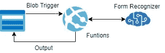

# 从 pdf 中提取表格并保存

> 原文：<https://medium.com/analytics-vidhya/extract-tables-from-pdf-and-save-86b7e1170607?source=collection_archive---------7----------------------->

# 使用表单识别器—认知服务

从 pdf 中提取表格和文本信息并保存回存储器。使用 Azure 函数实现自动化和扩展。

# 体系结构



# 步伐

*   创建 Azure 帐户
*   创建存储帐户
*   创建 pdfinput 容器
*   创建 pdfoutput 容器
*   创建表单识别器
*   创建函数

# 细节

*   创建输入容器
*   将输入容器设为 blob 类型
*   未启用 Cors
*   创建输出容器
*   打开 Visual Studio 代码
*   安装 Azure 功能扩展
*   安装 C#
*   创建新的功能应用程序
*   选择 Blob 触发器并提供 pdfinput 作为容器名称
*   选择。net 3.0
*   为存储选择存储帐户
*   安装 Azure。来自 Nuget 的 AI.FormRecognizer
*   现在编写代码来读取 blob pdf 并提取表格信息

```
using System;
using System.IO;
using Microsoft.Azure.WebJobs;
using Microsoft.Azure.WebJobs.Host;
using Microsoft.Extensions.Logging;

using Azure;
using Azure.AI.FormRecognizer;  
using Azure.AI.FormRecognizer.Models;
using Azure.AI.FormRecognizer.Training;

using System.Collections.Generic;
using System.Threading.Tasks;
using System.Text;

namespace formprocessing.Function
{
    public static class BlobTriggerCSharp1
    {
        private static readonly string endpoint = "https://cogacctname.cognitiveservices.azure.com/";
        private static readonly string apiKey = "xxxxxxxxxxxxxxxxxxxxxxxxxxxxxxxxx";
        private static readonly AzureKeyCredential credential = new AzureKeyCredential(apiKey);

        [FunctionName("BlobTriggerCSharp1")]
        public async static void Run([BlobTrigger("pdfinputpython/{name}", Connection = "cogstorage_STORAGE")]Stream myBlob, [Blob("pdfoutput/{name}", FileAccess.Write)] Stream outputcsv, string name, ILogger log)
        {
            log.LogInformation($"C# Blob trigger function Processed blob\n Name:{name} \n Size: {myBlob.Length} Bytes");
            var credential = new AzureKeyCredential(apiKey);
            var client = new FormRecognizerClient(new Uri(endpoint), credential);
            string completeuri = "https://cushwakestorage.blob.core.windows.net/pdfinputpython/" + name; 

            Uri formUri = new Uri(completeuri);

            //Response<FormPageCollection> response = client.StartRecognizeContentFromUri(formUri);
            Response<FormPageCollection> response = await client.StartRecognizeContentFromUriAsync(formUri).WaitForCompletionAsync();
            //response.Wait();
            FormPageCollection formPages = response.Value;

            foreach (FormPage page in formPages)
            {
                Console.WriteLine($"Form Page {page.PageNumber} has {page.Lines.Count} lines.");

                /*
                for (int i = 0; i < page.Lines.Count; i++)
                {
                    FormLine line = page.Lines[i];
                    Console.WriteLine($"  Line {i} has {line.Words.Count} {(line.Words.Count == 1 ? "word" : "words")}, and text: '{line.Text}'.");

                    if (line.Appearance != null)
                    {
                        // Check the style and style confidence to see if text is handwritten.
                        // Note that value '0.8' is used as an example.
                        if (line.Appearance.Style.Name == TextStyleName.Handwriting && line.Appearance.Style.Confidence > 0.8)
                        {
                            Console.WriteLine("The text is handwritten");
                        }
                    }

                    Console.WriteLine("    Its bounding box is:");
                    Console.WriteLine($"    Upper left => X: {line.BoundingBox[0].X}, Y= {line.BoundingBox[0].Y}");
                    Console.WriteLine($"    Upper right => X: {line.BoundingBox[1].X}, Y= {line.BoundingBox[1].Y}");
                    Console.WriteLine($"    Lower right => X: {line.BoundingBox[2].X}, Y= {line.BoundingBox[2].Y}");
                    Console.WriteLine($"    Lower left => X: {line.BoundingBox[3].X}, Y= {line.BoundingBox[3].Y}");
                }
                */

                for (int i = 0; i < page.Tables.Count; i++)
                {
                    StringBuilder sb = new StringBuilder();
                    FormTable table = page.Tables[i];
                    Console.WriteLine($"  Table {i} has {table.RowCount} rows and {table.ColumnCount} columns.");
                    string line = "";
                    foreach (FormTableCell cell in table.Cells)
                    {
                        if(cell.ColumnIndex >= (table.ColumnCount - 1))
                        {
                            line = line.TrimEnd(',');
                            sb.AppendLine(line);
                            line = "";
                        }
                        //Console.WriteLine($"    Cell ({cell.RowIndex}, {cell.ColumnIndex}) contains text: '{cell.Text}'.");
                        line += cell.Text + ",";
                    }
                    //sb.AppendLine(line);
                    Console.WriteLine("Table Output : " + sb.ToString());
                }

                /*
                for (int i = 0; i < page.SelectionMarks.Count; i++)
                {
                    FormSelectionMark selectionMark = page.SelectionMarks[i];
                    Console.WriteLine($"  Selection Mark {i} is {selectionMark.State}.");
                    Console.WriteLine("    Its bounding box is:");
                    Console.WriteLine($"      Upper left => X: {selectionMark.BoundingBox[0].X}, Y= {selectionMark.BoundingBox[0].Y}");
                    Console.WriteLine($"      Upper right => X: {selectionMark.BoundingBox[1].X}, Y= {selectionMark.BoundingBox[1].Y}");
                    Console.WriteLine($"      Lower right => X: {selectionMark.BoundingBox[2].X}, Y= {selectionMark.BoundingBox[2].Y}");
                    Console.WriteLine($"      Lower left => X: {selectionMark.BoundingBox[3].X}, Y= {selectionMark.BoundingBox[3].Y}");
                }
                */
            }

            log.LogInformation($"Completed function Processed blob\n Name:{name} \n Size: {myBlob.Length} Bytes");

        }

    }
}
```

*   按 F5 运行代码
*   将 pdf 上传到 pdf 输入容器
*   查看控制台日志中的输出。

*最初发表于*[*【https://github.com】*](https://github.com/balakreshnan/Samples2021/blob/main/AzureAI/formProcessing.md)*。*