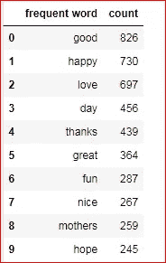
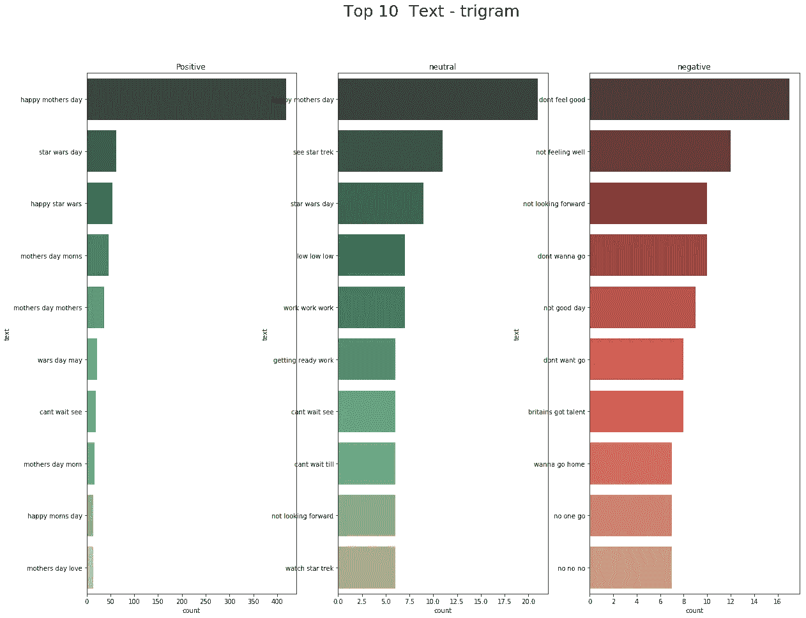
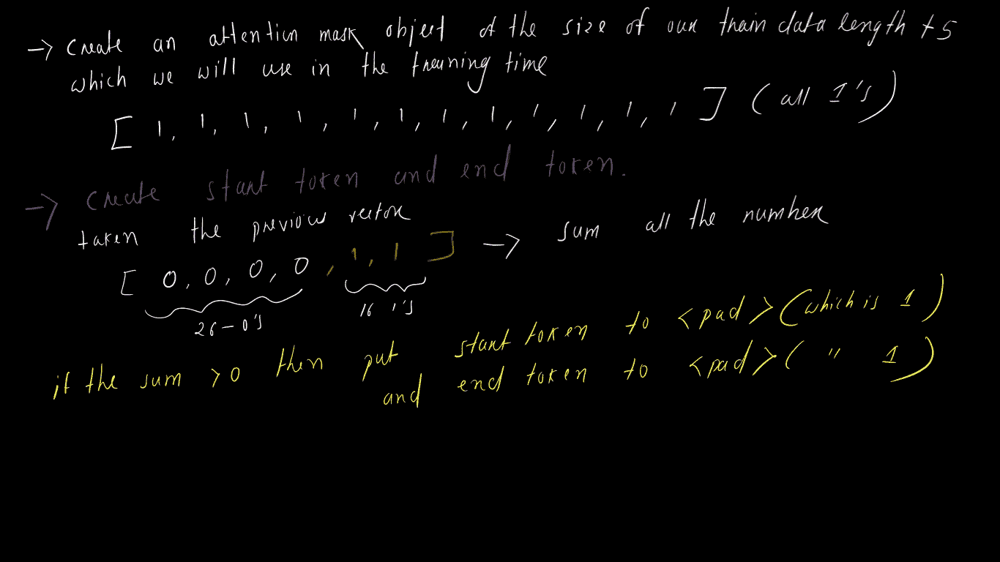
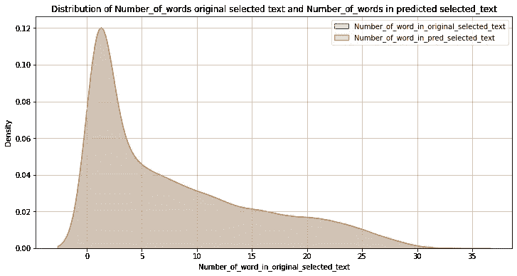

# 从句子中提取正确的短语

> 原文：<https://medium.com/analytics-vidhya/extract-the-right-phrase-from-sentence-29aa5f8b9182?source=collection_archive---------7----------------------->

使用深度学习的自然语言处理项目


这对我来说是一个非常独特的项目。因为，在这里我需要从一个句子中提取基于某种情感的短语。以前我在那些项目中工作，在那里我只需要给定一些数据来预测情绪，但在这个项目中，有一个除了整个任务。让我们了解整个项目…

# **1。我正在解决的业务问题是什么:**

这是我们首先应该自问的。因为我们可以实现我们的目标。

由于每一秒钟都有推文流传，很难判断特定推文背后的情绪是否会因为病毒式传播(积极)而影响一家公司或一个人的品牌，或者因为它表现出负面情绪而破坏利润。在这个决策和反应在几秒钟内被创造和更新的时代，用语言捕捉情感是很重要的。但是，哪些词却导致感情描写呢

> **这个案例研究是关于捕捉一条推文背后的情感或意义。**

## **1.1:现在我们来谈谈我要解决的机器学习问题:**

我们需要挑选出反映情绪的那部分推文(单词或短语)。

示例:

下面是一条推文:“**我老板欺负我** …”

推文的情绪是:**“负面”**

定义这是一条负面推文的词语:**“欺负我**”(这是我们想要在这个案例研究中找到的东西)

## **1.2:现在的问题是这是哪种 ML 问题(分类还是回归还是别的)？**

目标很清楚/简单:给定一个文本和情感，我们必须预测所选的文本(文本中的一个单词或短语)。

回答像是什么样的问题(分类回归)这样的问题？—这有点难以回答，但我会说这是一项分类任务，但方式不同(因为我们必须对文本的短语进行分类)

## **1.3:我们在哪里可以找到数据:**

我们可以很容易地从 kaggle re 得到数据的链接:

[https://www.kaggle.com/c/tweet-sentiment-extraction](https://www.kaggle.com/c/tweet-sentiment-extraction)

## **1.4:在开始之前，最好考虑一下目标和限制:**

*   没有低延迟要求(但应该合理)
*   可解释性很重要(但这很困难，因为我们将致力于深度学习模型，但我们可以通过对我们的 ml 模型进行事后分析来做到这一点)
*   它应该尽可能多地从文本中选择正确的短语
*   另一件事，我们需要看看每分钟有多少句子

## **1.5:对于给定的任务，我的 KPI(关键绩效指标)应该是多少:**

由于这是 kaggle 上的一场比赛，他们选择了 Jaccard 相似性作为他们的 KPI，从我的角度来看，这是我们应该关心的正确指标。

**Jaccard Score** 是两个集合相似/不相似程度的度量。分数越高，两个字符串越相似。其思想是找出普通令牌的数量，并将其除以唯一令牌的总数。它用数学术语来表达，


来源:[https://www . ka ggle . com/parulpandey/EDA-and-pre-conditioning-for-Bert](https://www.kaggle.com/parulpandey/eda-and-preprocessing-for-bert)


来源:[https://www . ka ggle . com/parulpandey/EDA-and-pre-conditioning-for-Bert](https://www.kaggle.com/parulpandey/eda-and-preprocessing-for-bert)

## **1.6:解决这个问题的现有方法有哪些:**

人们尝试了各种变压器模型来获得最佳结果，如 distillbert、Roberta 等

## **1.7:我对这个问题的处理方式:**

我在这个项目中所做的不是直接跳到大型/复杂的模型。

我从最简单的模型到复杂的模型，只是为了了解机器学习/深度学习模型如何表现并给我结果。

# **2。探索性数据分析**

**EDA 不仅仅是绘制不同种类的图形，也不仅仅是为了好看**。它是关于我们能从数据中得到什么东西，或者更准确地说 ***我们能从我们的数据中得到什么信息*** (这应该是我们的重点)。

导入必要的库:

## 2.1:读取数据和基本统计数据


*   在上面，我所做的是-我读取训练和测试数据，然后显示训练数据(4 行)
*   在训练数据 text_ID 中有 4 个字段，实际文本、选定文本、特定文本的情感


*   例如，测试数据只包含 3 个字段 textID、实际文本、给定文本的情感

输出:

```
shape of the training data :  (27481, 4)
Number of data points in the train data :  27481
Number of feature in the train data :  4
```

输出:

```
shape of the test data :  (3534, 3)
Number of data points in the test data :  3534
Number of feature in the test data :  3
```

输出:

```
<class 'pandas.core.frame.DataFrame'>
RangeIndex: 27481 entries, 0 to 27480
Data columns (total 4 columns):
textID           27481 non-null object
text             27480 non-null object
selected_text    27480 non-null object
sentiment        27481 non-null object
dtypes: object(4)
memory usage: 858.9+ KB
```

```
<class 'pandas.core.frame.DataFrame'>
RangeIndex: 3534 entries, 0 to 3533
Data columns (total 3 columns):
textID       3534 non-null object
text         3534 non-null object
sentiment    3534 non-null object
dtypes: object(3)
memory usage: 82.9+ KB
```

## 观察:

*   我们有 2 种类型数据训练和测试数据，其中存在 27481 个训练和 3534 个测试数据点，存在 4 个训练和 3 个测试特征。
*   在测试数据中，缺少一个特征，即所选文本(文本子集)，因此我们必须预测所选文本。(**选中的文本列是我们的目标列**)
*   训练数据中存在一个缺失值，我们将在清理部分将其删除

## 2.2:基于情感的文本分发


## 观察:

*   分布不均匀
*   基于情感的文本在训练数据中的分布是:中性的(40.5%)，正面的(28.3%)，负面的(31.2%)
*   基于情感的文本在测试数据中的分布有:中性(40.5%)、正面(31.2%)、负面(28.3%)
*   另一件事是训练数据阳性占 28.3 %，而测试数据阴性占 28.3%，反之亦然。

## 2.3:检查重复值和空值

```
(27481, 4)
         textID text selected_text sentiment
314  fdb77c3752  NaN           NaN   neutral
Empty DataFrame
Columns: [textID, text, selected_text, sentiment]
Index: []
```

## 观察:

存在一个丢失的值，该值已被删除。

## 3.4 数据清理

*   转换为小写
*   删除方括号中的文本
*   删除链接，
*   删除标点符号
*   删除包含数字的单词

## 2.5:发现新的分析特征

*   文本和选定数据中的单词长度
*   单词长度的差异(文本和所选数据)


## 2.6:基于单词差异的绘图

***文本中的字数分布和选定文本中的字数分布***


## 观察:

*   我们得到了两个右偏的图。
*   正如我们所看到的，文本的长度大于选定的文本，这是显而易见的，因为选定的文本是文本的子集
*   类似地，在相当好区域中有一些重叠

***2.7:+ve 和-ve 与中性的分布(文字与选定文字的区别)***

## 观察:

*   我无法解释阿沃比的情节。
*   在零处有一个峰值，因为在中性情绪的所有情况下，文本和所选文本的差异几乎为零。
*   让我们只画+ve 和-ve 的单词差


## 观察:

*   两个图向右倾斜
*   除了这里和那里有一些小的间隙之外，两幅图几乎相互重叠。
*   从上面的图中，我看不出+ve 和-ve 情绪之间有什么不同

## 2.8:小提琴的字差情节


## 观察:

*   这里需要分析的信息量也较少

## 2.8 字差方框图


## 观察:

*   除了中间值之外，正负方框图看起来是一样的
*   从这个图中我们也找不到+ve 和-ve 点的任何区别

# 2.9:词频(让我们建立一个词云) :


## 观察:

*   如果你观察积极的词云，一些词出现得更好，有趣，爱，母亲，伟大，令人惊叹，这些都是积极的推文的迹象
*   在负面的推文中，我们会发现不要，不能，想念，悲伤，生病，糟糕等等
*   在中性词中有混合的词，有时看起来像否定词，有时像肯定词，但不能只根据词来判断，我们必须看句子。
*   让我们看看这些单词出现了多少次

# 2.10:最常用词:

```
most frequent word in positive sentiment (text)
```


```
most frequent word in positive sentiment (selected text)
```



```
most frequent word in negative sentiment (text)
```


```
most frequent word in negative sentiment (selected_text)
```


```
most frequent word in neutral sentiment (text)
```


```
most frequent word in neutral sentiment (selected_text)
```


## 观察:

*   像“好，妈妈，快乐，太好了，谢谢”这样的词越来越多地出现在积极的推特上
*   不，悲伤，难过，生病，憎恨更多地发生在消极情绪上

# 2.11:推文中的唯一单词(选定文本)

正面数据:


负面数据:


## 观察:

*   我们在这里表演的是 tweets 中出现的一些独特的单词
*   在积极情绪中，祝贺、感谢、爱等词比消极情绪中疼痛、悲伤、憎恨、软弱等词出现得更多。

# 2.12:捕获多个单词:



## 观察:

*   在这里，我画了 n_gram 图，表示一个以上的单词
*   如果你观察两克和三克，我们会得到一些-ve 和+ve tweet 的感觉
*   像在肯定句中，像“快乐”、“一天”、“母亲”这样的词出现的频率更高，而在否定句中,“不”、“不”、“憎恨”出现的频率更高。

# 3.机器学习模型/深度学习模型

在这一节中，我尝试了不同类型的深度学习模型(为了便于阅读，我不会在这里发布源代码。以下是完整源代码的链接:

[](https://github.com/Jitendra-Dash/Extracting-Phrase-From-Sentence) [## jitendra-Dash/从句子中提取短语

### 它是一个基于 NLP GitHub 的深度学习项目，是超过 5000 万开发人员的家园，他们一起工作来托管和…

github.com](https://github.com/Jitendra-Dash/Extracting-Phrase-From-Sentence) 

# 3.1:基线模型:

> *基线模型应该简单，这样，如果出现任何错误，我们可以很容易地检测到，并且在将来我们可以与其他模型进行比较*

基线模型是一个简单的双向 LSTM。在进入模型的架构之前，我想讨论一下我们的文本数据的预处理工作:

*   *记住你如何给模型输入数据将会影响你的模型，在某些情况下，这可能会给你分析模型带来麻烦，特别是在深度学习中*

在我讨论的所有技术下面，我已经写了代码，请检查我的 github repo。

## 文本预处理

*   获取数据并将其分成训练、测试和验证数据(这是机器学习中不可忘记的重要一步)
*   通过删除@、#、&、转换小写、删除链接、删除 null、nan 等来清理数据
*   为那些既在文本中又在选定文本中的单词创建<tok>,并将它们作为目标文本。</tok>

**例如:**

正文:神作业**压力大**！但是它的结尾…

选文:**压力大**

目标正文:神作业有 **< tok >** ！但是已经结束了…

## 标记化

1.  从训练数据中提取所有单词。
2.  创建一个 tensorflow.keras tokenizer 的对象(这里我将最大字数设为 54k)。现在，将它与我们现有的所有单词相匹配(参考步骤 1)。
3.  这里我将句子(或向量)的最大长度设为 35。
4.  现在调用 tokenizer 的对象和一个函数“texts_to_sequences()”，并传递将给出向量的训练数据。
5.  在 vocab(令牌)中，分配给一个数的字。像这样[[(' <tok>'，1)，(' I '，2)，(' to '，3)，(' the '，4)，(' a '，5)，(' my '，6)]的 dict 格式。我故意给了<tok>1。</tok></tok>
6.  现在填充向量到我们的最大长度(35)。
7.  对测试数据重复步骤 4 和 5。
8.  让我们来看看目标数据，在<tok>出现的地方放 1，在任何地方放 0。</tok>

*   我举个例子:

假设这句话是:**神作业压力大！但是它的结尾……**

这里的目标词是**“有压力的”**

现在我们是这样创建目标的:神分配是<tok>！但是已经结束了…</tok>

我把<tok>放在充满压力的地方</tok>

向量会是这样的— [0，0，0，1，0，0，0，0，0，0，0，0……0]

**用预定义的手套模型嵌入单词**

单词嵌入的作用是让意思相似的单词有相似的表示。这里我们得到一个给定单词的向量(实值),它可以从预定义的向量空间中得到(我使用了 glove vector)。

*   首先从这个网站下载手套矢量:【https://nlp.stanford.edu/projects/glove/ 
*   为手套向量创建一个对象
*   使用我们为 glove vector 创建的对象创建一个字典，我们将在其中存储单词和特定单词的矢量表示。
*   现在堆叠所有的向量，得到平均值和标准偏差，使用大小为(32515，300)的向量创建一个矩阵
*   现在调用字典(我们在第 3 步中创建的)，获取单词和向量，并将其映射到矩阵(我们在第 4 步中创建的)
*   现在我们有了嵌入的单词和相应的向量

**掩盖损失**

为什么我们需要掩盖我们的损失？

因为我们在填充零(记住我们的最大长度= 35)，在计算损失时，我们必须在预测中删除这些填充的零。

1.  首先创建一个 loss 对象，这里我创建了 BinaryCrossEntropy。将其命名为“ **loss_function**
2.  现在创建一个函数，我们将在其中传递 loss 对象。命名为“ **maskedLoss**
3.  首先让我们得到一个目标值的二进制表示，就像这样，我们称它为“**掩码**


4.调用我们创建的 **loss_function** (步骤 1)并传递 y_train 和 y_pred

5.现在我们得到了损失张量，用我们在第三步中用损失张量创建的对象做一个类型转换。命名为“ **mask_type_cast**

看起来会是这样的— [0。0.0.1… 0.0.0.]

6.现在乘以损失

7.现在求所有值的平均值

8.归还损失

这是代码

## 双 LSTM 建筑

这是简单的架构(作为我们的基线模型)


现在用 adam optimizer 训练模型。让我们看看准确性和损失，它是如何表现的


通过查看上面的精度图，可能会有轻微的过度拟合。损失给了我们一个好的形状(随着列车损失的减少，测试损失也在减少)

现在让我们看看我们关心的 jaccard 分数:

**训练数据的 Jaccard 得分**:0.5842960053101587
**验证数据的 Jaccard 得分**:0.5536536536

好吧！！！看起来不错，但我想知道我们在积极情绪、消极情绪和中性情绪方面的 jaccard 得分是多少。

**阳性数据点的 Jaccard 评分:**

```
Jac train sccore =  0.3086811397909643
Jac valid sccore =  0.33709575637410566
```

**Jaccard 分数为负分**

```
Jac train sccore =  0.3322021538329059
Jac valid sccore =  0.358989438053781
```

**Jaccard 对中性点的评分:**

```
Jac train sccore =  0.8252107927755609
Jac valid sccore =  0.8593473997409419
```

好吧！！！！我们得到了一些不错的 jaccard 分数，但我们可以提高它。让我们建立另一个模型。

# 3.2:注意力模型

为了引起注意，我们还将做记号化，并应用填充。

在目标值中，我所做的不是给 0 填充值，而是给

-1 到填充值

0 表示那些不是<tok>的单词</tok>

1 到那些值是

像这样[-1，-1，-1，-1，-1，-1，-1，-1，-1，-1，-1，-1，-1，-1，-1，-1，-1，-1，-1，-1，-1，-1，0，0，0，0，0，0，0，0，0，1，1]

现在，我们将遵循与基线模型相同的步骤

我刚刚在基线模型上添加了一个关注层，然后添加了一些删除和层标准化，这样我们就不会过度拟合。

## 注意力模型的架构:


让我们看看准确性和损失


它看起来像模型是过度拟合。添加图层归一化和去除后。让我们看看 jaccard 的分数

```
Jaccard score for train data =  0.5895125412375438
Jaccard score for validation data =  0.5827399630028105
```

注意力层 jaccard 得分与基线模型有点相同

让我们看看积极、消极和中性数据点 jaccard 得分:

**Jacrad 正面数据点得分:**

```
Jac train sccore =  0.2848550415162455
Jac valid sccore =  0.30991278847885434
```

**Jacrad 负数据点得分:**

```
Jac train sccore =  0.3074721686328846
Jac valid sccore =  0.3312753654139326
```

**Jacrad 对中性数据点的评分:**

```
Jac train sccore =  0.7168542910565285
Jac valid sccore =  0.7384339042299354
```

# 3.3 变压器罗伯塔

## 标记化

首先，你需要安装拥抱脸变压器

*！pip 安装变压器*

*   取句子的最大长度为 96(我们也可以取 128)
*   创建一个字节级记号赋予器，这个记号赋予器有“id，type _ ids，tokens，offsets，attention_mask，special_tokens_mask，overflowing”。

字节级 BPE 记号赋予器做了一些类似子词记号赋予器的事情，它将一个单词分解成两个单词，例如:更快可以更快

*   创建一个字典，其中我们将给出一些独特的编码值，以肯定，否定和中立。这将有助于我们在预处理阶段定义开始和标记。

情操 _id = { '正面':1313，'负面':2430，'中性':7974}

*   现在让我们看看我们的记号赋予器是如何工作的


我所做的是将“**这是我的第一个深度学习项目**”这句话编码，并解码以检查它是否有效。

## 文本预处理(编码)(训练数据)，注意屏蔽，定义开始和结束标记

这里我用一个例子解释了这种预处理技术



## 模型结构


现在，当我们拟合/训练我们的模型时，我们必须给出

*   编码文本
*   注意力屏蔽
*   开始令牌
*   结束令牌
*   令牌类型 id

现在训练模型

**验证数据的 Jaccard 得分:** 0.7045

这是我们得到的最好的 Jaccard 分数。现在让我们检查一下每个情绪的得分。

**阳性数据点的 Jacrad 得分:** 0.5661

**Jacrad 负数据点得分:** 0.572

**Jacrad 中性数据点得分:** 0.974

好吧，好吧，我们得到了相当不错的 jaccard 分数，为每一个情绪。但是我想到了一个问题

***为什么负数据点在每个模型中都得到很高的 jaccard 评分？？？***

如果你仔细观察，训练文本数据 **的**长度等于训练选择文本**的** **长度，那么对比正负数据点来分类中性点**是一件**容易的事情。这就是为什么 jaccard 的中性点得分在每款车型中都很高**

# 所有模型分数


# 事后分析

在这一部分中，我将进行事后分析，我们将查看我们的**模型失败的地方**

1.  让我们看看**原始选择文本和预测选择文本的分布**


**观察:——**我们可以看到上面两个分布并不相同，但理想情况下应该是相同的，因为一个是另一个的预测。

**2。让我们检查原始选定文本中的字数和预测选定文本中的字数**


**观察**

*   有 **4955 行**存在原始选定文本和预测选定文本字长不相同的情况。
*   如果这两列(预测和原始的)的字长不相同，则导致较低的 jaccard 分数
*   在某些情况下，模型预测与所选文本相同，但(在预测中)存在少量导致 jaccard 得分较低的额外单词。
*   我们可以看到分布图，在大多数情况下，原始选定文本的单词长度比预测的选定文本包含更多的单词。，这导致低 jaccard 分数

**3。让我们检查一下原始选定文本中的差异字数和预测选定文本中的字数**



*   我们可以看到原始选择的文本和预测的选择的文本完全重叠(8738 个这样的数据点出现在字长不同的地方)
*   在文本长度没有差异的情况下，jaccard 得分也很高。

## **未来工作**

在这里，我处理了推特上的数据，人们在谈论不同种类的事情，没有固定的东西。我们未来可以做的是，我们可以选择一个特定的领域，在那里我们可以检索客户的评论，并从中我们可以根据我们试图捕捉的那些情绪给他们情绪，如果人们不喜欢(-ve review)某些东西，那么我们可以找到使用这种方法(我们在这个项目中使用的方法)背后的原因，反之亦然。

# 我的 github 和 Linkedin 个人资料

[](https://github.com/Jitendra-Dash/Extracting-Phrase-From-Sentence) [## jitendra-Dash/从句子中提取短语

### 这是一个基于自然语言处理的深度学习项目。通过…为 Jitendra-Dash/从句子中提取短语开发做出贡献

github.com](https://github.com/Jitendra-Dash/Extracting-Phrase-From-Sentence) [](https://www.linkedin.com/in/jitendra-dash-0738a616b/) [## Jitendra Dash -博客作者-分析 Vidhya | LinkedIn

### 查看 Jitendra Dash 在全球最大的职业社区 LinkedIn 上的个人资料。Jitendra 有 2 个工作列在…

www.linkedin.com](https://www.linkedin.com/in/jitendra-dash-0738a616b/) 

## **参考文献:**

*   [https://www . ka ggle . com/tanulsingh 077/Twitter-opinion-extaction-analysis-EDA-and-model](https://www.kaggle.com/tanulsingh077/twitter-sentiment-extaction-analysis-eda-and-model)
*   [https://www . ka ggle . com/tanulsingh 077/Twitter-情操-提取-分析-EDA-and-模型](https://www.kaggle.com/tanulsingh077/twitter-sentiment-extaction-analysis-eda-and-model)
*   【https://www.kaggle.com/raenish/tweet-sentiment-insight-eda 
*   [https://www . ka ggle . com/parulpandey/EDA-and-预处理-for-bert#4。-文本数据预处理](https://www.kaggle.com/parulpandey/eda-and-preprocessing-for-bert#4.-Text-Data-Preprocessing)
*   [https://www.kaggle.com/cdeotte/tensorflow-roberta-0-705](https://www.kaggle.com/cdeotte/tensorflow-roberta-0-705)
*   [https://www.kaggle.com/al0kharba/tensorflow-roberta-0-712](https://www.kaggle.com/al0kharba/tensorflow-roberta-0-712)
*   AAIC

谢谢你