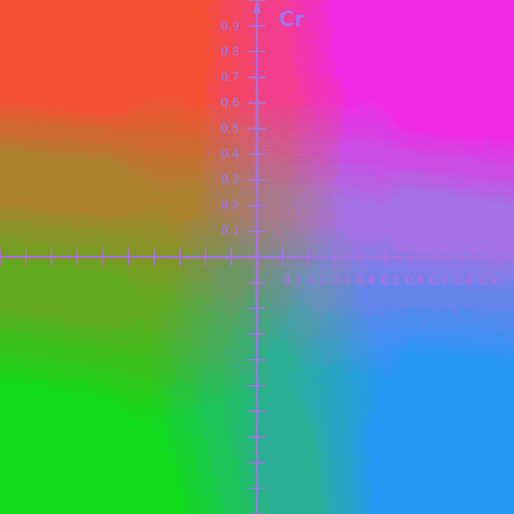
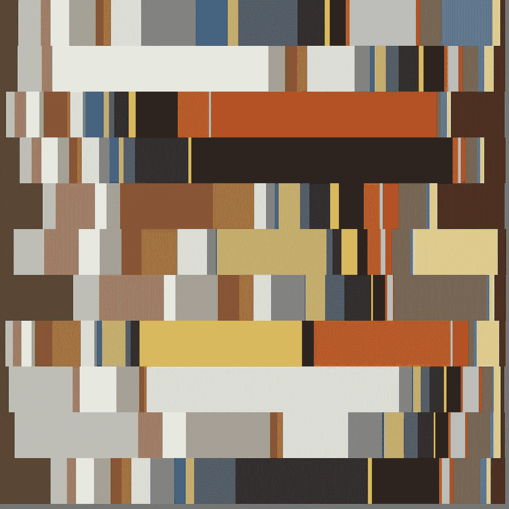
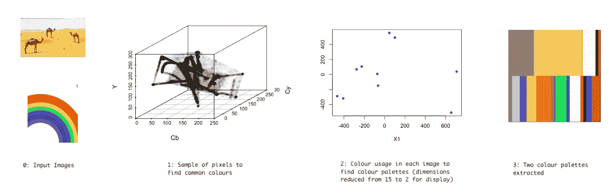

# 利用无监督学习提取调色板

> 原文：<https://medium.com/analytics-vidhya/extracting-colour-palettes-with-unsupervised-learning-4399d5ca820c?source=collection_archive---------22----------------------->

## 链式聚类的颜色组合分析

原始图形

在最近的一个项目中，我需要找到一种方法来确定艺术作品的大数据集中存在哪些调色板，最好是没有我自己的任何输入！这项任务与无监督聚类技术相一致，可以分为两个步骤:

1.  提取常见的颜色。
2.  提取这些颜色的常见组合。

这两者都可以通过 K-Means 聚类来实现，K-Means 聚类只是通过点和聚类中心之间的距离来对点进行聚类。

# 1.提取常用的颜色。

为了有效地使用 K-means 来提取颜色组合，重要的是使颜色数据点之间的欧几里德距离可被解释为颜色的感知差异。简单地使用图像的红绿蓝(RGB)通道作为三维向量在这方面做得相当差，因为 RGB 空间中的距离不能很好地转化为感知差异。

为了克服这一点，图像被转换到 YCbCr 色彩空间，Y、Cb、Cr 通道形成三维向量来表示每种颜色。这个颜色空间中的距离在表现感知颜色的差异方面做得更好。

YCbCr 色彩空间，Y 轴贯穿屏幕，代表亮度

在将加载的数据集转换为 YCbCr 并提取大量随机像素样本后，具有 *n* 个聚类的 K-means 将提取 *n* 个常用颜色作为聚类中心。因为这些中心标记了颜色簇的平均值，所以如果使用的簇数量不足，产生的颜色会相当柔和。根据经验，我发现 20 到 40 个集群会产生好的结果。

# 2.提取这些颜色的常见组合。

一旦找到了共同的颜色，我们就想找出这些颜色通常是以什么样的组合和比例使用的。

这可以通过从每幅图像中提取固定的像素样本并查看每个像素属于哪个颜色簇来完成。这些分组可以按图像聚合为每种颜色的计数，并存储为表示每幅图像中颜色使用的 n 维向量。以这种方式使用计数可以捕捉每种颜色的比例和存在。因为所有这些图像向量具有相同的和，所以这些图像表示位于超平面上，该超平面以像素样本的大小与所有轴相交。

然后可以将 K-means 应用于这些计数向量，以提取之前发现的颜色的常见组合和比例，其中 *m* 个聚类中心产生 *m* 个不同的调色板。

m=11 个调色板，n=22 种不同的颜色。原始图形

该系统可以通过提供一个数据集来测试，该数据集代表来自两种非常不同的调色板分布的图像——明亮的彩虹和朴实的甜点。将颜色的数量设置为保守的 15，调色板的数量为 2，我们可以看到不同的调色板是如何通过这两个步骤提取出来的。

原始图形