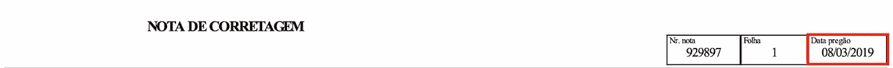
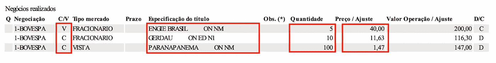
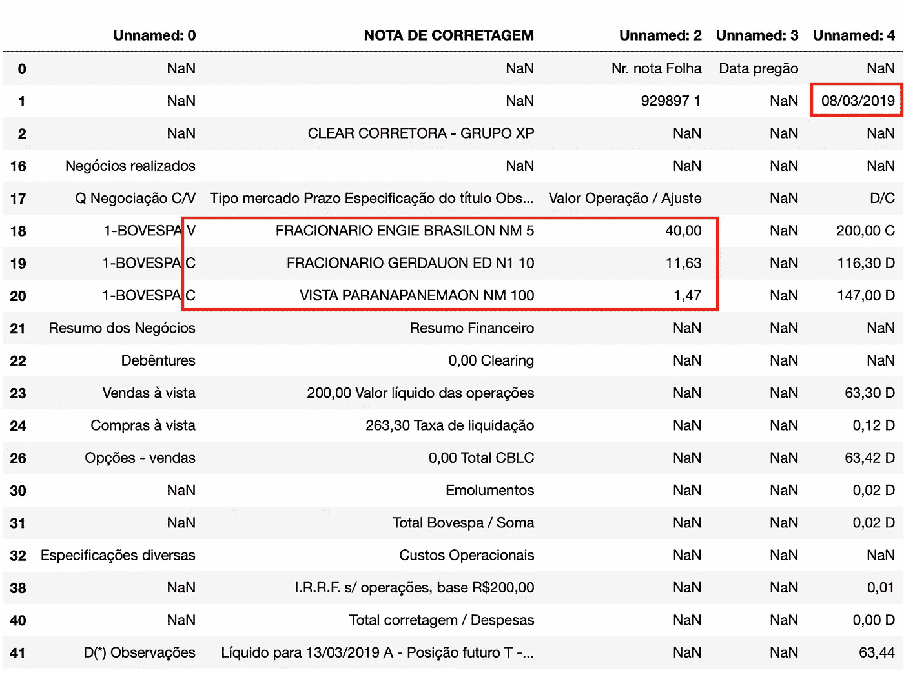
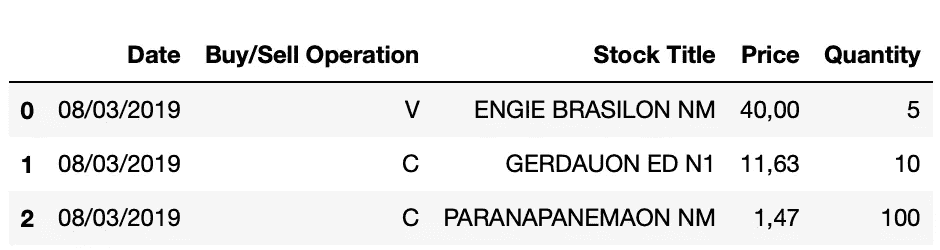

# 使用 Python 从经纪记录中提取数据

> 原文：<https://medium.com/analytics-vidhya/extracting-data-from-brokerage-notes-using-python-dc30b561299?source=collection_archive---------15----------------------->

如何使用 Tabula，Pandas 和 Regex 以 PDF 格式从您的经纪记录中提取信息，并将其保存到 Excel 文件中。


[由 stories / Freepik 设计](http://freepik.com)

券商票据是你在股票市场上议价时，券商生成的文件。通常，它在您每天进行交易时生成，并以 PDF 格式发送给您(或包含在您的经纪人门户帐户中)。这些记录包括所有关于你谈判的项目的信息，如价格、数量和费用。这些是分析和控制你的投资组合以及申报税收的重要信息。

当您只有一些笔记时，复制您需要的信息并将其粘贴到工作表中是一项简单的任务。然而，当您操作许多天时，从所有笔记中复制和粘贴可能是一项耗时的任务。除了我对自动化和开发新技能的兴趣之外，这也是我从事这个项目的最大动机之一。

这个项目的目标是从 PDF 格式的证券交易记录中获取必要的信息，并将其保存到工作表中，这样可以更容易地进行处理。我使用了 Clear(一家巴西经纪商)的经纪票据，进行了三次股票谈判操作。

以下是我们从 PDF 文件中获得的信息摘要:

*   交易记录的日期；
*   每笔交易的买入/卖出操作；
*   股票名称；
*   每股股票的价格；
*   谈判的股票数量。



我们可以在经纪凭证的顶部找到议付日期。



在操作表中，我们可以找到它是买/卖，股票名称，数量和价格。

如果你对这个项目的全部代码感兴趣，请查看我的 [GitHub](https://github.com/hugoplm/brokerage-note/blob/main/Extracting_Brokerage_Note.ipynb) 。

# 1.使用 Tabula 阅读 PDF 文件

为了从 PDF 文件中读取数据，我们将使用 library Tabula。它会将文件中的所有数据转换成结构化的表格，即数据框。

为了使这篇文章更简单，我不会在这里介绍关于 Tabula 的细节，但是如果你想了解更多，我推荐你看一下[文档](https://tabula-py.readthedocs.io/en/latest/)。此外，由于我们正在处理数据框，我建议你看一下熊猫[文档](https://pandas.pydata.org/pandas-docs/stable/reference/api/pandas.DataFrame.html)，以防你不知道。

第一步是导入库。

```
import pandas as pd
import tabula-py 
```

然后，我们将读取 PDF 并将其数据存储在变量“data”中。变量“文件名”存储 PDF 文件的完整路径。我不会详细介绍 tabula 中“read_pdf”方法的参数。呈现的配置是我得到的 PDF 文件模板的最佳结果。

```
filename = "/Users/hugoplm/Documents/brokerage_note.pdf"
data = tabula.read_pdf(filename, multiple_tables=False, pages='all', stream=True, guess=False)
```

运行代码后，变量“data”将是一个列表，第一项是提取的所有数据。然后我们可以设置一个变量“df”作为我们的数据帧。

```
df = data[0]
```

当调用变量“df”时，可以在一个结构化的表中看到经纪记录中的所有数据(我过滤掉了一些行以使其更简单，同时也保留了敏感信息)。



包含从 PDF 文件中读取的信息的数据框。

现在，我们已经从 PDF 文件中获得了所有需要的信息，但是它们仍然没有按照我们的要求进行组织。让我们继续下一步，看看如何使用 Regex 来实现。

# 2.使用正则表达式获取正确的信息

如果您从未听说过 Regex，它是正则表达式的缩写，用于搜索文本中的模式。关于这个我就不赘述了，但是如果你想了解更多，我推荐你看一下[文档](https://docs.python.org/3/library/re.html)。

## 日期

我们得到的第一个信息是手术日期。在这种情况下，我们不需要使用 Regex，因为日期是列“Unnamed: 4”和行 1 的单元格中唯一的信息。过滤之后，我们可以应用 strip()函数清除日期前后任何可能的空字符。

```
date = df['Unnamed: 4'].iloc[1].strip()
```

## 操作

为了获得操作的信息，我们将不使用行号作为参考，因为我们不知道每个注释中有多少个操作。我们将需要另一种方法来引用操作行。可以看到，我们需要的所有行在“未命名:0”列中都有值“1-BOVESPA”。因此，我们可以使用下面的代码获得一个包含我们需要处理的行数(或索引)的列表。

```
operations = list(df[df['Unnamed: 0'].str.contains("1-BOVESPA",na=False)].index)
```

对于我们有三个操作的经纪票据，我们得到“[18，19，20]”。

在知道哪些行要获取数据之后，我们需要定义如何获取每一行中的信息。为此，我们将使用 regex 库，第一步是导入它:

```
import re
```

要在 Python 中使用正则表达式，我们首先需要编译表达式，然后在字符串中搜索模式。我们将这个字符串称为“cell_value ”,当从“operations”列表中筛选一列一行时，它将具有我们的数据框的特定单元格的值。我们将在后面看到如何在链表中使用 For 循环来存储这个字符串中的值。

现在，让我们看看如何从每一行中获取我们需要的信息。

## 购买/销售操作:

买入/卖出操作在“未命名:0”列中定义。它是单元格中的最后一个信息，即“V”代表 sell(葡萄牙语中的 *venda* )和“C”代表 buy(葡萄牙语中的 *compra* )。我们的模式可以是字符串末尾的单个字母，前面有一个空字符，末尾没有或有一些空字符。

```
cell_value = df['Unnamed: 0'].iloc[current_row]
c_vRegex = re.compile(r'(?<=\s)[a-zA-Z]\s*$')
c_v = c_vRegex.search(cell_value).group(0).strip()
```

## 股票名称:

股票所有权的值在“NOTA DE CORRETAGEM”列中。它介于“VISTA”(当买入 100 只股票时)或“FRACIONARIO”(当单独买入时)和数量之间。因此，要获得股票标题，我们可以首先检查单元格是否包含“FRACIONARIO”或“VISTA ”,并使用此信息来定义目标之前的内容。此外，我们可以定义我们将有一个数字(一个或多个数字)在我们的目标之后。

```
cell_value = df['NOTA DE CORRETAGEM'].iloc[current_row]
if 'FRACIONARIO' in cell_value:
   stock_titleRegex = re.compile(r'(?<=FRACIONARIO\s)(.*)(?=\s\d+)')
elif 'VISTA' in cell_value:
   stock_titleRegex = re.compile(r'(?<=VISTA\s)(.*)(?=\s\d+)')
stock_title = stock_titleRegex.search(cell_value).group(0).strip()
```

## 价格:

价格很容易得到，因为日期是单元格中唯一的值。因此，我们可以简单地过滤正确的索引并获得列“Unnamed: 2”中的值。如果您想使用 Python 中的价格进行任何计算，那么有必要将价格从 string 转换为 float。因为我们使用葡萄牙语格式，所以有必要替换小数点分隔符。下面是一个我们如何做的例子。

```
price = df['Unnamed: 2'].iloc[current_row].strip()
price_float = float(price.replace('.','').replace(',','.'))
```

## 数量:

数量与股票标题在同一个单元格内。它是单元格中的最后一个值，因此我们可以使用与 buy/sell 操作类似的表达式来获取它，但是要查找一个数字(一个或多个数字)而不是一个字母。

```
cell_value = df['NOTA DE CORRETAGEM'].iloc[current_row]
quantityRegex = re.compile(r'(?<=\s)\d*\s*$')
quantity = quantityRegex.search(cell_value).group(0).strip()
```

## 把所有的放在一起

既然我们知道了如何获取每一行中的单个值，我们将定义一种方法来获取我们需要的所有数据。正如我之前提到的，对于这个任务，我们将在操作行列表上使用一个 for 循环。

我们可以创建一个包含每行所有数据的列表，并将其存储在一个名为“row_data”的变量中。我们还将把我们的日期添加到这个列表中，因为这是所有操作的同一天。然后，我们将把这个列表添加到另一个列表中，该列表将包含所有行的信息。我们将把这个列表称为“note_data”。

下面我们可以看到带有 For 循环的代码结构。为了简单起见，我用一个注释替换了之前给出的所有代码，在你应该包括它的地方。

```
#include here the steps to get the date#include here the steps to get the operation list rowsnote_data = []for current_row in operations:

    #include here the steps to get the buy/sell operation

    #include here the steps to get the stock title

    #include here the steps to get price

    #include here the steps to get the quantity

    row_data = [date, c_v, stock_title, price, quantity] note_data.append(row_data)
```

运行此代码后,“note_data”的值将为:

```
[['08/03/2019', 'V', 'ENGIE BRASILON NM', '40,00', '5'],
 ['08/03/2019', 'C', 'GERDAUON ED N1', '11,63', '10'],
 ['08/03/2019', 'C', 'PARANAPANEMAON NM', '1,47', '100']]
```

现在我们已经将所有需要的数据组织在一个 Python 列表中。在下一部分，我们将检查如何将其导出到 Excel 文件。

# 3.导出到 Excel

为了将我们的数据导出到 Excel 文件，我们将使用 Pandas 库。第一步是从我们的“note_date”列表创建一个数据框。我们需要定义每个列的名称，并将其存储在一个列表中(按照与我们的数据相同的顺序)。为此，我们将创建一个名为“cols”的新列表。

```
cols = ['Date', 'Buy/Sell Operation', 'Stock Title', 'Price', 'Quantity']
```

现在，我们已经将所有数据存储在一个列表中，并且有了列名，我们可以创建数据框了。

```
note_df = pd.DataFrame(data=note_data, columns=cols)
```

下面是调用变量“note_df”时的输出。



使用从经纪记录中过滤出的信息生成的数据框架。

有了我们的数据框架，我们可以调用“to_excel”方法将其导出到。xlsx”文件，名为“brokerage_note”。

```
note_df.to_excel("brokerage_note.xlsx")
```

# 结论

在这个项目中，我介绍了如何从一份证券交易记录中读取一些有用的信息，并将其保存到 Excel 文件中。如果您想从这个文件中获得更多的信息，您可以使用过滤 DataFrame 和应用 Regex 的相同思想来获得您需要的数据。此外，您可以实现一个例程来读取您需要的任意多的笔记，在一个循环中应用这里给出的代码，遍历一个经纪笔记列表。

感谢您花时间阅读本文。我希望它能帮助你节省一些时间来管理你的投资组合，并了解更多关于熊猫，Tabula 和 Regex。如果您对此有任何问题或反馈，请随时通过 LinkedIn 联系我。