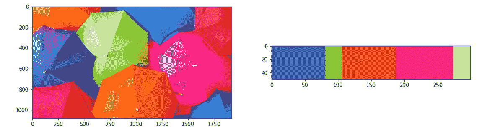

# 从零开始使用 K-均值聚类从图像中提取主色

> 原文：<https://medium.com/analytics-vidhya/extracting-dominant-colours-in-an-image-using-k-means-clustering-from-scratch-2ce79a3eea5d?source=collection_archive---------12----------------------->

从零开始，在不到 5 分钟的时间内从您选择的任何图像中提取主色！

你可能听过一句话 ***“一图胜千言”*** 在我们这个数字化发达的时代，这比以往任何时候都更准确；从一幅图像中可以提取很多信息。高级计算机视觉系统已经允许*自动驾驶汽车*识别前方的物体是人行横道还是静态道路危险，Instagram 过滤器是面部检测和互动的。这些进步源于大多数机器学习的基本方法。

> 关于自动驾驶汽车的更多内容: [**强化学习初学者指南及其从零开始的基本实现**](/analytics-vidhya/a-beginners-guide-to-reinforcement-learning-and-its-basic-implementation-from-scratch-2c0b5444cc49)

*机器学习*涉及机器为了理解数据并提供一些关于数据的答案而进行的学习过程。在*图像处理*的背景下，机器学习的一个应用可以是尝试用代表*像素*和*颜色*的数字作为数据来处理图像。

> 关于机器学习的更多内容: [**机器学习入门指南**](/analytics-vidhya/a-beginners-guide-for-getting-started-with-machine-learning-7ba2cd5796ae)

不提供预测或假设一组正确输出，而是从给定数据集揭示洞察力的方法被称为*无监督*。用于*图像处理*和*信息提取*的一种这样的技术是 ***K 均值聚类*，**一种旨在*将 n 个数据点划分成 K 个组的学习方法。*

> 有关 K-均值聚类的概念概述，请参考— [**关于 K-均值聚类您需要知道的一切**](https://tp6145.medium.com/everything-you-need-to-know-about-k-means-clustering-88ad4058cce0)

*我们现在将从头开始实现 K-means 聚类算法的代码演练:*

> 不要烦恼！我向你保证，它会变得像听起来一样迷人！

```
import **numpy** as np
import **matplotlib.pyplot** as plt

np.random.seed(42)

**def euclidean_distance**(x1, x2):
    return np.sqrt(np.sum((x1 - x2)**2))

**class KMeans():**

   ** def __init__**(self, K=5, max_iters=100, plot_steps=False):
        self.K = K
        self.max_iters = max_iters
        self.plot_steps = plot_steps

        *# list of sample indices for each cluster*
        self.clusters = [[] for _ in range(self.K)]
        *# the centers (mean feature vector) for each cluster*
        self.centroids = []

    **def predict**(self, X):
        self.X = X
        self.n_samples, self.n_features = X.shape

        *# initialize* 
        random_sample_idxs = np.random.choice(self.n_samples, self.K, replace=False)
        self.centroids = [self.X[idx] for idx in random_sample_idxs]

        *# Optimize clusters*
        for _ in range(self.max_iters):
            *# Assign samples to closest centroids (create clusters)*
            self.clusters = self._create_clusters(self.centroids)
            if self.plot_steps:
                self.plot()

            *# Calculate new centroids from the clusters*
            centroids_old = self.centroids
            self.centroids = self._get_centroids(self.clusters)

            *# check if clusters have changed*
            if self._is_converged(centroids_old, self.centroids):
                break

            if self.plot_steps:
                self.plot()

        *# Classify samples as the index of their clusters*
        return self._get_cluster_labels(self.clusters)

    **def _get_cluster_labels**(self, clusters):
        *# each sample will get the label of the cluster it was assigned to*
        labels = np.empty(self.n_samples)

        for cluster_idx, cluster in enumerate(clusters):
            for sample_index in cluster:
                labels[sample_index] = cluster_idx
        return labels

   ** def _create_clusters**(self, centroids):
        *# Assign the samples to the closest centroids to create clusters*
        clusters = [[] for _ in range(self.K)]
        for idx, sample in enumerate(self.X):
            centroid_idx = self._closest_centroid(sample, centroids)
            clusters[centroid_idx].append(idx)
        return clusters

   ** def _closest_centroid**(self, sample, centroids):
        *# distance of the current sample to each centroid*
        distances = [euclidean_distance(sample, point) for point in centroids]
        closest_index = np.argmin(distances)
        return closest_index

    **def _get_centroids**(self, clusters):
        *# assign mean value of clusters to centroids*
        centroids = np.zeros((self.K, self.n_features))
        for cluster_idx, cluster in enumerate(clusters):
            cluster_mean = np.mean(self.X[cluster], axis=0)
            centroids[cluster_idx] = cluster_mean
        return centroids

    **def _is_converged**(self, centroids_old, centroids):
        *# distances between each old and new centroids, fol all centroids*
        distances = [euclidean_distance(centroids_old[i], centroids[i]) for i in range(self.K)]
        return sum(distances) == 0

    **def plot**(self):
        fig, ax = plt.subplots(figsize=(12, 8))

        for i, index in enumerate(self.clusters):
            point = self.X[index].T
            ax.scatter(*point)

        for point in self.centroids:
            ax.scatter(*point, marker="x", color='black', linewidth=2)

        plt.show()
   ** def cent**(self):
        return self.centroids*#Extracting Dominant Colours in an Image*import **cv2**
from **skimage** import **io**
from **google.colab.patches** import **cv2_imshow**url = "https://www.teahub.io/photos/full/35-355143_windows-10-wallpaper-umbrella.jpg" 
img = io.imread(url)img.shape**Out:** (1080, 1920, 3)img_init = img.copy()plt.figure(figsize=(6, 6)) 
plt.imshow(img_init)**Out:** <matplotlib.image.AxesImage at 0x7f49e6a7d6a0>
```


```
img = img.reshape((img.shape[0] * img.shape[1],img.shape[2]))k = **KMeans**(K=5) *#for 5-most dominant colours*
y_pred = k.**predict**(img)
k.cent()**Out:** array([[ 53.16708662,  93.69632655, 175.47967713],
       [133.07051658, 195.54817432,  47.66459003],
       [237.62760178,  76.63096981,  21.42656026],
       [248.665852  ,  31.23121874, 121.13346739],
       [206.22142881, 229.36967717, 152.23724866]])y_pred**Out:** array([2., 2., 2., ..., 0., 0., 0.])label_indx = np.arange(0,len(np.unique(y_pred)) + 1)
label_indx**Out:** array([0, 1, 2, 3, 4, 5])np.histogram(y_pred, bins = label_indx)**Out:** (array([565545, 172073, 559377, 593291, 183314]), array([0, 1, 2, 3, 4, 5]))(hist, _) = np.histogram(y_pred, bins = label_indx)
hist = hist.astype("float")
hist /= hist.sum()
hist**Out:** array([0.27273582, 0.08298274, 0.26976128, 0.28611642, 0.08840374])hist_bar = np.zeros((50, 300, 3), dtype = "uint8")startX = 0
for (percent, color) in zip(hist,  k.cent()): 
  endX = startX + (percent * 300) *# to match grid*
  cv2.rectangle(hist_bar, (int(startX), 0), (int(endX), 50),
      color.astype("uint8").tolist(), -1)
  startX = endXplt.figure(figsize=(15,15))
plt.subplot(121)
plt.imshow(img_init)
plt.subplot(122)
plt.imshow(hist_bar)
plt.show()
```



> 希望你喜欢并充分利用这篇文章！敬请关注我即将发布的博客！如果你觉得我的内容有帮助/信息丰富，请确保**拍**和**跟着**！

***完整代码实现:***

[](https://github.com/tanvipenumudy/Winter-Internship-Internity/blob/main/Day%2011/Day-11%20Notebook-1%20%28Dominant%20Colours%20in%20an%20Image%29.ipynb) [## tanvipenumudy/Winter-实习-实习

### 存储库跟踪每天分配的工作-tanvipenumudy/Winter-实习-实习

github.com](https://github.com/tanvipenumudy/Winter-Internship-Internity/blob/main/Day%2011/Day-11%20Notebook-1%20%28Dominant%20Colours%20in%20an%20Image%29.ipynb)