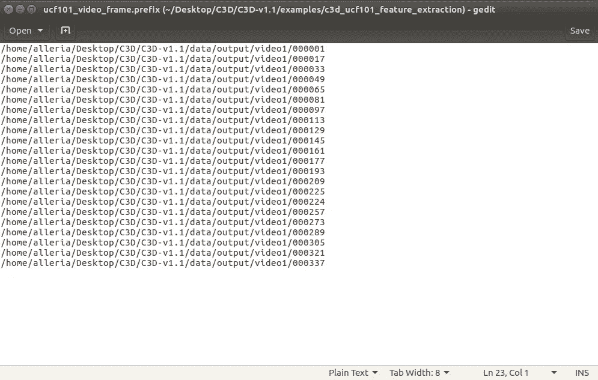

# 在 Ubuntu 16.04 中使用 C3D 1.1 版从视频中提取特征

> 原文：<https://medium.com/analytics-vidhya/extracting-features-from-videos-using-c3d-v1-1-in-ubuntu-16-04-16f2b2990e3b?source=collection_archive---------0----------------------->

在这篇文章中，我将提供一个关于如何用 **C3D v1.1** 模型安装和提取特性的指南，这个项目的网站可以在[这里](https://vlg.cs.dartmouth.edu/c3d/)访问。我写这篇文章的动机是因为我找不到任何关于如何从 C3D 1.1 版中提取特性的详细指南，因此现在我试图自己写这篇文章，以防有人需要。

对于 C3D 1.0 版，可以在这里访问官方文档[。](https://docs.google.com/document/d/1-QqZ3JHd76JfimY4QKqOojcEaf5g3JS0lNh-FHTxLag/edit)

# 初始设置(先决条件)

首先，在一个新安装的 Ubuntu 16.04 上，右击->打开终端，输入:

> sudo 升级
> sudo 升级
> sudo 安装 git
> sudo 安装 ffmpeg

(可选)如果您将 VMWare 用作虚拟机，请在终端命令行中键入以下内容:

> sudo apt-get 安装 open-虚拟机工具
> sudo apt-get 安装 open-虚拟机工具桌面

然后，我们需要从 Github 克隆 C3D 文件夹:

> cd ~/Desktop/
> git 克隆[https://github.com/facebookarchive/C3D](https://github.com/facebookarchive/C3D')

接下来，我们需要安装一些依赖项:

> sudo apt-get install python-opencv
> sudo apt-get install build-essential cmake pkg-config
> sudo apt-get install libprotobuf-dev libleveldb-dev libsnappy-dev libopencv-dev
> sudo apt-get install liblapack-dev libhdf 5-serial-dev protobuf-compiler
> sudo apt-get install lib-base-dev
> sudo apt-get install—no-install—建议使用 libboost-all-dev【T15

# Caffe 安装(CPU 版本)

安装完所有依赖项后，现在让我们开始安装 Caffe，以便使用 C3D 模型。我将使用 Caffe 的 CPU 版本，因为我没有设法让我的虚拟机利用 GPU。

## 1.复制 Makefile.config.example 文件

要安装 Caffe CPU，打开 C3D 文件夹，然后进入 C3D 1.1 版文件夹。右键单击并打开文件夹中的终端，然后键入:

> cp Makefile.config .示例 Makefile.config

## 2.编辑“Makefile.config”文件

打开您刚才复制的“Makefile.config”文件，并更改这些行(对于 Caffe CPU 版本):

> 1)取消第 8 行中“ **#CPU_ONLY := 1”到“CPU_ONLY := 1** ”的注释
> 
> 2)将第 83 行中的' **PYTHON_LIB := /usr/lib** '改为'**PYTHON _ LIB:=/usr/LIB/usr/LIB/x86 _ 64-Linux-GNU/**'
> 
> 3)取消第 91 行中' **# WITH_PYTHON_LAYER := 1** '到' **WITH_PYTHON_LAYER := 1** '的注释

对于 94 号线和 95 号线:

> 你需要的任何东西都在这里。
> INCLUDE _ DIRS:= $(PYTHON _ INCLUDE)/usr/local/INCLUDE
> 库 _ DIRS:= $(PYTHON _ LIB)/usr/local/LIB/usr/LIB
> 
> 更改为:
> 
> **#你需要的任何东西都在这里。
> INCLUDE _ DIRS:= $(PYTHON _ INCLUDE)/usr/local/INCLUDE/usr/INCLUDE/HD F5/serial
> 库 _ DIRS:= $(PYTHON _ LIB)/usr/local/LIB/usr/LIB/usr/LIB/x86 _ 64-Linux-GNU/usr/LIB/x86 _ 64-Linux-GNU/HD F5/serial**

## 3.编辑“Makefile”文件

然后，关闭“Makefile.config”编辑器并打开“Makefile”文件(不配置)。有两行需要更改:

> 1)第 415 行:
> 
> **nvcc FLAGS+=-ccbin = $(CXX)-Xcompiler-fPIC $(COMMON _ FLAGS)**
> 
> 换成
> 
> **NVCCFLAGS+=-D _ FORCE _ INLINES-ccbin = $(CXX)-Xcompiler-fPIC $(COMMON _ FLAGS)**
> 
> 2)第 181 行:
> **库+= glog gflags proto buf boost _ system boost _ file system m HD F5 _ HL HD F5**
> 
> 更改为:
> 
> **LIBRARIES+= glog gflags protobuf boost _ system boost _ file system m HD F5 _ serial _ HL HD F5 _ serial opencv _ core opencv _ imgproc opencv _ high GUI**

## 4.运行生成文件

保存并关闭文件。然后，在 C3D/C3D-v1.1 文件夹中打开终端，并在终端中键入:

> 制作所有
> 制作测试
> 制作运行测试
> 制作咖啡

如果你的电脑有更好的规格，你可以输入类似' ***make all -j4* '** 的代码，这代表使用 4 个 CPU 内核来运行 Makefile。如果出现错误，那么很可能会使用不带' *-j4* '参数的默认命令。

*旁注:如果你在 make 过程中遇到任何错误，不要忘记在重复任何“Make”命令之前通过键入“make clean”来清理构建。*

通过“生成运行测试”中的所有测试

# 将视频转换为帧

因为我想从视频中提取特征，C3D 允许视频输入由帧序列表示。在我的例子中，我将使用 ffmpeg 库把我的视频提取到帧中。C3D 将假设每个视频是一个具有帧的文件夹，这些帧从 000001 开始编号到 N(帧的数量为六位数)。帧名称的格式为“[视频文件夹名称]/%06.jpg”。

通常，这些步骤是:

1.  导航到“/C3D-主/C3D-v 1.1/数据/”并创建新文件夹“视频/”(为了不与其他文件夹混淆)。
2.  然后，在“videos/”文件夹中为每个视频创建一个新文件夹。
3.  在每个文件夹中，打开终端，输入:'*ffmpeg-I "[video name]. MP4 " % 06 . jpg '*提取帧。
4.  提取完所有帧后，我们可以进入下一阶段进行特征提取。

记住为每个你想要提取的视频创建不同的文件夹

# 基于 C3D 的特征提取

C3D 提取 16 帧长的剪辑的特征，因此当从视频中提取特征时，需要将视频分成帧。此外，为了保留时间信息，在提取后续剪辑时，8 个帧将被重叠。

视频中 C3D 特征提取过程的图示

## 1.在'中更改采样率。“prototxt”文件(可选)

导航到“*/C3D/C3D-v 1.1/examples/c3d _ ucf 101 _ feature _ extraction/*”文件夹。

对于 C3D 特征提取，默认采样率被设置为 2，因此例如第一次提取将提取帧 1、3、5…直到帧 31。

如果你想使用 1 的采样率，你可以只编辑。并将第 16 行中的“sampling_rate”从 2 改为 1。

## 2.编辑“Feature_Extraction.sh”文件

打开' **feature_extraction.sh** 文件。第 5 行中特征提取的格式是:

> extract _ image _ features . bin<feature_extractor_prototxt_file><c3d_pre_trained_model><gpu_id><mini_batch_size><number_of_mini_batches><output_prefix_file><feature_name1>…</feature_name1></output_prefix_file></number_of_mini_batches></mini_batch_size></gpu_id></c3d_pre_trained_model></feature_extractor_prototxt_file>

对于这个例子，有 3 件事需要改变:

> 1. <gpu_id>: -1 表示 CPU，0 表示 GPU</gpu_id>
> 
> 2.<mini_batch_size>:如果你的 CPU 支持的话，批量可以更大，对我来说，我将使用 10 的批量。</mini_batch_size>
> 
> *** *如果您的批量发生变化，您需要编辑。并将第 22 行中的批处理大小更改为与该值相同。**
> 
> 3.<number_of_mini_batches>:此小批量数量基于所需的总提取量。</number_of_mini_batches>
> 
> 例如，如果您需要执行 31 个特征提取，并且您的“mini_batch_size”是 10，您将需要 4 个 mini_batch。而如果你总共有 30 个特征提取和 10 个小批量，你只需要 3 个小批量。

## “feature_extraction.sh”文件的第 5 行示例:

下面是一个例子，如果我需要执行 18627 次提取，并且我使用的批量大小为 10，那么我的' *feature_extraction.sh* '文件的第 5 行将是:

> LOG_logtostderr=1../../build/tools/extract _ image _ features . bin c3d _ resnet 18 _ ucf 101 _ feature _ extraction . proto txt c3d _ resnet 18 _ sports 1m _ R2 _ ITER _ 2800000 . caffemodel-1 10 1863 ucf 101 _ video _ frame . prefix fc8 pool 5 res5b

## Prob，pool5，res5b？

注意到“fc8”、“pool5”和“res5b”了吗？这些参数是什么？

基本上，这些是 prototxt 文件中定义的 C3D 体系结构的层。我发现 C3D 1.1 版的架构与下面显示的 C3D 架构图略有不同，因此要找到您想要的正确特性，您可以在 prototxt 文件中导航各层并自己更改特性。

C3D 建筑原文出自本文[此处](https://vlg.cs.dartmouth.edu/c3d/c3d_video.pdf)

prototxt 文件中的 C3D 架构层。请注意图层名称“fc8”、“pool5”、“res5b”。

## 3.“编辑输入”。“列表”文件

的’。前缀“和”。“列表”文件需要相应地更改为与原始文件类似的格式。

用于输入。“列表”文件，它包含您输入到 C3D 用于提取特征的剪辑的信息。每行的格式如下:

> <string_path><starting_frame></starting_frame></string_path>

对于特征提取，

**举例:**

对于我的示例视频，它有 369 帧。所以，我需要列出每次提取的所有开始帧。随后的<starting_frame>将总是前一次提取的第 8 帧。</starting_frame>

由于我使用的采样率为 2，下一次提取的起始帧将是初始帧之后的 16 帧。

简单来说，1，3，5，7，…，27，29，31 的第 9 帧就是 **17。**这是因为 C3D 在连续提取之间重叠 8 帧，以保留时间信息，如前所述。

ucf101_video_frame.list 文件示例

## 4.“编辑输出”。“前缀”文件

输出前缀文件用于指定保存提取要素的路径。
对于文件，每一行的格式为:

其中每一行对应于输入中的行。“列表”文件的顺序相同。根据 C3D 1.0 版用户指南，建议创建一个输出文件夹，并格式化为起始帧(如下图所示)。这是为了在提取特征后更容易识别。
*Sidenote:提醒为每个视频创建不同的文件夹(video1，video2，...)*

ucf101_video_frame.prefix 文件示例

## 5.运行外壳脚本“feature_extraction.sh”

所有文件相应更改后，打开“*c3d _ ucf 101 _ feature _ extraction/*”文件夹中的终端并运行:

> sh 特征 _ 提取. sh

*侧注:如果< mini_batch_size >对您的 PC 来说太高，它将显示一些错误，如:“检查失败:*大小为 192675840 的 ptr 主机分配失败”。如果发生这种情况，只需尝试在 shell 脚本和 prototxt 文件中调小您的批处理大小！*

# 特征提取完成！

成功提取特征

恭喜你，特征提取出来了！可以在每个视频的输出文件夹中找到这些功能。本例中提供的提取特征为‘prob’、‘pool 5’和‘res5b’。各层的整体架构可以在'*中找到。prototxt* 文件。

请让我知道你是否面临任何问题，或者任何我遗漏的东西，因为我花了很长时间配置和试验 C3D 1.1 版。谢谢！