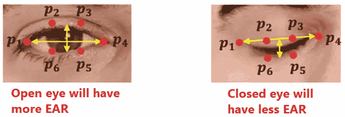

# 使用 dlib 的眼睛纵横比(耳朵)和睡意检测器

> 原文：<https://medium.com/analytics-vidhya/eye-aspect-ratio-ear-and-drowsiness-detector-using-dlib-a0b2c292d706?source=collection_archive---------1----------------------->

在本文中，我将向您展示如何使用 *dlib* 库来确定面部标志，如何计算 EAR(眼睛纵横比)，以及使用 EAR 的概念来检测睡意。

> 在开始本文的代码部分之前，您必须用 python 安装 dlib 库。安装 dlib 库有一些先决条件，我建议你查看[这篇文章](/analytics-vidhya/how-to-install-dlib-library-for-python-in-windows-10-57348ba1117f)。

# dlib 检测的面部标志是什么

*dlib* 库可以用来检测图像中的人脸，然后在检测到的人脸上找到 68 个面部标志。


dlib 在一张脸上发现的 68 个面部标志

我不会详细介绍它如何检测人脸和定位面部标志。无论图像尺寸或面部大小如何，检测到的面部标志的顺序总是相同的，这意味着 1-17 将总是代表面部的轮廓。43–48 代表左眼。如何做到这一点的确切代码将在本文后面给出。

# 如何找到眼睛长宽比(耳朵)

如果你注意到，每只眼睛用 6 个标志点表示。

单眼的耳朵使用以下公式计算:


||p2-p6||表示点 p2 和 p6 之间的距离

> 耳朵越长，眼睛睁得越大。我们将决定一个最小耳值，并使用它来决定眼睛是否闭合。



这是一个效用函数，它将返回单眼的耳朵

```
def eye_aspect_ratio(eye):
    p2_minus_p6 = dist.euclidean(eye[1], eye[5])
    p3_minus_p5 = dist.euclidean(eye[2], eye[4])
    p1_minus_p4 = dist.euclidean(eye[0], eye[3])
    ear = (p2_minus_p6 + p3_minus_p5) / (2.0 * p1_minus_p4)
    return ear
```

# 主要代码(睡意检测器)

1.  我们将从导入必要的 python 库开始

```
import cv2
import dlib
import imutils
from imutils import face_utils
from scipy.spatial import distance as dist
```

2.然后，我们声明一些全局配置变量，这些变量将用于我们代码的其余部分:

```
FACIAL_LANDMARK_PREDICTOR = "shape_predictor_68_face_landmarks.dat"  
MINIMUM_EAR = 0.2
MAXIMUM_FRAME_COUNT = 10
```

*face _ LANDMARK _ PREDICTOR:*dlib 预训练面部地标预测器的路径。你可以从[这里](https://github.com/davisking/dlib-models/blob/master/shape_predictor_68_face_landmarks.dat.bz2)下载这个文件。

*MINIMUM_EAR:* 最小耳朵值，超过该值眼睛将被标记为睁开，否则为闭上。您可能希望根据自己的需求来调整这个参数。试着在不同的场景下找到 EAR，然后确定值。此外，请注意，这个耳朵不是单眼的，而是双眼的累积耳朵。

*MAXIMUM_FRAME_COUNT:* 耳朵的数值变化非常快。即使你眨眼，耳朵也会迅速下垂。但是眨眼不代表困倦。困倦将是一个人已经闭上眼睛(他的耳朵很小)例如连续 10 个视频帧的情况。所以这个变量告诉耳朵可以保持小于 *MINIMUM_EAR* 的最大连续帧数，否则提醒困倦。

3.然后我们实例化 dlib 的 *faceDetector* (它将检测图像中的人脸)和 *landmarkFinder* (它将在检测到的人脸中找到 68 个地标)

```
faceDetector = dlib.get_frontal_face_detector(
landmarkFinder = dlib.shape_predictor(FACIAL_LANDMARK_PREDICTOR)
webcamFeed = cv2.VideoCapture(0)
```

4.然后，我们找到两只眼睛的界标 id 的开始和结束值。你也可以手动完成(右眼 37–42，左眼 43–48)，但是使用 *face_utils* 你可以通过传递眼睛名称来获得这些值。


dlib 面部标志

```
(leftEyeStart, leftEyeEnd) = face_utils.FACIAL_LANDMARKS_IDXS["left_eye"]
(rightEyeStart, rightEyeEnd) = face_utils.FACIAL_LANDMARKS_IDXS["right_eye"]
```

5.最后一部分是真正的事情发生的地方

```
EYE_CLOSED_COUNTER = 0
try:
    while True:
        (status, image) = webcamFeed.read()
        image = imutils.resize(image, width=800)
        grayImage = cv2.cvtColor(image, cv2.COLOR_BGR2GRAY)

        faces = faceDetector(grayImage, 0)

        for face in faces:
            faceLandmarks = landmarkFinder(grayImage, face)
            faceLandmarks = face_utils.shape_to_np(faceLandmarks)

            leftEye = faceLandmarks[leftEyeStart:leftEyeEnd]
            rightEye = faceLandmarks[rightEyeStart:rightEyeEnd]

            leftEAR = eye_aspect_ratio(leftEye)
            rightEAR = eye_aspect_ratio(rightEye)

            ear = (leftEAR + rightEAR) / 2.0

            leftEyeHull = cv2.convexHull(leftEye)
            rightEyeHull = cv2.convexHull(rightEye)

            cv2.drawContours(image, [leftEyeHull], -1, (255, 0, 0), 2)
            cv2.drawContours(image, [rightEyeHull], -1, (255, 0, 0), 2)

            if ear < MINIMUM_EAR:
                EYE_CLOSED_COUNTER += 1
            else:
                EYE_CLOSED_COUNTER = 0

            cv2.putText(image, "EAR: {}".format(round(ear, 1)), (10, 30), cv2.FONT_HERSHEY_SIMPLEX, 0.7, (0, 0, 255), 2)

            if EYE_CLOSED_COUNTER >= MAXIMUM_FRAME_COUNT:
                cv2.putText(image, "Drowsiness", (10, 50), cv2.FONT_HERSHEY_SIMPLEX, 0.7, (0, 0, 255), 2)

        cv2.imshow("Frame", image)
        cv2.waitKey(1)
except:
    pass
```

我们声明一个变量 *EYE_CLOSED_COUNTER* ，它记录耳朵小于 *MINIMUM_EAR 的连续帧的计数。*

我们对图像进行了一些尺寸调整，并将其转换为灰度。

使用 dlib 的*人脸检测器*检测图像中的所有人脸:

```
faces = faceDetector(grayImage, 0)
```

在每个面上循环，使用 dlib 的*地标探测器*找到 68 个地标:

```
faceLandmarks = landmarkFinder(grayImage, face)
```

获取左眼和右眼的界标，然后将其发送到 *eye_aspect_ratio()* 以获取左眼和右眼的耳值:

```
leftEye = faceLandmarks[leftEyeStart:leftEyeEnd]
rightEye = faceLandmarks[rightEyeStart:rightEyeEnd]

leftEAR = eye_aspect_ratio(leftEye)
rightEAR = eye_aspect_ratio(rightEye)
```

找出两只眼睛的累积耳朵:

```
ear = (leftEAR + rightEAR) / 2.0
```

使用眼睛标志在图像上显示眼睛:

```
cv2.drawContours(image, [leftEyeHull], -1, (255, 0, 0), 2)
cv2.drawContours(image, [rightEyeHull], -1, (255, 0, 0), 2)
```

如果对于当前帧，累积 EAR 小于 MINIMUM_EAR，则增加计数器，否则重置计数器，因为我们只对连续帧感兴趣。

```
if ear < MINIMUM_EAR:
     EYE_CLOSED_COUNTER += 1
else:
     EYE_CLOSED_COUNTER = 0
```

如果耳朵小于指定数量的连续帧的 MINIMUM_EAR，这意味着困倦。

```
if EYE_CLOSED_COUNTER >= MAXIMUM_FRAME_COUNT:
                cv2.putText(image, "Drowsiness", (10, 50), cv2.FONT_HERSHEY_SIMPLEX, 0.7, (0, 0, 255), 2)
```

一旦一切就绪，您运行代码，它将生成如下所示的输出:


EAR(未四舍五入到小数点后 1 位)小于 minmin ium _ EAR(0.2)，报告困倦

# 最后的话

在本文中，我们使用 dlib 库来确定面部标志。dlib 库使用起来非常简单，即使没有 GPU 也能流畅运行。但是市场上也可能有其他免费使用的库。Mediapipe 就是这样一个例子。如果你不知道这个库，你可以查看我以前的文章。在撰写本文时，Mediapipe 库的 Face 模块还不能用于 Python。在以后的某个时间，如果面部模块变得可用，它肯定值得一试，因为 Mediapipe 的面部标志检测肯定会比 dlib 更好。你可以在 Github [这里](https://github.com/pdhruv93/computer-vision/tree/main/drowsiness-detector)找到这篇文章的源代码。