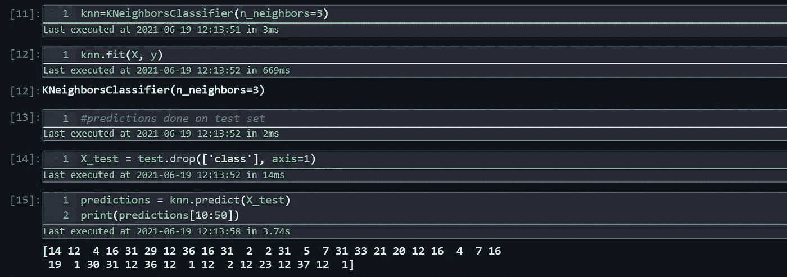

# 眼球运动验证和识别

> 原文：<https://medium.com/analytics-vidhya/eye-movement-verification-and-identification-dd32012e4916?source=collection_archive---------19----------------------->

该模型的目的是确定如何基于人们的眼球运动特征来识别他们。

在这个模型中，读数来自任何一种眼动仪(例如 Ober2)

使用 Ober2 眼动追踪器以 250Hz 的频率读取样本读数，然后输入模型。根据左眼和右眼注视坐标训练该模型。这是为每个用户单独完成的。

**数据集**

对于数据集，采集了 2048 个样本读数，整个测量持续了 8192 毫秒。作为一种刺激，使用了一个 3×3 的跳跃矩阵，由 11 个点的变化位置组成。这些点变化位置返回 12 个连续的点位置。

**数据集的准备**

对于阅读，第一个点出现在屏幕的中间，受试者应该把注意力集中在它上面，眼睛朝向它。持续 1600 毫秒后，该点消失，屏幕变黑 20 毫秒。这使得被摄主体的眼睛处于不稳定的状态，等待另一个兴趣点。此外，下一个点出现在右上角，闪烁的点吸引了主体眼睛的注意。重复这个过程，直到到达屏幕中间的最后一个位置。

数据集在”中可用。csv”格式。有培训和测试文件。每个读数有四种类型的值:

*   类别—受试者的分类(训练集为 1–37，带“？”在测试装置的情况下)
*   LX-X 轴上左眼凝视点的 2048 个逗号分隔值的列表。
*   ly-Y 轴上左眼注视点的 2048 个逗号分隔值的列表。
*   rx-X 轴上右眼凝视点的 2048 个逗号分隔值的列表。
*   ry-Y 轴上右眼凝视点的 2048 个逗号分隔值的列表。

中间点的值为 0，屏幕右侧或上方点的值为正，屏幕左侧或下方点的值为负。

数据集的前几行

大多数机器学习项目的很大一部分是了解数据集。但是，pandas API 提供了一个 describe 函数，该函数输出关于数据帧中每一列的以下统计信息:

*   计数是该列中的行数。理想情况下，每一列的计数都包含相同的值。
*   mean 和 std 包含每列中值的平均值和标准偏差。
*   最小值和最大值包含每列中的最低值和最高值。
*   25%，50%，75%，包含不同的分位数。

检查数据集

**预处理数据集**

我使用了 MinMax Scaler 来缩放数据集。缩放将保持损失值和学习率在一个更友好的范围内。

**定义特征和标签**

列“class”在这里将被用作标签，其余的列表示该特定类的特征。

根据 lx、ly、rx、ry 坐标为“受试者 1”绘制的眼球运动图。

左眼和右眼凝视在 x 轴上协调

y 轴上的左眼和右眼凝视坐标

**使用 *k* NN 分类器**

k 最近邻(**【KNN】**)**算法**是一个非常简单的，有监督的机器学习**算法**。It 既可以解决分类问题，也可以解决回归问题。在这种情况下，我们有一个分类问题，因为所有的特征属于不同的类。

首先，我们导入了 KNeighborsClassifier 模块，并通过在 KNeighborsClassifier()函数中传递邻居的参数编号来创建 *k* NN 分类器对象。

为*k* NN 分类器确定目标和特征在这里，我们为特征指定“X ”,为标签指定“y”。

然后，我们使用“fit()”在训练集上拟合我们的模型，然后使用 predict()在测试集上执行预测。

使用 *kNN 分类器*

这里，我们不能在测试集上验证我们的结果，因为测试集是一个未标记的数据集。此外，我们可以将训练集分为训练集和验证集，并确定我们的模型的估计准确性，甚至绘制混淆矩阵。

**结论**

基于眼球运动的生物识别是一个新兴领域，可以通过更大和校准的数据集来改进该模型。在测试集上进行的预测没有得到预期的结果，因为准确性分数接近 0.55，这是因为来自眼动仪的未校准数据。因为这里使用了 kNN 分类器，所以它以对数据集的良好伸缩性而闻名。因此，随着数据的增多，该模型的精确度将会提高。这个项目的灵感来源于 Kaggle 竞赛，“眼球运动验证和识别竞赛”。