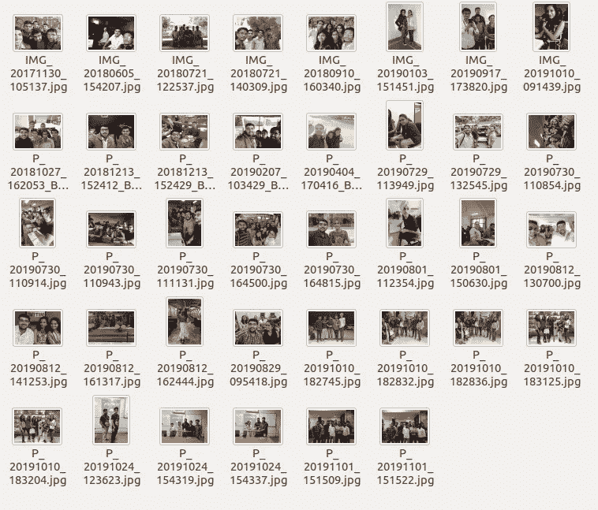
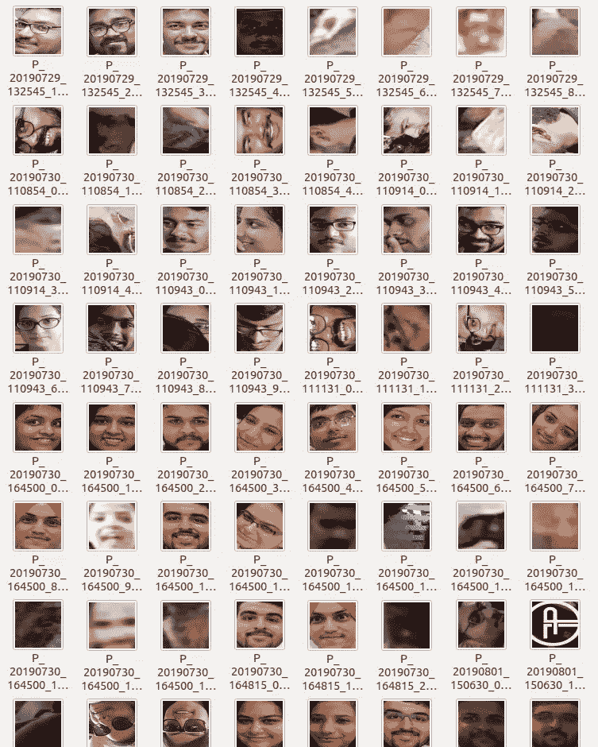
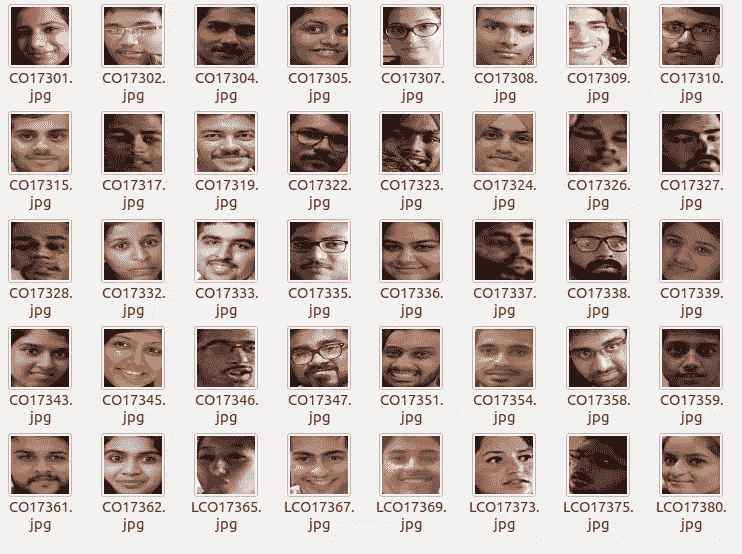
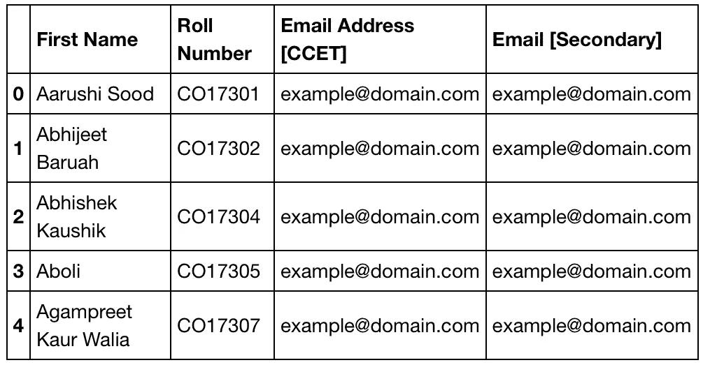
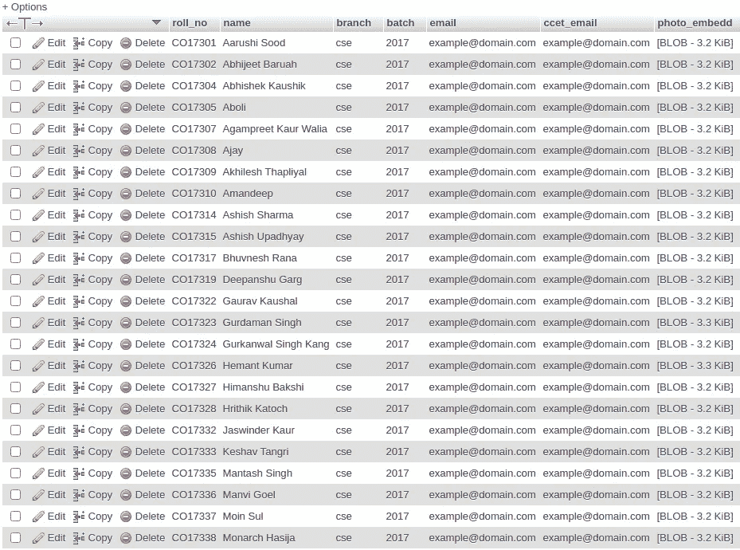

# (第三部分)eye attend——从零开始的基于面部识别的考勤系统。—完整的方法。

> 原文：<https://medium.com/analytics-vidhya/eyeattend-facial-recognition-based-attendance-system-from-scratch-4c07ce9da319?source=collection_archive---------17----------------------->

# 介绍

欢迎来到我们博客系列的第三部分。最后，在 2 个关于我们的愿景和项目概述的故事之后，我们将在这个故事中开始我们的编码。不浪费你太多时间，让我们开始吧。

# 概述

在开始之前，让我们复习一下上一个故事的内容。因此，我们讨论了深度学习模型的概述，并简要介绍了我们项目中的以下模型:

1.  **keras-facenet** (迁移学习)
2.  **面具探测器**
3.  **真假探测器**

您可以通过快速浏览本系列的第一部分和第二部分来熟悉这个项目。

数据是训练深度学习模型的主要资源。在我们的项目中，需要的第一类数据是课堂数据。为了执行面部匹配，我们实际上需要一个数据库，从中我们将绘制我们的图像比较。首先，我们将生成课堂数据。为此，我们的要求是学生的面部图像。由于在这个项目的开发过程中，我们地区的学校和大学因新冠肺炎疫情而关闭，我们必须想出一种方法来生成数据。

# 数据生成

## 1.收藏品

我们回忆起我们的集体照片、当地旅行和其他照片。接下来，我们将它们放在一个文件夹中以供考虑。这些图像确实包含重复的人脸，但是我们需要收集最大数量的人脸，以便生成我们的教室批次。我们的试验是获得最多人脸的图像，以减少收集工作。将它存储在一个目录中标志着这个阶段的完成。参见下面的附图，以供参考。



原始数据:用于提取人脸的群组照片

## 2.提取，血统

接下来，我们需要从这些图像中提取人脸。一些图像在肖像模式下显示，而一些图像在某个角度被点击。手动提取人脸是一项繁琐的任务。如前所述，我们将使用迁移学习进行人脸提取和人脸识别，我们将使用 MTCNN(多任务级联神经网络)模型进行人脸提取。MTCNN 模块可以从 PyPI 安装在[1]。您可以通过终端执行以下命令将其安装在您的机器上:

```
pip3 install mtcnn
```

请注意，在安装之前，您的机器上已经安装了 pip3。

安装 MTCNN 后，我们将导入人脸提取所需的库

```
import os
import numpy as np
from PIL import Image
from mtcnn import MTCNN
```

导入库之后，我们将把源和目标路径存储在一个变量中，并初始化 mtcnn 对象。你也可以使用参数解析器直接在终端中输入这些文件夹和输出路径。

```
detector = MTCNN()
folder_path = '/home/username/Eye_Attend/Eye_Attend/images'
output_path = '/home/username/Eye_Attend/Eye_Attend/FACES_224'
```

为了理解 MTCNN 是如何工作的，考虑下面的例子:


示例图像

如果我们对这个图像运行 MTCNN 检测器(通过下面的代码)，我们会得到下面的输出:

**代码:**

```
img = Image.open(folder_path+os.sep+"IMG_20171130_105137.jpg")
pixels = np.asarray(img)
results = detector.detect_faces(pixels)
print(len(results))
print(results)
```

**输出:**

```
6
[{'box': [602, 470, 358, 454], 'confidence': 1.0, 
'keypoints': {'left_eye': (724, 643), 'right_eye': (888, 662), 'nose': (816, 743), 'mouth_left': (718, 807), 'mouth_right': (863, 825)}}, {'box': [1066, 401, 228, 305], 'confidence': 0.9999994039535522, 'keypoints': {'left_eye': (1136, 518), 'right_eye': (1244, 523), 'nose': (1196, 571), 'mouth_left': (1137, 624), 'mouth_right': (1235, 632)}}, {'box': [1542, 538, 226, 283], 'confidence': 0.9999988079071045, 'keypoints': {'left_eye': (1591, 645), 'right_eye': (1692, 646), 'nose': (1625, 692), 'mouth_left': (1596, 755), 'mouth_right': (1671, 758)}}, {'box': [1764, 844, 477, 588], 'confidence': 0.9999927282333374, 'keypoints': {'left_eye': (1873, 1078), 'right_eye': (2096, 1067), 'nose': (1968, 1204), 'mouth_left': (1898, 1299), 'mouth_right': (2088, 1294)}}, {'box': [1038, 951, 453, 523], 'confidence': 0.9999831914901733, 'keypoints': {'left_eye': (1162, 1174), 'right_eye': (1351, 1109), 'nose': (1289, 1293), 'mouth_left': (1244, 1375), 'mouth_right': (1410, 1313)}}, {'box': [-92, 769, 623, 850], 'confidence': 0.9803318977355957, 'keypoints': {'left_eye': (86, 1089), 'right_eye': (375, 1070), 'nose': (268, 1253), 'mouth_left': (84, 1357), 'mouth_right': (392, 1330)}}]
```

输出是一个字典列表，每个字典都有“box”、“confidence”和“keypoints”作为关键字。键“关键点”是另一个字典，带有“左眼”、“右眼”、“鼻子”、“口左”和“口右”键。方框键列表由 x1、y1、宽度和高度组成。这指的是人脸的边界框，我们可以用它从图像中提取人脸。

以与上述类似的方式，我们将逐一迭代源文件夹中的图像，并从当前图像中检测所有人脸，提取它们的边界框坐标，然后将人脸图像存储在 output_folder 中。下面的代码帮助我们从输入目录路径中提取人脸，并将图像保存在输出路径中。

```
for image in os.listdir(folder_path):
    img = Image.open(folder_path+os.sep+image)
    pixels = np.asarray(img)
    filename , extension = image.split(".")
    results = detector.detect_faces(pixels)
    for i in range(len(results)):
        x1, y1, width, height = results[i]['box']
        x1, y1 = abs(x1), abs(y1)
        x2, y2 = x1 + width, y1 + height
        face = pixels[y1:y2, x1:x2]
        face_image = Image.fromarray(face)
        face_image = face_image.resize((224, 224))
        face_image.save(
            output_path+os.sep+filename+"_"+str(i)+"."+extension
        )
```

在每次迭代时，image 变量被转换为 numpy 数组，该数组作为参数传递给 detector.detect()以提取面部细节，如前面的示例所述。我们还存储图像的文件名和扩展名，以相同的前缀保存人脸图像。我们迭代每一个检测到的人脸，通过包围盒坐标从图像的 numpy 数组中提取人脸。将其大小调整为 224，244 维，因为我们将在稍后阶段需要一个预训练的模型，其权重在 imagenet 数据集上，该数据集接受 224x224 图像。最后，我们将把生成的面保存在输出目录中。下面是我们的源文件夹的结果。



教室批次的输出面

## 3.隔离:

在从组图像中提取可能检测到的人脸之后，我们有一些不想要的、扭曲的、模糊的和重复的人脸(由于图像中的重复个体)。下一步是从这个数据集中取出高质量的图像。这将是我们的隔离阶段。我们将挑选出高质量的图像，这些图像是可见的、可区分的，并且像素化程度较低。在新的目录中，这些图像将被粘贴，文件名将被更改为个人的卷号。这样做的原因将在后面解释。结果如下所示:



学生们被隔离的面孔

你可能会发现一些名单号码不见了，那是因为我们在 gallary 中找不到少数人的照片。我们的下一个目标是通过数据库导出这些数据，以便在需要时可以根据我们的应用程序流使用这些数据。

想到的一个问题是，我们真的需要图像数据来进行面部识别吗？如果你想一想，你就会明白我们需要人脸数据只是为了比较前端发送的人脸数据，如果你想得更深，那么我们实际上是在比较从前端获得的图像嵌入和从后端数据库获得的特定批次的人脸嵌入。因此，不是存储 60-80 幅图像，然后检索每一幅图像，从而计算它们的嵌入是一项计算量很大的任务。

因此，一个更好的方法是通过 MySQL 数据库上传每张脸的嵌入和其他学生的详细信息。

## 4.存储在数据库中:

我们在这个项目中使用 MySQL 数据库，现在下一步是上传数据库上的学生数据。随着面部嵌入，我们也将上传其他细节，即姓名，电子邮件，大学电子邮件，批次，分支机构等。需要明确的是，以上教室数据是针对分公司‘CSE’和批次 2017–21 的。

我们的下一个挑战是在 MySQL 中存储 numpy 数组。这个挑战是通过将 numpy 数组转换成字节并存储在 LONGBLOB 类型的列中解决的。这一部分比较棘手，但这一切都会过去的，而且确实过去了。让我们看看在 MySQL 表上上传数据的代码。

**学生详细信息:**每个教室的详细信息，如点名号、电子邮件 id 等，由 CR 和班级负责人保存为 Excel 记录。做了两年的前科犯，我也有学生记录表。我们使用 excel 表格中的详细信息和面部图像(按照卷号的升序排列),并将两者结合起来，自动完成将数据上传到数据库的任务。

在导入库之前，我们必须安装用于迁移学习的预训练的 keras facenet 模型。

```
pip3 install keras-facenet
```

成功安装后，导入基本库并从 keras-facenet [2]创建一个 Facenet 实例:

```
import os
import pickle
import numpy as np
import pandas as pd
from PIL import Image
import mysql.connector
from keras_facenet import FaceNet
from tensorflow.keras.preprocessing.image import img_to_array,array_to_imgembedder = FaceNet() 
```

一旦导入所有内容，我们将打开包含学生详细信息的 excel 文件。出于隐私考虑，电子邮件和个人信息被从图片中删除。我们使用熊猫图书馆来读取数据。

```
df = pd.read_excel(“StudentListEmail_ccet_gmail.xlsx”)
       .fillna(“example@domain.com”)df.head(5)
```



上图显示了班级学生详细信息的输出。使用这个和学生的脸的图像，我们将在 MySQL 数据库上传相同的。

我们的下一个任务是计算每个人脸的嵌入，并把它存储在一个列表中。

注:excel 文件中的辊号和各面的文件名相同，数量相等，按升序排列。我们的教室文件夹中不存在 excel 中的额外条目，反之亦然。

请参见下面计算嵌入的代码片段。

```
name = list(df['First Name '])
email = list(df['Email [Secondary]'])
ccet_email = list(df['Email Address [CCET]'])
roll= list(df['Roll Number'])class_temp_path ="/home/username/Eye_Attend/Eye_Attend_Final/classroom_224"temp_totalEmbeddings = []
for faces in os.listdir(class_temp_path):
    face = Image.open(class_temp_path+os.sep+faces)
    face = img_to_array(face)
    face = np.expand_dims(face, axis=0)
    embedding = embedder.embeddings(face)
    temp_totalEmbeddings.append(embedding)
```

temp_totalEmbeddings 列表保存了我们教室中每个人脸的嵌入。每个嵌入都是一个 512 维向量，如下所示:

```
print(temp_totalEmbeddings[0].shape)
print(len(temp_totalEmbeddings))
print(len(roll))#Output 
(1, 512)
40
40
```

这表明我们的 excel 中有 40 名学生，教室文件夹中有 40 张与他们对应的图像(按卷号 asc 排序)。

由于每个嵌入是 512 维向量，因此我们的最终矩阵将是 40×512 维的。

接下来，我们将看到在 MySQL 数据库中上传所有这些数据的上传代码。

```
branch_ = 'cse'
batch_ = '2017'
conn = mysql.connector.connect(
    host="localhost",
    user="root",
    password="",
    database="eyeattend"
    )
if conn.is_connected():
    print("Successfully connected")
    mycursor = conn.cursor()
    create_tab = "CREATE TABLE IF NOT EXISTS `batch_2017` ( `roll_no` varchar(10) NOT NULL, \
                 `name` varchar(50) NOT NULL,\
                 `branch` text NOT NULL,\
                 `batch` text NOT NULL,\
                 `email` varchar(50) NOT NULL,\
                 `ccet_email` varchar(50) NOT NULL,\
                 `photo_embedd` longblob NOT NULL,\
                 PRIMARY KEY (`roll_no`) ) "

    mycursor.execute(create_tab)
    conn.commit()

    for i in range(len(roll)):
        r = str(roll[i])
        naam = str(name[i])
        ema = str(email[i])
        ccet = str(ccet_email[i])
        embed = temp_totalEmbeddings[i]
        pickemb = embed.dumps()
        mycursor.execute("INSERT INTO batch_2017 VALUES (%s,%s,%s,%s,%s,%s,%s)",(r,naam,branch_,batch_,ema,ccet,pickemb))
        conn.commit()
        # Closing the connection
    conn.close()

else:
    print('Error in connecting with database')
```

这里我们使用 mysql.connector 包。branch 和 batch 是变量，可用于判断哪个分支和批次的学生数据将被上传到 DB 中。

首先，我们尝试与后端数据库建立连接。如果连接成功，我们打印出一条成功消息并创建一个光标对象。接下来，我们将运行 CREATE TABLE 查询来为特定的批处理创建表(如果它不存在的话)。此外，我们逐一迭代学生的详细信息及其面部图像嵌入，并将它们插入到数据库中。如前所述，为了上传嵌入，我们必须将它们编码成字节形式，因为我们的`image_embed`属性接受`longblob`。为此，我们使用 dumps()函数并通过 DB 上传数据。下面显示了该代码以 DB 为单位的输出:



DB 输出

这样，同一批次的其他流(如 ECE、CIVIL、MECH、BIOTECH、EE 等)的数据可以以相同的方式上传。这就是我们如何为这个项目建立数据库的。在未来的博客中，你会看到我们将如何只获取 coma 监狱的点名号码和嵌入信息，以及我们将如何通过面部识别来标记出席人数。

# 结论

所以这标志着博客的结束。在这篇博客中，你看到了我们如何使用预训练的 keras-facenet 模型来生成人脸图像的矢量嵌入，以及我们如何在 MySQL 上创建我们的教室数据库。在下一篇博客中，我们将建立面具检测器模型。敬请关注，我们希望你喜欢这个博客。一定要喜欢并分享给你的圈子。

# 参考

[1]https://pypi.org/project/mtcnn/

[2]https://pypi.org/project/keras-facenet/