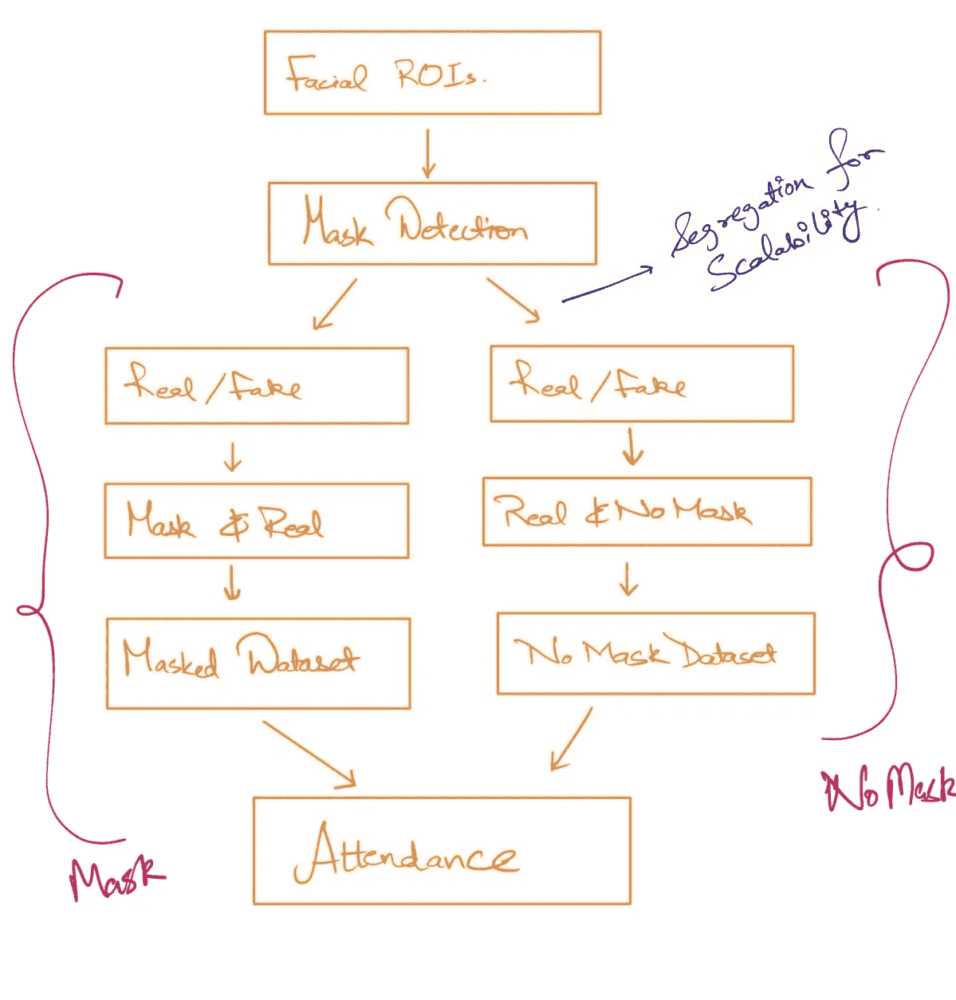

# EyeAttend 从头开始基于面部识别的考勤系统。–完整的方法。(第二部分)

> 原文：<https://medium.com/analytics-vidhya/eyeattend-facial-recognition-based-attendance-system-from-scratch-c93dbab8c17?source=collection_archive---------16----------------------->

# 介绍

读者们，欢迎来到 EyeAttend 系列的第二部分。在这篇博客中，我们将详细分析手头的问题陈述、传统方法、我们提出的解决方案以及为执行该解决方案而进行的规划。我们将涵盖整个项目中发生的事件流程，并借助流程图来表示。所以让我们开始吧。

# 理解问题陈述

在开始解决任何问题之前，建议先了解问题。因此，我们首先解释当前/传统的考勤方法。

## 传统方法论

1.  最初，在讲座结束后，班级代表将不得不袖手旁观讲台，并大声说出每个学生的点名号码，如果他/她在课堂上，相关个人将带着 present 返回。
2.  接下来，班级代表(CR)将记录出席和缺席和/或缺席的学生。
3.  然后将该列表发送给相关的科目教师。课堂代表无权填写出席人数。
4.  老师在他/她的登记簿上记下了这一点。
5.  这个循环一直重复到学期结束

## 限制

这种特殊的机制有许多限制。其中一些如下:

1.  **Proxy:** Proxy 的意思是在学院里做假出席讲座。上述方法易于在 CR 级别进行代理。他可能会为他的朋友标记礼物，即使他们正在城市中漫游。
2.  **分享:**很难与学生分享出勤情况。有时是因为注册表没有更新，或者教授不在等等。在像印度这样的国家，75%的大学出勤率是强制性的，这对学生来说是一个大问题。
3.  **无软拷贝:**如果要在学期结束后转发考勤表，由于没有维护软拷贝，很难做到。这导致扫描寄存器的另一个时间浪费。
4.  **大量手动工作**:无论是在 excel 上还是在登记簿上更新考勤，传统的方法都需要大量的手动工作来完成任务。
5.  **时间:**整个过程有些耗时。
6.  **编辑:**如果因生病、比赛或任何原因缺席，并且有有效证明，必须转换回当前，教授必须使用增白剂来纠正，这使得登记册有点混乱。

## 智能系统提案

我们的建议是一个没有麻烦的系统部署，不需要 CR 点名，教师自己只需点击学生的照片就可以记录出勤情况。

## 解决方案概述:

正如您可能已经在第一部分的视频演示中看到的，我们首先将图像上传到数据库，然后机器学习模型从图像中提取人脸，然后根据教师、科目代码，在提取的人脸和教室人脸之间执行批量人脸识别。完成后，将生成出席者和缺席者列表，并在数据库中动态更新。这个最终列表被发送回教师的前端。该解决方案还提供了简单的下载工具，在未来的版本中，我们可以添加所收集数据的图形分析，以直观地了解多年来的趋势。

# 项目流程(ML 模型流程)

下面是我们的项目 ML 模型的流程图。我们分离了具有不同功能的模型，以方便未来的更新和可扩展性。

ML 模型的流程

上面的流程显示了各种模型是如何处理我们的图像的。最初，我们考虑为掩蔽和非掩蔽场景制作这个项目，但是由于硬件的限制，我们选择了非掩蔽场景。然而，新的模型可以开发和代码可以更新，以纳入掩盖版本。

因此，最初当图像被提供给脚本时，它将从中提取面部区域。它将检测人脸的存在，并以 224x224x3 的尺寸提取人脸。接下来，我们迭代面数，对于每个面，我们执行以下操作:

1.  检查它是屏蔽的还是未屏蔽的
2.  检查它是一个真人还是一张人脸照片
3.  检查教室里的人是谁(面部识别)。
4.  记下他的点名号码，并将他记录在出席者记录中。

# 模型概述

正如上一节提到的，我们必须为我们的模型开发不同的模型。现在，这是因为当新学生到达校园时，我们可能需要再次训练该模型，以使其更加健壮。这就是为什么模型被分解成不同的部分，以便一个部分可以被升级，然后在不影响其他模型的情况下被重用。下面列出了我们已经使用和将要开发的模型:

1.  **keras-facenet** (迁移学习):这是用于提取人脸和创建嵌入的人脸图像[1]。我们使用了一个预训练的 facenet 模型，它将人脸图像转换成 **512 维向量**。它通过 **MTCNN(多任务级联神经网络)检测和提取人脸。**
2.  面具检测器:我们将开发这个模型来检测这个人的脸是否有面具。这样做是为了区分不同的用例，通过 mask，教室数据库、真/假检测器等将得到不同的开发。
3.  **真/假检测器:**真/假检测器或活动性检测器模型用于检查真实的人是否存在。这是在我们的项目中最小化代理的努力，因为有可能某人只是用他们朋友的面部图像打开笔记本电脑屏幕，这样他/她的点名数就可以被算作在场。

# **结论**

在本系列的这一部分，您了解了深度学习/机器学习在后端是如何进行的。很抱歉，像第一部分一样，这一部分也没有代码，但我们将从该系列的第三部分的模型开发开始。敬请关注，并在 LinkedIn 上关注我们:[凯沙夫·唐里](https://www.linkedin.com/in/keshav-t-7ab782104/)，[阿比吉特·巴鲁阿](https://www.linkedin.com/in/abhijeet-baruah-bb1b08165/)，& [阿鲁士·索德](https://www.linkedin.com/in/aarushi-sood-b2b11b154/)。让我们在下一篇博客中叙旧。在那之前，祝你一周愉快！

# 参考

[1].[https://github.com/faustomorales/keras-facenet](https://github.com/faustomorales/keras-facenet)