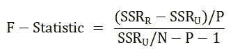
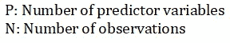
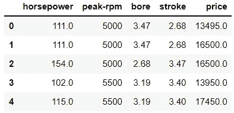
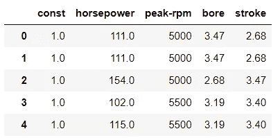
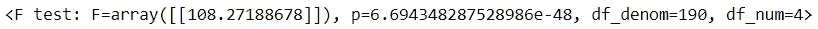
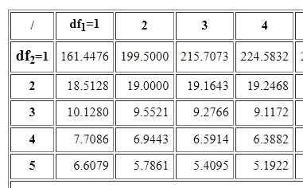
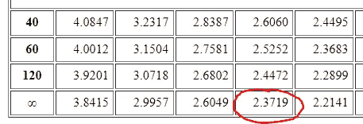
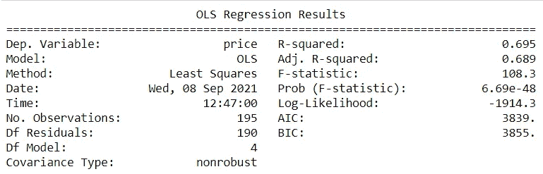

# f 统计量:使用 python 理解模型的重要性

> 原文：<https://medium.com/analytics-vidhya/f-statistic-understanding-model-significance-using-python-c1371980b796?source=collection_archive---------0----------------------->


[安德鲁·尼尔](https://unsplash.com/@andrewtneel?utm_source=unsplash&utm_medium=referral&utm_content=creditCopyText)在 [Unsplash](https://unsplash.com/s/photos/decision?utm_source=unsplash&utm_medium=referral&utm_content=creditCopyText) 上拍照

在统计学中，**显著性检验**是一种根据数据得出拒绝或接受某些主张的结论的方法。在回归分析的情况下，它用于确定自变量在解释因变量的方差时是否显著。假设我们有回归方程:

```
y = intercept + β*xy: independent variable
β: regression co-efficient
x: dependent variable
```

在这种情况下，

*   零假设 H0 将是: *β* = 0，即预测值 *x* 不能解释自变量 *y* 的方差。
*   另一个假设 H1 将是: *β* ≠ 0，即 *x* 在预测 *y* 的值时是有意义的。

因为这里我们只有一个预测器，T 检验应该足够了。然而，在现实中，我们的模型将包括**个独立变量**。这就是 F 统计量发挥作用的地方。

f 统计量可用于寻找多个自变量的**联合显著性**。它用于比较两个模型解释因变量方差的能力。换句话说，它可以帮助确定是使用复杂的模型还是简单的版本。无效假设和替代假设类似于 T 检验中的假设。所以对于给定的回归方程:

```
y = intercept + β1*x1 + β2*x2 + ... + βn*xn
```

*   零假设 H0 将是:*β1*=*β2*=…=*βn*= 0
*   另一个假设 H1 会是: *βi* ≠ 0

因此，如果甚至一个系数是重要的，那么很有可能拒绝零假设，因为系数不再是**共同不重要的**。这里，这两个模型可以是包含所有预测变量的**非限制模型**，或者是限制预测变量数量的限制模型。对于本文，我将使用一个只拦截的**模型作为受限模型。**

每个模型都有一些**剩余**与之相关联。残差只不过是从数据点到回归线的距离的度量。在我们的例子中，我们有两种类型的残差:

*   SSRr:受限模型的残差平方和
*   SSRu:无限制模型的残差平方和

SSRr 将总是大于 SSRu，因为受限模型不能很好地捕捉因变量的方差。添加变量有助于减少误差，不管我们添加的是重要变量还是噪声。

但是如果无限制模型总是比限制模型有更小的误差，那么我们为什么需要 F-统计量呢？因为我们要问的问题是，它是否比无限制模型大得多。

F 统计量的等式为:



由于残差平方和(SSR)是无单位的，除以分子中的 *P* 和分母中的 *N-P-1* 让我们形成一个可比较的分布。这两个也正好是我们的**自由度**。所以，

*   df1 = *P* :自由度 1
*   df2 = *N-P-1* :自由度 2

我们要与之比较的分布叫做 **F 分布**。我们通常采用 95% 的**置信区间，即转化为 0.05** 的 **alpha 值。基于两个自由度的值和 alpha 值，我们可以在 F 分布上找到 **F 临界**值。如果 F-统计值大于 F-临界，我们拒绝零假设，换句话说，我们有足够的证据表明给定的自变量在解释因变量的方差方面是显著的。**

为了在 python 上展示这一点，我使用了一个汽车数据集。问题陈述只是基于一些特征/独立变量来寻找车辆的价格。这些参数包括*马力、峰值转速、缸径和冲程*。

所以我们先从导入熊猫开始，读取 CSV 文件。

```
import pandas as pd
df = pd.read_csv('Automobile_data.csv')print(df.head())
```



将自变量和因变量分别赋给 *X* 和 *y* 变量。

```
X = df.drop(['price'], 1)
y = df['price']
```

为了计算 F 统计量，我将导入一个名为 **statsmodels** 的库。

```
import statsmodels.api as sm
```

默认情况下不会添加截距，因此必须手动添加。

```
X = sm.add_constant(x)
print(X)
```



最后，我们可以使用 statsmodels 的 OLS(普通最小二乘法)方法来拟合数据。

```
results = sm.OLS(y, X).fit()A = np.identity(len(results.params))
A = A[1:,:]print(results.f_test(A))
```



结果显示，与仅截距模型相比，给定模型的 F 统计值为 108.272。它还显示了两个自由度:df1 = 4°和 df2 = 190。为了找到 F 临界值，我们可以在 F 分布表中查找α值 0.05。



来源:[http://www.socr.ucla.edu/Applets.dir/F_Table.html](http://www.socr.ucla.edu/Applets.dir/F_Table.html)

比较自由度的值以获得 F 临界值。我们的 df1 是 4，df2 是 190，所以我们必须查找第 4 列，因为 df2 大于 120，所以我们必须检查最后一行。



我们得到的 F 临界值为 2.3719，远低于我们的 F 统计值 108.272。由于 F-统计> F-临界，我们拒绝零假设，这意味着自变量在解释因变量的方差时是共同显著的。

相反，您也可以打印显示回归结果的 OLS 模型的摘要。

```
print(results.summary())
```



在这种情况下，我们可以检查汇总中的 p 值(列为 Prob F-statistic ),以确定是拒绝还是接受零假设。这里的 p 值是完整模型的零假设为真的概率(即所有回归系数为零)。由于 p 值近似为零，我们拒绝零假设。换句话说，有证据表明价格和预测变量之间存在线性关系。

**总结**

*   显著性测试可以帮助我们决定是应该采用复杂的模型还是简单的模型。
*   f 统计量可用于了解给定的预测变量集在解释因变量的方差方面是否显著。
*   如果 F-统计量> F-临界，或者如果概率(F-统计量)约为 0，那么我们拒绝零假设。换句话说，给定的回归是有意义的。

快乐造型！

数据:[来源](https://www.kaggle.com/toramky/automobile-dataset)