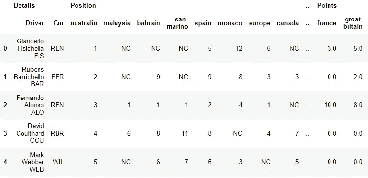
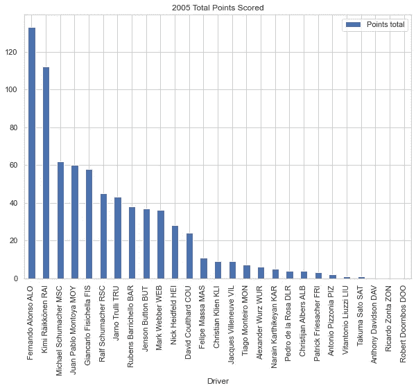
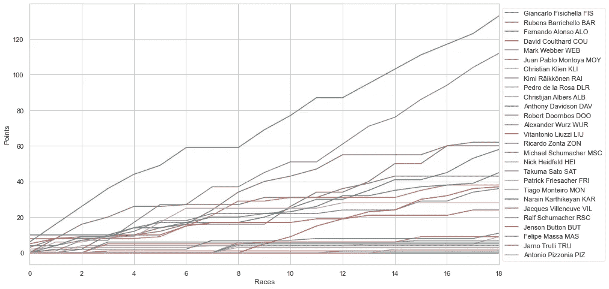
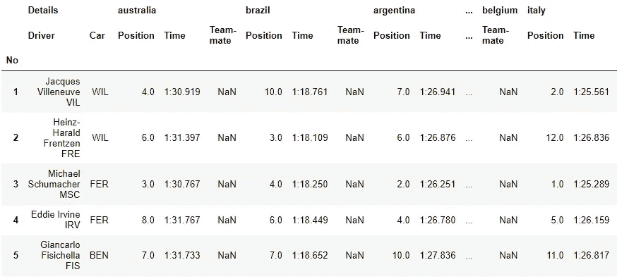
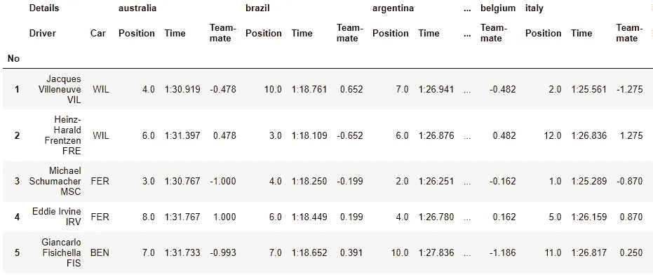
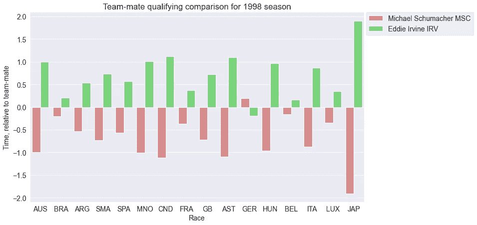
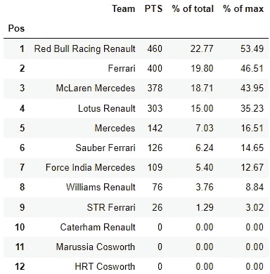
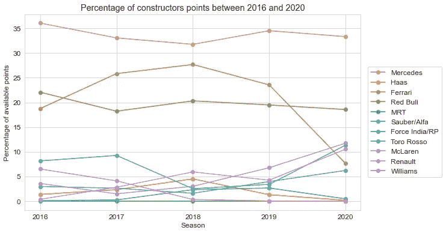

# F1Archive:用于分析 F1 数据的 Python 库

> 原文：<https://medium.com/analytics-vidhya/f1archive-a-python-library-for-analsying-f1-data-e40f831633a9?source=collection_archive---------7----------------------->

资料来源:Unsplash.com

在我开始分析一些 F1 历史数据的前一篇博客文章的基础上，我在这篇文章中讨论的代码库背后的想法是让导入在[一级方程式网站](https://www.formula1.com/en/results.html)上可用的数据变得非常简单，这样你就可以开始做自己的数据科学项目。存储库由几个类组成，只需要一两次方法调用和最少的参数，就可以从网站中提取数据。在引擎盖下，代码主要基于美丽的汤和熊猫，首先提取数据，然后将其转换为易于使用的格式。

目前，代码库是围绕三个主要类形成的，这三个类对应于三个感兴趣的领域:

1.  **车手总冠军:**每个车手在整个赛季中的排位和积分。
2.  **排位赛表现:**绝对时间以及队友和赛场其他人之间的相对表现。
3.  **车队总冠军:**总积分、可用积分的百分比以及几个赛季的趋势。

这三个领域都补充了数据转换和可视化功能，以帮助进行数据分析。在本文的剩余部分，我将更详细地介绍每一项，并演示一些可用的功能。

这个库可以在 github 上获得，并且包括每个驱动、资格和构造类的单独的教程笔记本。下载 zip 格式的代码并在本地运行可能是最好的开始方式。

## 车手锦标赛

对于车手冠军赛，我们感兴趣的是整个赛季每场比赛中每位车手的名次和积分。为了使这变得简单，库包含了一个 **DataExtractor** 类，用于从一级方程式网站提取数据，并将其格式化为适合熊猫的模式。除了单个季节，我们还可以给它传递一个季节列表。

**DataExtractor** 类是提取数据的基类，限定类和构造类从它继承而来(见下文)。下面的代码片段显示了获得整个赛季的结果是多么简单。我们首先调用类。然后我们调用 **get_race_urls** 方法，同时传递所需的年份或年份列表。年份可以作为整数或字符串传递。这个方法搜索所有指向该赛季逐场比赛结果网页的 URL。从那里，我们简单地调用 **seasons_results** 方法，该方法从页面中提取数据并将其格式化为 DataFrame。每年的结果都存储在一个字典中，以年份作为键，以数据帧作为值。

2005 赛季的样本数据框架显示了结果是如何存储的。对于每个车手，我们存储他们在该赛季每场比赛中的位置，以及得分。

加载了位置和积分数据后，我们可以选择删除位置数据，只考虑积分(一般来说，积分数据比我们对每场比赛的位置所做的任何事情都更能提供信息)。这使得我们可以在数据框中为每个车手在赛季中的总积分添加一个新的列，并按照最终的冠军位置对数据进行重新排序。

如果你更喜欢一个视觉上的冠军分数如何分解为任何一个特定的赛季，有一个基本的功能来绘制一个结果条形图，显示冠军一直到非得分者。在这里，重新排序的数据图表和随后的柱状图清楚地表明，2005 年是费尔南多·阿隆索和基米·莱科宁之间的两匹马的比赛。

看待车手总冠军的另一个有趣的方式是想象整个赛季的进程。有可能看到一场冠军争夺战是如何在一整年中激烈展开的。2005 年，虽然看起来可能不像(看纽博格林)，阿隆索和莱科宁之间的争斗在赛季的大部分时间里都保持着相当的静止。累积图表显示了最初几场比赛后，差距变化有多小。

关于车手比赛和冠军成绩的更多功能可以在相关的 [Jupyter 笔记本](https://github.com/cfcooney/F1Archive/blob/main/DriversChampData.ipynb)中查看。

## 合格结果

排位赛表现是一级方程式赛车中对赛车和车手的黄金标准速度测试。我并不认为这是我们判断一名车手速度的唯一标准，但这无疑是最明确的。出于这个原因，有几种方法可以从每场比赛中提取排位赛结果，也有助于队友之间以及相对于整个赛季的比赛成绩进行比较。除了这里的简要概述，我还写了一篇关于为资格结果开发的代码的**姐妹贴**，因为它比其他类稍微复杂一些。

**quality extractor**类继承自 **DataExtractor** 并有效地执行相同的功能来鉴定结果，只是在本质上有一些不同。一年后，它会找到相应的网页网址，提取信息，并相应地将其格式化成数据帧。下面的代码片段显示了这是多么简单。

您可以在下面看到，代码返回了 1998 年赛季中每场比赛的排位和排位赛时间。你可能已经注意到，每场名为“Team-mate”的比赛都有一组空列。这些列可以填充每个车手与队友的相对时间，从而能够进行比较性能分析，以显示车手的速度。

用于计算不同类型分析的数据转换的函数在**data _ transformations . transformations . py**文件中，有几个在限定时间执行操作。计算合格的增量需要一点处理，从字符串到日期时间的转换有很多工作要做，我在**其他帖子**中对此进行了更详细的介绍。

为了获得相对于队友的时间， **qualy_differences** 函数获取上述数据帧和一系列比赛名称，按“汽车”(制造商)过滤数据帧，并计算一对排位赛时间之间的差异。这给了我们下面修改后的数据框架，现在“队友”一栏已经填写完毕。

我们可以用这些信息做很多事情，这个库为不同的可视化提供了一套功能(见下文)。其中之一，**plot _ teammate _ comparison**允许我们显示给定赛季每场比赛中队友之间的相对差值。首先，我们必须堆叠数据帧以获得正确的绘图格式。为此，我们使用了**quality extractor**类的 **stack_qualy_results** 。

由此产生的图给我们一个合理的指标，两个司机之间的速度差异。在这里，负数表示更快的圈速……舒马赫当然占优——除了一场比赛，其他比赛都比他快，在 16 场比赛中有 11 场超过 0.5 秒！

我们可以设想用合格数据做许多其他事情，并且可以在 Jupyter 笔记本[这里](https://github.com/cfcooney/F1Archive/blob/main/QualifyingComparisons.ipynb)中浏览一些图书馆提供的便利。

## 制造商锦标赛

与排位赛数据一样，**数据提取器**有一个子类用于提取车队冠军数据，**T5 被称为**车队数据提取器**。调用该方法的基本语法与前面相同，最初返回一个包含一个或多个冠军表的数据帧字典。**

从上面的数据框中可以看到， **champ_standings** 方法返回每个构造者的总积分、可用总积分的百分比以及任何车队实际可以获得的最大积分的百分比，即每场比赛中获得第一名和第二名的积分。可视化文件中的每一个数字列都有可用的绘图功能，这些功能将在[这里](https://github.com/cfcooney/F1Archive/blob/main/ConstructorsChampData.ipynb)演示。

在本帖中，我们将关注多个赛季中球队表现的一个有趣趋势。为此， **TeamsExtractor** 类也可以用于提取多个季节的结果。下面的代码片段演示了如何绘制几个赛季的构造者积分数据。

首先，我们将一个年份列表传递给 **champ_standings** 方法，该方法返回一个数据帧字典。然后 **get_seasons_df** 用于将几个季节的结果合并到一个数据帧中。在此方法中，另一种方法( **generic_team_names** )用于将车队名称中的季节差异转换为一个单一实体，例如“红牛车队豪雅”转换为“红牛”(**注:**目前此方法在演示之外并不完全有效)。接下来，我们将数据堆叠成绘图格式(**stack _ constructor _ trends**)，最后，使用**plot _ constructors _ trend**可视化函数生成下图。

不出所料，梅赛德斯、法拉利和红牛在这段时间内占据了积分百分比的主导地位。只有法拉利在 2020 年大幅下滑。这张图表确实有助于直观地显示出最好的赛车和其他赛车在性能上的差距，并表明 F1 在混合动力时代并不像我们所想的那样具有竞争力。

与车手和排位赛结果一样，这里有一个附带的笔记本用于记录车队数据。

## 可视化工具

显然，如果人们想将这些代码用于数据科学项目，可视化将是一个重要的特性。目前，代码包含几个绘制数据不同方面的函数。这些可以在 **visualization.viz.py** 文件中找到，该文件目前有 9 个这样的绘图功能。其中包括绘制排位赛场地分布和车队积分榜积分的功能。

这些绘图功能都在比赛、资格赛和构造者数据提取课程随附的三本笔记本中演示过。目前，可视化使用标准的 Matplotlib 和 Seaborn 方法，还没有优化配置来表示球队颜色。这是要添加到增强列表中的东西，增强列表有很多。

## 未来的增强

我必须承认，在承担这个项目时，我意识到 F1 的历史数据比我预期的要混乱得多！在某些情况下，我可能应该知道这会有点尴尬。例如，车队每年都会根据赞助商的支持而改变他们的名字，像最快圈速积分之类的东西并没有被整合。其他问题不太容易预测。2020 赛季引起了一些问题，因为几个赛道举办了多场比赛，这在我第一次通过代码时没有考虑到。

肯定还有一些遗漏，需要进一步的工作。例如，viz_utils.py 中的缩写是不完整的，颜色编码会很好，并且需要概括 2016 年以后的旧团队名称。所以，当你发现少了什么的时候，请随意修改。

最后，如果你觉得这个东西有趣、有用或者值得继续开发，请在 [github](https://github.com/cfcooney/F1Archive) 上给它点个赞或者打个星。