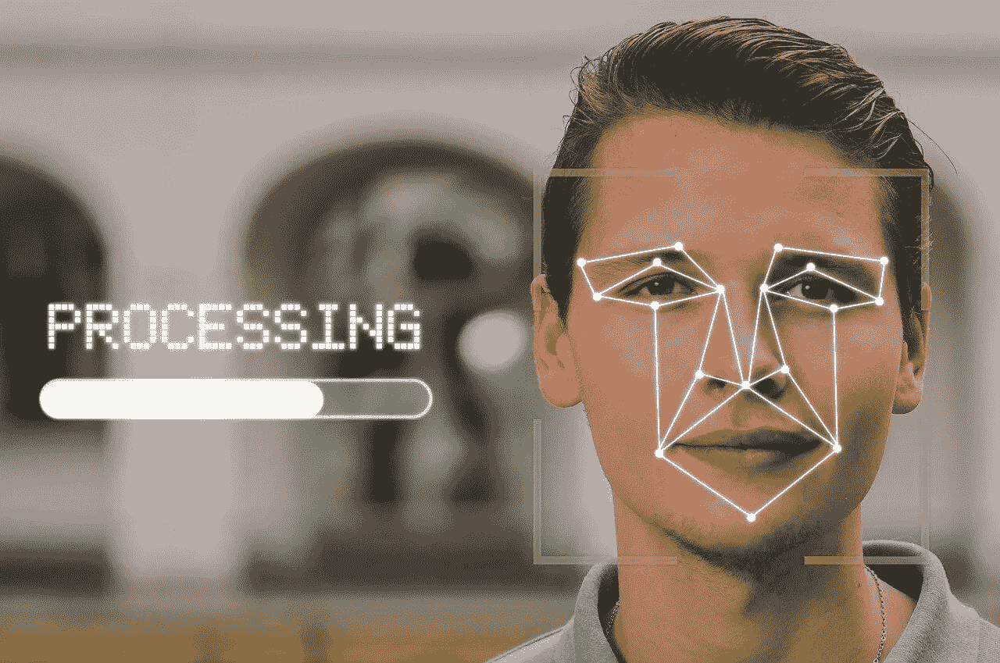
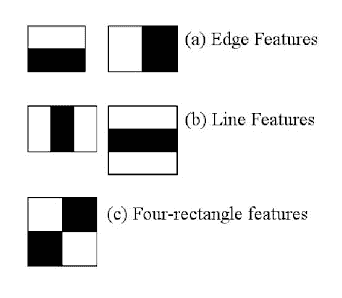
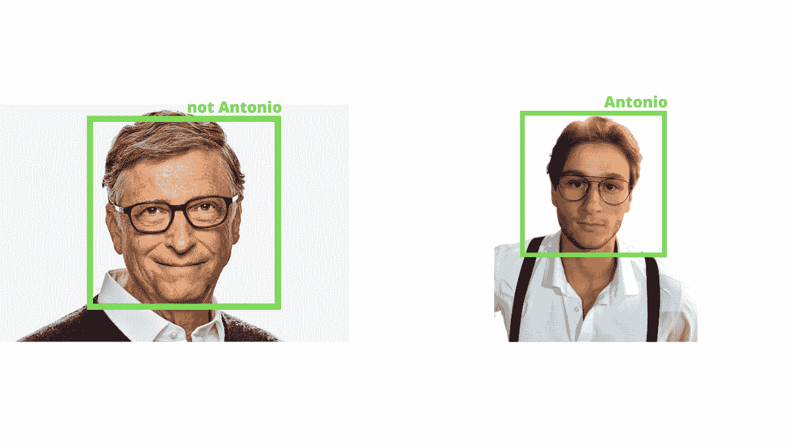

# 人脸检测和人脸识别:让我们看看它们的区别

> 原文：<https://medium.com/analytics-vidhya/face-detection-and-face-recognition-lets-see-the-differences-41428ddb4a06?source=collection_archive---------0----------------------->

你有没有想过手机是怎么通过面部识别解锁的？

如果我告诉你，这是今天大多数相机、智能手机和电脑使用的相同技术，会怎么样？

在这篇文章中，我们将谈论一种遍布全球的技术，据说到 2025 年将达到[85 亿美元。今天我们要讲的是**人脸检测**及其最重要的应用之一:**人脸识别**。](https://www.statista.com/statistics/1153970/worldwide-facial-recognition-revenue/)

您将要阅读的文本不适合更有经验的人，所以请做好准备，因为现在我们将讨论**什么是人脸检测和人脸识别**、**它们如何工作**以及它们的一些**现实应用**。

# 面部检测与面部识别

作为一名行业新手，您可能至少曾经也想知道，*“但是人脸检测和人脸识别是一回事吗？如果不是，它们的区别是什么？”*。

由于这个问题的答案已经可以在这两种技术的名称中找到，所以最好能够更深入地了解这两个主题。

因此，让我们一步一步来，找到问题的根源:

# 什么是人脸检测技术？

你知道吗，作为人类，我们可以通过观察来识别某样东西？为什么我们能够做到这一点？我们会自动这样做，但这是我们从小就学会的。

当然，如果我给你一张人的照片，我相信在短时间内你就能告诉我你在照片中看到的身体部位。

下面这个例子可以帮助你理解什么是面部识别。这种**人工智能**技术可以在给定图像或视频时识别人脸。

时至今日，由于该领域的更多研究以及越来越精确的新算法的出现，真实世界的应用正在增加。我们从简单的面部识别到眼球追踪来计算一个人站着不动看商店橱窗有多长时间。

但是我们要小心！

面部识别，是的，可以识别人的脸，但它不是以我们的方式(或至少是我们大脑的方式)做的。

让我解释一下。

# 人脸检测是如何工作的？

我们正在谈论的技术可以在几个方面实现，其中一些是旧的，另一些是新的，更准确，更快地检测人脸。

**人脸检测算法背后的基本思想是检测人脸的某些特征**。

想想看，如果我让你描述一个人的脸，你第一个想到的是什么？

我打赌你想到了眼睛，是吗？这也是人脸检测算法所做的，即，它分析图像，直到找到人脸的共同特征，如眼睛，然后移动到鼻子，嘴和面部轮廓。

该算法通过逐个像素地分析整个图像来自动完成这项工作，最后，它结合面部的这些特征来预测它。这是其中一种方法，被称为**基于特征的方法**。

但这并没有结束。

我向你描述的是这个想法，但要实现这种方法，你首先需要用相当多的图像来训练你的人脸识别算法。不仅有人脸，还有建筑物、风景等的图像。

只有这样，我们才能有一个同时有效的算法。

# 人脸检测算法:哈尔级联

然而，由于最有经验的[计算机视觉](https://www.antoniofurioso.com/artificial-intelligence/what-is-computer-vision-and-how-does-it-work/)人员的持续研究，近年来出现了许多算法，其中一些比另一些更有前途和更准确。

其中最受欢迎的是 **Haar Cascades** ，这是 Viola 和 Jones 用于刚性物体检测的“增强”算法的子版本。哈尔级联不是最新的，但它是一个很好的基本算法，也是最快的算法之一。

此外，由于 Haar 分类器存在于 **OpenCV 库**中，因此可以很容易地使用它。

*但是它到底是如何工作的呢？*

这种算法使用所谓的“**哈尔特征**”，这是用于识别人脸特征的 5 个矩形。

[*图像来源*](http://www.willberger.org/cascade-haar-explained/)

由于这种方法，该算法可以使用**滑动窗口技术**来识别面部特征，即一种允许你在图像上滑动窗口(或者更确切地说是一个正方形)的技术，以允许该算法一次分析图像的一部分。

为了更好地理解我所说的，我建议你看看这个视频:

我不想深入细节，尤其是数学方面的，因为这篇文章旨在让你理解基本思想，而不是逐个算法地分析(如果你想深入，我可以直接参考[论文](https://www.merl.com/publications/docs/TR2004-043.pdf))。

Haar Cascade 是人脸检测领域中最流行的方法之一，但它不是最好的。事实上，许多其他较新的算法许多算法的性能比所描述的更好，一些例子是 **MTCNN** 、 **FDNet** 、 **RetinaFace** 和 **TinaFace** 。

现在你知道什么是人脸检测和它是如何工作的，我们可以继续下一步，然后去了解人脸识别。

# 什么是人脸识别技术？

*Foto di*[*George Dolgikh @ Giftpundits.com*](https://www.pexels.com/it-it/@george-dolgikh-giftpundits-com-551816?utm_content=attributionCopyText&utm_medium=referral&utm_source=pexels)*da*[*Pexels*](https://www.pexels.com/it-it/foto/persona-che-tiene-smartphone-seduta-bianca-1310532/?utm_content=attributionCopyText&utm_medium=referral&utm_source=pexels)

这个名字听起来熟悉吗？

这听起来很熟悉，因为你几乎肯定会使用这项技术来解锁你的智能手机。好吧，那么让我们不要浪费更多的时间，看看它是什么，它是如何工作的，简而言之。

人脸识别是人脸检测的应用之一。我一开始就告诉过你这两者是相关的，原因如下。

这么说吧，如果没有人脸检测，这项技术是不可能存在的。

基本概念或多或少是相同的，但不是相同的，人脸识别稍微复杂一点，不要与人脸验证混淆，稍后我们将看到二者的区别。

# 人脸识别是如何工作的？

当然，对我们来说，认出一个在某个地方见过的人要容易得多。也许我们甚至可以描述他们的眼睛颜色，头发颜色等。

但是对于人脸识别就不一样了。这项技术使用几何和数学公式来识别一个人，如何实现？

让我们看看。

首先，这项技术将一个人的面部转换成一组数据，称为“*编码*”。这些数据在数据库中传输，并与受试者相关联。

一旦算法将这些数据放入数据库，当它在照片或视频中看到同一张脸时，它将能够识别它。

好吧，但是具体怎么做？

该算法可以通过考虑几何形状来存储面部。那就是两眼之间的距离，可以在一张脸上找到的角度，圆度和其他许多方面。

所有这些数据都被存储起来，以便在您尝试识别人脸时可以访问。

**另请参阅** : [计算机视觉的一个奇妙工具:OpenCV](https://www.antoniofurioso.com/artificial-intelligence/opencv-for-computer-vision/)

# 人脸识别与人脸验证

同样，基本思想是相同的，但两者之间有一个主要区别。

有了**人脸识别系统**，就可以识别多张脸。例如，一些办公室有这个系统来识别他们的员工并允许他们访问。因此，这是一个**一对多系统**，这意味着用一个系统你可以识别多张脸，如果它们已经存储在数据库中。

而**人脸验证是 1:1 技术**，所以只能告诉你那张脸是不是某个人的。最常见的例子就是苹果的 Face ID 或者其他安卓智能手机的人脸验证。

# 人脸识别的伦理问题

面部识别系统在当今世界非常有用，许多国家(如中国)和一些组织(如 FBI)使用面部识别系统来监控或检测罪犯。

这是一个非常有用的系统，但是有一些隐私问题。

让我们以城市为例。这当然使他们更安全，但由于这个系统安装在所有的街道，以维持安全，市民的隐私更少。

想想看，你可以利用这项技术来监视一个公民的全部活动，侵犯他们的自由。此外，您的面部信息是在未经您允许的情况下收集的，并且收集的图像可能用于其他目的。

隐私是实现这些技术的最大问题之一，我认为我们将努力解决这个问题，但与此同时，我们可以享受面部识别的好处，让我们看看其中的一些。

# 应用程序

一些现实世界的应用是:

*   提高城市和机场的安全性
*   你可以使用这些技术来了解一个人花了多长时间在我们商店的橱窗上
*   **社交** **媒体**:人脸识别用于创建过滤器，Snapchat 就是一个例子
*   **解锁智能手机**或保险箱
*   **医疗保健**:你可以监控病人，这样你就可以立即干预
*   识别司机是在看路还是在打电话

# 结论

上面列出的只是这项技术的一些关键例子，你几乎可以肯定地添加更多的例子，它们也是为什么面部检测在今天如此重要的原因。

我希望这篇文章对你理解我们到目前为止谈论的话题有所帮助，请记住，如果你对某些事情不清楚，或者你想要一些更深入的文章，你可以随时在评论中写下。

直到下一次，

安东尼奥。

*原载于*[【https://www.antoniofurioso.com】T21](https://www.antoniofurioso.com/artificial-intelligence/face-detection-and-face-recognition-lets-see-the-differences/)