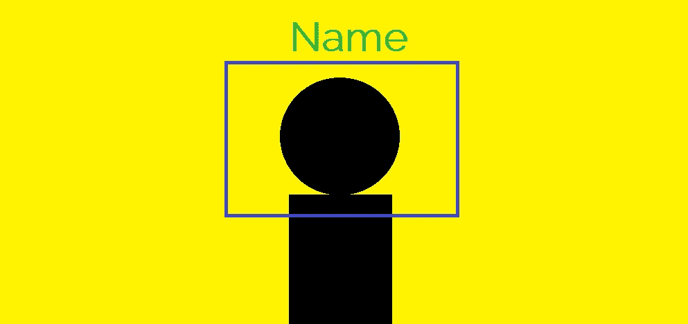

# 从零开始使用 OpenCV 和 KNN 进行人脸检测和识别

> 原文：<https://medium.com/analytics-vidhya/face-detection-and-recognition-using-opencv-and-knn-from-scratch-dcba9b0fd07d?source=collection_archive---------5----------------------->

***【KNN】***是机器学习中最基本的分类算法之一。属于机器学习的 ***监督学习*** 范畴。KNN 经常被用在搜索应用程序中，你在那里寻找*【相似的】物品*。

我们测量相似性的方法是创建项目的向量表示，然后使用适当的距离度量*(例如欧几里德距离)比较向量。*



> 更多关于 KNN:**[**KNN 和 MNIST 手写数字识别入门使用 KNN 从零开始**](/analytics-vidhya/a-beginners-guide-to-knn-and-mnist-handwritten-digits-recognition-using-knn-from-scratch-df6fb982748a)**

*****使用的数据集:***
我们使用的`haarcascade_frontalface_default.xml`数据集可以很容易地从 [***这个链接***](https://github.com/opencv/opencv/tree/master/data/haarcascades) ***下载。*****

*****人脸识别:***
这包括*三个 Python 文件*，其中*第一个*用于检测人脸并以列表格式存储，*第二个*用于存储数据。csv '文件格式，第三个*用于识别人脸。***

*   *****Face detect . py—****人脸检测器***

```
# this file is used to detect face 
# and then store the data of the face 
import cv2 
import numpy as np# import the file where data is 
# stored in a csv file format 
import npwritername = input("Enter your name: ")# this is used to access the web-cam 
# in order to capture frames 
cap = cv2.VideoCapture(0)classifier = cv2.CascadeClassifier("haarcascade_frontalface_default.xml")# this is class used to detect the faces as provided 
# with a haarcascade_frontalface_default.xml file as data 
f_list = []while True: 
 ret, frame = cap.read() 

 # converting the image into gray 
 # scale as it is easy for detection 
 gray = cv2.cvtColor(frame, cv2.COLOR_BGR2GRAY) 

 # detect multiscale, detects the face and its coordinates 
 faces = classifier.detectMultiScale(gray, 1.5, 5) 

 # this is used to detect the face which 
 # is closest to the web-cam on the first position 
 faces = sorted(faces, key = lambda x: x[2]*x[3], 
         reverse = True)# only the first detected face is used 
 faces = faces[:1] 

 # len(faces) is the number of 
 # faces showing in a frame 
 if len(faces) == 1: 
  # this is removing from tuple format  
  face = faces[0] 

  # storing the coordinates of the 
  # face in different variables 
  x, y, w, h = face# this is will show the face 
  # that is being detected  
  im_face = frame[y:y + h, x:x + w]cv2.imshow("face", im_face)if not ret: 
  continuecv2.imshow("full", frame)key = cv2.waitKey(1)# this will break the execution of the program 
 # on pressing 'q' and will click the frame on pressing 'c' 
 if key & 0xFF == ord('q'): 
  break
 elif key & 0xFF == ord('c'): 
  if len(faces) == 1: 
   gray_face = cv2.cvtColor(im_face, cv2.COLOR_BGR2GRAY) 
   gray_face = cv2.resize(gray_face, (100, 100)) 
   print(len(f_list), type(gray_face), gray_face.shape)# this will append the face's coordinates in f_list 
   f_list.append(gray_face.reshape(-1)) 
  else: 
   print("face not found")# this will store the data for detected 
  # face 10 times in order to increase accuracy 
  if len(f_list) == 10: 
   break# declared in npwriter 
npwriter.write(name, np.array(f_list))cap.release() 
cv2.destroyAllWindows()
```

*   *****NP writer . py****—创建/更新’。“csv”文件***

```
import pandas as pd 
import numpy as np 
import os.pathf_name = "face_data.csv"# storing the data into a csv file 
def write(name, data):if os.path.isfile(f_name):df = pd.read_csv(f_name, index_col = 0)latest = pd.DataFrame(data, columns = map(str, range(10000))) 
  latest["name"] = namedf = pd.concat((df, latest), ignore_index = True, sort = False)else:# Providing range only because the data 
  # here is already flattened for when 
  # it was store in f_list 
  df = pd.DataFrame(data, columns = map(str, range(10000))) 
  df["name"] = namedf.to_csv(f_name)
```

*   *****recog . py****—人脸识别器***

```
# this one is used to recognize the 
# face after training the model with 
# our data stored using knn 
import cv2 
import numpy as np 
import pandas as pd
import operator
from operator import itemgetterfrom npwriter import f_name def euc_dist(x1, x2):        
    return np.sqrt(np.sum((x1-x2)**2))class KNN:    
def __init__(self, K=3):        
    self.K = K    
def fit(self, x_train, y_train):        
    self.X_train = x_train        
    self.Y_train = y_train    
def predict(self, X_test):        
    predictions = []        
    for i in range(len(X_test)):                        
        dist = np.array([euc_dist(X_test[i], x_t) for x_t in self.X_train])            
        dist_sorted = dist.argsort()[:self.K]            
        neigh_count = {}            
        for idx in dist_sorted:                
            if self.Y_train[idx] in neigh_count:
                    neigh_count[self.Y_train[idx]] += 1 
               else:   
                 neigh_count[self.Y_train[idx]] = 1
        sorted_neigh_count = sorted(neigh_count.items(), key=operator.itemgetter(1), reverse=True)
        predictions.append(sorted_neigh_count[0][0])        
    return predictions# reading the data 
data = pd.read_csv(f_name).values# data partition 
X, Y = data[:, 1:-1], data[:, -1]print(X, Y)# Knn function calling with k = 5 
model = KNN(K = 5) # fdtraining of model 
model.fit(X, Y)cap = cv2.VideoCapture(0)classifier = cv2.CascadeClassifier("haarcascade_frontalface_default.xml")f_list = []while True:ret, frame = cap.read()gray = cv2.cvtColor(frame, cv2.COLOR_BGR2GRAY)faces = classifier.detectMultiScale(gray, 1.5, 5)X_test = []# Testing data 
 for face in faces: 
  x, y, w, h = face 
  im_face = gray[y:y + h, x:x + w] 
  im_face = cv2.resize(im_face, (100, 100)) 
  X_test.append(im_face.reshape(-1))if len(faces)>0: 
  response = model.predict(np.array(X_test)) 
  # prediction of result using knnfor i, face in enumerate(faces): 
   x, y, w, h = face# drawing a rectangle on the detected face 
   cv2.rectangle(frame, (x, y), (x + w, y + h), 
          (255, 0, 0), 3)# adding detected/predicted name for the face 
   cv2.putText(frame, response[i], (x-50, y-50), 
       cv2.FONT_HERSHEY_DUPLEX, 2, 
          (0, 255, 0), 3) 

 cv2.imshow("full", frame)key = cv2.waitKey(1)if key & 0xFF == ord("q") : 
  breakcap.release() 
cv2.destroyAllWindows()
```

> **我知道一下子很难接受。但是你坚持到了最后！恭喜你。不要忘记看看我即将发表的文章！**

# **其他资源和参考**

**[](/analytics-vidhya/a-beginners-guide-to-knn-and-mnist-handwritten-digits-recognition-using-knn-from-scratch-df6fb982748a) [## 从头开始使用 KNN 识别 KNN 和 MNIST 手写数字的初学者指南

### MNIST(“修改后的国家标准和技术研究所”)是事实上的“你好世界”数据集的计算机…

medium.com](/analytics-vidhya/a-beginners-guide-to-knn-and-mnist-handwritten-digits-recognition-using-knn-from-scratch-df6fb982748a) [](/analytics-vidhya/celebrity-face-recognition-using-knn-from-scratch-76287bdab088) [## 从零开始使用 KNN 的名人人脸识别

### 你能从下面的图片中找出你最喜欢的名人吗？当然可以！计算机是如何完成同样的任务的…

medium.com](/analytics-vidhya/celebrity-face-recognition-using-knn-from-scratch-76287bdab088) [](https://www.geeksforgeeks.org/ml-implement-face-recognition-using-k-nn-with-scikit-learn/) [## ML |使用 k-NN 和 scikit-learn - GeeksforGeeks 实现人脸识别

### ML |使用 k-NN 和 scikit 实现人脸识别-学习 k-最近邻:k-NN 是最基本的…

www.geeksforgeeks.org](https://www.geeksforgeeks.org/ml-implement-face-recognition-using-k-nn-with-scikit-learn/) 

***完整代码实现:***

[](https://github.com/tanvipenumudy/Winter-Internship-Internity/tree/main/Day%2008/Face%20Recognition%20with%20OpenCV%20%2B%20KNN) [## tanvipenumudy/Winter-实习-实习

### 存储库跟踪每天分配的工作-tanvipenumudy/Winter-实习-实习

github.com](https://github.com/tanvipenumudy/Winter-Internship-Internity/tree/main/Day%2008/Face%20Recognition%20with%20OpenCV%20%2B%20KNN) 

> 希望你喜欢并充分利用这篇文章！敬请关注我即将发布的博客！如果你觉得我的内容有帮助/有帮助，请确保**鼓掌**和**跟着**！**