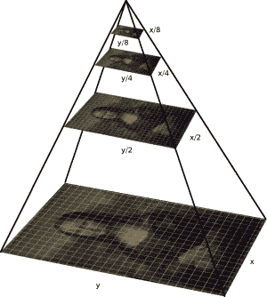
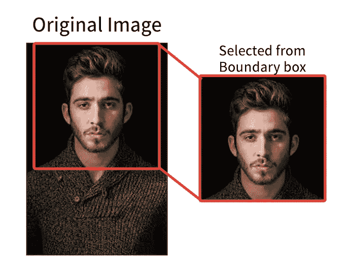
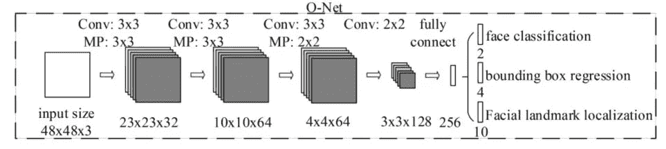
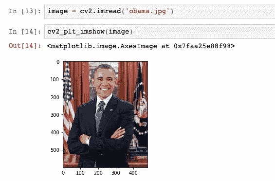
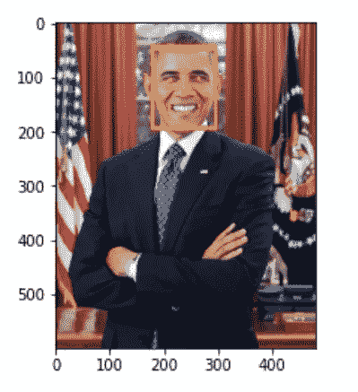

# 简化的人脸检测

> 原文：<https://medium.com/analytics-vidhya/face-detection-simplified-5e0aeb729d3d?source=collection_archive---------25----------------------->

我们看过各种间谍和科幻电影，其中一些秘密服务的监视系统通过搜索或识别他们的数据库来匹配一个身份不明的个人。我们也购买了许多使用面部识别和游戏体验的玩具游戏。

在现实世界中，办公室安全、签证和移民、员工出勤的身份验证系统使用人脸生物识别技术。面部识别也用于从通过闭路电视捕获的图像/视频中识别商店扒手。随着移动设备将人脸识别作为无处不在的解锁手机的方式，它也成为了一种非常常见的家居用品。

这篇博文通过一个例子来解释人脸生物识别技术是如何用于人脸检测、识别和验证的。

**多任务级联卷积网络**

人脸检测是指识别图像或视频中的人脸。脸书标签是一个很好的例子。人脸识别是一种使用人脸生物特征与数据库进行匹配的方法，而人脸验证是一种一对一的匹配，用于认证或验证给定身份的声明。有各种库和算法来执行面部检测。然而，多任务级联卷积网络(MTCNN)是最流行和易于使用的 ML 库之一，它提供了具有非常高精确度的人脸检测。这是一个非常轻的重量检测器，由于它有较短的推理时间。

MTCNN 算法由 3 个阶段组成，从图像中检测人脸的包围盒并识别 5 个点标志。

**阶段 1** :图像被缩小以创建图像金字塔，由此每个缩小的版本通过 CNN。



图像金字塔缩小

**阶段 2** :提取包围盒的图像块



包围盒

**阶段 3** :计算标志点(口左、口右、左眼、右眼、鼻子)


标志点检测

总的来说，MTCNN 的 3 个阶段总结如下:



MTCNN 的 python 实现的 Github 链接可在[https://github.com/ipazc/mtcnn](https://github.com/ipazc/mtcnn)获得。它基于论文 [FaceNet:人脸识别和聚类的统一嵌入](https://arxiv.org/abs/1503.03832)

*环境细节*:康达 Python3

> pip install mtcnn #用于安装 mtcnn 库
> 
> pip 安装 tensorflow #tensorflow 用于运行 mtcnn 算法
> 
> pip 安装 cv2-PLT-im show #用于笔记本显示图像

将任何图像下载到服务器。我从维基百科下载了下面的图片:[https://upload . wikimedia . org/Wikipedia/commons/thumb/8/8d/President _ Barack _ Obama . jpg/800 px-President _ Barack _ Obama . jpg](https://upload.wikimedia.org/wikipedia/commons/thumb/8/8d/President_Barack_Obama.jpg/800px-President_Barack_Obama.jpg)



一旦您成功地将图像加载到 cv2 或任何其他处理库中，您就可以创建一个用于面部和标志检测的检测器对象。

> detector = mt CNN()
> faces = detector . detect _ faces(image)
> for face in faces:
> print(face)

这将返回一个 json 对象，带有面部边界框、置信度得分和其他关键点(界标):

```
{'box': [178, 45, 118, 148], 'confidence': 0.9990620017051697, 'keypoints': {'left_eye': (213, 103), 'right_eye': (264, 104), 'nose': (237, 132), 'mouth_left': (209, 153), 'mouth_right': (266, 153)}}
```

现在，为了直观显示，我们将创建一个函数，以参数化的方式获取这些值:

> def create _ bounding _ box(image):
> faces = detector . detect _ faces(image)
> bounding _ box = faces[0][' box ']#在我们的情况下获得唯一的一个图像
> key points = faces[0][' key points ']
> 
> cv2 . rectangle(image，(bounding_box[0]，bounding_box[1])，
> (bounding _ box[0]+bounding _ box[2]，bounding _ box[1]+bounding _ box[3])

这里 cv2.rectangle 是从 openCV 库中获得的，openCV 库通常用于计算机视觉问题，定义如下以绘制矩形，其中起点和终点解释如下

*cv2.rectangle(图像，起点，终点，颜色，厚度)*

```
cv2.rectangle(img, (x1, y1), (x2, y2), (255,0,0), 2)

x1,y1 ------
|          |
|          |
|          |
--------x2,y2
```

同样，cv2.circle 用于在任何图像上画一个圆。

`image **=**` `cv2.circle(image, center_coordinates, radius, color, thickness)`

> image _ with _ markers = create _ bounding _ box(image)#方法调用
> 
> cv2 _ PLT _ im show(image _ with _ markers)#用矩形和圆形显示图像

正如你在下面看到的，下面显示了代表面部和面部标志的边界框。



现在，作为下一步，这一基本逻辑可用于使用一些相似性距离度量(如余弦)或警报系统(入侵者)将面部生物特征与其他图像进行匹配，该警报系统根据相机中检测到的面部采取行动。这可以进一步用于构建企业级用例，如考勤系统、监控、刑事调查等。