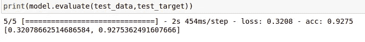

# 基于开放 CV 和 CNN 的实时人脸检测

> 原文：<https://medium.com/analytics-vidhya/face-mask-detection-in-real-time-by-using-open-cv-and-cnn-a176755ba885?source=collection_archive---------11----------------------->

> 人类的眼睛有 575 百万像素，让我们评估一下拥有 1/100 百万像素的机器视频摄像头，它的检测速度有多快

本项目中使用的数据集总共有 1376 幅图像，分为两类，即带遮罩和不带遮罩。目标是通过使用 Open CV 和 Harr Cascade 以及深度学习 CNN 模型来训练这些图像，以便它可以在实时场景中检测视频中的人是否戴着面具。

让我们看看我们将遵循的面具检测步骤。

1.  从保存图像的文件夹中读取日期设置图像

存储面罩分类图像的路径

2.让我们看看贴有标签的图片

这些数据包含了世界上大多数种族的图像

带有遮罩图像

没有遮罩图像

3.从描述的路径中读取所有图像，并执行灰度缩放和标签分类。

来自基于标签类别指定的路径的图像的灰度

4.以数组-1D 的形式重塑数据，使范围从 0 到 255。

我们已经将 RGB 图像转换为灰度图像，用于训练我们需要将图像转换为数组矩阵的图像，以使列和行表示一个数字。对于 1D 数组，范围是从 0 到 255，所以让我们将图像划分到一个数组中。

使用 numpy 将灰度图像转换成从 0 到 255 的数组

5.为神经网络模型准备卷积层

将图像转换为数组后，数据和目标来自其存储位置

它有以下几层

顺序模型和 CNN 模型中使用的各种层次。

6.将数据分为训练和测试，10%的数据用于测试，90%的数据用于训练。

训练和测试数据分割。

7.使用之前设计的 CNN 模型对模型进行训练。

发现模型精确度超过 97%。

根据大小为 20 的纪元进行模型准备和训练。

发现模型精确度超过 97%-模型 16

8.绘制培训和验证准确度图。

训练准确性

列车验证损失

9.打印评估结果

评估结果显示准确率为 92%

10.加载训练结果中获得的最佳模型，启动摄像机进行检测

使用模型 16，因为它是培训期间看到的最好的模型之一，也使用 harr cascade xml

哈尔喀斯喀特正面脸。xml 由 OpenCV 库中用于图像检测的预训练分类器组成。在这里，我们用它来检测正面人脸。更多关于哈卡斯卡德的信息，请点击此处

[https://github . com/opencv/opencv/blob/master/data/haarcascades/haarcascade _ frontal face _ default . XML](https://github.com/opencv/opencv/blob/master/data/haarcascades/haarcascade_frontalface_default.xml)

哈尔喀斯喀特正面脸。xml 文件可以从这里下载:-

[https://github . com/opencv/opencv/blob/master/data/haarcascades/haarcascade _ frontal face _ default . XML](https://github.com/opencv/opencv/blob/master/data/haarcascades/haarcascade_frontalface_default.xml)

11.实时人脸面具检测。

这里的主要思想是，我们已经训练了带有和不带有蒙版的图像的神经网络，记忆是以模型的形式存储的。我们使用型号 16，因为它在上面显示的所有型号中精度最高。

步骤:-

1.  通过打开 cv 读取视频捕获，并对图像帧进行灰度缩放。
2.  将图像大小调整为数组
3.  使用该模型来预测来自视频捕获的图像
4.  使用已定义的标签，无论是“遮罩”还是“无遮罩”,分别以轮廓“绿色”或“红色”显示。
5.  根据场景实时显示视频和面部轮廓的标签..

用于实时面罩检测。

12.实时评估结果。

没有面具的时候

带面具

【https://youtu.be/t0bf3pFzCZk】视频链接:-

**结论:-** 使用开放 CV 和 CNN 可以真正用于实时的人脸面具检测。

**参考文献:-**

1.  关于面具检测的论文-[https://www.irjet.net/archives/V7/i8/IRJET-V7I8530.pdf](https://www.irjet.net/archives/V7/i8/IRJET-V7I8530.pdf)
2.  关于 CNN-[https://towards data science . com/a-comprehensive-guide-to-convolutionary-neural-networks-the-Eli 5-way-3bd2b 1164 a53](https://towardsdatascience.com/a-comprehensive-guide-to-convolutional-neural-networks-the-eli5-way-3bd2b1164a53)
3.  关于 Harr cascade-[https://github . com/opencv/opencv/blob/master/data/Haar cascades/Haar cascade _ frontal face _ default . XML](https://github.com/opencv/opencv/blob/master/data/haarcascades/haarcascade_frontalface_default.xml)
4.  完整代码:-[https://github . com/saish 15/Machine-Learning/blob/master/Face _ mask _ detection . ipynb](https://github.com/saish15/Machine-Learning/blob/master/Face_mask_detection.ipynb)