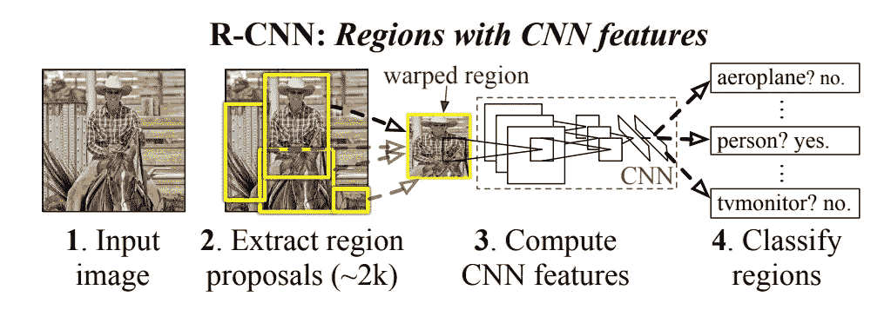
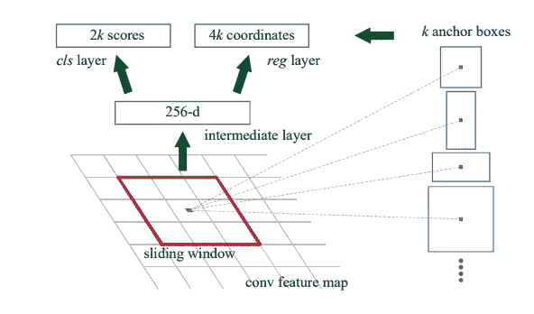
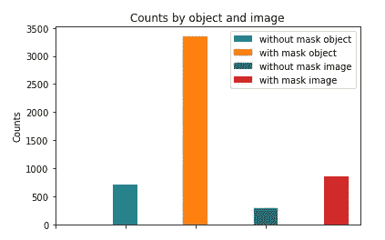
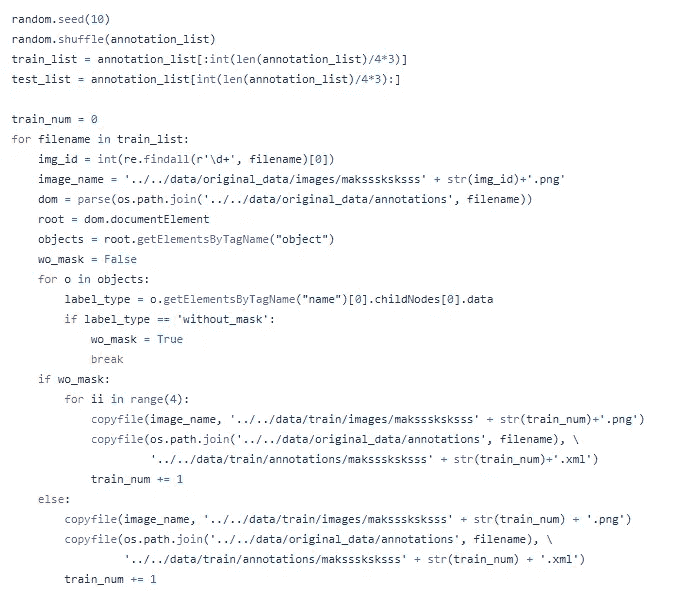
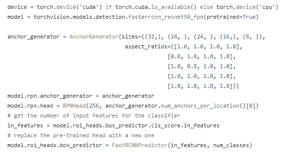
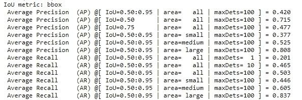
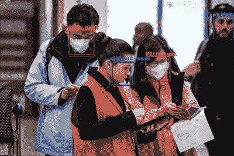

# 基于快速 RCNN 的人脸面具检测

> 原文：<https://medium.com/analytics-vidhya/face-mask-detection-using-faster-rcnn-2df35f53cce8?source=collection_archive---------20----------------------->

快速 RCNN 是检测 2D 彩色图像中目标的有效工具。该模型在 [TPAMI 2016](http://papers.neurips.cc/paper/5638-faster-r-cnn-towards-real-time-object-detection-with-region-proposal-networks.pdf) 中首次提出，是对之前 [RCNN](https://openaccess.thecvf.com/content_cvpr_2014/html/Girshick_Rich_Feature_Hierarchies_2014_CVPR_paper.html) 和 [Fast RCNN](https://openaccess.thecvf.com/content_iccv_2015/html/Girshick_Fast_R-CNN_ICCV_2015_paper.html) 工作的改进，通过引入深度区域提议网络。

来自原始 RCNN 工作的检测模型。

深层区域建议网络(RPN)从原来更快的 RCNN 工作。

在本文中，我们讨论了如何使用更快的 RCNN 网络来解决使用 [Kaggle 数据集的二进制人脸面具检测问题。](https://www.kaggle.com/andrewmvd/face-mask-detection)在这个 GitHub [资源库](https://github.com/adoskk/KaggleFaceMaskDetection)上可以找到 PyTorch 的完整实现和预训练模型。

Kaggle 数据集包含 853 张带有相应 xml 注释的图像。每个注释包含边界框坐标信息，以及不同的遮罩类型。数据集中有三种不同的掩码类型:a)带掩码；b)不带面罩；c)面罩佩戴不正确。我们简单地使用 a)和 b)作为原型。

在培训之前，让我们浏览一下数据集，看看班级分布。我们从两个角度来考察:a)从对象层次的类分布；b)图像层面的类别分布。

上面的结果显示数据集是高度不平衡的，如果在对象级别和图像级别上都有“带遮罩”组,“不带遮罩”组几乎是 1/4。一个简单的解决方案是在训练数据中将“无掩码”组过采样 4，同时保持测试数据不变。为了简单起见，我们以 3:1 的比例分割训练和测试数据。

split_dataset.py 中包含分割数据集和过采样的代码

模型设置遵循 PyTorch 官方网站上的教程:[https://py torch . org/tutorials/intermediate/torch vision _ tutorial . html](https://pytorch.org/tutorials/intermediate/torchvision_tutorial.html)

让我们快速讨论一下这个模型是如何工作的。

首先，主干模型是在 [COCO 数据集](https://cocodataset.org/)上预先训练的 resnet50 网络。一旦训练完毕，resnet50 网络层将被冻结，不会进一步训练。

如前所示，对于每个像素，给出了 n 个不同的锚定框。我们设置 k=5，比例为 32、24、24、16、8，纵横比不同。默认的特征映射包含 256 个通道，我们在 [RPNHead 类](https://github.com/pytorch/vision/blob/master/torchvision/models/detection/rpn.py)中设置输入通道数= 256。

在我们的例子中 k=5。由于输入特征映射包含 256 个通道，我们设置 RPNHead 输入通道= 256。

由于特征生成层是固定的，唯一需要改变的是 cls 和 reg 层，这就是为什么这里引入了一个新的 [FastRCNNPredictor 类](https://github.com/pytorch/vision/blob/master/torchvision/models/detection/faster_rcnn.py)。

主模型的快照。

评估和结果。

我们遵循教程并使用 COCO 评估指标，这里是训练 20 个时期后的测试结果。

最高的 AP 和 AR 几乎达到 80%。

这是测试结果的快照。

