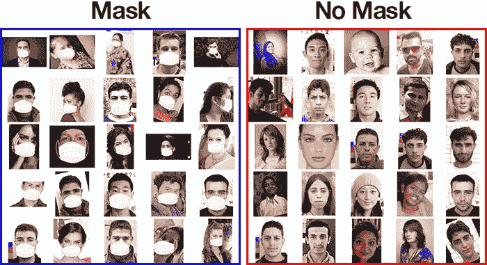
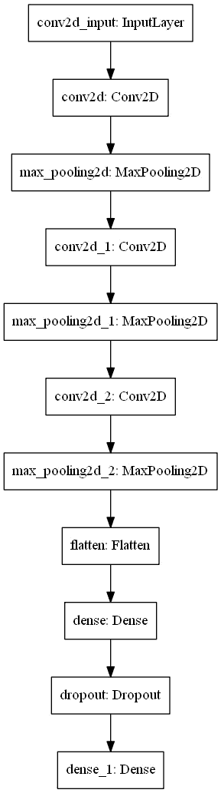
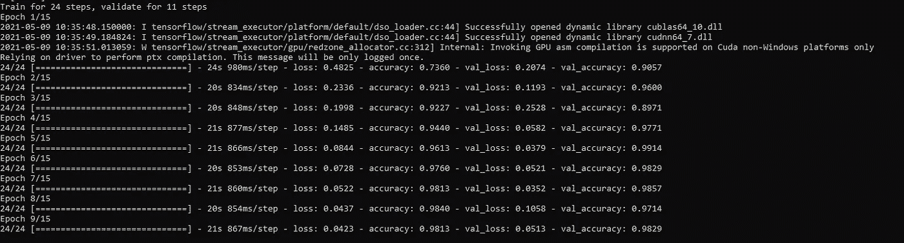
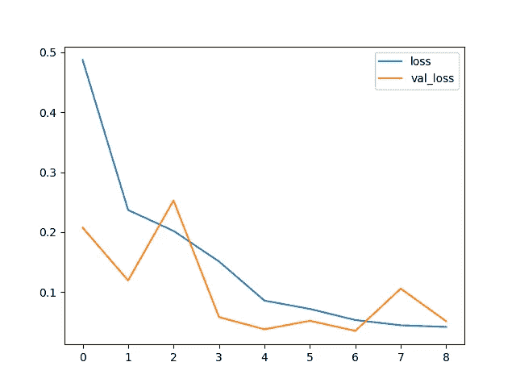
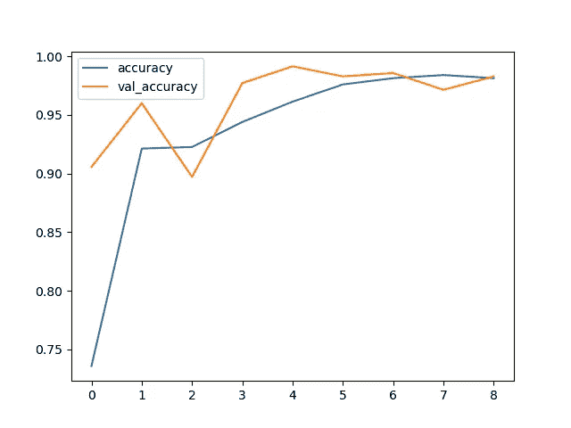

# 基于张量流的人脸面具识别

> 原文：<https://medium.com/analytics-vidhya/face-mask-recognition-using-tensorflow-dbccbf8653d9?source=collection_archive---------4----------------------->



在这篇博客中，我将一步一步地分享如何利用 tensorflow 创建一个人工智能模型的教程，该模型应该能够发现一个人是否戴着面具。

# 步骤 1:下载数据集

我使用的数据集取自 Kaggle 人脸面具数据集。您可以点击 [*这里的*](https://bit.ly/3f8c7aG) 下载数据集。

# 步骤 2:创建 config.py 文件

调整模型训练过程需要对模型的预定义参数进行一些更改。我已经创建了一个配置文件来在培训前进行这些更改，它保持了代码文件的整洁。

config.py

```
DATASET_DIR = ‘PASTE_LOCATION_OF_DATASET_HERE’IMG_WIDTH = 300
IMG_HEIGHT = 300
BATCH_SIZE = 32
EPOCHS=15MODELS_PATH = ‘./models/’ # Models will be saved to this folder
```

# 步骤 3:训练模型

I .导入库

```
import warningsimport sys
import os
import timeimport pandas as pd
import matplotlib.pyplot as plt
import tensorflow as tffrom tensorflow.keras.models import Sequential
from tensorflow.keras.layers import Dense, Conv2D, MaxPooling2D, Flatten, Dropout
from tensorflow.keras.preprocessing.image import ImageDataGenerator, load_img, img_to_array, array_to_img
from tensorflow.keras.callbacks import EarlyStopping
```

二。加载数据集

因为我们已经将数据分为训练和验证，保存在不同的文件夹中。我已经使用 tensorflow 中的[*imagedata generator*](https://www.tensorflow.org/api_docs/python/tf/keras/preprocessing/image/ImageDataGenerator)来加载数据集。

```
# cfg is config (see import)
images_root_directory = cfg.DATASET_DIR
train_path = ‘Train/’
val_path = ‘Validation/’# loaded from config
IMG_WIDTH = cfg.IMG_WIDTH
IMG_HEIGHT = cfg.IMG_HEIGHT
batch_size = cfg.BATCH_SIZE
epochs = cfg.EPOCHSfull_train_path = images_root_directory + train_path
full_val_path = images_root_directory + val_path# load data using ImageDataGenerator
train_datagen = ImageDataGenerator(rescale=1./255, horizontal_flip=True)
test_datagen = ImageDataGenerator(rescale=1./255)train_generator = train_datagen.flow_from_directory(
 full_train_path,
 target_size=(IMG_WIDTH, IMG_HEIGHT),
 batch_size=batch_size,
 shuffle=True,
 class_mode=’categorical’)
validation_generator = test_datagen.flow_from_directory(
 full_val_path,
 target_size=(IMG_WIDTH, IMG_HEIGHT),
 batch_size=batch_size,
 class_mode=’categorical’)
```

三。准备模型

我使用了 3 层 [*卷积*](https://www.tensorflow.org/api_docs/python/tf/keras/layers/Conv2D) ，然后是一个 [*展平*](https://www.tensorflow.org/api_docs/python/tf/keras/layers/Flatten) 层，接着是两个 [*密集*](https://www.tensorflow.org/api_docs/python/tf/keras/layers/Dense) 层。最终致密层有 2 个节点，由 [*softmax*](https://www.tensorflow.org/api_docs/python/tf/keras/activations/softmax) 激活组成。

```
def get_model(IMG_WIDTH, IMG_HEIGHT, NUM_CHANNELS=3):
    model = Sequential()
    # Conv layer 1
    model.add(Conv2D(16, (3,3), activation=’relu’, input_shape=       (IMG_WIDTH, IMG_HEIGHT, NUM_CHANNELS)))
    model.add(MaxPooling2D())
    # Conv layer 2
    model.add(Conv2D(16, (3,3), activation=’relu’))
    model.add(MaxPooling2D())
    # Conv layer 3
    model.add(Conv2D(16, (3,3), activation=’relu’))
    model.add(MaxPooling2D())
    # Flatten
    model.add(Flatten())
    # Fully Connected
    model.add(Dense(32, activation=’relu’))
    model.add(Dropout(0.5))
    # Output
    model.add(Dense(2, activation=’softmax’))
    model.compile(loss=’categorical_crossentropy’, optimizer=’adam’,  metrics=[‘accuracy’])
    return model
```



模型架构

四。拟合模型

Get model 函数返回一个模型对象，该对象可用于拟合加载的数据。我还实现了一个 [*提前停止*](https://www.tensorflow.org/api_docs/python/tf/keras/callbacks/EarlyStopping) 回调，如果验证损失停留在相同的值，就停止训练过程。

```
model = get_model(IMG_WIDTH, IMG_HEIGHT)# early-stop to prevent overfitting
early_stop = EarlyStopping(monitor=’val_loss’, patience=2)
# fit model to data generator
model_history = model.fit_generator(train_generator, epochs=epochs, validation_data=validation_generator, callbacks=[early_stop])# plot loss and accuracy
history = pd.DataFrame(model_history.history)
history[[‘loss’, ‘val_loss’]].plot()
plt.show()
history[[‘accuracy’, ‘val_accuracy’]].plot()
plt.show()
```



培训过程



每次迭代的培训/验证损失



每次迭代的培训/验证准确性

动词 （verb 的缩写）保存模型

```
def save_model(model, models_path):
    if not os.path.exists(models_path):
      os.makedirs(models_path)
    timestr = time.strftime(“%Y%m%d_%H%M%S”)
    model_file_name = ‘MODEL_’ + timestr
    model.save(models_path+model_file_name+’.h5')models_path = cfg.MODELS_PATH
save_model(model, models_path)
print(‘Model Saved.’)
```

# 结论

最后，我们有一个模型，可以将图像分类为遮罩/无遮罩。我们可以准备一个推理管道来为模型服务。可以访问我的 [*github 库*](https://github.com/iamrajatroy/face-mask-recognition) 看推理代码。也可以看[试玩](https://www.youtube.com/watch?v=TlrxpqBF_1w)。