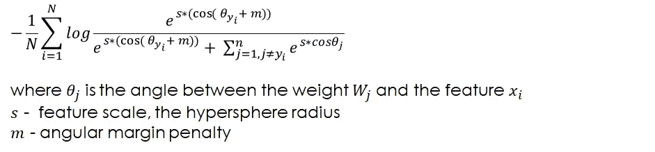

# 人脸识别和 ArcFace:深度人脸识别的附加角裕度损失

> 原文：<https://medium.com/analytics-vidhya/face-recognition-and-arcface-additive-angular-margin-loss-for-deep-face-recognition-44abc56916c?source=collection_archive---------0----------------------->

> 最广泛使用的多类分类损失函数是分类交叉熵损失，也称为 SoftMax 损失，即 SoftMax 激活之后是交叉熵损失。但是，它是否明确地最大化了类的可分性？

在本文中，您将发现一种 ArcFace 方法，这种方法可以获得用于人脸识别的高区分度特征。阅读本文后，您将了解:

*   人脸识别任务是如何工作的。
*   如何计算人脸匹配？
*   SoftMax 和 ArcFace 的直观区别。
*   弧面的几何解释。
*   ArcFace 背后的数学。

本文假设您已经熟悉用于多类分类、检测和 SoftMax 损失的卷积神经网络概念，并重点关注人脸识别任务和 ArcFace 方法。

# **人脸识别任务**

在我们深入研究 ArcFace 方法之前，让我们首先了解一下人脸识别任务是如何工作的，以及我们为什么需要它。

**人脸识别**是识别或验证图像中一张或多张人脸的任务。我们希望在图像中识别人脸的原因有很多:机场安检可以验证乘客的面部与其护照上的面部是否匹配，脸书可以识别并标记图像中的人，在工作场所，我们希望只允许授权人员进入。

**验证任务**是比较两张人脸并检查它们是否是同一个人的任务。

**识别任务**是将给定的人脸与存储的人脸数据库进行比较和识别的任务。

人脸识别的过程通常包括 3 个主要步骤:检测图像中的人脸、特征提取和人脸匹配。

# **人脸匹配**

## **特征嵌入**

用于分类的典型 CNN 包括特征提取和分类。在训练期间，模型学习独特的面部特征，并在特征提取过程中产生特征嵌入。一旦训练完成，就可以跳过分类部分，对每张人脸图像产生特征嵌入，就像一个数字“指纹”。考虑嵌入向量的另一种方法是将高维数据转换成相对低维的数据。

这些嵌入帮助我们通过使用余弦相似性或两个向量之间的平方距离来理解两个人之间是否存在相似性。

同一个人的两个不同图像的向量将具有高相似性和低距离，而不同人的两个图像将具有低相似性和大平方距离。

现在，给定两张人脸图像，在我们检测并裁剪人脸后，我们可以通过 ArcFace 模型处理它们，这将产生两个特征嵌入。一旦我们得到两个嵌入向量，我们将能够计算它们之间的余弦相似度或平方距离，并确定这两幅图像是否是同一个人。

人脸验证的通用流水线，其中分类器损失函数用于训练，相似性判别式用于获得最终的验证精度，来源:[深度学习中的指数判别式度量嵌入](https://www.researchgate.net/publication/323025952_Exponential_Discriminative_Metric_Embedding_in_Deep_Learning)

## **余弦相似度**

余弦相似度的范围在-1 和 1 之间。在内积空间中，这是两个向量之间的方向(而不是大小)相似性的度量，这两个向量不是零向量。余弦相似度等于两个向量之间的余弦，并且与两个归一化向量之间的内积相同:

*   如果两个向量方向相同，余弦相似度为 1
*   如果两个向量成 90 度角，余弦相似度为 0
*   如果它们相反，那么余弦相似度是-1

ArcFace 的人脸识别演示，来源:**[https://www.youtube.com/watch?v=y-D1tReryGA&t = 16s](https://www.youtube.com/watch?v=y-D1tReryGA&t=16s)**

**边界框旁边的条是余弦相似度，表示人脸图像的内方差。**

# ****SoftMax vs ArcFace****

**在标准分类网络中，通常在网络的末端使用 SoftMax 和分类交叉熵损失。SoftMax 将数字转换成概率。对于每个对象，它给出了每个类的概率总和为 1。一旦训练完成，选择概率最高的类。分类交叉熵损失计算两个概率分布之间的差异，并在训练期间的反向传播过程中被最小化。**

**SoftMax 的缺点是它不能产生安全余量，这意味着边界有点模糊。我们希望同一个人的两幅图像的向量尽可能相似，两个不同的人的两幅图像的向量尽可能不同。这意味着我们想创造利润，就像 SVM 一样。**

**看看下面的例子。这里，我们看到 MNIST 数字的特征嵌入。值得注意的是，与 Arcface 要素嵌入相比，SoftMax 要素的边界相对模糊:**

****

**https://github.com/4uiiurz1/keras-arcface/，ArcFace vs SoftMax，来源:**

****

**用 ArcFace 学习了 MNIST 的功能，来源:[https://youtu.be/tgnitF1irVM](https://youtu.be/tgnitF1irVM)**

# ****弧面的几何解释****

**ArcFace 不使用欧几里得距离，而是计算超球面上的测地线距离。测地线空间是所有距离都由轨道测量的空间。两点之间获得的轨迹称为测地线轨迹。它描述了两点之间的最短距离，也称为测地线距离。**

**在下图中，我们可以看到 ArcFace 的几何解释:**

**(a)角度和弧边之间的直观对应。弧面的角边对应于超球面上的测地线距离&弧边。**

**(b)蓝色和绿色点代表来自两个不同类别的嵌入特征。ArcFace 可以直接在类之间施加角度(弧)边距。**

****

**来源: [DeepAI](https://deepai.org/publication/arcface-additive-angular-margin-loss-for-deep-face-recognition)**

# ****弧面背后的数学原理****

**这是 SoftMax 损失函数，通常用于多类分类任务:**

****

**这是弧面损失函数:**

****

**您可以看到，两个损失函数之间的唯一差异是 logit，即 SoftMax 的功效，并且余量被添加到地面真实值。**

**让我们观察一下如何从 SoftMax logit 进入 ArcFace logit。**

**为方便起见，假设偏差为零。使用计算两个向量之间角度的公式，我们知道两个向量之间的内积等于以下表达式:**

****

**我们想提取θ。为此，我们将 w 和 x 归一化，使它们的大小都为 1:**

****

**我们得到了这个等式:**

****

**为了提取 theta，我们计算两边的 arccos 并获得 theta:**

****

**现在，我们给角度加上余量，例如 0.5，并计算它的余弦。最终，我们将此乘以 ***s*** ，例如，超球面上的半径为 30，我们得到弧面的 logit:**

****

**在下图中，您可以看到弧面损失的构成，步骤如上所述:**

****

**归一化 x 和 w 很重要！它基本上迫使预测仅依赖于角度，因此嵌入分布在半径 s 内的超球面上。**

# ****结论****

**我们已经讨论了人脸识别任务和 ArcFace 方法。在实践中，弧面损失改变了 SoftMax 的 logit，并且由于它与超球面上的测地线距离的精确对应，它具有清晰的几何解释。由于归一化的权重和特征，弧面损失最大化了裕度，即超球面上测地线空间的决策边界。它获得用于人脸识别的高鉴别特征，并且可以容易地以可忽略的计算开销来实现。**

# **参考**

> **[https://arxiv.org/pdf/1801.07698.pdf](https://arxiv.org/pdf/1801.07698.pdf)**
> 
> **[https://machine learning mastery . com/人脸识别深度学习简介/](https://machinelearningmastery.com/introduction-to-deep-learning-for-face-recognition/)**
> 
> **[https://medium . com/Apache-mxnet/onnx-model-zoo-developing-a-face-recognition-application-with-onnx-models-64 eed db 9 c7a](/apache-mxnet/onnx-model-zoo-developing-a-face-recognition-application-with-onnx-models-64eeeddb9c7a)**