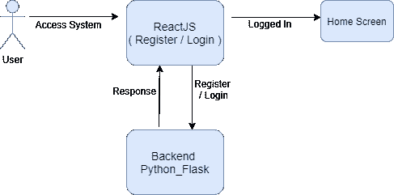
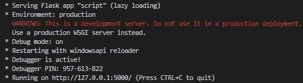
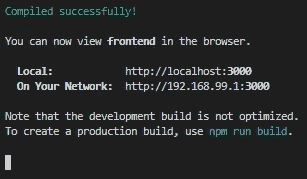

# 使用 ReactJS 和 OpenCV 进行人脸识别登录

> 原文：<https://medium.com/analytics-vidhya/face-recognition-login-using-reactjs-and-computer-vision-e98a892fd4ef?source=collection_archive---------1----------------------->


约翰·努南在 [Unsplash](https://unsplash.com?utm_source=medium&utm_medium=referral) 上拍摄的照片

作为一名开发人员，首先想到的是我们系统的认证。因为存在运行在不同平台上的各种应用程序，例如 web 应用程序、桌面应用程序、移动应用程序，其中的每一个都需要某种安全机制。本文介绍了一个适用于 web 应用的人脸识别登录系统。

在您的系统上必须有两个基本的框架配置，即 ReactJS 和 Python Flask。这里 ReactJS 将用于前端部分，Flask 将用作 python 后端的轻量级后端 API。

跟随我的 [GitHub 链接](https://github.com/IndianCoder25/Face_recognition_login)阅读这篇文章。让我们先来看看我们系统的架构。



作者图片:系统架构

# **创建后端应用程序**

首先，你需要在 MySQL 数据库中创建一个表，并给它一个名称注册。

现在，在您的本地系统中克隆我的 GitHub repo，并使用 node 命令安装必要的前端依赖项，使用 python 安装程序安装后端依赖项。

现在启动终端并运行后端文件夹中的 script.py 文件。这将启动 flask 服务器，并等待来自客户端的请求。现在，通过运行 npm start 命令启动 react 应用程序，该命令将开始在默认端口上为 web 应用程序提供服务。



*作者图片:* Flask 服务器启动



*作者图片:* ReactJS 服务器启动

让我们了解我们系统的流程。首先，让我们为 Flask 服务器导入重要的模块。

```
#importing all the modules
import cv2
import numpy as np
import os
from flask import *
import face_recognition
from flask_cors import CORS
import mysql.connector as conn
```

现在，我们的 API 需要遵循一些重要的步骤。

```
app = Flask(__name__)
CORS(app)
db = []
known_path = os.path.join(os.getcwd(),"Images/Known_faces/")
unknown_path = os.path.join(os.getcwd(), "Images/Unknown_faces/")
```

最后，我们将创建一个函数，该函数将从数据库中获取数据，即此人的编码及其姓名。

```
def get_data():
    global db   
    con = conn.connect(host='yourhost', database='yourdb',user='youruesrname', password='yourpassword', charset='utf8', port=yourportnumber)    
    cursor = con.cursor()
    sql = 'select * from register'
    cursor.execute(sql)
    result = cursor.fetchall()    
    for i in result:        
        l = []        
        l.append(i[0])        
        string = i[1][1:-2]        
        nums = []        
        for x in string.split():
            nums.append(float(x.strip()))        
        l.append(nums)        
        db.append(l)    
    cursor.close()    
    con.close()
```

现在我们有 flask API 注册和登录如下。

```
@app.route('/register', methods=['GET'])
def register():    
    con = conn.connect(host='yourhost', database='yourdb',user='youruesrname', password='yourpassword', charset='utf8', port=yourportnumber)    
    cursor = con.cursor()    
    sql = 'insert into register values(%s,%s)'    
    name = request.args.get("name")    
    video_capture = cv2.VideoCapture(0)    
    ret, frame = video_capture.read()    
    small_frame = cv2.resize(frame, (0, 0), fx=0.25, fy=0.25)
    rgb_small_frame = small_frame[:, :, ::-1]
    face_locations =face_recognition.face_locations(rgb_small_frame)
    face_encodings =face_recognition.face_encodings(rgb_small_frame, face_locations)    
    dir = os.path.join(known_path,name)    
    if(not os.path.isdir(dir)):        
        os.mkdir(dir)    
    os.chdir(dir)     
    rand_no = np.random.random_sample()
    cv2.imwrite(str(rand_no)+".jpg", frame)
    video_capture.release()
    cv2.destroyAllWindows()
    encoding = ""    
    for i in face_encodings:        
        encoding += str(i)+","    
    li = [name, encoding]    
    value = tuple(li)    
    cursor.execute(sql, value)    
    con.commit()    
    cursor.close()    
    con.close()    
    return "Done"@app.route("/login")
def login():    
    get_data()    
    global db    
    if(db == []):
        msg = "You are unknown first register your self"    
    else:        
        known_face_encodings = [i[1] for i in db]
        known_face_names = [i[0] for i in db]
        face_locations = []        
        face_encodings = []        
        face_names = []
        video_capture = cv2.VideoCapture(0)
        ret, frame = video_capture.read()
        small_frame = cv2.resize(frame, (0, 0), fx=0.25, fy=0.25)
        rgb_small_frame = small_frame[:, :, ::-1]
        face_locations = face_recognition.face_locations(rgb_small_frame)     
        face_encodings = face_recognition.face_encodings(rgb_small_frame, face_locations)
        face_names = []        
        if(face_encodings == []):            
            msg = "You are unknown first register your self"
        else:            
            for face_encoding in face_encodings:   
                matches = face_recognition.compare_faces(known_face_encodings, face_encoding)  
                name = "Unknown"                
                face_distances = face_recognition.face_distance(known_face_encodings, face_encoding)
                best_match_index = np.argmin(face_distances)
                if matches[best_match_index]: 
                    name = known_face_names[best_match_index]
                if(name == "Unknown"):                    
                    msg = "You are unknown first register your self"                
                else:                    
                    msg = name             
                face_names.append(name)            
            for (top, right, bottom, left), name in zip(face_locations, face_names):
                top *= 4                
                right *= 4                
                bottom *= 4                
                left *= 4                
                cv2.rectangle(frame, (left, top), (right, bottom), (0, 0, 255), 2)                
                cv2.rectangle(frame, (left, bottom - 35), (right, bottom), (0, 0, 255), cv2.FILLED)                
                font = cv2.FONT_HERSHEY_DUPLEX
                cv2.putText(frame, name, (left + 6, bottom - 6), font, 1.0, (255, 255, 255), 1)            
            os.chdir(unknown_path)            
            rand_no = np.random.random_sample()
            cv2.imwrite(str(rand_no)+".jpg", frame)    
        return msg
```

# 正在创建 ReactJS 应用程序

这里我使用 ReactJS 作为前端，代码可以在我的 GitHub repo 中找到，你可以下载并运行这个应用程序。在这里，您可以从导航栏转到注册或登录选项，然后继续操作。

如果用户没有注册，并试图登录，然后它会提示信息“你是未知的，首先注册你自己”。并将此人标记为未知并保存在目录中以供将来参考。


*作者图片:*识别为未知人物

现在，用户可以进行注册，他/她必须提供他/她的姓名，该姓名将用于在登录时识别该人，他/她的照片也将被拍摄，并将被转换为大小为 128 的编码向量。让我们先进行注册。<register>组件的代码如下</register>


*图片作者:*预注册界面


*图片作者:*帖子注册界面

所以，注册完成后，我们再登录一次。现在照片应该是一个注册了名字的人。<login>组件的代码如下。</login>


*作者图片:*人物识别


*图片作者:*发布登录画面

# 结论

在本文中，我们看到我们可以将 ReactJS 与计算机视觉相集成，以创建一个人脸识别登录应用程序。这个应用程序可以集成到您的系统中，登录阶段将是这个应用程序，登录后的应用程序可以从您这边定制。

在这里，您还可以训练自己的深度学习模型，并获得编码，以提高模型的准确性。为此，你可能需要花费一些资源，这些资源可能会转化为巨大的成果。

总之，图像识别领域发展非常迅速，本文展示了一种非常简单的方法。人脸识别也可以作为基于人脸的情感检测。

# 参考

1.  [https://github.com/ageitgey/face_recognition](https://github.com/ageitgey/face_recognition)