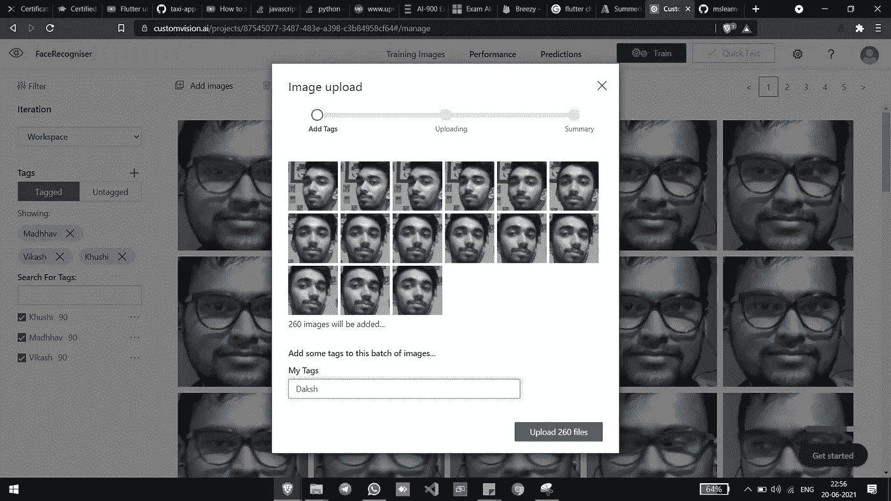
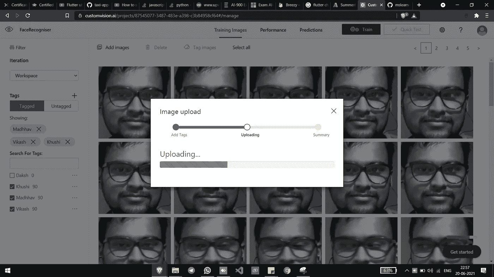
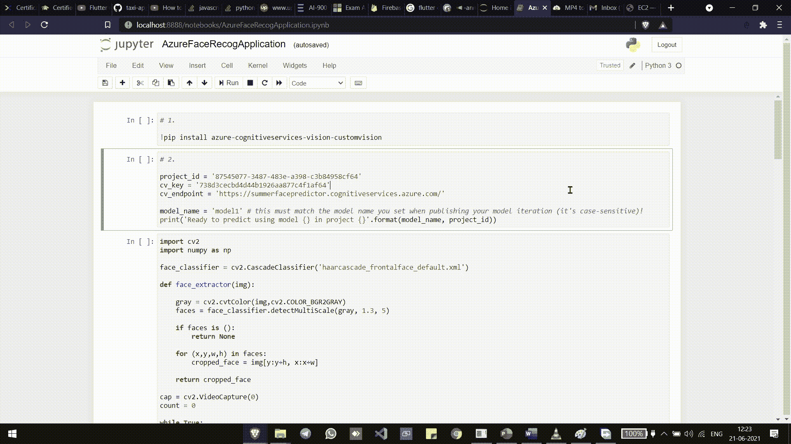

# 使用 Azure 自定义视觉服务的人脸识别模型

> 原文：<https://medium.com/analytics-vidhya/face-recognition-model-using-azure-custom-vision-service-ff15e0330646?source=collection_archive---------11----------------------->

## 使用 Microsoft Azure 自定义视觉服务的面部识别模型。然后，该模型用于检测一些特定的面孔&按照我们的业务逻辑执行某些指定的任务。


在本文中，我将解释我如何使用 Azure **Custom Vision** 服务创建人脸识别模型。

为微软提供如此棒的文档和 GitHub 学习资源库而大声疾呼。我从这个[微软 AI900](https://github.com/MicrosoftLearning/mslearn-ai900/blob/main/02%20-%20Image%20Classification.ipynb) 的资源库中获取了参考资料。

## 让我们跳进来吧！

## 第一步

拍摄团队成员的照片。这些照片将提供给模特进行训练。该模型基于**监督学习**，因为在上传图像时，我们向它们提供标签。


**代码点击图片**

代码可在此链接上找到— `[**Capture Photos**](https://github.com/Dakshjain1/LWSummer2021/blob/main/Task6-FaceRecognition/Capture%20100%20photos.ipynb)`。

## 第二步

现在主要过程开始了。在**微软 Azure** 上创建模型。
计算机视觉是一种赋予网络摄像头“理解”其所见的能力的技术。
同样，Azure 中的计算机视觉是一项服务，让你可以摆弄预先创建的模型。

现在，为了构建一个模型，他们有另一个服务“ **Custom Vision** ”，可以帮助您轻松地为您的业务逻辑创建一个模型。

仔细按照截图做，你就准备好自己的模型了！

**本文假设您已经有了一个 Azure 帐户、一个订阅和一个资源组。**
**——天青帐**就可以从这个[链接](https://azure.microsoft.com/en-in/free/)做成。
你可以很容易地从一个免费账户开始，它可以让你获得很多服务。
**-资源组**是一个逻辑容器，它将保存你在 Azure 中创建的所有资源。

在 **Azure Marketplace 中搜索**自定义视图**。
点击**创建。


**自定义视觉**

创建选项— **Both(用于训练&预测)** 选择合适的**订阅**和**资源组**。
为正在创建的两个资源选择相同的**位置** & **定价层**。


**创建**

1-2 分钟后，两种资源的部署应该完成。


**部署完成**

点击“转到资源”。
然后点击**自定义视觉门户**。


**资源**

使用与云门户相同的 Microsoft 帐户登录门户。


**签到**

点击创建一个**新项目**。


**新项目**


然后它会给出这些选项。

请给出适合您的名称和描述。

从下拉列表中选择资源(您已经创建)。

项目类型:**分类**
多类分类。

域:如果你的业务逻辑在 Azure 支持的选项中，那么选择它，否则选择一个通用模型。

点击**创建**。

这个新窗口将会打开，这是您的空的新项目。


**新项目**

现在它要求您添加图像，所以一个接一个地添加团队成员的图像。


**团队所有图像**

提供**正确标签**并点击**上传**。



**上传图片**



**上传**


**完成**

图像上传后点击**完成**。

对所有团队成员做同样的事情，标签在这里很重要。


**训练类型。**

然后选择您想要的培训类型并点击**培训**。

根据您提供的图片数量，培训将需要几分钟时间。


**培训**

## 中间步骤-

通过点击**快速测试**检查您的模型的准确性，并提供测试图像。

您可以看到，经过一定的打击和试验，我的模型足够精确，可以部署。

我用我所有队友的照片做了一个快速测试，结果如下-


**维卡什— 65.8%**


**Khushi— 62.8%**


达克什— 96.3%


**Madhhav——54.7%**


**Madhhav — 91.7%**

你可以看到不同的结果。

成功测试后，当您对模型满意时，**发布模型。**


**发布**

您在这里给出的**型号名称**非常重要，**所以要记住！记下型号名称。**

点击**发布**。

点击**同页**上的**档位图标⚙** 。这些是模型的细节。


**型号设置**

**注****项目 ID** (左侧)**端点**(右侧)**。**

现在点击**眼睛图标👁现在点击左上角的**齿轮图标**⚙**进入该页面。这将给出预测器的细节。从这里我们需要**键。**


**预测器的设置**

**注意**键**的值**。

**必需的详细信息—清单**

1.  **发布时的型号名称。**
2.  **来自模型设置的项目 ID 和端点**
3.  **来自门户设置的键**

## 第三步

现在最后在应用程序中使用这个模型。

```
**pip install azure-cognitiveservices-vision-customvision
pip install dotenv
pip install** 
```

我们的应用程序是根据谁在摄像机前来执行一些任务。

## 要完成的任务是-

1.  发送邮件
2.  发送 Whatsapp 消息
3.  创建 AWS 实例、EBS 存储并将其附加到实例
4.  打开 LinkedIn 个人资料

## 你可以在下面的视频中看到它是如何工作的。


**Daksh —发送 Whatsapp 消息**



**Khushi — AWS 实例**


**Madhhav —发送邮件**


**Vikash —打开 LinkedIn**

该应用程序和点击照片的完整代码可在此`[**Github Repo**](https://github.com/Dakshjain1/LWSummer2021/tree/main/Task6-FaceRecognition)`获得。

# 如有任何疑问、更正或建议，您可以随时通过我的 LinkedIn 与我联系。

[](https://www.linkedin.com/in/dakshjain09/) [## daksh Jain-Azure Cloud & devo PS Intern-Piramal Glass | LinkedIn

### 认证詹金斯工程师 2021 认证詹金斯工程师是一个功能专家谁了解持续的…

www.linkedin.com](https://www.linkedin.com/in/dakshjain09/)