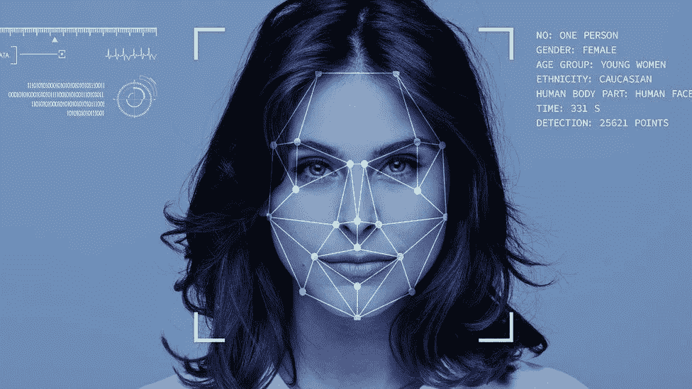

# 人脸识别自动化|以及通过人脸检测发送电子邮件和 WhatsApp 消息。

> 原文：<https://medium.com/analytics-vidhya/face-recognization-automation-and-sending-emails-and-whatsapp-messages-via-face-detection-e3091199291?source=collection_archive---------11----------------------->

# **使用 CV2、深度学习和神经网络。**



人脸识别自动化

# 问题陈述

*在这项任务中，我将介绍深度学习的力量，即识别人脸，并在 WhatsApp 和电子邮件上发送自动化消息。*

> ***注意，在阅读本文之前，你可以浏览一下我的*** [***Github 库***](https://github.com/babuakash68/Face-Recognization-Automation-and-sending-emails-and-WhatsApp-messages-via-face-detection..git) ***获取源代码，以便更好地理解本文。***

根据维基百科的说法——“面部识别系统是一种能够从数字图像或视频源的视频帧中识别或验证一个人的技术。”

但它在现实世界中究竟意味着什么呢？

这背后的简单解释是什么？这项技术是如何工作的？哪些领域利用了它？

本文将回答所有这些问题以及更多问题。

戴上老花镜，揭开 FRT(面部识别技术)世界的神秘面纱。

模式识别、面部分析、深度学习和机器学习是面部识别系统发展的主要贡献者。深度学习是指机器学习的子集，它使机器能够在没有任何人工干预的情况下，使用受人脑启发的算法来学习和解决复杂问题。它的灵感来自于被称为人工神经网络的大脑结构和功能。

这些人工神经网络模拟了组成人脑的神经元网络，以便机器能够以类似人类的方式学习和做出决定。面部识别技术通过从数据库中识别个人的面部来利用这一点，就像人类从我们的记忆中回忆不同的人一样。

# **面部识别技术是如何工作的？**

***第一步*:人脸检测**

首先，当人直视摄像机时，摄像机会检测并识别人脸。这种相机还可以从人群中检测人脸。

***第二步:*人脸分析**

从这里加载 HAAR 人脸分类器进行人脸识别:- [HaarClassifire](https://github.com/opencv/opencv/blob/master/data/haarcascades/haarcascade_frontalface_default.xml) 。

然后使用检测多尺度分类器检测人脸。

***第三步:*将图像转换成数据**

一旦面部分析完成，它就被转换成面部签名，即数学公式。该签名包括代码，并被称为面纹。就像我们每个人都有独一无二的指纹一样，我们有自己独一无二的面纹，并保存到本地目录中。

步骤 3 工作 100 次来收集我们自己的数据集，该数据集将用于构建我们的模型并将文件以唯一的名称保存在指定的目录中。

> 文件名路径= '。/faces/user/' + str(count) +'。' jpg '

***第四步:训练我们的模型进行人脸检测。***

使用 LBPHFaceRecognizer，我们可以为训练创建一个虚拟模型。

> akash _ model = cv2 . face _ lbphfacecognizer . create()

如果没有安装 LBPHFaceRecognizer，您可以使用以下命令安装它:-

> pip 安装 opencv-contrib-python

现在我们可以建立我们的人脸识别模型。

> akash _ model . train(NP . as array(Training _ Data)，np.asarray(Labels))

*至此，我们已经建立了模型，现在可以运行面部识别模型了。*

***第五步:使用* CascadeClassifier *检测人脸。***

使用我们创建的数据集，我们将通过使用创建的模型来识别我们自己的脸。

所以现在 Pass 面对的是预测模型。

> *results = akash _ model . predict(face)*

*结果*由包含标签和置信度值的元组组成。

现在用我们的模型获得检测到的人脸的置信度。

> *置信度= int(100 *(1-(结果[1])/400) )*

如果获得的置信度大于 80%,我们假设该人脸被我们创建数据集的同一个人正确地检测到。

**现在检测到人脸。**

# 2.通过检测到的面部发送自动化邮件。

使用 ***smtplib*** 库更容易自动发送邮件。

所以只要在你的系统中安装 smtplib 就可以了。

> pip3 安装 smtplib

只需为 gamail.com 创建 smtplib 对象

> smtpObj = smtplib。SMTP('smtp.gmail.com ')

通过 obj 传递 create identity。电子邮件( )

> smtpobj . log in("[your_@gmail.com](mailto:akashbabu68@gmail.com)，"你的 _ 密码")
> 
> subject = " your _ subject "
> body = " your _ message！！!"

并使用 sendmail()发送邮件

> smtpobj . sendmail(" your _ mail @ Gmail . com "，"[your_friend_mail@gmail.com](mailto:babuakash68@gmail.com)"，消息)

**现在邮件发送成功。**

# 3.通过检测到的面部发送自动化 Whatsapp 按摩。

对于 Whatsapp 消息，只需导入 pywhatkit 库

> 将 pywhatkit 作为 py 导入

拿着你朋友的手机号和短信还有最重要的时间。

> number = "+91 _ mobile _ number "
> mess = " Your _ message？"时间= hourse_time
> 薄荷= timeS_minuts

并发送给 sendwhatmsg()

> py.sendwhatmsg(数量、混乱、时间、薄荷)

**WhatsApp 消息发送成功**

# 4.使用 AWS 在 EBS 中保存已识别的照片

现在我使用 AWS 来保存由自动相机拍摄的截图。

在这里，我使用 S3 简单的 AWS 存储。

因此，当我们创建的模型检测到人脸时，这个自动化程序立即启动 EC2 实例和 S3 桶存储。

在继续之前，我们首先必须导入一些库。

```
**import** **subprocess** **as** **sp**
```

由这组代码 EC2 实例发起的 ***instance_id*** 。

```
**instance_id** = sp.getoutput("aws ec2 run-instances --image-id ami-0ad704c126371a549 --instance-type t2.micro --count 1 --key-name tryaws --subnet-id subnet-ba4ea5d1  --security-group-ids sg-0f02295aa9df10e89  --tag-specifications=ResourceType=instance,Tags=[{Key=Name,Value=CV_instances}]  --query Instances[*].[InstanceId] --output text")
```

启动 EC2 实例后，我们现在必须创建 S3 卷

```
**vol_id** = sp.getoutput("aws ec2 create-volume --availability-zone ap-south-1a --size 5 --tag-specifications ResourceType=volume,Tags=[{Key=Name,Value=CV_volume}] --query VolumeId --output text")
```

在这里，我们已经为存储创建了 S3 卷 **vol_id** ，现在将该卷与实例连接起来。

```
sp.getoutput("aws ec2 attach-volume --volume-id **{}** --instance-id **{}** --dev /dev/sdf".format(vol_id,instance_id))
```

使用 **sp.getoutput( )** 方法，我们在创建的 EC2 实例上发送图像数据。

因此，我们已经看到了使用 CV2 的人脸检测自动化机制的 3 个场景。

希望这篇文章对你有帮助！！

如有任何疑问，请通过 [Linkedin 个人资料](https://www.linkedin.com/in/akash-babu-mca-2019/)联系我。

关于代码，你可以访问我的 Git-Hub Repo

感谢阅读！！！

快乐学习: )