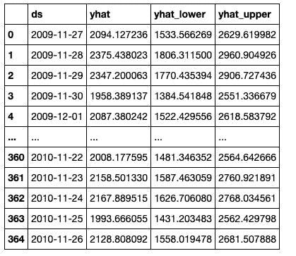

# 时间序列分析中的脸书先知算法

> 原文：<https://medium.com/analytics-vidhya/facebook-prophet-algorithm-in-time-series-analysis-90da4a7c1b16?source=collection_archive---------10----------------------->

时间序列分析是一种处理趋势分析的统计分析。时间序列分析是使用跨越一段时间的时间序列数据来完成的。总之，它涉及到寻找你的因变量和时间之间的相关性。

脸书先知算法是 Facebook 设计的一种算法，是一种开源的时间序列预测算法。它通过找到最佳平滑线来构建模型，该最佳平滑线由以下各项表示:

y(t) = g(t) + s(t) + h(t) + ϵ

其中:

g(t) =总体增长趋势

s(t) =年度季节性，周季节性

h(t) =假日效应

在这次演示中，我使用 facebook prophet 将数据分为单变量和多变量分析。

单变量分析处理一个变量，而多变量分析处理多个变量。

# 数据预处理:

在导入库并加载数据集之后，我执行了一些可视化操作，包括前 10 行、统计信息、它的信息以及检查空值。我解析了数据集中的日期时间，将其格式化为一个字符串。

使用向前填充方法，我填充了空值。

我创建了另一个列，它是“全局有功功率”乘以 1000，除以 60，再减去“分表 1 到 4”的乘积。

我创建了一个名为 hpc_daily 的变量，它是 D 的重采样，然后是一个 hpc_index，它重置了 hpc_daily 索引，最后将列 dt 和全局有功功率分别重命名为 ds 和 y。

# 单变量分析:

我将数据集分为训练和测试。训练数据集的范围从 2006 年 12 月 16 日到 2009 年 11 月 26 日，而测试数据集在 2009 年 11 月 26 日之后。在我导入 facebook prophet 模型、实例化和训练该模型之后，我使用 365 天的测试数据作为预测。

**可视化:**

我绘制了天气预报及其组成部分。

# 多元:

对训练和测试使用相同的分割并导入模型，我必须添加外部回归。这是因为该算法不能对训练数据中的一些点进行建模。

在我对模型进行定型后，预测如下所示:

绘制组件:

最后，使用其诊断进行交叉验证和性能指标，得分如下:

# 结论:

这是我在 Hamoye externship 的第三模块项目之一。同样值得注意的是，两个模型都在两个独立的笔记本中，这是因为我不能在拟合模型后添加回归变量，因为这个过程应该在拟合之前进行。这是这个项目的[回购](https://github.com/Nwosu-Ihueze/fb_prophet)，你可以在 [LinkedIn](https://www.linkedin.com/in/rosemary-nwosu-ihueze/) 上联系我。感谢您的阅读。