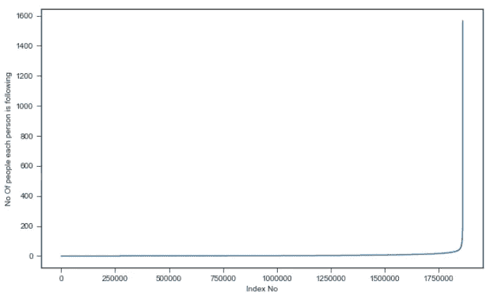
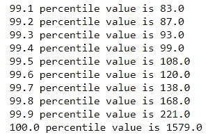
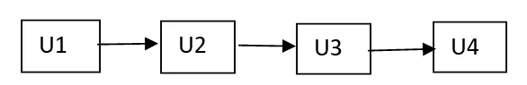
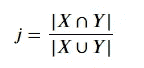

# 脸书推荐系统案例研究

> 原文：<https://medium.com/analytics-vidhya/facebook-recommendation-system-case-study-8dfc3ff5ddcc?source=collection_archive---------2----------------------->

在日常生活中，我们使用了许多社交媒体应用程序，如 FB、IG 等。但是你认为这个平台将如何提供好友推荐提醒。此外，对每个用户的提醒是独特的，取决于他或她的朋友圈、办公室圈子等。在这个案例研究中，我们将从机器学习模型的角度深入了解所有这些东西是如何工作的。


# 目录:

**A .简介**

**B. ML 配方**

**C .业务目标和限制**

**D .数据集分析**

**E .第一次切割方法**

**F .性能矩阵**

**G. EDA**

**H .特征化**

**我**。**建模**

**J .总结**

**K .今后的工作**

**L .简介**

**M .参考文献**

# **答:简介:**

在本案例研究中，我们必须关注脸书用户的朋友推荐系统(即，推荐最有可能成为朋友的人)

# B.毫升配方:

在本案例研究中，我们可以使用具有二进制分类的监督学习模型，因为我们必须识别源节点和目的节点之间的链接是好还是坏。

# C.业务目标和约束:

**a)目标:**

主要目的是通过使用给定的数据确定可能缺失的环节。

分类的概率很重要，因为通过使用它，我们可以根据概率选择特定数量的推荐选项。

**b)约束:**

预测概率有助于推荐概率最高的链接。

没有严格的延迟限制，因为目标更多的是做出正确的决策，而不是快速决策。如果模型只需要几秒钟就能做出预测，这是可以接受的。

# D.数据集分析:

数据取自 facebook 在 Kaggle 上的招聘挑战

[https://www.kaggle.com/c/FacebookRecruiting](https://www.kaggle.com/c/FacebookRecruiting)数据包含两列图中每条边的源和目的地

数据列(共 2 列):

-源节点 int64

*   目标节点 int64


数据集概述

# **E .第一次切割方法:**

1)我们拥有的数据集包含节点和边。因此，首先我们将对数据集进行 EDA，以获得对数据集的清晰了解。

2)在 EDA 之后，我们必须进行特征化，因为我们不会将带有节点和边的数据集直接提供给模型。因此，为了避免这种情况，我们将通过使用节点和边来创建可能的特征。

3)一旦我们最终确定了特征，我们将通过使用该特征来创建数据集，并且我们可以将其用于建模。

4)现在，在建模部分，我们将尝试不同的 NLP 模型并检查它们的性能。

5)最后，我们将选择性能最佳的型号。

# F.绩效矩阵:

1)预测的缺失链接应该是正确的，因此我们需要高召回值。

2)因为我们必须覆盖最大数量的人，所以精度值也应该很高。

4)所以，绩效矩阵中的 F-1 分数是非常有用的。

5)混淆矩阵

## 导入重要的库:

**注意:我们将使用 networkx 库，因为它对图形相关特性**非常有帮助

现在我们将阅读图表，其中入度和出度解释如下:

假设有一个人 A 追随了 3 个人，那么在这种情况下就有了 5 个追随者

入度=5，出度=3。


代码的输出

上述代码的输出如下所示:

图形类型是方向图。

数据集中的节点数(源+目标节点)是 1862220

数据集中的总边数是 9437519

数据集中节点的平均入度和平均出度都是 5.0679

# G.EDA:

在数据集中，我们有节点和节点之间的边。这些节点是源节点和目的节点。因此，我们将根据追随者、追随者和追随者+追随者来分析数据。

```
There is total 1862220 unique persons.
```

**1)关注者(每个人的关注度):**

首先，我们将尝试绘制追随者数量与指数之间的图表。从这一点上，我们知道很少有人的追随者数量超过 50。


为了进一步分析这一点，我们将使用“关注者数量与无索引”图表来检查前 150 万人的关注者数量。从这个图表中，我们知道大多数人的关注者数量小于等于 7。


我们已经尝试使用入度来绘制箱线图，但是它不能给出清晰的理解。


现在，我们绘制了 90%到 100%的入度值，我们知道 99%的值是 40，而 100%的值是 552。


现在，我们将通过绘制 99.1 到 100 之间的百分位值来进一步分析 100 百分位值。由此我们知道 99.9 百分位值是 112，而 100 百分位值是 552。


我们还绘制了入度数据的 PDF。


**2)以下(每个人的出格程度):**

首先，我们将尝试绘制关注人数与指数之间的图表。从这一点我们可以知道，很少有人的关注人数超过 50。



为了进一步分析这一点，我们将使用关注人数与无指数图来检查前 150 万人的关注人数。从这个图表中我们知道，大多数人的数字小于等于 7。


我们试图用外向度来绘制箱形图，但它不能给出清晰的理解。


现在我们绘制了 90 到 100 百分位的出度值，我们知道 99 百分位值是 40，而 100 百分位值是 1566。


现在，我们将通过绘制 99.1 到 100 之间的百分位值来进一步分析 100 百分位值。由此我们知道 99.9 百分位值是 112，而 100 百分位值是 1566。


没有关注任何人或没有关注者的人数为 0。

没有跟踪任何人的人数是 27，412，而%是 14 . 53687 . 68686868661

零追随者的人数是 188043 人,%是 10 人。18800.888686886617

**3)追随者+跟随者(每个人的入度和出度):**

首先，我们将尝试绘制关注人数+关注人数与指数之间的关系图。从图中我们可以看出，关注人数超过 80 的人非常少。


为了进一步分析这一点，我们将使用关注者+关注者数量与无索引图来检查前 150 万人的关注者+关注者数量。从这个图表中我们可以知道，大多数人的关注人数+关注人数小于等于 14。


现在，我们绘制了 90%到 100%的出度+入度值，我们知道 99%的值是 79，而 100%的值是 1579。


现在，我们将通过绘制 99.1 到 100 之间的百分位值来进一步分析 100 百分位值。由此我们知道 99.9%的值是 221，而 100%的值是 1579。



关注者+关注者少于 10 的人数为 1320326。

关注者+关注者的最小数量为 1，334291 人拥有关注者+关注者的最小数量

关注者+关注者的最大数量为 1579，1 人拥有关注者+关注者的最大数量

弱连通分量数 45558 具有 2 个节点的弱连通分量 32195

目前，我们只有好边(y=1)的数据集，因此数据集目前不平衡。为了使数据集适当平衡，我们必须添加一些坏边(y=0)。从图中生成了不良链接，这些链接不在图中，并且其最短路径大于 2。



Len(U1，U4)=3，Len(U1，U3)=2，因此我们将拒绝(U1，U3)并接受(U1，U4)链接。

我们得到的坏链接(missing_edges)的总数是 9437519，我们可以将它添加到当前数据集中。

因此，现在我们有了平衡的数据集，包含好的链接(y=1)和坏的链接(y=0)，如下所述。


现在，我们必须将训练和测试数据随机分成 80%和 20%的组合，如下所述:


现在我们已经对训练和测试数据做了一些观察。

如摘要中所示，81K 个点存在于测试中但不存在于训练数据集中，717K 个点存在于训练中但不存在于测试数据集中。因此，我们没有关于这一点的信息，这种问题被称为部分冷启动问题。

对上述代码的输出进行事后分析，我们了解到:

1.  训练和测试数据集中的节点数分别为 1780722 和 144623。
2.  训练测试数据集中的边数分别为 7550015 和 1887504。
3.  训练测试数据集中的平均入度分别为 4.2399 和 1.6490。
4.  训练测试数据集中的平均出度分别为 4.2399 和 1.6490。
5.  训练和测试数据集中的公共节点数是 1063125
6.  列车中存在但测试中不存在的节点数量为 717597
7.  测试中存在但序列中不存在的节点数是 81498
8.  总测试数据集中存在于测试中但不存在于训练中的节点的百分比为 7.12%

# **H .特征化:**

**目前，我们有源节点、目的节点和 Yi 的数据集，但我们无法将这些数据直接提供给模型，我们需要首先对数据进行特征化。假设我们有特征 f1、f2、F3…等等，如果我们将源节点和目的节点输入到特征 f1，我们将得到该特征的相应值，并且我们将把它添加到新的基于特征的数据集中。**

# **1) Jaccard 距离**

# **2)余弦距离**

# **3)排名措施**

**3.1)页面排名**

# **4)图形特征**

**4.1)最短路径:**

**4 2)检查同一个社区**

**4 3) Adamic/Adar 指数:**

**4 4)被跟踪回来的人是**

**4 5)卡茨中心性:**

**4 6)点击数得分**

# **1) Jaccard 距离:**

它是通过使用下述公式计算的:



Jaccard 距离我们可以计算跟随者和跟随者。找出用户之间的相似性是一个参数。Jaccard 距离越高，用户之间存在边缘的概率越大。设 X= {u1，u2，u3 } Y = { u2，u3，u4}则|X **∩** Y|= {u1，u4} =2 且|X ∪ Y| = {u1，U2，u3，u4} =4 即 j=2/4=0.5

代码片段:

# 2)余弦距离:

余弦距离也是一种与 Jaccard 距离相同的距离，只是分母不同。它是通过使用下述公式计算的:


代码片段:

# 3)排名措施

## 3.1)页面排名:

如果数据集具有有向图数据，那么 PageRank 就是流行特征。把每个顶点看作网页，我们可以称之为有向图。如果任何网页有 CNN.com 的超链接，那么这个条件是有向图条件。如果有大量重要页面指向该页面，则该页面的页面排名得分会增加。

在下面提到的图片中，B 有最高的网页排名分数，因为所有的网页都指向它，所以它有大量的网页连接，其中一些是重要的。虽然与 E 相比，C 具有较高的页面等级，即使它有较少的页面指向它，但是 B 指向 C，所以它也是重要的网页，因此它具有较高的页面等级值。


它主要用于互联网/web 搜索任务。但是我们可以在我们的数据集中使用，假设比尔盖茨是被马克·祖加巴克、沃伦·巴菲特(都是像比尔盖茨一样的名人，也是重要的人物)追随的人，所以这将增加比尔盖茨的得分，也像像我们这样的非名人(增加追随者的数量)，所以我们可以向任何随机的人推荐比尔盖茨，因为这个人有可能会追随他。

我们已经在网络的网页排名功能。我们可以计算最小概率、最大概率和平均概率值。**概率值是这个人在进行任何随机搜索时进入该页面的可能性**。前面我们已经看到，有些节点存在于训练中，但不存在于测试中，反之亦然。对于这样的源和目的节点，我们将使用平均页面等级值(mean_pr)。

代码片段:

对输出进行事后分析，我们了解到:

1.  最低页面排名分数为 1.6556497245737814e-07
2.  最大页面排名分数为 2.7098251341935827e-05
3.  页面排名得分平均值 5.615699699389075e-07。我们可以使用平均值对训练数据中不存在的节点进行插补。

# 4)图形特征:

**4.1)最短路径:**

在这个特征化中，我们将计算两个节点之间的最短路径。如果两个节点之间没有最短路径，那么我们将它视为-1。如果两个节点是直接连接的，那么首先，我们将删除这种直接连接，然后找出它们之间的最短路径。

代码片段:

源节点 77697 和目的节点 826021 之间的最短路径是 10。


测试最短路径函数

**4.2)检查同一个社区:**

在首先理解这个特征之前，我们必须关注周连通分量和强连通分量的概念。

在下面提到的图像中，S1 部分中的组件是强连通组件，因为从 1，2，0 我们可以通过跟随方向行进到任何组件，但是我们不能从节点 3 和节点 4 行进到节点 0，1，2。所以，S2 区间中的分支是弱连通分支。


如果我们结合 S1 和 S2，当我们试图从顶点 **4** 到 **0** 时，我们没有任何路径可移动，所以我们不能称 S1 和 S2 结合的子图为强连通分量。

现在假设有一个人在一个弱连通子图中有一组朋友，这个弱连通子图也称为社区，而在另一个社区中是他的办公室朋友。这两套节目彼此大相径庭。如果这两个社区之间有任何联系，那么这两个社区可以合并

我们可以通过使用 networkx 库找到弱连通分量，并且我们可以检查输入节点是否是弱连通分量。

代码片段:

我们正在检查源节点 861 和目的节点 1659750 是否属于同一个团体。但是在输出中我们得到了 0，所以这表明它不属于同一个社区。


测试社区功能

**4.3) ADAMIC/ADAR 指数:**

它是通过使用下述公式计算的:


其中 N(x)→节点 x 处向内和向外连接的数量

n(y)→节点 y 处向内和向外连接的数量


我们可以如下计算 Adar 指数:

1)如果我们必须找到节点 x 和节点 y 的 Adar 索引，那么首先，我们必须找出它们之间的公共邻域，即 N(x) **∩** N(y)

2)有两种常见的邻域类型我们可以进入**节点 x** 和**节点 y** :

1)名人节点:它有大量的邻居，节点 x 和节点 y 是其中之一，所以节点 x 和节点 y 之间出现边的可能性很小。因此，在这种情况下，log(N|u|)很大，因此 1/ log(N|u|)的值减小。因此，Adar 指数下降。

2)正常节点:它的邻居有限。节点可能是**节点 x** 和**节点 y** 大学朋友等。所以很有可能在**节点 x** 和**节点 y** 之间存在可能的边。因此，在这种情况下，log(N|u|)很小，因此 1/ log(N|u|)的值会增加。因此，Adar 指数增加。

代码片段:

计算源节点 1 和目的节点 189226 之间的 Adar 索引，该索引为 0。


测试 adar 指数函数

**4.4)跟回来:**

如果(a，b)之间有边，那么(b，a)之间有边的概率很高。

当输出为 1 时，源节点 1 有可能跟随目的节点 189226。


测试跟踪返回功能

**4.5)卡尔兹中心性:**

节点的 Katz 中心性是网络中心性的度量。这是类似的网页排名，但它是非常古老的技术，所以不太受欢迎。卡茨中心性的公式如下:


其中，Aij→用特征向量λ邻接矩阵

β→控制初始中心性和α <1/ λmax

Code Snippet:

Post analyze the Output we got to know that:

1.  Minimum Katz centrality score is 0.0007313532484065916
2.  Maximum Katz centrality score is 0.003394554981699122
3.  Mean value of the Katz centrality score 0.0007483800935562018 . We can use the mean value for the imputation to the nodes which are not there in train data.

**4.6)命中分数:**


详情请参考 https://en.wikipedia.org/wiki/HITS_algorithm*[**。**](https://en.wikipedia.org/wiki/HITS_algorithm)*

*代码片段:*

*对输出进行事后分析，我们了解到:*

1.  *最低命中分数为 0.0*
2.  *最大命中分数是 0.006666768767*
3.  *点击得分的平均值 5.615699699344123e-07*

***4.7)奇异值分解(分解):***

*设 A 是 G 的邻接矩阵，它是数据集中节点的大小，即 1.78M*1.78M。它是大的稀疏矩阵，因为如下面的矩阵 A 所示，顶点 I 和 j 的值是 Aij，如果 ui 和 uj 之间有边，则 Aij 为 1，如果没有，则 Aij 为 0。这使得矩阵变得稀疏。*

*在下面提到的代码中，在执行奇异值分解时，我们选择将矩阵分解为大小为 6 的矩阵。应用 SVD 后，即分解邻接矩阵，我们得到三个值 U、S(也称为 sigma)和 VT，因此各自的矩阵形状如下所述。在 U 形中，点 I 以六种可能的方式定义，同样在 V 形中，点 I 也以六种可能的方式定义。因此，如果我们有两个顶点，那么对于每个顶点，我们有一对分别对应于 U 和 VT 的 6 个特征。因此，对于这对顶点，我们总共有 24 个值为 0 或 1 的特征。*

*代码片段:*

*SVD 分解后矩阵的形状为:*

**

***4.8)重量特性:***

*为了确定节点的相似性，计算节点之间的边权重值。边权重随着邻居计数的增加而减少。凭直觉，假设有 100 万人在社交网络上关注一位名人，那么他们中的大多数人很可能从未见过对方或该名人。另一方面，如果用户在他/她的社交网络中有 30 个联系人，则他们中的许多人相互认识的可能性更高。*

*我们为培训和测试创建了下述功能:*

*引入边的权重*

*输出边的重量*

*传入边的权重+传出边的权重*

*输入边的权重*输出边的权重*

*2 *输入边的权重+输出边的权重*

*传入边的权重+2 *传出边的权重*

*代码片段:*

***4.9)奇异值分解点:***

*源节点 SVD 和目的节点 SVD 特征之间的点积。如下图。*

*代码片段:*

***4.10)优惠附件:***

*社交网络中一个众所周知的概念是，拥有许多朋友的用户倾向于在未来创建更多的联系。这是因为在一些社交网络中，比如金融领域，富人越来越富。我们通过计算每个顶点拥有的朋友数量(|γ(x)|)或追随者数量的乘积来估计我们的两个顶点有多“富有”。可以注意到，相似性指数不需要任何节点邻居信息；因此，该相似性指数具有最低的计算复杂度。*

*代码片段:*

# *一、建模:*

*我们已经完成了特征化。因此，现在我们将按照下面提到的步骤进行建模:*

*参数调谐*

*用最佳参数训练模型。*

*检查绩效矩阵*

*特征重要性*

*下表列出了不同型号的性能:*

**

*不同型号的性能*

# *J.总结:*

*根据我们在建模部分观察到的性能，GBDT 是基于图形数据集的反馈推荐系统的最佳模型*

# ***K .未来工作:***

*1.目前，我们已经尝试实现了重要的 NLP 算法，但我们也可以使用 DL 方法来检查模型的性能，如:
1) MLP
2) LSTM
3) GRE*

*2.此外，我们可以引入新的特征化方法来改进数据集，因为您知道 ML 的重击规则，即数据越多，性能越好。*

# ***L .简介:***

*感谢阅读！请鼓掌感谢我的辛勤工作。如果你想看看我是如何实现这个分析的，这里是该项目的 [GitHub repo](https://github.com/Ultimatespd/Facebook-RS-Case-study) 。我总是乐于接受建设性的反馈——如果你对这一分析有后续想法，请在下面发表评论或通过 LinkedIn 联系[。](http://linkedin.com/in/shubham-d-3ba232b7)*

# *米（meter 的缩写））参考资料:*

*①特别感谢:[https://www.appliedaicourse.com/?gclid = cjwkcajwzmefbhbweiwazws 8 zgsy _ tvp 9 zwwztxrblflamxt _ iq5c 6 CP 5-dppyqeteot 5b 9 jbebmfhocpvoqavd _ BwE](https://www.appliedaicourse.com/?gclid=CjwKCAjwzMeFBhBwEiwAzwS8zGsy_TVp9ZwwZtXRBlFlAMxT_Iq5c6CP5-dPPYQeteoT5b9jBeBmfhoCPVoQAvD_BwE)*

*[2)](https://en.wikipedia.org/wiki/Spearman%27s_rank_correlation_coefficient)[https://en.wikipedia.org/wiki/HITS_algorithm](https://en.wikipedia.org/wiki/HITS_algorithm)*

*3) *权重特征参考:用于监督链接预测的基于图的特征 William Cukierski，Benjamin Hamner，Bo Yang**

*4)优先附件*参考*:[https://medium . com/@ cynosuremishra 01/different-featureization-techniques-for-graph-related-problems-in-machine-learning-9c 9d 60 caae 60](/@cynosuremishra01/different-featurization-techniques-for-graph-related-problems-in-machine-learning-9c9d60caae60)*

*5)[https://www.kaggle.com/c/FacebookRecruiting](https://www.kaggle.com/c/FacebookRecruiting)*