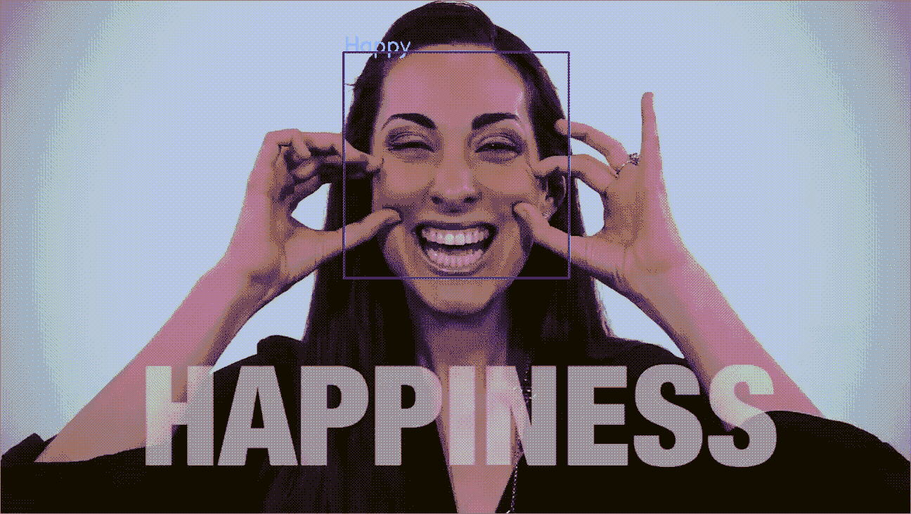
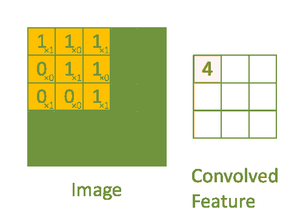
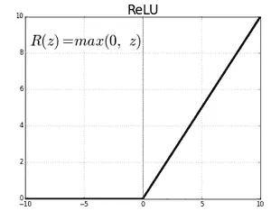
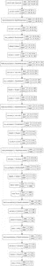
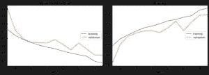

# 基于 Python 的机器学习人脸表情检测

> 原文：<https://medium.com/analytics-vidhya/facial-expression-detection-using-machine-learning-in-python-c6a188ac765f?source=collection_archive---------1----------------------->

使用*机器学习算法*如 **CNN** 来检测**面部表情**，然后预测表现出哪种表情。

**举例**:



在上面的视频中，我们可以看到一个蓝色的盒子突出了女士的脸。在青色的方框上方，显示了由我们的机器学习算法预测的表达式。较大的灰色文本是实际表达。

# **解决方案/方法**:

**简介(为什么需要它)——>**

首先，对于许多公司来说，情绪检测是一项非常重要的任务，以了解消费者对他们推出的产品的反应。它还可以用来了解他们的员工是否对提供给他们的设施感到满意。此外，它还有许多其他用例，如检查一个人的情绪，而不用靠近他，因为我们使用相机来检测。同样的算法只需要一点点修改，可以用于其他领域，如人脸检测，考勤系统，面具检测等等…

# **步骤# 1->-**

导入所需的 python 库，如**[**numpy**](https://www.geeksforgeeks.org/python-numpy/)**，**[**seaborn**](https://www.geeksforgeeks.org/seaborn-distribution-plots/)**，**[**matplotlib**](https://www.geeksforgeeks.org/python-introduction-matplotlib/)**，**[**tensor flow**](https://www.geeksforgeeks.org/introduction-to-tensorflow/)**

**Python3**

```
import numpy as np
import seaborn as sns
import matplotlib.pyplot as plt
import utils
import osfrom tensorflow.keras.preprocessing.image import ImageDataGenerator
from tensorflow.keras.layers import Dense, Input, Dropout,Flatten, Conv2D
from tensorflow.keras.layers import BatchNormalization, Activation, MaxPooling2D
from tensorflow.keras.models import Model, Sequential
from tensorflow.keras.optimizers import Adam
from tensorflow.keras.callbacks import ModelCheckpoint, ReduceLROnPlateau
from tensorflow.keras.utils import plot_modelfrom IPython.display import SVG, Image
from livelossplot.inputs.tf_keras import PlotLossesCallback
import tensorflow as tf
print("Tensorflow version:", tf.__version__)
```

**在上面的代码中，我们从 tensorflow 的包装 [keras](https://www.geeksforgeeks.org/python-image-classification-using-keras/) 中导入了不同的模块。我们特别从 keras 引进了这些模块，这将有助于建立一个 CNN 模型。在上面代码的最后一行，我们打印了系统中 tensorflow 的当前版本。**

****请注意- >** 所需的 tensorflow 版本必须大于或等于 2.0**

# ****步骤 2->-****

**现在，我们将获得我们的模型将在其上进行训练的数据集，我们将验证我们的模型在该特定数据集上的表现如何，以便我们可以提高准确性分数。我已经在 Kaggle 上上传了我使用的数据集，这样任何人都可以访问它。**数据集的链接是:——**[https://www . ka ggle . com/aadityasinghal/face-expression-dataset](https://www.kaggle.com/aadityasinghal/facial-expression-dataset)**

*****数据集有七类表达式。*****

# ****第三步->****

**现在我们已经获得了数据集，现在让我们获得一些关于 train 和 test 文件夹的信息。**

**Python3**

```
for expression in os.listdir("PATH OF TRAIN FOLDER"):
    print(str(len(os.listdir("PATH OF TRAIN FOLDER" + expression))) + " " + expression + " images")
```

**上面的代码使用 ***os*** 库来获取 train 文件夹路径，然后我们打印每个表达式文件夹的总数和类别。**

# ****第 4 步->****

**现在，我们将 ***生成训练和测试(验证)批次*** ，以便我们的模型可以根据测试数据进行训练和评估/验证。这是非常重要的一步，因为没有这一步，我们就不能有一个准确的模型，而且没有训练，模型也不知道它要寻找什么，也不知道要预测什么。**

**Python3**

```
img_size = 48
batch_size = 64datagen_train = ImageDataGenerator(horizontal_flip=True)train_generator = datagen_train.flow_from_directory("PATH OF TRAIN FOLDER",
                                                    target_size=(img_size,img_size),
                                                    color_mode="grayscale",
                                                    batch_size=batch_size,
                                                    class_mode='categorical',
                                                    shuffle=True)datagen_validation = ImageDataGenerator(horizontal_flip=True)
validation_generator = datagen_validation.flow_from_directory("PATH OF TEST FOLDER",
                                                    target_size=(img_size,img_size),
                                                    color_mode="grayscale",
                                                    batch_size=batch_size,
                                                    class_mode='categorical',
                                                    shuffle=False)
```

**在上面的代码中，我们已经将 ***的图像尺寸定义为 48*** ，因此每张图像的尺寸都将被缩小到 48x48。之后，我们将 ***批次大小定义为等于 64*** ，这意味着在每个时期，即当模型在每个周期穿过训练数据集时， ***将通过的图像数量将为 64*** 。这意味着该模型将通过第一个时期获取前 64 个图像用于训练，并将继续如此，直到所有时期完成。**

**之后，我们使用 keras 模块 中的****imagedata generator 生成批量的张量图像数据，并进行实时数据扩充。在这里，我们保持 ***水平翻转真*** 这意味着它将随机水平翻转输入图像。******

**现在我们将执行主要且最重要的步骤，即 ***生成训练和测试数据图像*** 。**

**首先，我们将获取训练数据。这里，我们使用了来自 ImageDataGenerator 的 datagen_train 函数，即***flow _ from _ directory***，它采用了几个参数，如数据集的路径、target_size(输出图像的大小)、color_mode(输出图像的颜色，我们已经设置了给出灰色图像的 gayscale)、batch_size、class_mode(确定返回的标签数组的类型，我们已经指定了 categorical)以及 shuffle False。**

**现在我们将执行上面的 ***来生成测试数据集图像*** 。唯一的变化是测试文件夹的路径。**

# ****第 5 步->****

**到目前为止，我们已经导入了库，获得了数据集，并创建了训练和测试图像。现在是时候进入另一个重要的步骤了，那就是 ***建立 CNN 模型。*****

**Python3**

```
# Initialising the CNN
model = Sequential()# 1 - Convolution
model.add(Conv2D(64,(3,3), padding='same', input_shape=(48, 48,1)))
model.add(BatchNormalization())
model.add(Activation('relu'))
model.add(MaxPooling2D(pool_size=(2, 2)))
model.add(Dropout(0.25))# 2nd Convolution layer
model.add(Conv2D(128,(5,5), padding='same'))
model.add(BatchNormalization())
model.add(Activation('relu'))
model.add(MaxPooling2D(pool_size=(2, 2)))
model.add(Dropout(0.25))# 3rd Convolution layer
model.add(Conv2D(512,(3,3), padding='same'))
model.add(BatchNormalization())
model.add(Activation('relu'))
model.add(MaxPooling2D(pool_size=(2, 2)))
model.add(Dropout(0.25))# 4th Convolution layer
model.add(Conv2D(512,(3,3), padding='same'))
model.add(BatchNormalization())
model.add(Activation('relu'))
model.add(MaxPooling2D(pool_size=(2, 2)))
model.add(Dropout(0.25))# Flattening
model.add(Flatten())# Fully connected layer 1st layer
model.add(Dense(256))
model.add(BatchNormalization())
model.add(Activation('relu'))
model.add(Dropout(0.25))# Fully connected layer 2nd layer
model.add(Dense(512))
model.add(BatchNormalization())
model.add(Activation('relu'))
model.add(Dropout(0.25))model.add(Dense(7, activation='softmax'))opt = Adam(lr=0.0005)
model.compile(optimizer=opt, loss='categorical_crossentropy', metrics=['accuracy'])
model.summary()
```

**在上面的代码中，我们已经创建了神经网络的基本结构。为此，我们从 keras 模块*中获得了帮助，它是 tensorflow 库的一个很好的包装器，有助于减少我们的工作。首先我们已经通过使用顺序( )函数 ***初始化了 CNN 模型。之后我们创建了 ***神经网络的前四层*** 即 ***卷积层。*********

***卷积神经网络，或简称为 CNN，是一种专门类型的神经网络模型，设计用于处理 ***二维图像数据*** ，尽管它们可以用于一维和三维数据。 ***卷积是一种线性运算*** ，它涉及一组权重与输入的相乘，很像传统的神经网络。乘法是在输入数据数组和二维权重数组(称为过滤器或内核)之间执行的。这方面的可视化如下所示***

******

***可以使用 model.add ()将卷积层**添加到我们的模型中。这需要几个参数，如 **Conv2D** ，它指定要添加的层是卷积层。这个方法也需要两个参数，第一个是过滤器数量*和池数量**。之后，我们应用 ***批量标准化*** ，该标准化应用了一个保持平均输出接近 0 和输出标准偏差接近 1 的变换。之后，添加激活功能*，它对输入信号进行非线性变换。然后，这个转换后的输出被发送到下一层神经元作为输入。之后我们应用了 ***MaxPolling2D*** ，它只从池中取出最大值。最后我们添加了*来防止模型过拟合。这里我们完成了卷积层的构建。**********

******此处，对于所有四个卷积层，除 Conv2D 之外的所有参数保持不变。对于第一个 Conv，我们也提到了输入大小，即要接收的图像的大小。******

****之后，我们添加了 ***展平层*** ，它将数据转换成一个 ***一维数组*** 用于输入到下一层。我们展平卷积层的输出以创建单个 ***长特征向量*** 。并且它连接到最终的分类模型，该分类模型被称为全连接层。****

****最后，我们将完全连接的层添加到模型中。为了创建一个完全连接的层，我们首先添加一个 ***密集层*** ，它是一个规则的深度连接的神经网络层。这是最常见和最常用的层。之后我们添加 ***批量归一化图层。*** 和最后 ***激活*** 和 ***脱落层。*******

****对于所有的层，到目前为止，我们一直保持激活函数 ReLU，因为 ReLU 是半整流的(从底部)。当 z 小于零时 f(z)为零，当 z 大于或等于零时 f(z)等于 z。****

********

****但在所有上述层之后，我们将最终添加一个 ***密集层*** 层，激活设置为 ***Softmax*** ，这将数字(又名逻辑)转换为 ***概率，总和为一个*** 。Softmax 函数输出一个向量，该向量表示一系列潜在结果的概率分布。****

****因此，在上述模型的输出中，我们最终得到 0 到 1 范围内的概率，从而使我们易于对表达式进行分类。****

****之后我们使用***model . compile***来编译模型。它采用一些类似于 ***优化器*** 的参数，通过比较预测和损失函数来优化输入权重。我们已经用指定的学习速率(lr)将优化器保持为 ***亚当*** 。之后，我们将 ***损失*** 添加到 ***分类 _ 交叉熵*** 中，并保留了 ***度量值(*** ，用于评估模型的性能，等于 ***)*** ***精度。*** 最后我们使用 ***model.summary()输出了模型摘要。*******

# ******第 6 步->******

****到目前为止，我们已经编译了我们的模型。现在让我们使用下面给出的代码来可视化 ***模型架构*** 。****

****Python3****

```
**plot_model(model, to_file='model.png', show_shapes=True, show_layer_names=True)
Image('model.png',width=400, height=200)**
```

****在上面的代码中，我们使用了 ***plot_model*** ，这也是 keras 库的一个功能。我们给了它相同的参数，如 ***模型名称*** ，文件名，即 ***to_file*** ， ***show_shapes*** 显示形状信息，以及 *show_layer_names* :显示图层名称。****

****之后我们使用了 ***Ipython 库*** 函数 ***图像*** 来显示输出中的模型架构。它需要几个 ***参数*** 像 ***文件名，宽度和高度*** 的图像来显示。这个(图像)的输出如下所示。****

********

# ******第 7 步->******

****既然我们已经成功构建了模型架构，现在是时候 ***训练模型并评估结果了。*******

****Python3****

```
**%%timeepochs = 15
steps_per_epoch = train_generator.n//train_generator.batch_size
validation_steps = validation_generator.n//validation_generator.batch_sizereduce_lr = ReduceLROnPlateau(monitor='val_loss', factor=0.1,
                              patience=2, min_lr=0.00001, mode='auto')
checkpoint = ModelCheckpoint("model_weights.h5", monitor='val_accuracy',
                             save_weights_only=True, mode='max', verbose=1)
callbacks = [PlotLossesCallback(), checkpoint, reduce_lr]history = model.fit(
    x=train_generator,
    steps_per_epoch=steps_per_epoch,
    epochs=epochs,
    validation_data = validation_generator,
    validation_steps = validation_steps,
    callbacks=callbacks
)**
```

****上面的代码 ***在 ***训练数据集*** 上训练我们的模型*** ，同时它 ***在 ***测试/验证数据集*** 上验证*。******

***首先，我们已经设置了 ***个历元*** ，其中一个 ***历元*** 是整个数据集仅通过神经网络向前和向后传递一次。由于一个时期太大，不能一次输入计算机，我们把它分成几个更小的批次。 随着历元数的增加，神经网络中权值改变的次数越多，曲线从 ***欠拟合到最优再到过拟合曲线*** 。***

*****重要提示:-** 我将历元数保持为 15，您可以增加它以获得更高的精度和更好的结果。***

***之后，我们将每个时期的步骤和验证步骤设置为等于图像总数除以批量大小的整数输出。***

***之后，我们设置了***ReduceLROnPlateau***，用于在检测到模型性能平稳时调整学习率，例如，给定数量的训练时期没有变化。之后我们设置了 ***模型检查点*** ，它允许你定义在哪里检查 ***模型权重*** ，文件应该如何命名以及在什么情况下做模型的检查点。在这之后，我们用***PlotLossesCallback()***设置了 ***回调*** ，它给出了训练如何进行的实时报告，我们还添加了 ***检查点*** 和 ***reduce_lr*** 。***

***最后我们完成了 ***model.fit()*** 开始了的训练和验证***

***我们的模型。其以一些参数作为输入，如 ***x - >训练数据集*** 即每历元 ***步数*** 、 ***验证数据、验证步数*** 和 ***回调*** 。运行上述代码后的输出如下所示。***

******

```
*Log-loss (cost function):
training   (min:    0.866, max:    1.786, cur:    0.866)
validation (min:    0.970, max:    1.705, cur:    0.970)accuracy:
training   (min:    0.313, max:    0.675, cur:    0.675)
validation (min:    0.381, max:    0.643, cur:    0.643)Epoch 00015: saving model to model_weights.h5
448/448 [==============================] - 27s 60ms/step - loss: 0.8659 - accuracy: 0.6748 - val_loss: 0.9700 - val_accuracy: 0.6426
CPU times: user 6min 50s, sys: 57.4 s, total: 7min 47s
Wall time: 6min 46s*
```

***我们通过仅运行 15 个时期，在数据集上获得了接近 68%的准确率。您可以运行更多的时期，并可以更改一些其他参数，以获得更高的准确性。***

# *****步骤# 8->-*****

***现在我们已经得到了一个训练好的模型，让 ***将模型*** 保存为 ***json*** 格式，同时保存其 ***权重*** 。***

***Python3***

```
*model_json = model.to_json()
model.save_weights('model_weights.h5')
with open("model.json", "w") as json_file:
    json_file.write(model_json)*
```

***在上面的代码中，我们首先将 ***模型转换为 json 格式。*** 之后我们已经 ***以. h5 格式*** 保存了模型的权重。之后，我们以写模式打开一个 model.json 文件，并将转换成 json 格式的模型写入该文件。现在我们得到了两个名为 ***model.json 和 model_weights.h5*** 的文件，分别用于模型及其权重，可以在任何地方使用它们进行预测。***

# *****第 9 步->*****

***现在我们将为 ***编写一个 Python 代码来加载模型和权重，并进行预测*** 。***

***Python3***

```
*from tensorflow.keras.models import model_from_jsonclass FacialExpressionModel(object): EMOTIONS_LIST = ["Angry", "Disgust",
                    "Fear", "Happy",
                    "Neutral", "Sad",
                    "Surprise"] def __init__(self, model_json_file, model_weights_file):
        # load model from JSON file
        with open(model_json_file, "r") as json_file:
            loaded_model_json = json_file.read()
            self.loaded_model = model_from_json(loaded_model_json) # load weights into the new model
        self.loaded_model.load_weights(model_weights_file)
        self.loaded_model.make_predict_function() def predict_emotion(self, img):
        self.preds = self.loaded_model.predict(img)
        return FacialExpressionModel.EMOTIONS_LIST[np.argmax(self.preds)]*
```

***在上面的代码中，我们首先导入了***model _ from _ json***函数，它帮助我们从 JSON 文件中导入模型。之后，我们编写了一个 ***python 类*** ，其中首先有一个 ***情感列表*** ，它包含了我们的数据集。之后我们定义了 ***init 方法*** ，它采用了 ***model.json 文件和. h5 格式的模型权重文件*** 。在此之后，我们将 ***读取 json*** 文件，并使用 model_from_json 函数 ***加载模型*** 。之后，我们将 ***将重量*** 加载到模型中。***

***之后在这个类中我们定义了一个 ***方法*** 命名为***predict _ emotion***它给出了图像的预测。首先它使用 ***。预测*** 方法给出预测之后，我们用 ***numpy argmax*** 得到一个 ***整数 b/w 0–6***表示列表中对应的情感。最后我们 ***返回那个特定的情感名称。******

# *****第十步->*****

***现在我们已经有了将权重加载到模型中的模式代码，现在我们将 g ***设置视频的帧，并将对其执行预测*** 。***

***Python3***

```
*import cv2facec = cv2.CascadeClassifier('haarcascade_frontalface_default.xml')
model = FacialExpressionModel("model.json", "model_weights.h5")
font = cv2.FONT_HERSHEY_SIMPLEXclass VideoCamera(object):
    def __init__(self):
        self.video = cv2.VideoCapture(0) def __del__(self):
        self.video.release() # returns camera frames along with bounding boxes and predictions
    def get_frame(self):
        _, fr = self.video.read()
        gray_fr = cv2.cvtColor(fr, cv2.COLOR_BGR2GRAY)
        faces = facec.detectMultiScale(gray_fr, 1.3, 5) for (x, y, w, h) in faces:
            fc = gray_fr[y:y+h, x:x+w] roi = cv2.resize(fc, (48, 48))
            pred = model.predict_emotion(roi[np.newaxis, :, :, np.newaxis]) cv2.putText(fr, pred, (x, y), font, 1, (255, 255, 0), 2)
            cv2.rectangle(fr,(x,y),(x+w,y+h),(255,0,0),2) return fr*
```

***在上面的代码中，我们首先 ***导入 OpenCV 模块。*** 之后，我们设置 ***CascadeClassifier 和 Haar Cascade classifier***，用于通过在人脸片段上叠加预定义的模式来检测特征，并用作 XML 文件。在我们的模型中。***

***我们使用的 ***哈尔级联分类器*** 在这里 **可以找到 [**。**](https://github.com/opencv/opencv/blob/master/data/haarcascades/haarcascade_frontalface_default.xml)*****

***之后，我们通过传递 model.json 文件和权重文件来调用模型。在这之后，我们已经为 CV2 设置了字体。之后我们又写了一个 ***的 python 类*** 。在类中，我们首先声明了 ***init 方法*** ，它使用***cv2 video capture***方法来访问您想要预测的摄像机或视频文件。***

******重要注意:-******

***在上面的代码中，我们将 ***0 作为参数传递给了 VideoCapture。*** 您可以将 0 改为视频文件的路径来对视频文件进行预测。这里 0 表示 CV2 将从您的 PC 的网络摄像头获取视频。***

***之后，我们为类 声明了 ***析构函数，当你想停止时，它释放视频并停止方法。******

***之后，我们声明了一个名为 ***get_frame*** 的方法，它首先读取视频。之后，我们使用了 ***cv2.cvtColor()*** 方法将图像从一个颜色空间转换到另一个颜色空间。这里我们用了 ***cv2。COLOR_BGR2GRAY*** 它将图像转换为灰色，因为我们的模型是在灰色图像上训练的。之后我们使用了***detect multi scale()***来检测输入图像中不同大小的物体。检测到的对象以矩形列表的形式返回。之后，我们循环到返回图像的不同坐标，并使用 ***CV2.resize()*** 函数调整图像大小。最后我们用***model . predict _ emotion***得到预测的情绪。之后，我们将文本放在图像的框架上，该图像显示了预测的情绪，我们还将矩形框放在检测到人脸的区域周围。 最后我们让 ***返回那个帧*** 以及预测的框和文本。***

# *****第 11 步->*****

***现在我们已经有了 mode 所有重要的函数，现在让我们制作 ***函数来调用上面的代码并显示输出视频。******

***Python3***

```
*def gen(camera):
    while True:
        frame = camera.get_frame()
        cv2.imshow('Facial Expression Recognization',frame)
        if cv2.waitKey(1) & 0xFF == ord('q'):
            break
    cv2.destroyAllWindows()*
```

***在上面的代码中，我们声明了一个名为 ***gen*** 的 python 函数，它将 ***相机作为参数。*** 在此我们运行一个 ***while 循环为真*** ，连续进行。在此我们先调用 ***获取摄像机的 _frame 函数。*** 之后我们用 ***imshow*** 的方法对 CV2 进行处理。将视频显示为输出。在此之后我们编写了 ***代码来停止*** 代码。我们添加了 if 条件，即如果按下 ***键“q ”,则循环将被中断*** ,输出屏幕将使用***destroyAllWindows()***功能被破坏。***

# *****第 12 步->*****

***现在我们将编写最后一行代码，它将通过调用 gen 函数***运行上述所有代码。******

***Python3***

```
*gen(VideoCamera())*
```

***在上面的代码中，我们调用了 ***gen 函数，并传递了 VideoCamera 类对象*** 作为参数，最后，当我们运行上面的代码行时，输出屏幕将打开，显示实时预测，如下所示。***

# *****输出:*****

******

*****重要点:-*****

*   ***要获得 ***数据集*** 点击 [**此处**](https://www.kaggle.com/aadityasinghal/facial-expression-dataset)***
*   ***要得到 ***哈尔级联分类器*** 文件，点击 [**此处**](https://github.com/opencv/opencv/blob/master/data/haarcascades/haarcascade_frontalface_default.xml)***
*   ***要获得所有带有模型文件的代码如 JSON 和 Weights 以及所有其他代码，这里的 ***GITHUB 链接*** 是 [**这里的**](https://github.com/Aaditya1978/Face_Expression_Prediction)***
*   ***链接到 ***Kaggle 笔记本*** 这里是[](https://www.kaggle.com/aadityasinghal/facial-expression-recognization-using-tensorflow)***