# 人脸表情识别& dense net 161 和 Resnet152 的比较研究

> 原文：<https://medium.com/analytics-vidhya/facial-expression-recognition-comparative-study-on-densenet161-and-resnet152-e88ee02b6734?source=collection_archive---------3----------------------->

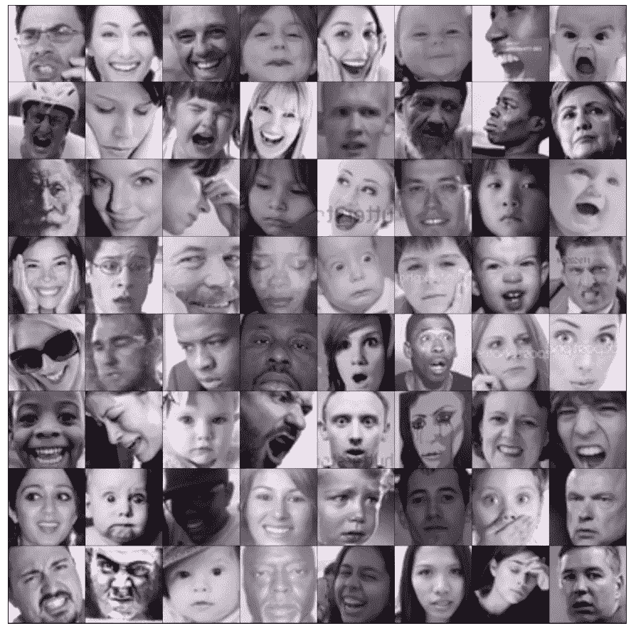

*利用* [*深度学习*](https://en.wikipedia.org/wiki/Deep_learning) *，*[*py torch*](https://pytorch.org/)*，* [*迁移学习*](https://en.wikipedia.org/wiki/Transfer_learning)

面部表情识别可以作为人们可能希望包含在计算机视觉系统中的分类工作之一。我们项目的工作将是通过一个将被用作机器眼睛的相机进行观察，并根据人当前的表情/情绪对人的面部(如果有的话)进行分类。

人脸识别是一种利用人脸识别或验证个人身份的方法。这是最重要的[计算机视觉应用](https://viso.ai/applications/computer-vision-applications/)之一，具有巨大的商业利益。最近，人脸识别技术随着基于深度学习的方法而大大进步。

在不受约束的记录条件下捕获的静态图像和视频序列中的人脸识别是计算机视觉中最广泛研究的课题之一，因为它在监控、执法、生物计量、市场营销等方面有广泛的应用。

# 深度人脸识别的历史:

*   在 20 世纪 90 年代早期，随着历史特征脸方法的引入，人脸识别开始流行。在 20 世纪 90 年代和 21 世纪初，[整体方法](https://doi.org/10.1109/IC3I.2014.7019610)主导了人脸识别社区。整体方法通过某些分布假设导出低维表示，例如线性子空间、流形和稀疏表示。整体方法的问题在于它们无法解决偏离其先前假设的不受控制的面部变化。这导致了 21 世纪初基于局部特征的人脸识别的发展。
*   在 2000 年代早期和 2010 年代，引入了基于[局部特征](http://azadproject.ir/wp-content/uploads/2014/07/2012-Monogenic-Binary-Coding-An-Efficient-Local-Feature-Extraction-Approach-to-Face-Recognition.pdf)的人脸识别和基于[学习的局部描述符](http://mmlab.ie.cuhk.edu.hk/archive/2010/cvpr10_face.pdf)。使用 [Gabor 滤波器](https://citeseerx.ist.psu.edu/viewdoc/download?doi=10.1.1.112.1199&rep=rep1&type=pdf)和[局部二进制模式(LBP)](https://www.researchgate.net/deref/http%3A%2F%2Fdx.doi.org%2F10.1007%2F978-3-540-30548-4_21) 以及它们的多级和高维扩展的人脸识别，通过局部滤波的一些不变特性实现了鲁棒的性能。不幸的是，手工制作的特征缺乏独特性和紧凑性。在 2010 年代早期，[基于学习的局部描述符](http://mmlab.ie.cuhk.edu.hk/archive/2010/cvpr10_face.pdf)被引入人脸识别，其中局部滤波器被学习以获得更好的区别性，编码码本被学习以获得更好的紧凑性。
*   2014 年，脸书的 [DeepFace](https://research.fb.com/publications/deepface-closing-the-gap-to-human-level-performance-in-face-verification/) 和 [DeepID](https://www.ee.cuhk.edu.hk/~xgwang/DeepID.pdf) 在著名的[标记的野生(LFW)](http://vis-www.cs.umass.edu/lfw/) 人脸基准上取得了最先进的精度，首次超越了人类在无约束场景下的表现。从那以后，研究重点转移到了基于深度学习的方法。深度学习方法使用多层处理单元的级联来进行特征提取和转换。因此，已经开发了更大规模的人脸数据库和高级人脸处理技术来促进深度人脸识别。因此，随着表示管道变得更深，LFW(标记为野外人脸)性能从大约 60%稳步提高到 97%以上。

# 人脸识别和深度学习:

深度学习，特别是深度[卷积神经网络](https://viso.ai/deep-learning/artificial-neural-network/) (CNN)，在人脸识别方面受到了越来越多的关注，已经提出了几种[深度学习](https://viso.ai/deep-learning/what-is-deep-learning/)方法。

自 2014 年以来，深度学习技术重塑了人脸识别的研究格局，这是由 [DeepFace](https://research.fb.com/publications/deepface-closing-the-gap-to-human-level-performance-in-face-verification/) 和 [DeepID](https://www.ee.cuhk.edu.hk/~xgwang/DeepID.pdf) 方法的突破发起的。从那时起，深度人脸识别技术(利用分层架构来学习有区别的人脸表示)极大地提高了最先进的性能，并培养了许多成功的现实世界应用。深度学习应用多个处理层来学习具有多级特征提取的数据表示。

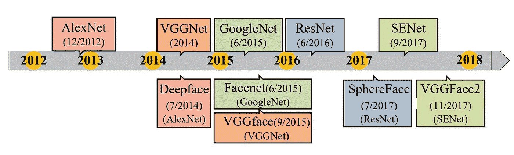

# 数据集:

我在 [Kaggle](https://www.kaggle.com/) 上找到了这个数据集，它代表了一个图像分类问题；因为数据由六个类别组成，每个类别包含 3000-7000 张图片，六个类别为“快乐”、“惊讶”、“悲伤”、“恐惧”、“愤怒”、“中性”。

> **数据集链接:**
> 
> [**https://www . ka ggle . com/Apollo 2506/面部识别数据集**](https://www.kaggle.com/apollo2506/facial-recognition-dataset)

# 描述:

愤怒类有 3995 张图片。悲伤类有 4830 张图片。惊喜类有 3171 张图片。恐惧类有 4097 张图片。快乐类有 7215 张图片。中性类别有 4965 张图片。

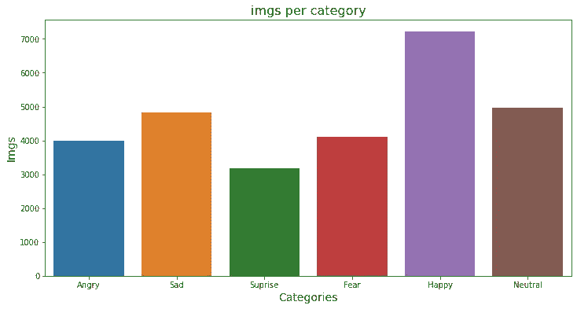

# 程序:

1.  下载数据集
2.  导入库
3.  GPU 实用程序
4.  创建自定义 PyTorch 数据集
5.  创建训练集和验证集
6.  PyTorch 数据加载器
7.  一些例子
8.  修改预训练模型(DenseNet161，ResNet152)
9.  迁移学习
10.  训练循环
11.  微调预训练模型
12.  结果
13.  根据测试数据集测试模型以检查准确性
14.  保存训练好的模型

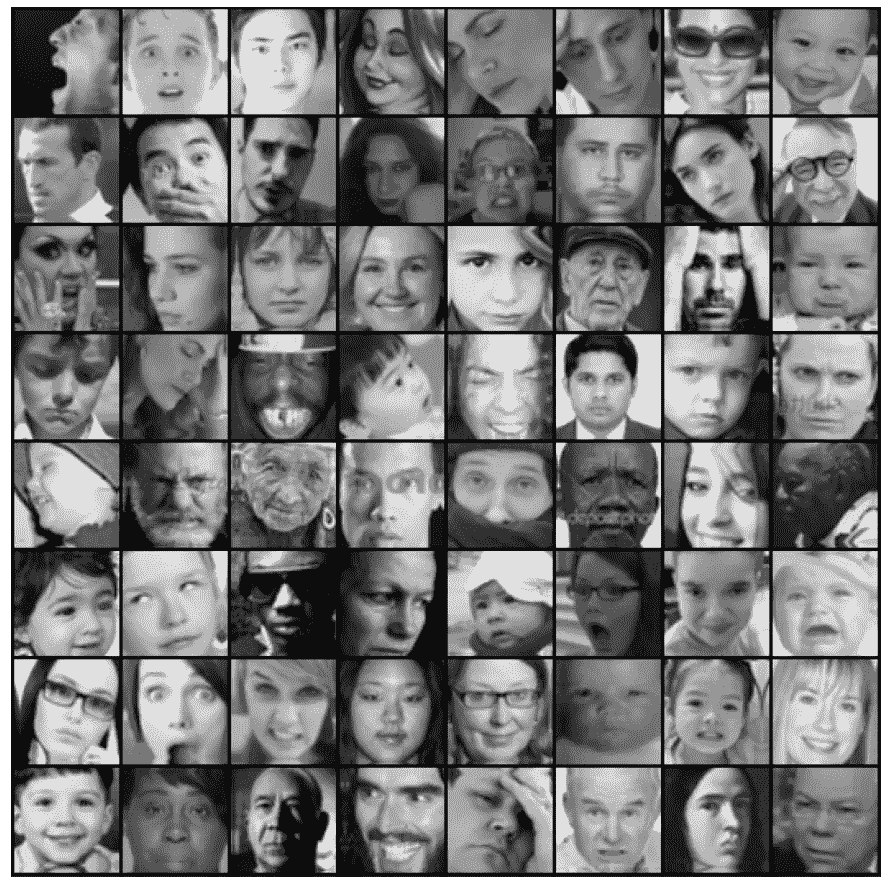

# 修改预训练模型(DenseNet161):

最近的工作表明，如果卷积网络在靠近输入的层和靠近输出的层之间包含较短的连接，则卷积网络可以训练得更深入、更准确和有效。在本文中，我们接受这种观察，并介绍了密集卷积网络(DenseNet)，它以前馈方式将每一层与每一层连接起来。传统的 L 层卷积网络有 L 个连接——每层与其后续层之间有一个连接——而我们的网络有 L(L+1)/2 个直接连接。对于每一层，所有先前层的特征地图被用作输入，并且它们自己的特征地图被用作所有后续层的输入。DenseNets 有几个引人注目的优点:它们缓解了消失梯度问题，加强了特征传播，鼓励特征重用，并大大减少了参数的数量。我们在四个极具竞争力的目标识别基准任务(CIFAR-10、CIFAR-100、SVHN 和 ImageNet)上评估了我们提出的架构。DenseNets 在大多数方面都取得了显著的进步，同时需要更少的内存和计算来实现高性能。

作者:黄高，刘庄，基里安·q·温伯格，劳伦斯·范德马滕

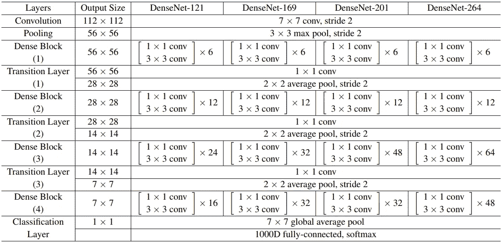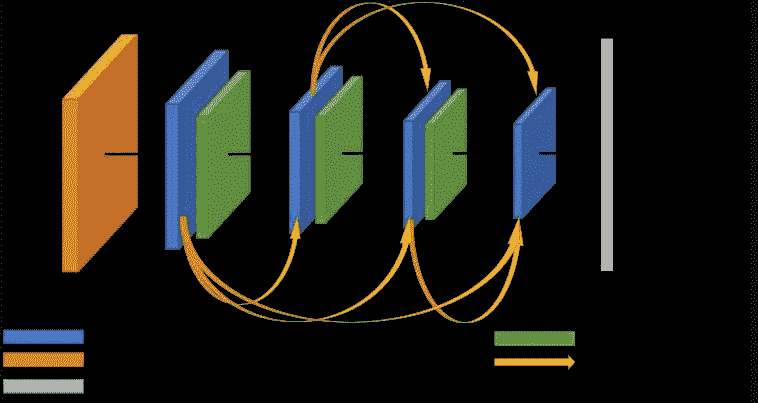

# 修改预训练模型(ResNet152):

更深层次的神经网络更难训练。我们提出了一个剩余学习框架来简化比以前使用的网络更深入的网络训练。我们明确地将这些层重新表述为学习关于层输入的剩余函数，而不是学习未被引用的函数。我们提供了全面的经验证据，表明这些残差网络更容易优化，并可以从显著增加的深度获得准确性。在 ImageNet 数据集上，我们评估了深度高达 152 层的残差网络——比 VGG 网络深 8 倍，但复杂度仍然较低。

这些残差网络的集合在 ImageNet 测试集上实现了 3.57%的误差。该结果在 ILSVRC 2015 分类任务中获得第一名。我们还对具有 100 层和 1000 层的 CIFAR-10 进行了分析。

表征的深度对于许多视觉识别任务是至关重要的。仅仅由于我们非常深入的表示，我们在 COCO 对象检测数据集上获得了 28%的相对改进。深度残差网络是我们提交给 ILSVRC 和 COCO 2015 竞赛的基础，在该竞赛中，我们还在 ImageNet 检测、ImageNet 定位、COCO 检测和 COCO 分割任务中获得了第一名。

作者:，何，，，任，

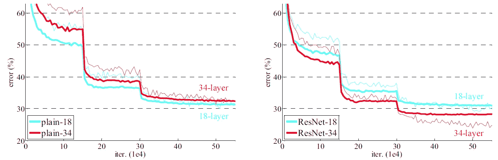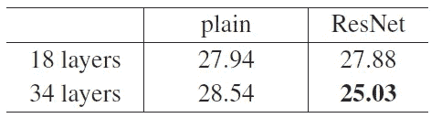

# Densenet161 和 Resnet152 的比较研究；

ResNet 还是 DenseNet？如今，大多数基于深度学习的方法都是通过开创性的主干网络实现的，其中最著名的两个可以说是 ResNet 和 DenseNet。尽管它们的竞争性能和压倒性的受欢迎程度，但它们都存在固有的缺点。对于 ResNet 来说，稳定训练的身份快捷方式也限制了它的表示能力，而 DenseNet 通过多层特征串联具有更高的能力。然而，密集的串联导致了需要高 GPU 内存和更多训练时间的新问题。部分由于这个原因，在 ResNet 和 DenseNet 之间做出选择并不容易。

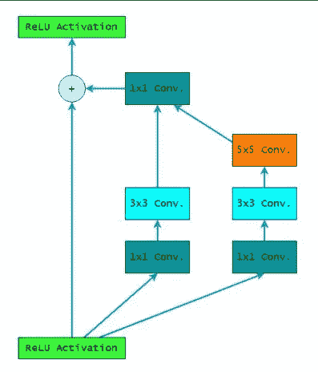

剩余单元框图

它们的实现是深度剩余网络(ResNet ),具有跳过一定层数的快捷连接。在执行身份映射之后，这些连接的输出和堆叠层的输出被相加。根据他们的结论，剩余网络易于优化，并从深度增加中受益匪浅。他们的 152 层单一模型(当时 ImageNet 上最深的模型)在 ILSVRC 2015 分类竞赛中获得第一名，其复杂性明显低于 VGG 网络。此外，ResNet152 以 0.94 的前 5 名准确度优于以前的系综。为了避免过度拟合，在小数据集上训练更深层次的网络时，建议进行更激烈的正则化

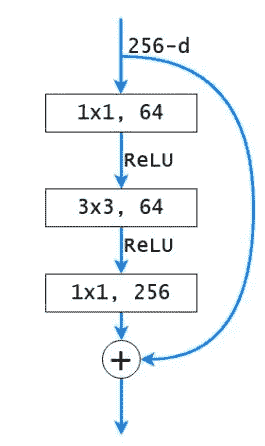

瓶颈设计

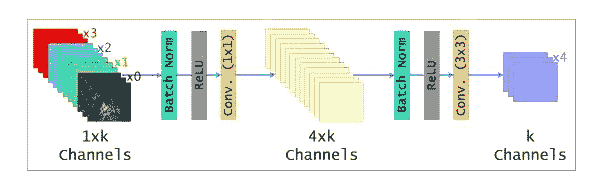

DenseNet-B

与 ResNets 相比，使用复合函数将输入连接起来，从而得到更简单、更高效的解决方案。DenseNets 被划分为多个密集块，由执行批量标准化、卷积和池化的过渡层连接，更加紧凑并促进特征重用；瓶颈层和压缩层用于减少特征图的数量，提高计算效率。此外，由于每层的过滤器数量相对较少，DenseNets 易于训练和扩展到数百层，同时不会引起优化问题。他们的研究结果表明，DenseNets 实现了与 ResNets 相似的性能，而所需的参数却少得多。DenseNet201 在 ImageNet 数据集上实现了 0.93 的前 5 名精度，并被认为通过超参数调整获得了进一步的增益；过度拟合问题通过连接的正则化效果来解决。

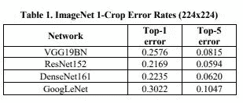

在 ILSVRC 中竞争意味着将图像分类到 ImageNet 数据库的 1，000 个类别中的一个。从搜索引擎收集的大约 150，000 张图像用于验证和测试，每种算法产生一个按置信度递减排序的标签列表。PyTorch 是深度学习社区中一个流行的科学计算机库，具有简单的调试和对硬件加速器的支持。它提供了解决图像分类的通用图像变换和模型架构。表 1 提供了所选预训练模型的前 1 名和前 5 名错误率。

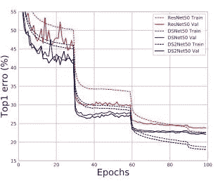

ImageNet 上的训练曲线。

提出的密集加权归一化捷径也有利于加快收敛速度。另外需要注意的是，DS2Net 的训练误差要小得多。

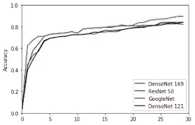

我们提供了稠密求和的统一视角，以便于理解 ResNet 和 DenseNet 之间的核心区别。我们证明，核心差异在于卷积参数是否为前面的特征图所共享。我们提出了一种密集加权规范化快捷方式作为替代的密集连接方法，它优于现有的两种密集连接技术:ResNet 中的相同快捷方式和 DenseNet 中的密集级联。我们发现来自聚合输出的密集求和提供了优于来自卷积块输出的性能。简而言之，密集快捷方式解决了 ResNet 中表示能力下降的问题，同时避免了 DenseNet 中需要更多 GPU 资源的缺点。

# 迁移学习:

迁移学习的基本前提很简单:采用一个在大型数据集上训练的模型，并将其知识转移到一个较小的数据集。对于使用 CNN 的对象识别，我们冻结网络的早期卷积层，并且仅训练做出预测的最后几层。这个想法是，卷积层提取适用于图像的一般、低级特征，如边缘、图案、梯度，后面的层识别图像中的特定特征，如眼睛或车轮。

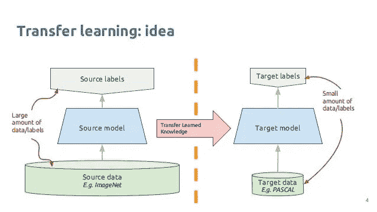

# 结果:

以下是的结果

## 1.Resnet152:

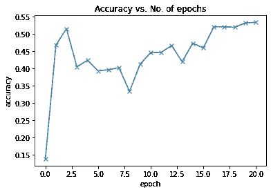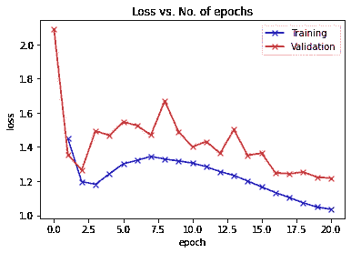

从历元对损失图中，我们可以看到，首先，训练数据和测试数据同时减少，直到历元 15。之后，训练图线开始增加一段时间，而验证图线开始平行。

最初，培训和验证损失似乎都随着时间的推移而减少。但是，如果你训练模型的时间足够长，你会注意到训练损失持续减少，而验证损失停止减少，甚至在某个点之后开始增加！

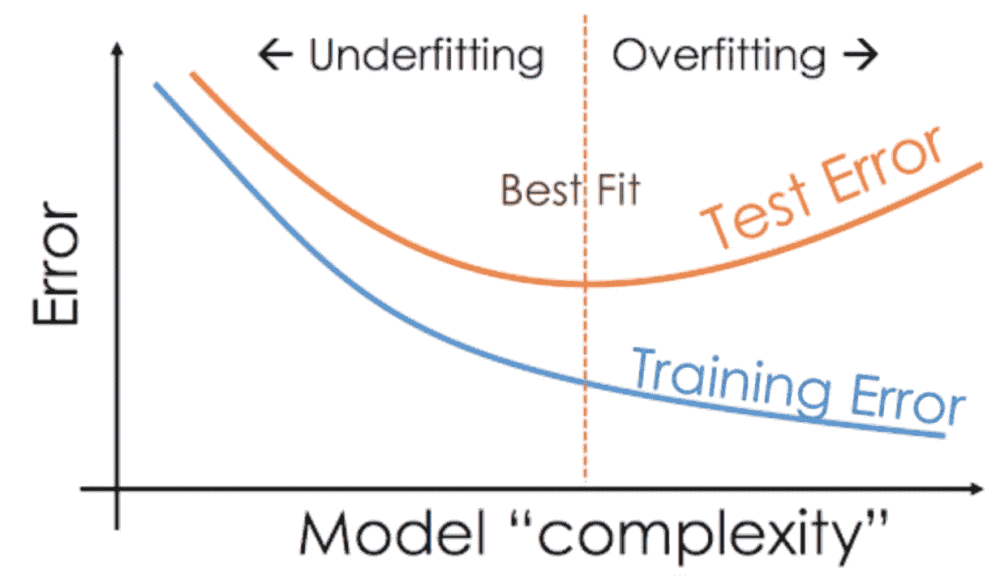

这种现象被称为过度拟合，这是许多机器学习模型在真实世界数据上给出相当糟糕的结果的首要原因。这是因为模型为了尽量减少损失，开始学习训练数据特有的模式，有时甚至会记住特定的训练示例。因此，该模型不能很好地推广到以前未见过的数据。

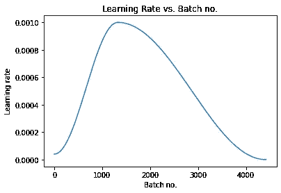

## 2.Densenet161:

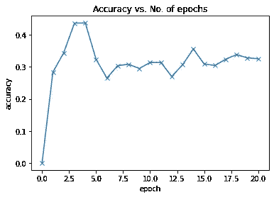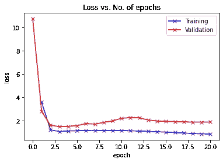

从历元对损失图中，我们可以看到，首先，训练数据和测试数据都同时减少，直到历元 5。之后，训练图线开始增加一段时间，而验证图线平行进行。

# 结论:

> 1.面部表情识别的训练比我想象的要困难得多，一些表情非常相似，当试图识别某些表情时，似乎会产生更多的错误。
> 
> 2.也许更大尺寸的图片调整和随机裁剪可以给出更好的结果，但为了达到最高质量，GPU 是非常必要的，否则它会给出一个“内存不足”的错误。
> 
> 3.我也尝试了不同的学习速度和其他方法。也试过 DenseNet，不过 ResNet 更好。

# 项目链接:

> [https://github . com/soham 2707/face-Expression-Recognition-Using-Deep-learning . git](https://github.com/soham2707/Facial-Expression-Recognition-Using-Deep-Learning.git)

# 未来工作:

由于结果不是很令人满意，我将尝试使用迁移学习方法进行另一种图像分类。

伊恩·施耐德在 [Unsplash](https://unsplash.com?utm_source=medium&utm_medium=referral) 上的照片