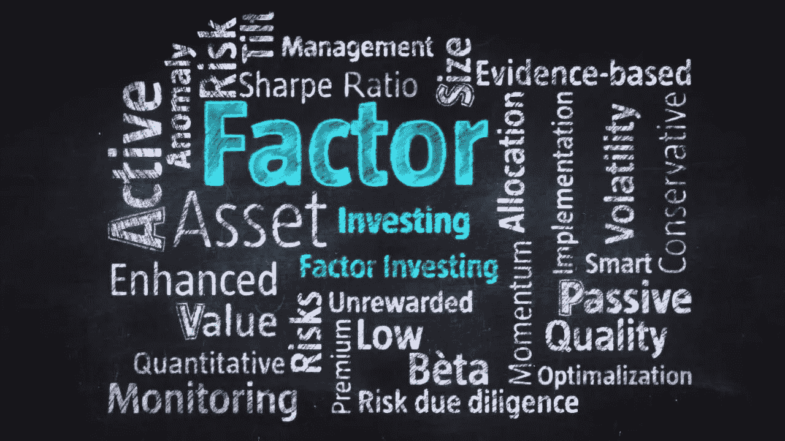

# 用 Python #3 进行因子投资单周期因子回溯测试

> 原文：<https://medium.com/analytics-vidhya/factor-investing-with-python-3-single-period-factor-backtesting-bd428882ac69?source=collection_archive---------5----------------------->

因素投资最重要的部分之一是知道什么因素可以起作用，最常用的方法之一是**因素回溯测试**。在本次会议中，让我们使用我们在上次会议**中创建的 **API** ，看看我们如何进行单周期因子回溯测试。**

****

# **核心理念**